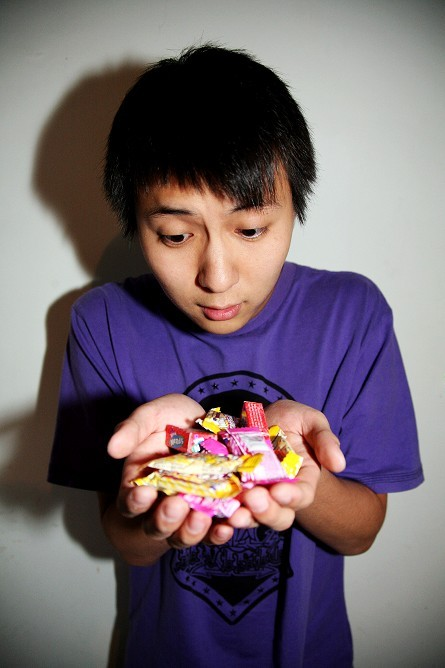
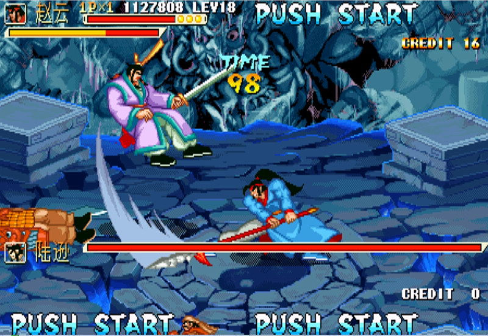
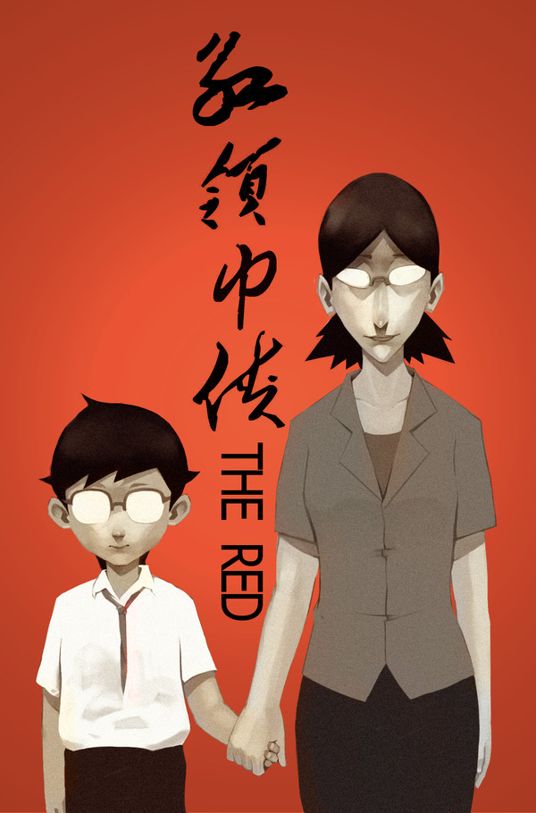
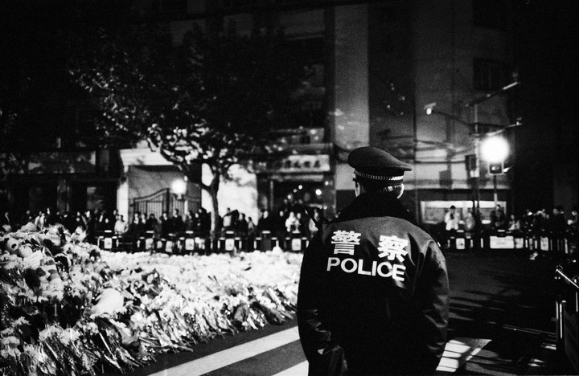
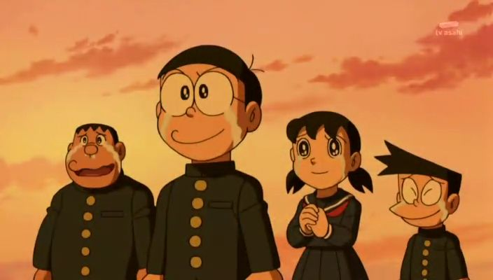

# 成长就是一个认为以前的自己很傻逼的无限循环

**你望着过去那个傻逼的自己，尴尬又幸福地发笑时，就已经说明你成熟了。所以，你那过去的傻逼是你现在最宝贵的财富。不要否定你的傻逼，请永远珍惜它。**

### 

### 

# 成长就是一个认为以前的自己很傻逼的无限循环

### 

## 文 / 罗超（合肥工业大学）

### 

### 

### 一

时间是个倔强的小妞儿，无论你如何爱惜她，她还是义无反顾地向前走，似乎永远也追不到手。我提醒她慢点跑，2011来了，2012还会远吗？到时候天崩地裂我可救不了你。她回头向我笑道，我就是想让你陪我去见证那真正的海枯石烂，沧海桑田，没那勇气就别追我。 于是，我只得硬着头皮跟紧时间的脚步，走出21世纪第一个十年的最后一天。 

### 

###  二

十年前，我还是个戴着红领巾的少年，纯洁懵懂，不喑世事，胸中却有一团熊熊火焰，因为少先队队歌告诉我们“时刻准备，建立功勋，要把敌人，消灭干净。”每次趁老爸不在家偷偷拿出小霸王学习机插上卡带时，这威武的歌词便会涌入我的脑海，激励我把魂斗罗打通关。 当然，那时候黑卡、黄卡游戏机都还不是我的最爱，要是手上能有一块钱，跑到游戏厅里买五个币子摇一会拳皇或者三国志，才真有过节的感觉。一个少年的共产主义梦不过如此吧。 

### 

### 

### 

就这样，十年前的今天，那个充满幻想的小孩，由奥特曼、气弹枪、超级玛丽陪着，开始跨世纪。 

### 

### 三

半年后，我顺利升入初中。因为臭味相投，结交了两个铁哥们。可在班主任眼中，他俩是班里“最没出息的”，我这种“好苗子”不应该和他俩“混”在一起。为此我多次被找谈话、请家长。我不明白，他们一不偷二不抢还很诚实，无非是成绩差排名在最后，为什么要和同学的友谊扯上关系？于是便采取了非暴力不合作的态度，不管老师怎么说我，我也要维护伙伴的尊严。我知道他们有时候很自卑，所以我更不能迫于老师的压力而疏远他们。 每次老师看到我们在一起玩时，都会对我投来失望甚至严厉的目光。而那时，我最想做的就是，挺直腰板对那更年期的老女人说一句“操你妈，傻逼”。 

### 

 这句话终究没有说出口，因为我还没有足够的勇气。后来，我也没像老师预言的那样被“拉下水”，上了重点高中。现在我们都已经长大，他俩也没成为“最没出息”的人，相反比很多当年老师很喜欢的同学过得更好，更有发展。 我由衷为他们高兴。 

### 

### 四

高中时代是我过得最快乐的三年，有太多美丽的记忆无法抹去。那段日子似乎每个人都很躁动，也都很纯真。我们会毫无原因地追求一件事情，毫无目的地坚持一件事情。每天总是那么充实、那么有趣。我还清晰地记得和两个最好的兄弟站在讲台上唱《爱要怎么说出口》的情景，三个人三个调，却激情洋溢——因为我们都有所爱，即使不知道爱到底是什么。 后来我们每次聊起此事，都会不由自主地笑着说，“太他妈傻逼了”。 的确，每当我们回忆过去，总会认为以前的自己很傻逼，总觉得当年的一些事一些话荒谬可笑甚至无法理解。“唉我去，当时我是怎么想的，咋可能做出那种事来？” 成长，就是一个认为以前的自己很傻逼的无限循环。 你望着过去那个傻逼的自己，尴尬又幸福地发笑时，就已经说明你成熟了。所以，你那过去的傻逼是你现在最宝贵的财富。不要否定你的傻逼，请永远珍惜它。 

### 

### 五

在这世界上，做傻逼事不可怕，可怕的是遇到傻逼人。 当我们按着自己的心愿践行自己的理想时，总会有一些人出于“为你好”的态度拿着他们深谙的“潜规则”对你循循善诱，告诉你不该这样不该那样，引导你向这个操蛋的世界投降，暗示你如果不听他们的，一意孤行，你就傻逼了——就像我的初中老师那样。 这些人，才是纯傻逼。 谁试图用他们自认为牛逼的社会经验来阻止你傻逼的循环过程，谁就真正扼杀了种子的正常成长，甚至荼毒了整个社会。 

### 

### 六

明白这个道理后，我信心满满。在大学里，一往无前地傻逼着。 随着阅历的增加、交往的广泛、网络的普及，我开始尝试认识这个世界。这才发现世界上有太多的事让我无法理解。我想从书中寻找答案，于是开始广泛地阅读，但社会呈现的现实却和书中给我的知识大相径庭。那无尽的荒谬让我困惑纠结，寻不得答案。比如说：为什么连自焚都无法阻止拆迁的继续？为什么含冤者上访要被抓起来，上访是国家规定的民众反映情况的正常途径，这种合法行为都要被阻止，不是逼着人们使用暴力不法手段泄愤吗？为什么过去老子对儿子恨铁不成钢，现在却变成了儿子对老子恨爹不成刚？为什么地沟油假鸡蛋有那么大的市场？为什么奶粉里会有毒？为什么孩子喝了毒奶粉患病后父亲讨说法都要被判刑？为什么我们不能用Facebook、YouTube和推特？ 说到这，一定又有人说，你能吃饱还能上大学就不错了，抱怨有什么用，唯恐天下不乱，不喜欢这里滚美国去！ 

### 

 我就更不明白了，为什么作为一国公民、作为纳税人，不可以批评政府？没有疑问与挑剔怎么可能有进步？是人民养活了政府还是政府养活了人民？为什么那么多人还是摆脱不了封建专制思想甘于接受奴役，为什么现代政治理念公民精神在中国暗淡无光？为什么你明知道我一穷书生去不了美国却撵我走，而那些高官的孩子却都已经悄悄地入了美国国籍，存款也进了瑞士银行？ 这些问题，会被我带进新的一年。 我知道，很多东西不是用知识解答的，而是用良心。 

### 

### 七

良心与知识的结合，才叫良知。所以我会秉承追求良知的信念，坚持走下去。继续行使傻逼事儿，远离傻逼人儿。 真性情就应该是做人和交友的底线，没必要到处装人。其实那也不是装人，只是装逼。就是这些人把一个个社会群体搞得像一营营伪军。 当世上所有人都把欲望当做理想，把世故当做成熟，把麻木当做深沉，把怯懦当做稳健，把油滑当做智慧，那只能说这个社会的底线已被击穿，所以你们没有资格说我的勇敢是莽撞，执着是偏激，求真是无知，激情是幼稚。 杰克凯鲁亚克的著名小说《在路上》中有一句话一直深深震撼着我——我还年轻，我渴望上路。 希望二十一世纪的第二个十年结束之时，我还能像现在这样，像傻逼一样高喊—— 

“永远年轻，永远热泪盈眶”。

### 

### 

罗超

2010.12.31
