# 我们不欠你们什么

**“我们这一代，看着民进党的成长，和民进党的堕落。八年了，民进党能够做的事情应该也很多。如果真的有心想要弥补这段过去，应该利用这八年的时间好好表现，可惜的是，我们看到的，是一个又一个的人，他们收割了民主化的果实，却贪得无厌。他们忘记了过去的理想，却以「国民党以前也这样」，来替自己脱罪，觉得自己拿个一点，不算什么，以前的人拿更多。如果真是这样的心态，当年大家又何必选你们呢﹖”**

** **

** **

** **

** **

# 我们不欠你们什么

## 文/杜宗熹 国立台湾大学

  
前言﹕

这篇文章其实我三天前就想写，这是我选前一晚就酝酿好的文章，可惜因为发生了连胜文遭到枪击，一死一伤的惨剧，我就没有及时写上来，而是去关心连胜文的新闻。我一直有预感选前一天会出事，当天下午我出门前，我还在我Facebook上留言说﹕「选前一天，小心奥步」。这句话是同时写给支持两党的朋友看的，没想到后来回家居然就看到这件事，只能说，实在是太扯了。

我不是警方，检方，调查人员，我也不在现场，所以我对这件事情的真相我不评论，静候专业人员调查，我相信台湾的司法人员和警方，希望他们能给我们一个真相。事实上，当天晚上，我回家路上有经过凯达格兰大道，那是郝龙斌的竞选晚会现场。我经过该路口时，正好就是听到连胜文在演讲。他讲的很激动，这是我第一次听到他在现场演讲，还在远远的地方，站着稍微听了一下。没想到，回家就听到这件事情，实在是觉得太巧，也太扯了。

总之，这篇是欠着的，我决定现在要贴出来。

[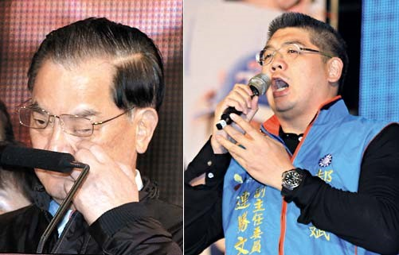](8bb02733-3018-4828-aaef-149033645cba.jpg)

----------------------------------------------------------------------------------------
我其实并不一直是支持蓝营的。事实上，在很长的一段时间里面，我跟台湾大部分的青年一样，我没有特定的政治立场。我们家也不是那种，会督促子女一定要怎样怎样之类的，我爸妈在家里也很少谈政治，这是我们一般台湾家庭的状况。事实上，1994年陈水扁当选台北市长，2000年他当选总统时，我是真心的期待看他能否有好的表现。

当时，国民党感觉已经烂很多年了。虽然90年代末期，台湾的经济仍然非常好，好的一蹋胡涂，跟现在比简直是天堂，失业率跟通货膨胀率都很低，经济成长率卻表现不俗。但当时黑金泛滥﹑地方派系勾结，治安不佳的阴影，其实一直在大家心中。正巧，陈水扁的运气很好，两次都碰到泛蓝分裂，就让他顺利上了台，大家本来对他期待很高。反正选上了嘛，就给你个好好表现的机会。

[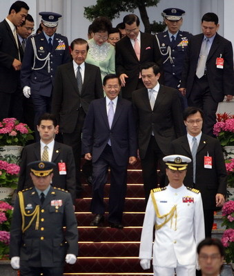](27fe6086-af20-442a-81a6-f47815b0fb6c.jpg)

中国历史上，从一个政治团体，和平转让政权，而没有经过签条约，谁胜谁负的战争，以及你死我活政治斗争，交到另外一个政治团体手上，这是五千年来第一次。这一点，其实是很值得肯定的，历史会记住2000年5月20日，这是中国历史上最值得纪念的一个时间。曾经拥有庞大武力和军队的国民党，在没有失去武力和官僚支持的情况下，和平的转移政权，这是所有中国人都应该纪念的一刻。

[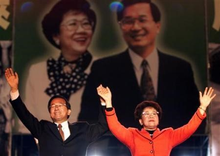](0a5be582-020c-4b6b-a298-3c5303530f87.jpg)

当时的我，对于民进党的政治立场和主张，并没有特别的感受，基本上中立吧，如果民进党能够表现的好，我以后就支持民进党，反正，我当时还不过是个初中学生而已。年轻，有活力，而且感觉上有使命感的民进党，其实对年轻人有号召力。我时常在想，如果我早生15年，跟着那群学运世代一起的话，说不定我也会投入学运世代的行列。

[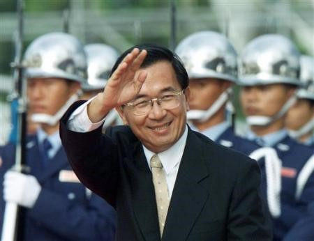](3892d27e-c1a3-4d57-a284-3a7c6614e520.jpg)

我对我自己的要求，基本上也是「兼听则明」，即便到了现在，左中右独，各派图书我都兼读，我并不会因为我支持蓝营，我就否定李登辉的贡献，我也不会因为我投票给蓝营，我就去骂投绿营的人脏话之类的，我觉得这是身为一个民主社会现代公民基本的素养。至于，对于民进党的「台独」立场和论述，我也给予一定程度的尊重，毕竟那并非完全没有道理，的确是有一个历史的脉络可寻。事实上，选前的一天，我还在景美文化园区，寻找过去戒严时代的遗留。

景美文化园区，或者也称为景美人权文化园区，离我家还满近的，不到两公里。不过，因为地点不在我主要的交通在线，也没有大众运输可以从我家直接到，所以我并没有去。选前的一天，我担忧选举，而且我担忧会出意外，其实有点放不下心。加上我也没课，天气很好，就决定骑自行车出去转转。临时性起，就顺路到了景美文化园区参观。

如果想看照片的朋友，很抱歉，我正好没有带相机在身上，只能从网上抓照片给别人看。

[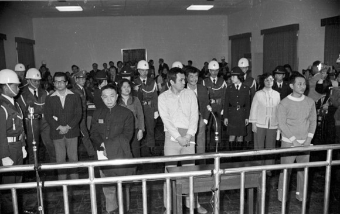](20603162-82af-4ed6-a741-7326c4511486.jpg)

(1980年美麗島大審，即在現在的景美文化园区舉行)

景美文化园区，就是过去戒严时代的台湾警备总部军法处和国防部军法局的所在，由宪兵驻守，本身也是属于羁押和审理政治犯的地方，著名的美丽岛大审即在此举行，本身就可以说是深具意义。而且，有非常多的名人在这边「蹲过」，包含柏杨﹑李敖等人，也关押因美丽岛事件入狱的施明德﹑吕秀莲﹑陈菊等人。据估计，当时「进出过」这里的人数大概在五万人次左右，后来被宪警枪决的人数应该也在上千人以上。戒严时代最为人诟病的一点，就是当时如果犯法的话，是可以按照军法处置的，所以，滥审﹑滥判﹑滥杀的情况的确有可能会经常发生。我不是历史学家，也没读过文献，所以只能最保守的来估计。

我想，大部分看我文章的人，都没有进过真正的监狱，无论是仍在使用的，还是已经停用的监狱。说真的，第一次看到监狱，你才会知道什么叫做「铁窗」，懂什么叫做那种失去自由，非常无助的感觉。走在已经变成博物馆的景美文化园区，看着过去的羁押室﹑会客室﹑营房﹑以及给犯人放封运动的空间，即便没有任何荷枪实弹的军警，还是可以感受到那种肃杀之气。所以，我非常同情他们。我无法想象，如果是我被关押在这样的地方这么久，我会不会妥协，会不会出卖我的朋友，会不会精神崩溃。当然，前提还在于是不会被枪决的情况之下。

[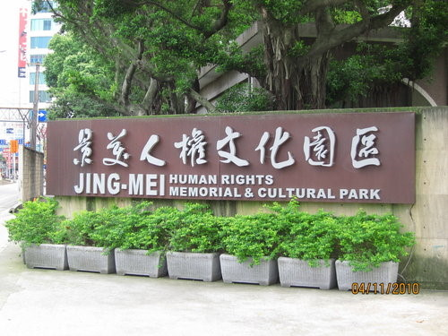](9e059cbf-517e-4c7e-a552-09e29b6e720b.jpg)

[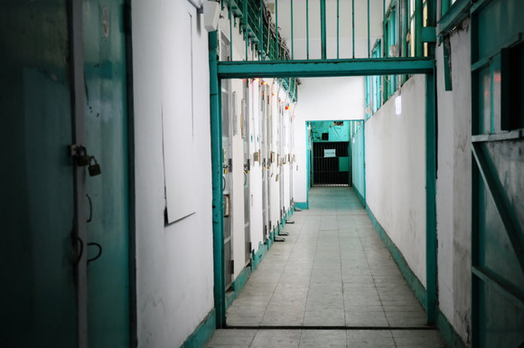](fd86500d-1b51-4157-aa45-5992f48a6e31.jpg)

(牢房走廊)

[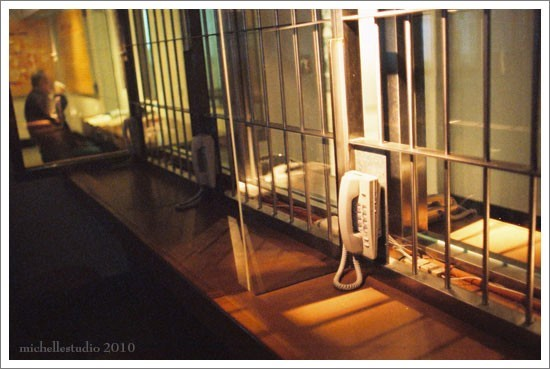](a4ab3c4b-ea3b-4ca3-86c3-8218049b35fe.jpg)

(以前犯人會客用的電話，會有憲警監視，而且全程被錄音)

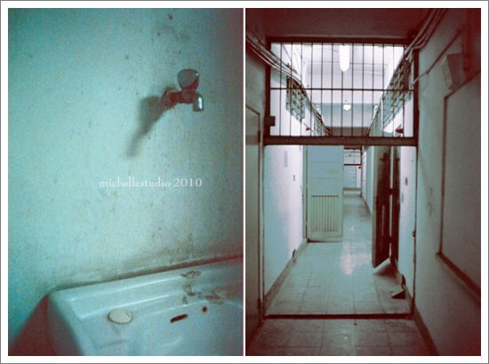

[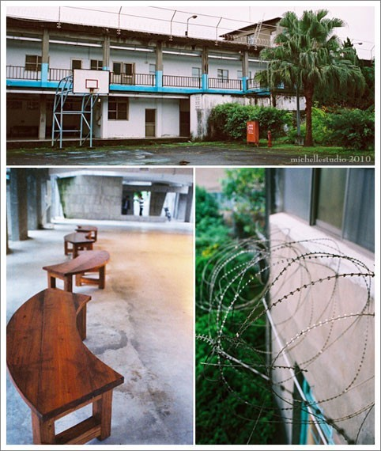](fb2c1aa4-460d-413b-ba55-0ba4c194a5c7.jpg)

[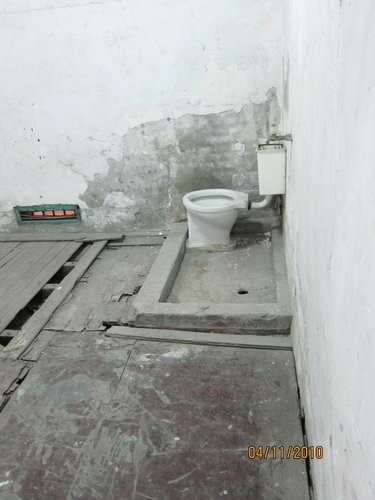](6dbc0867-8e9b-4efb-a9d3-9699021b88af.jpg)

(牢房內)

[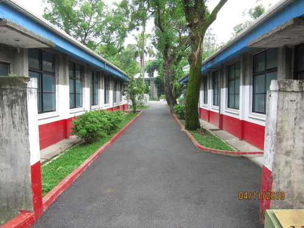](fc674619-821d-4365-b4a4-d58b86ed515d.jpg)

(駐守此地的國軍營房)

就在我逛完这里的差不多26个小时之后，选举结果已经大致出来了。当年曾经被关押在这里的陈菊，获得了高雄市长选举的绝对胜利。即便有这么多的负面消息，淹水﹑各式各样的丑闻和批评，她仍然高票当选。我想，那已经不是单纯可以用简单的政见﹑政绩和个人特质解释的部分。

无可否认的，陈菊也好民进党也好，在高雄是真的有一定的政绩，他们办了个世界运动会﹑盖了两条地铁﹑整建原来的港口海岸成为观光景点﹑经常举办各式活动，拍电影﹑拍偶像剧（如痞子英雄等）。但是，高雄的失业率，仍然是台湾最高，犯罪率居高不下。走在高雄的街上，店关的关，出租的出租，但大家仍然饿肚子都要支持陈菊和民进党。这让我们外地人感觉不可思议。

另一个新闻，是陈水扁的儿子陈致中，在高雄的第十选区，获得了超过三万两千票的支持，不但是该选区的最高票议员当选人，也是全高雄的最高票议员当选人。面对各式各样对扁家人的抨击，罪证确凿的洗钱风波，扁家人仍然坚挺，仍然有这么多的人愿意支持他们和民进党，这究竟是怎么回事呢﹖

有人说，是南北对立，族群对立的议题炒作，有人说是高雄人对民进党死忠，有人说陈菊有其政绩和贡献等等，或者说国民党在南部没有好好经营之类的。

但在各种各样的解释之余，我觉得，能够合理解释大家继续支持扁家﹑支持陈菊﹑支持民进党那批人的原因，有一个很重要的理由，那就是，有些选民觉得﹕我们欠「他们」很多。同时，这些政治人物自己也这么觉得，他们觉得这没什么，这没什么不应该的。

我以前觉得这是瞎讲，我想说天底下怎么会有这么厚颜无耻的说法，怎么会有这么多人，替罪证确凿，而且道德和信用已经出问题的扁家人辩护﹖怎么会替经济没有起色，欠下一堆公债，治安不好的高雄市长陈菊辩护﹖

但是在当我看完景美人权园区的牢笼铁窗之后，我突然可以理解为何有人到现在还觉得，陈水扁家被判刑是政治迫害﹑为什么高雄经济没搞好，淹水搞得一蹋胡涂，大家还是要支持陈菊。关键还是那句话，因为很多人觉得﹕我们欠「他们」很多。

基于同理心，我可以体会这样的感受。毕竟白色恐怖的时代，搞得大家人心惶惶，身心受害很深，这是有可能的。对于高雄人对他们的那份爱护和信仰，我也觉得可以理解，毕竟，美丽岛事件当年是发生在高雄，而不是台北。

但话说回来，当时代已经变了，有些人却还赖在自己的记忆和恐惧里头，没办法走出来时，这恐怕已经变成一种病态了。我不想太批评这些人什么，毕竟我没有经历过那个时代，我认识的长辈里面，也没有白色恐怖的受害人。那样的感受，我没有办法体会。对于家里有受害者的家庭，我也相当同情。

不过，也正因为如此，身为一个台湾的80后（七年级）生，生长在一个解严后﹑民主化的时代里，我们不可以陷入这样的情感当中。今天是我的生日。今天过后，我就虚岁25岁了，正是要开始展开冲刺的年纪。我们年轻人要的，是未来。

上一代的恩恩怨怨，跟我们这一代没有关系。至少，我们不能因为同情那些人，就希望让他们来领导我们的未来，这是必须要分清楚的。台湾需要的是光明美好的未来，而不沉浸在过去的悲惨当中。况且，对一个基本上算是解严后出生的人来说，过去的恩恩怨怨，也不是我们这一代人造成的。对于白色恐怖﹑美丽岛事件等冤案，我们可以补偿，可以道歉，可以同情包含陈菊和扁家在内的这些人，只要是冤案，是错判，都可以弥补，甚至赔偿都行（其实二二八事件早在1995年的李登辉时期，政府就开始赔偿了）。

但是，我们千万不可以将这份同情，转化为对民进党的盲目支持。不得不否认，到现在很多人，特别是南部的挺绿民众，仍把对于民进党人物的同情，转化为支持的力量。这在古今中外的政治圈，应该都不难见。但实际上，二二八事件已经超过六十年了，美丽岛事件也超过三十年，真正经历过这些事情的人，并不占台湾总人口的多数。由此可知，这其实是一种被操弄出来的悲情文化。

很多人觉得，民进党那些人，像陈菊好了，当年那么可怜，我们应该要用选票「还给他们正义」。台湾是个很重人情味的社会，这种现象不难理解。不过，这份同情心和观感，多半被政治人物不断操作，不断利用。基本上我认为，陈水扁家族的人，到现在还摆出一副「司法迫害」﹑「国民党黑牢」的心态，如果他们不是在骗选民，就是他们真的也觉得「欠他们的」，这种心态非常糟糕。陈致中当选之后，也还在用这样的言语，继续鼓动他的支持者，让大家继续认为这是「司法迫害」﹑「国民党黑牢」，这是非常要不得的。

我们这一代，看着民进党的成长，和民进党的堕落。八年了，民进党能够做的事情应该也很多。如果真的有心想要弥补这段过去，应该利用这八年的时间好好表现，可惜的是，我们看到的，是一个又一个的人，他们收割了民主化的果实，却贪得无厌。他们忘记了过去的理想，却以「国民党以前也这样」，来替自己脱罪，觉得自己拿个一点，不算什么，以前的人拿更多。如果真是这样的心态，当年大家又何必选你们呢﹖

因为说真的，既然选过你们，给了你们八年机会，台湾人民也真的不欠你们什么。我们给过你们机会，是你们自己不好好把握的，不能怪选民变心。而且，也请不要摆出一副﹕「这是台湾欠我们的」心态。
