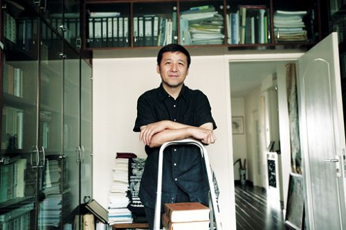

# 故意想不出好题目

**“所以，学术规范不是金科玉律，而只是一套包装精美的意识形态律令，对学术规范的重申和强调，是对这一套律令的再生产，它维系着我们当下的知识运行体系和知识生产方式，这当然是有其必要性的。但对一部学术著作而言，更重要的不是它是否再生产了这套律令，而是它是否能够提供洞见，推进思想。”**

### 

### 

# 故意想不出好题目

### 

## 文 / 康凌（复旦大学）

### 

### 

前段时间把赵园先生的《明清之际士大夫研究》重新翻出来读，归纳罗列明清易代之际士大夫群体热衷的话题，以及清初明遗民的行容举止，也算是闲书，和手边做的东西没有多大关系。断断续续地翻着翻着，忽然生出惭愧来，当时的读书人，每天生活在朝代更迭的动荡中，在生死之间周旋转圜，奇异的是，正是在这样的环境里，他们的阅读和阐释，反倒和自己的生命体验牢牢榫合在了一起，一句话说出来，甚至看得到背后的血肉模糊。道、德、统、殉、忠、夷夏、节义、清议、生死、出处进退，这些四书五经里的名词概念，统统走入人间，成为日用常行中随处可见的遭遇、疑虑和困惑。论经衡史，都是在生活实感中间摸爬滚打，而面对实际问题，也能即刻转回经史之中上下求索。 于是，思想的表达变得困难，因为那不仅是对经典文句的笺释，更是对生命走向的判词，甚至是生死存亡的抉择：“死社稷”、“死封疆”、“死守城”、“主辱臣死”、“不济，以死继之”、“不能死节，靦颜苟活”、“以死为道”、“义所当死，死贤于生；义所当生，生贤于死”，这些关于死亡的表述，全都来自当时关于“节义”的汹汹士论，而议论背后，则是大规模的自杀与殉节，战死的、自沉的、饿死的、自虐的、上吊的、自残的、自灭全门的，凡此种种，不一而足，而苟活者所面临的，则是无穷无尽的苛责——不仅来自旧代遗民，也来自新朝皇帝。 

### 

### 

生死当然是极端的例子，但由此也可见出当时士林之中，书本的讨论与生活的去就之间，是如何彼此冲撞撕咬，像是用砂皮摩擦皮肤，一下一下，那样紧密、粗粝、激烈、疼痛。 相比之下，我们自己，显得多么窝囊。 摆弄着那些硕大无朋的概念、新近翻译的名词、高深莫测的理论、汗牛充栋的文献，而它们对我们的生命、创伤、困惑而言意味着什么，却好像是等而下之的问题，生怕连提一下，都会让显得自己如此蠢笨。 漫天飘飞的语词，说到底也都是泡沫。一副铁面无私的脸孔，经不起生命的检证。一朵朵盛开在骄阳下的奇葩，都是艳若桃花的塑料。 就像这次的汪晖抄袭案。 讨论的参与者越来越多，泰山北斗到无名网友，一个个出来表态、发言、分析、督促，有的一针即见血，有的一看就脑残，攻讦者步步紧逼，捍卫者寸土不让，从诸神之战，生生演成了群魔乱舞。 而我却越来越想沉默。 不是不想说话，而是说不出话。我想弄清楚的是，这个事情，跟我有什么关系？我不是说学术规范、汪晖、朱学勤、自由主义、大众传媒这些东西跟我没有关系，我是说，由这些东西所组成的这个事件，它和我有什么关系？它和我的知识经历、和我的生命体验、和我的生活实践有什么关系？它们在哪一点上发生了摩擦、冲撞？ 只有弄清楚这一点，发言才是必须的，才是不得不然的，因为那不仅是对这个事件发言，也是对自己的生命发言。“予岂好辩哉 予不得已也”，这样说出来的话，才能落在地上，而非飘在空中，我以为。 然而并没有弄清楚。 

### 

### 

老徐说，他要替汪晖翻案。我大概明白他的意思，八十年代学术规范的缺失和写作、编辑方式的疏漏，两者都不足以构成翻案的理由，因为其中所贯穿的依旧是一种目的论思维，学术规范仍然被作为一个可欲的、正确的目标。 但是，现代学科体制以及由此派生的学术规范体系从来不是一个不言自明的范畴，而是一个特定的历史进程的产物，背后纠结着各种教育史、思想史、学术史的偶然事件，甚至纠结着后殖民意义上的西方霸权主义、纠结着现代大学体制本身的理性化倾向、纠结着现代之后知识与人的关系的嬗变甚或异化，借由还原这一体系的建构过程，完全可以展现它所内涵的诸种意识形态取向，以及这些取向对思想的局限和伤害。 换句话说，现有学术规范体系的建立和普及，极有可能不是一个历史的进步，而是一种倒退或平庸，它的合法性有待进一步的质疑与检验。甚至，我们大可想象，思想工作可以放置到另一套截然不同框架中进行，并且可能获得更好的结果，而这一点或许能够从人类学的研究中得到支持。 所以，学术规范不是金科玉律，而只是一套包装精美的意识形态律令，对学术规范的重申和强调，是对这一套律令的再生产，它维系着我们当下的知识运行体系和知识生产方式，这当然是有其必要性的。但对一部学术著作而言，更重要的不是它是否再生产了这套律令，而是它是否能够提供洞见，推进思想。 当然，以上这些，都是我的猜想，没有与他核实过，如果不对，权当是栽赃无妨，但这毫不重要，因为在我看来，更值得珍视的不是翻案的理由，而是这种翻案的冲动，它从哪里来？我隐隐觉得，这才是这个事件，和我自己的关系所在。 天光渐亮了。 

康凌

2010.8.11 晨
