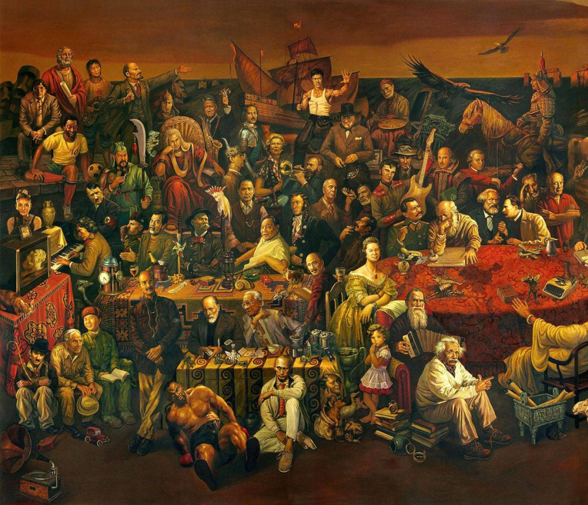

# 文明的时间轴

**随着高利贷的兴起，钱的时间价值，这个看起来和教廷无关的概念，却在深刻地挑战统治者的权威。没有时间价值的钱更不会有流通价值，而正是钱的时间价值鼓励了投资，鼓励了冒险，鼓励了用借来的资源博取更大的回报，因为钱是在分分秒秒增值的，这也正是亚当斯密在《国富论》中不厌其烦地描绘着一个货币的借贷应该有回报的原因，正是这种时间观念和冒险精神让英国在当时领先于诸国，让无数冒险家争分夺秒向世界各角落出发。**  

# 文明的时间轴

## 文 / 陈博（芝加哥大学）

  来美国以前我把美国的学术想得神圣至极，尤其是芝加哥大学的通识课程（Core）。拿到书单的时候我就乐疯了有没有！亚当斯密，马克思，德科海姆，笛卡尔，康德，休谟。。。恒星遍天，这书单纸仿佛都拿不稳了。但后来我才知道，尽管这些人的思想构成了人类文明最灿烂的篇章，自己却不一定能读出滋味。初时的对名家的盲目崇拜是我要坦诚的第一个错误，而忘记了自己研究的出发点和方法是第二个错误。 我首先是一个中国人，一个在中国教育体系下浸淫了十年以上的学生，一个在中国这片土地上生活了十八年的人。尽管我坚信人不应忘本，我却在学术这件事情上忘本了——我忘记了自己是无法摆脱从一个中国人的角度来深入西方经典的，也没必要摆脱的。我越发明白没有思想是普世的，任何思想都有自己生成的土壤。看西方学术作品自然不应狭隘地俯视，也不应仰着头看，但最重要的还是立足于对方，他者的土壤来审视他的成型过程和伟大之处。而这样以他人的视角来审视却是我一直没有学到的。 无论承认与否，中国的发展都是超快速跨时代的，无数社会思想，经济理论，道德学说还没在理论上成型就已经被千万人实践，推高，又消逝。中国就像一个大社会实验场，从极左猛地转舵到市场经济却又在意识形态上以保守的威权政治为正统，在短短时间内从人类文明范式的一个极端苏联拉扯到另一个极端美国，而中间又有意无意地混杂着欧洲的社会主义改良思想并参悟着南美自由经济的教训。十九世纪的上海是资本家的乐园，那今天的中国大概就是思想家的逐鹿场。从极左的乌有之乡到自由主义的南方系，无数的观点在突围反突围。 而西方那些经典都是一步一个脚印，细水长流地在数个世纪的激烈碰撞中诞生的，有着极深厚的历史社会背景。而中国从来不乏舶来品，在实现跨越式发展的同时也少了很多积淀。中国的山寨技术，无论是山寨制度还是产品，都一次过把东西给复制过来压缩在一张二维平面上；而西方的发展出的终端产品是有着明显时间轴的，每个部分都可以追溯出其历史渊源和来历的，每个东西都是优胜劣汰或人为选择后留下的，因此那是有厚度的成品。 就像美国的宪法，每个条文都有着历史上争端，案例，判决，形成了法的精神。 就像一个互联网产品，每个组件功能都有其历史，研发适应过程。而腾讯百度基本上都是一锅端。 在中国大部分舶来品都只能看到一个断层面，而难以看见时间这条轴上的演化。看得见时间轴的要不然是我们的原创，如儒家思想，经历汉武宋元乃至明清，要不然是经过天才般再创造改编过的，如马克思主义在中国的变种，适应当时中国社会现实的毛泽东思想，阶级理论和军事战略。 西方文明的结晶又何尝不是如此。因此在学习其精髓时，只知其然，而不知其所以然，往往就忽略了其时间轴的建立，而觉得分外苦闷，不解，觉得那是一纸废言，不但和今日之中国无关，更和今日的西方无关。 看亚当斯密的国富论时，开始那是一个激动啊。这不是被人称为资本主义世界的圣经吗？那双看不见的手不是已经搅和了中国30年，搅和了世界400多年了吗？但看着看着就觉得不对劲。那些简直不就是中国大学财经课本的翻版吗？通篇大白话，全都是一个地里的农民，村里的个体户天天在实践的东西。请一个乡镇企业家来做报告也不会做的比斯密差吧。 “就资本利润说，就连最普通的利润，我们也很少能够确定。利润极易变动，经营某特定行业的人，未必都能够说出他的每年平均利润是多少。”——《国富论》论资本利润一节 废话，中石油都不能确定它明天的利润会多多少。 “可以提出这样一个原则：在使用货币所获较多的地方，对于货币的使用，通常支付较多的报酬；在使用货币所获较少的地方，对于货币的使用，通常支付较少的报酬。” 这不是货币供求关系的说法么。这在经济课上早被芝加哥教授大卸八块从数学角度微分又积分地分析了一通，现在再听你讲一遍又有何用?好吧，你说你是祖师爷第一个这么讲的人，但你讲出来终归是这些东西，我又如何撰文来分析？可教授却偏偏喜欢拿出一段文字叫我们细细分析，一开始让我直骂没事找事。 就像我幼儿园读的第一本书固然重要（大概是十万个为什么吧），但你今天要我分析这本书，我却也无从下笔。因此，在初入芝加哥的那段时间，我常常困惑地无法在那些“简单”的文本中找出任何可用的素材，只能无病呻吟，抓着些零碎段落浑然分析一通了账。 现在回顾起我的Core,还不禁莞尔无奈。 亚当斯密是注定无病呻吟的了，德科海姆有些意思，但有机分工和机械分工的东西表面上太玄，讲透了却也就是流水线分工和社区友谊的区别，马克思是让老外们抓狂的，但是让一个浸淫在中学政治课本中6年的人来看却是再无聊不过，以至于一个人跑过来跟我说《马克思1842手稿》的伟大时，我看到那些异化，阶级，剩余价值，生产手段之类的词语就郁闷——老马怎么还来美国唬人啦？至于弗洛伊德照样是意淫的，反正没人可以证伪他，儿子总爱妈女儿总爱爸。休谟有意思，只是看完后再不相信科学了，反正连因果都不确定了。笛卡尔呢？简直就是黑客帝国，盗梦空间的启发者啊，他的方法论不是高考复习法的17世纪翻版吗？ 

 我的Core就在这样的翻烂帐，胡思乱想和心中乱骂中过去了，就连《极权主义及其起源》这样本来似乎会有点现实意义的书我都可以看出哈欠来，只因为她大篇大篇地讲法国的排犹主义让我丈二和尚摸不着头脑。 只因为我忽略了那条时间轴，忽略那些经典是怎样从基础上一点一滴构建的。罗马非一日所成，但游人看见罗马时的激动又怎能和一个设计师看见罗马耸立时的壮怀激越相比？因为在设计师的眼中，这座城市是数个世纪的积累，每一砖瓦，每一块巨石除了长宽高的外部表象都还有着在整个构建过程中的独特价值。这是社会学家看文明。但最心怀崇敬的还是历史学家吧，是历史学家不止看到了城市建筑的构建，更看到了城市居民的生活史，看到了斯巴达克思的起义，三巨头的争霸，迦太基的战争；眼前的巨石林立可以瞬间化为奔腾的洪流，顺着历史的河岸长泻而下。以至于在下游平静的流水中拾起一块鹅软石的时候，他可以历数出上面的刻痕是在哪个急湍哪处转弯所留下的。这种充满悠远的遐想给了人类文明以厚度。 上次在巴黎郊游，我们聊到巴黎城市的建筑风格非常相似，而佛罗伦萨一带几公里外往往就是一片新风格。我猛然想起也许这是因为法国历来是王权集中之地，而意大利则以城邦公国为分，自然在风格上变化更多。几天后我读到《带一本书去巴黎》时，才进一步了解到巴黎是因为18世纪那一次大修后由一位设计师整体规划成了今天的模样。这步步推进的认识慢慢地把历史那根轴勾勒了出来，比只看到眼前的一面岂不是乐趣大得多？ 可惜这个道理我没有早点明白。在芝加哥的美国教授似乎从来没有提醒这一点，或者提醒了，我碰巧睡着了。但确实，这是只有这学期我在巴黎上文明史必修的时候才从一个法国教授身上领悟到的。这位菲利普先生只教了我们短短三个星期，却让我有豁然开朗之感。他也是一个讲学派，常常一口气连讲半小时不停歇，在倾听了一两个问题后又再次激动地讲半个小时。 不少美国同学纷纷表示受不了，也许他们习惯了学生踊跃发言的课堂。但上帝，那又有什么！一个有料的教授你不让他讲难不成还让学生主讲？让the kid大发“妙论”？让叽叽喳喳不知所言？一个用毕生积蓄来讲学的教授三分钟可以比五个学生讲的更透彻，就让他统治时间好了，就让他畅所欲言好了，承认差距吧，为什么要让自我表现欲那么膨胀，为什么倾听半小时就坐不住了，是被快餐文化洗脑了么？ 至少他让我重新发现了西方经典的意义，他给文明加上了漂亮的时间轴。他从文艺复兴讲起。曾经他谈到借贷一事。在今天，借贷收利息再也正常不过了，然而他点出在中世纪时借贷是从来不收利息的，那不但和天主教教义不符（帮助不应索求回报），更和当时人们静态的价值观不符。借出十分，要回来的也应该是十分，天经地义，童叟无欺。 不！他激动地谈到。钱是有价值的，是有time value的，这是资本主义的最核心奠基石之一！随着高利贷的兴起，钱的时间价值，这个看起来和教廷无关的概念，却在深刻地挑战统治者的权威。没有时间价值的钱更不会有流通价值，而正是钱的时间价值鼓励了投资，鼓励了冒险，鼓励了用借来的资源博取更大的回报，因为钱是在分分秒秒增值的，这也正是亚当斯密在《国富论》中不厌其烦地描绘着一个货币的借贷应该有回报的原因，正是这种时间观念和冒险精神让英国在当时领先于诸国，让无数冒险家争分夺秒向世界各角落出发。 这就像在一个人家里挂上了从未见到的时钟，time is ticking. 这就像给一个学生deadline，time is ticking， get off procrastinating! 这就像给人类文明上了发条！追求天堂安稳的教廷顿时恐慌了，看到人们纷纷为现世的一分一秒而奔劳，谁会在乎后世的永恒呢？西斯廷教堂的宏大，圣母院的高耸，哦，人们从中再也看不到永恒，反而开始质疑为什么要给教廷贡献那么自己的辛苦钱呢？为什么要买赎罪卷去傻乎乎地等待天堂的升华呢？隔壁的催债人可来的更加急迫呢。 一个人类价值观的建立可以需要千年，但奔溃只需要一代人。一个政权，一个信仰何尝不是如此？瞬间我思路又回到了赵鼎新讲过的threshold effect —— 苏联那降下的旗帜不也正是这效应的完美体现吗？昨日的神圣瞬间失落，昨日的严肃今天看来就像小丑，连那些严肃的人儿啊，也开始嘲笑起昨日的所为，所在只于一念一瞬。 大脑里散落各处的信息瞬间被拼接了起来，如《非常嫌疑犯》结尾的快速闪回，如《电锯惊魂》结尾的恍然大悟。原谅我不能如蒙田般对历史旁征博引，只能以电影来比喻那些领悟的瞬间。 这场无声的变革却是那么振聋发聩，以至于今日还在回荡。这是资本的力量。凭借什么美国，一个制造业已经被掏空的国家，一个一半多生活用品已经不在生产的国家依然能在今天称霸？这在中世纪必然是个笑话，但在今天，凭借着资本的力量却可以翻云覆雨。贝恩资本能够搅得中国的企业实体国美天翻地覆，索罗斯可以用资本进攻东南亚，高超的资本运作可以将行业大洗牌，这都建基于资本的价值，或者，资本的时间价值。没有时间价值的资本无法增值，只能最终沦为一潭死水，或者变为纯粹的消费，以至于今天美国的高消费低储蓄已经让不少国内政治家隐忧。但这又何足畏惧呢？资本是会在全球寻找出路的，在全世界投资。美国在过去数十年间的积累已经足以在今天收取红利，用一小部分历史积累购买低价的消费品，再用大部分积累寻找新的增长点，并利用这独特的先发优势继续控制制造业，顺便全球打打围。 而只要我们依旧信仰这个体系，这个体系就能够自维持下去。只要不是physically 打破这个体系，这个体系就能运转。就像bank run,就像股市神话。The World is what we believe it is, until we believe it no more. 所以下一步，哦，不对，搞错了这不是什么革命宣言。回到正题。 上述的这一切不都起源于资本主义的萌芽么？是钱的时间价值让资本活动了起来。问渠哪得清如许，唯有源头活水来。经济课上的所学获得了历史这一维度。多少东西在上一个千年还是闻所未闻，而今天却成为了理所当然，以至于回望一眼都觉得困难。也好，正如菲利普所说，美国人就是不怎么注重历史，哪个好用就拿来用了。他同时感叹，欧洲人有时就太被过去所羁绊了——这究竟是幸还是不幸？ 但至少对我来说，遇到一位懂得历史的欧洲教授是幸运的。没有更早地遇见他，是后悔的。顺便，这位菲利普教授凭借着对蒙田的深厚研究，被法国政府授予了骑士称号。以后见到他，要恭敬地叫一声——Sir!  

（采编：陈轩 责编：陈轩）

 
