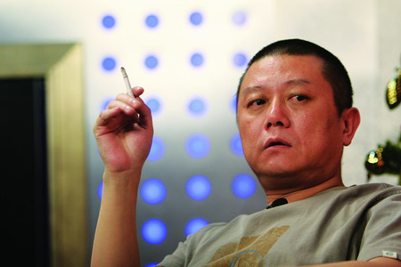
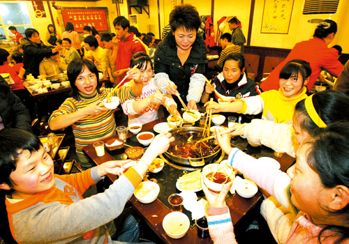

# 智识阶层切不可有道德优越

**“如果智识阶层总是想着要改变人家的生活方式，总是指责人家“民智未开”不和自己站在一道，这种精英的偏见其实是对自身责任的逃避。你本来是应该站在社会进步的前沿，而现在，广大的不读书不看报的普通民众，变成了你自己达成不了自身目标的借口。这种道德优越感，本质上是缺乏对责任的担当。”**

# 智识阶层切不可有道德优越

## 文 / 元淦恭（中国人民大学）

中国的知识分子/知识人，或者说智识阶层中间的不少人，长期以来有一种优越感，这种优越感是来源于什么，我一直不太清楚，或许是中国古代“士”阶层“唯有读书高”所形成的精神贵族观念，至今仍然使得一部分人自觉不自觉地去充当“教化者”和“启蒙者”的角色。 法国启蒙运动传统的启蒙，与德国的康德启蒙思想，到底不同在哪里？李秋零认为，一个是授人以鱼，另一个是授人以渔。法国启蒙运动的伏尔泰等人强调的是直接告诉民众所谓正确的价值观，而康德则更多地希望民众掌握独立思考的能力从而自己得出接近真理的判断。中国的智识阶层，在这二者之间做何选择取舍，一直深刻影响着中国社会进步的历程。 

 这一期的《南方周末》有一篇四川郫县高三学生的短文，名字叫《我们小区设施全》，这篇文章读了让我很不是滋味。文中当然有提到老人参加药店活动，年轻人抽烟喝酒泡网吧等等，意在说明大家的文化生活匮乏，但是其中隐含的一种作者乃至于整个南方集团以道德优越自居的苗头，是让我最为警惕的。 我最看不惯的是文章的最后两段，作者对于麻将馆的描述虽然貌似中立，但对应最后一段关于书店和学校的描写，他显然是看不惯这个现象的。有一家重点中学要招生被他说成是“好消息”，就已经明确地表达了作者的取向。不知道他是认为小区建设不合理，还是嘲笑小区人的生活方式，总而言之，他觉得这个小区“没文化”，这倒是真的了。 中国这个国家一直就是个文明程度相对不太高的国家，至少相对其他文明而言，它一直表现出浓厚的世俗性和物质性。在中国，人们讲“民以食为天”，到处都是饭馆酒楼，却很少看到书店，不像以色列之类的国家恰恰相反，人们自觉地有一种对知识的渴望，对知识的仰慕远远超越味蕾的满足，对真理的向往也大大强于对许多物质的追求，所以饭馆少而书店多。 有些知识人就很羡慕人家这样的国家，甚至于对中国民众求全责备。甚至有些人觉得，就是因为中国人天天沉溺于物质生活，沉溺于打麻将之类的娱乐，才使得中国的政治体制铁板一块，公民意识无从提升，因而这部分人就热衷于所谓的“启蒙”，热衷于把西方的生活方式、意识形态甚至宗教信仰移植到中国，以为这样就能让中国实现政治转型，这样的想法带有一种极端的傲慢，我是很反感的。 中国人是喜欢吃，四川人是喜欢打麻将。无论中国这个国家实行什么样的政治制度，大家的生活方式几千年传承下来是改变不了的。大陆人看台湾明星的八卦，台湾人也看台湾明星的八卦，大陆人看台湾的偶像剧、长寿剧，听台湾的歌，和台湾人没什么区别，为什么?因为两岸同文同种，所以生活方式总是相似的。即使将来有一天，中国大陆实行宪政民主制度，我们四川的街头照样是火锅店比书店多，麻将馆比文化馆兴盛，人们仍然热衷于休闲、娱乐，我可不相信到时候四川人就变成了犹太人，都一头钻进图书馆去。 

 实行宪政民主的目的，是为了更好地保卫个人自由，捍卫每个人独特的生活方式，而不是去改变别人的生活方式。 在没有民权保障的社会，连打麻将的权利都是政府赐予的，连穿衣服的自由都是执政者赠送的，这样纸糊的权利和自由，最后发展到极端，就是连人民吃饭的权利都没有。1959年到1962年四年间，四川饿死上千万人，四川的吃喝玩乐的生活方式自然就没有得到起码的尊重。我们大家为什么要改革，就是要让大家有免于饥饿的自由，否则哪里做得出来川菜、火锅、小吃?否则哪里会有机会打麻将？ 中国这个世俗社会，大家就把吃火锅打麻将视为幸福源泉，像这位写《我们小区设施全》的萧小朋友，有什么资格对周围的人这样的生活方式指手画脚？！就跟有很多人说成都太休闲了云云，你觉得成都太休闲了，你要在成都奋斗并没有人干涉，你管人家悠闲不悠闲干什么呢？如果你不喜欢这个气氛，你就不在成都呆就好了。 有些人说中国人太世俗了，这情况当然有些不同。因为中国这个国家世俗，世俗得不尊重你需要精神生活的人，中国这个国家世俗，世俗得连世俗本身都随时可能被某某部门给大事折腾。因而我们要改变的，不是别人世俗的生活方式，而是要建立一个基本的尊重文化的国家制度。这个制度本身，就允许别人世俗，允许别人三俗，允许别人吃喝玩乐。萧小朋友文章里带有的清教徒色彩，让我看起来非常不愉快。 智识阶层的问题是，国家不尊重你的生活方式，现在你需要做的是让国家尊重你的生活方式，而不是让人家与你生活方式不同的人都改成你这个生活方式。 任何人都无权干涉别人如何生活，高雅的还是低俗的，注重精神的还是注重物质的，那都是人家的事情，以自己的道德优越觉得人家不读书不看报的人是“民主化”的包袱，这和宣传系统觉得民众“三俗”不利于和谐的论调有什么区别？！ 有人觉得，只有民众觉醒了才有希望，总是寄希望于别人不关心政治的，不喜欢看书的人都能变成和你一类的人，这怎么可能呢？你凭什么要求人家站出来呢。智识阶层自己就要站在争取自由和权利的前沿，而不是老在这里和强权者一道去讨论什么公民素质问题。如果智识阶层就可以指责人家不读书不看报天天打麻将，那你和那些诋毁中国公民素质的当权者有好大不同呢？ 我认为，中国公民最重要的是三点：“爱自由，会生活，懂常识”。这三点中间前两点挺容易，大多数人都做得到，最后一点比较难，因为整个大环境不好。但是智识阶层可不要以为民众是没有常识的。唐福珍自焚的时候，张海超开胸验肺的时候，他们有没有常识？那些汶川、玉树、舟曲灾民抱怨政府的死亡数字的时候，他们有没有常识？那些为了征地补偿制造群体性事件的农民，他们有没有权利意识？ 他们或许没有读过你读过的那些书，说不出你头头是道的那些道理，可他们绝不是像少数持有道德优越的人所说的那么不堪。 如果智识阶层总是想着要改变人家的生活方式，总是指责人家“民智未开”不和自己站在一道，这种精英的偏见其实是对自身责任的逃避。你本来是应该站在社会进步的前沿，而现在，广大的不读书不看报的普通民众，变成了你自己达成不了自身目标的借口。这种道德优越感，本质上是缺乏对责任的担当。 

 最后我要说，麻将馆多饭馆多，那就是我们成都的生活，就是我们四川的生活。有的四川人自己对自己的生活方式就没有自信力，觉得麻将馆多书店少是坏事情，我看这是被广电总局和中宣部洗脑洗多了。智识阶层中间的道德优越，很大程度上摆脱不了几千年来中国“士”良好的自我感觉，这种感觉，今天可以休矣！
