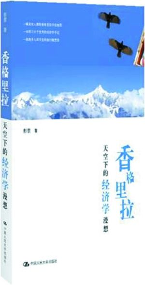
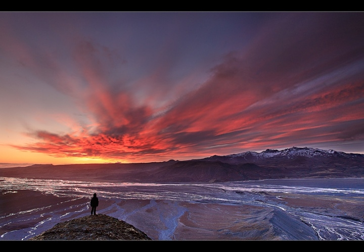

# 梅里雪山的美是免费的，雨崩神瀑的美是有价的

**“四周的人们都在急忙拍照或激动议论。但其实，来这里的人，没有多少是真正抱着虔诚的态度来朝拜雪山的圣洁的。大部分人都只是把它作为一个画布的背景，一个舞台的幕布。仿佛在雪山的映衬下，他们本身也就同样拥有了纯洁和美丽。”**

### 

### 

# 梅里雪山的美是免费的，雨崩神瀑的美是有价的

### 

## 文/彭萦 （节选自《香格里拉天空下的经济学漫想》）

### 

### 

 清早，天还没亮，我们便起来看梅里雪山。 卡瓦格博峰。 启明星在泛白的天色中渐渐隐没。天空的幕布忽然被染红了，仿佛是在预告一场静默的独角戏即将拉开。山尖开始泛起淡淡的金光。那抹颜色自山顶一点一点从上至下不断扩散，泛出淡粉色的红晕。虽然不见任何的仪式，但是心中的祷词却是如此的舒缓。它变成了一种沉思的风格，扩大了寂寞之感。那色彩漫过了山腰，最后涂遍了整座卡瓦格博还有它周边的四座连峰。在淡蓝色的天幕前，红色的蓝色的淡黄色的云飘然而至，更添一笔神韵。视线所能及处，都荡漾着蓝色和金色。这是夏日清晨的美丽而典雅的庆典，又像是一场盛大又隐秘的诉说。 四周的人们都在急忙拍照或激动议论。但其实，来这里的人，没有多少是真正抱着虔诚的态度来朝拜雪山的圣洁的。大部分人都只是把它作为一个画布的背景，一个舞台的幕布。仿佛在雪山的映衬下，他们本身也就同样拥有了纯洁和美丽。就像一件衣服，摆在地摊上和挂在高级商店的橱窗里，似乎就不同了。 我并没有拿起相机，相片对我来说已经无法使这样的美得以停留和保存了。我想，图像没法达到的，也许文字可以。对于过去，我们总是想尽一切方法记录下来，用图像，用文字，用声音，用一切可以用的方法。似乎只有这样，才能在回首的时候，感觉过去并没有完完全全地离我而去。只有这样，过去才能重新在某个时刻，当我们重翻开旧日的照片和日记时，再一次被唤醒，过去的自己才能和现在的自己重新融合在一起。 但Elle认为，刻意的记录是无用的，它不能带来真切的意义，过去不会寄寓在那些我们自己有意去为了挽留而记录的基质上。她觉得，那些东西只会让我们感觉到过去与自己的隔离，因为它们站在我们对面，被封存在所罗门的瓶子里了，封印就是时间的距离；而只有在某一时刻，某个梦醒时刻，某件小物品，某一句别人偶然说出的话当中，它们给我们一种错觉，仿佛我们再次回到了从前的场景，仿佛一切都没有过去。我们周围的人与事就像时间本身，像铺天盖地的灰尘……或许我们能感受和他们共处天地间的一刻，却无法挽留。那么最好的方法或许是留在回忆中，这样，他们才不会真正过去。 我独自静静地看着对面的雪山。这时候，一切言语表达都已多余。我只希望自己能把这美丽的画面刻在脑海中，只要一闭上眼，那映像，那色彩，就能在我的面前得以重现。有些东西，如果注定无法拥有，那么唯一能做的就是，不要忘记。香叶燃起的浓烟在上方弥漫。此刻，我身体冰凉，内心温暖。想着如果心爱的人在身旁，一同静静地仰望，将是多么的幸福。 此刻，我在这里，你在哪里？ 将美丽的雪山收入记忆中后，我们回到归去来客栈。米粒亲自做的咖喱鸡肉饭十分美味。 一整天都在归去来里悠闲地看书和写字。在客栈里我们结识了宇，一个沉静的男子，钢琴和萨克斯都很棒。他也打算去雨崩，于是约定明天同行。我们坐下来一起商量接下来几天的行程安排。听了稻子给的徒步行程建议，研究了雨崩徒步路线图，我们决定放弃明永冰川，直接前往雨崩神瀑。Elle在水泥森林里过惯了宅女生活，很不情愿地同意和我们一起徒步而行。杏子指着徒步路线图提醒在雨崩神瀑和明永冰川的岔口前，有个售票点。我一听，感叹道：“还能这样收费呐？”Elle抱怨地说：“是啊，简直是花钱买罪受呢。” 自然风景本来都是供人们免费欣赏的公共物品，就像是梅里雪山。我们能站在它的对面欣赏它的美而不需要像观赏植物园或去游乐园那样交费。而我在这里暗自感叹它的美的同时，别人也同样能为它所震撼。 我们日常中说的“公共的物品”，比如公共交通、医疗保险、自来水等等其实并不是公共物品。公共物品有两个特性，一是非排他性，二是非竞争性。 排他性是一个物品本身的属性，指的是可以阻止别人使用这个物品，而不是实际上一定要阻止别人的使用。比如可以在高速路上设置收费站征收过路费，所以有设置路卡的道路是有排他性的。再比如从中甸到飞来寺沿路看见的木头搭成的简易公共厕所也是有排他性的，虽然谁都可以免费使用，但也可以安排一个村民在门口收费而把不交钱的人挡在门外。这时候，收费非不能也，实不欲也。非排他性是指它一旦存在或是被提供了，它就很难排除别人的使用，或者要排除别人的使用需要巨大的成本而不可能实现。比如雨崩神瀑的徒步路线图人人都可分享和使用，所以它没有排他性。 公共物品还有另一个特性，竞争性。意思是物品共用会增加成本，或者如果一个人用了，别人能用的就少了。比如米粒做的咖喱鸡肉饭，我吃完了，别人就不能再享用了。而一首乐曲，我在听的同时，别人也能听，音乐就没有竞争性。 按竞争性和排他性这两个特征的有无，可以把所有物品分成四类。非排他性和竞争性的物品被称为自然资源，像泸沽湖里的鱼。非竞争性和排他性的物品称为自然垄断物品，比如那些收费公路。竞争性和排他性的物品被称为私人物品，比如我们身上的旅行包。而非竞争性和非排他性的物品就是公共物品了，比如无线电视节目、广播电台，当然，还有那些自然美景。 可是，同样是公共物品的自然美景，为什么梅里雪山的美是免费的，而雨崩神瀑的美却是收费的？神瀑雨崩的美不也应该是非排他性，就是说任何人都也无法阻止我们去欣赏它们的美吗？ 

 其实公共物品并不一定不能收费，最典型的就是灯塔。原本公共物品在消费中有非排他性的特点，它一旦生产出来就无法排斥那些不为此付费的人进行消费。正因为如此，它也被定义为“一旦被生产出来，生产者就无法决定谁来得到”的物品。灯塔也是公共物品，无论谁建造了灯塔，任何人都可以免费利用，也无法定价和收费，所以私人不愿意建灯塔。但是，灯塔的指引对过往的渔船来说又是不可或缺的。这样，就必须由政府出面建造灯塔。但经济学家科斯却发现，早期英国的灯塔是由私人建造并经营的，他们根据船的大小、所经过灯塔的数量，成功地对私人船主收费，并从中获利。因为英国的三个负责兴建及维护灯塔的行政部门的支出是由所有船主集体支付的。行政部门把所有关于灯塔经费账目的运用都交给议会负责，而向船主征收使用灯塔的费用则交由驻在港口的海关进行，收集到的款项就交给灯塔基金新建和维护灯塔。灯塔基金委托私人兴建灯塔，私人担心他们没法从船主那收取到费用，便向皇室要求取得了向那些享受灯塔服务的船只收费的专利权。那些由私人拥有的灯塔开始在海港设立收费处，按船只吨位大小来收取服务费。更重要的是，他们找到驻港口的海关来代劳向船主收取灯塔服务费。如此一来，任何船只都不可能成为漏网之鱼。所以，公共物品不是不可以收费，在某些特别情况下，公共物品能向自然垄断物品和私人物品转变。 雨崩神瀑本是公共物品，对它们的美的欣赏本来是无法收费的，但是如果得到政府许可之后，在唯一一条通往景点的那条公路上设置收费的关卡，那么人们不为美景付钱，就无法观赏它。这时候，在特殊的地形条件下，雨崩神瀑的美景也拥有了排他性，成为自然垄断型物品。但是，梅里雪山海拔高，周边地势相对比较平坦，能够从多个地方多角度地去观赏，所以就没法对观赏它的美进行收费了。如果要在每一个前往梅里雪山观赏地的路口都设置收费口，成本太大，不切实际。不过，观赏梅里雪山其实也并不是完全免费的。从中甸到德钦的路费，在飞来寺下榻的食宿费，这些都是为了观赏它的美而付出的代价。这其实是另一种收费的方法。当地政府即使不收取门票费用，也可以从客栈酒吧的利润中征得税收。 美景收费并不一定不好。当地政府可以从中获得更多的财政收入，用这些门票得到的收益来保护自然环境。同时，当人们必须为风景的观赏付费时，游客数量也会减少，我们不是更能真切地去体验大自然的宁静与和谐了吗？ 

### 

### 

### 【附】

词条： 公共物品 没有消费的竞争性和排他性的物品。即在给定的生产水平下，向一个额外的消费者提供商品或服务的边际成本是零，而且任何人都不能因为自己消费而排除他人对这个商品或服务的消费。 排他性 是指某个消费者在购买并得到一种商品或者服务的消费权之后，就可以把其他消费者排斥在获得该商品的利益之外。 竞争性 是指消费者的增加引起生产成本的增加，每多提供一个商品或者一种服务，都要增加生产成本。 点击进入本书介绍[http://www.tudou.com/programs/view/3D0LhBZOsBg/](http://www.tudou.com/programs/view/3D0LhBZOsBg/) 附本书网购地址 [http://product.dangdang.com/product.aspx?product_id=21022067&ref=search-1-pub](http://product.dangdang.com/product.aspx?product_id=21022067&ref=search-1-pub)

### 

### 

（编辑：项栋梁）

### 

### 
