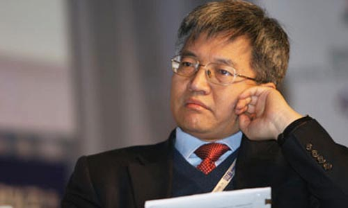
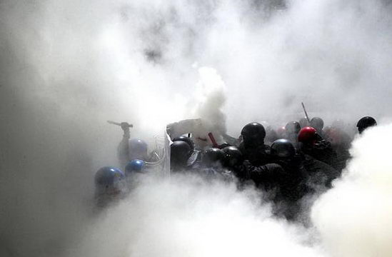

# 没人捍卫的张维迎

**“或许让张维迎下课的，不仅有长期以来无法遏制的行政干预学术的权力滥用，更有乌合之众与舆论媒体的蛮横驱赶。热衷专研学术，诚恳发表观点的张维迎，遭世人唾弃后又被北大所抛弃；见人说人话、见鬼说鬼话的明星学者郎咸平，却因“替老百姓说话”被众多网民尊称为“良心”。以上发生在天朝的奇观，不仅诠释着这片缺乏包容精神土壤的离谱，更折射出市场经济大步迈进的今天，依然存在过去思想管制年代某种 “认知服从于偏好”的集体性逻辑障碍。”**

# 

# 

# 

# 没人捍卫的张维迎

## 文/李维（西南财经）

北大光华的院长张维迎卸任了。 一位不愿透露姓名的北大光华教师表示，张维迎在人际关系问题上，可能得罪的人多一些。他思想有新意，但很多观点引起了社会不满，与民意相左，这可能是他无法继任的原因。 张维迎，作为国内最早提出双轨制价格的改革者之一，89年以前一直在国家体改委工作，是那一时期国家改革的推动者之一，他曾主张政府退出经济领域，将自由经济的权利归还于市场，而这样的改革思路在2003年的发改委改制前一直断断续续延续着。 早在1983年，还是西北大学研究生的张维迎在《中国青年报》上发表了《为钱正名》一文，文章大意是，赚多少钱能够证明一个人为社会创造的价值，而只有在知识需求旺盛的市场经济中，知识分子才有可能被尊重的可能，观点一出，立刻触怒了无数文革遗老遗少们的敏感神经，并引来了主流价值层面的争议和声讨，然而，80年代特有的开放、自由的思想环境保护了他，自此，张维迎就很少会轻易服从多数人的传统认知，而是敢于向多数人看不见的领域试探性的发表着自己的观点。 

94年取得牛津大学博士学位的张，归国后更致力于推动教育体制和医疗体制的去行政化改革。而在公众媒体更加开放和发展的今天，张也更乐意表达自己不同于国人习惯性思维的思考，而每一次的出声，却总要面临着来自国人如同文革一般的人身攻击与侮辱。 记得最典型的一次，是一些媒体断章取义报道其“上不起学是因为学费太低”的观点，在报道中，媒体对其“以高学费来弥补经济条件较低学生，保障其上大学的权利”的论述进行选择性忽视。而舆论的冲锋号一响，无数“读标题党”之公众的恶劣言辞也随着涌来，对于张的异见，不但很少有人愿意平静下来了解一下张的观点究竟是怎样的。相反，人们更多愿意做的，是去转载和相信对准张维迎如“现身夜总会”“学历造假”等信息源不明的传言。 就学术观点而言，笔者并不太认同张维迎关于市场原教旨主义万能论的阐述，也不尽然相信自由市场假说的绝对有效性。但是笔者仍然对张维迎今天的下课怀揣一丝的哀叹。 或许让张维迎的下课的，不仅有长期以来无法遏制的行政干预学术的权力滥用，更有乌合之众与舆论媒体的蛮横驱赶。热衷专研学术，诚恳发表观点的张维迎，遭世人唾弃后又被北大所抛弃；见人说人话、见鬼说鬼话的明星学者郎咸平，却因“替老百姓说话”被众多网民尊称为“良心”。以上发生在天朝的奇观，不仅诠释着这片缺乏包容精神土壤的离谱，更折射出市场经济大步迈进的今天，依然存在过去思想管制年代某种 “认知服从于偏好”的集体性逻辑障碍。 面对这些“带有强烈阶级意识”的普罗大众，世态炎凉下的投机奉承，让所谓“说真话式”的欺骗成了天朝社会无往不利的生存哲学，这种言行不一的虚伪，一方面将人们折磨的精疲力竭，另一方面人们却乐意之至，而且，没有任何力量能够阻拦人们我行我素的选择他们爱听的话，并进行转发和宣传，“民意”滔滔不绝犹如洪水一般。善于运用双重标准的他们，一边儿斥责政府不够包容，听不进去不同意见的声音，一边儿同时又讳疾弃医地的对自己不爱听的话加以屏蔽，于是张维迎、茅于轼、任志强等就成了他们语言暴力中的“权贵走狗”和“砖家”。 同时，人们往往还喜欢拿着“为草根说话”，“为老百姓说话”当成衡量公众人物品行的道德尺码，说房价即将大涨的都成了“走狗”，说房价马上暴跌就成了说出真相的“英雄”。可是人们却很少发现另一些事实，中国似乎一直不缺少口号和“为老百姓说话”的声音：“工农是国家的主人”“天下无处不均匀”“消费者就是上帝”“我要感谢XXX、还要感谢XXX”，但是，同样在中国，自古以来，但凡可以轻浮地说出这种口头上的话，去讨民众们听个喜欢的事，靠土地革命打下江山的独裁者会做，娱乐圈里聪明人会做，注重维护商业形象的商人会做，那个被中国网民捧为“最有良心”的经济学的“狼教授”会做，那些靠吸引眼球吃饭、假命清高的媒体会做，但是，一些踏踏实实的知识分子却往往不会。 夏天，当网络上下齐心合力的发出“捍卫郭德纲”的声音，一边倒的讨伐，不由得让人惊叹郭的权谋之术操纵舆论之成功，而就在那同时，济南却发生了一件没人捍卫的事：某工地不顾《高温停工令》而违规施工，造成了8名建筑工人中暑身亡，其身份又被的事主隐瞒，此事终无人问津。文明社会中，八条鲜活的生命，以及八个在背后默默哭泣的家庭，抵不过一群自我感觉良好的公众对一个相声演员、一家电视台丑闻关注的兴奋。[ (此新闻地址）](http://news.ifeng.com/opinion/politics/detail_2010_08/05/1890608_0.shtml) 人命比纸薄的现实，浮躁多变的心态，是否足以承载我们这个时代的集体迷思：“趣闻”早已超过了“新闻”，“逢迎”早已胜过了“直言”“讨好”早已战胜了“诚恳”。多少“有趣”的围观，多少“良心”的观点，多少“真相”的宣传。在这个荷尔蒙永远比常识更加旺盛的岁月里，馒头蘸血的惨案，就一直上演。因此，学者被公众声音所鞭挞，也是一种历史的悲哀。当然，各种因素下，对公众素质和求证精神提出过高要求显然无法满足于当下这个时代，笔者只是期望，在抱怨、愤怒和诅咒满天飞舞的世界里，多一些安静、宽容和理解。 

 今年，59年出生的张维迎已经51岁了，年过半百的他不过是一个穷学者，他没有钱，更没话语权，住不起别墅，更不会发动水军，所以，没人来“捍卫”。 那么，今天张维迎的卸任是一个终结，还是一个开始？还只是北大口中的一次“正常的人事变动”。下一个又会是谁呢？是敢于直言政府与市场关系的任志强，还是年事已高廉颇老矣的茅于轼和吴敬琏？ 而近来，行政权对于学术的干预，不光有个人命运的流离，还有组织形态的失常。有“金融的黄埔军校”之称五道口——人民银行研究生部，又被并入清华大学。人民银行由于其工作性质的专业性，是中国为数不多、独立性较强的政府部门，其附属学院身份的独立性也保持的较为完整，多年为中国输送多位金融人才，然而今天，却也没能躲避被传说大陆最好的行政化的高校所收编的命运，而就在此前不久，作为大陆的技术官僚，人民银行行长周小川刚刚被美国杂志列为今年的“世界百位思想家”中的第四位，为非美国人中的第一位，和周同时获奖的还有原《财经》主编胡舒立、大陆青年作家韩寒，以及诺奖得主、异见人士刘某等。五道口的被收编，和周小川的被高捧相映成趣，不知道这算不算一种偶然。 冬季依然寒冷，水面依旧冰封，天空依然深邃，春天依旧遥远，穿越于天朝大江南北，乐此不疲地做巡回演讲会的狼咸平教授依然是小愤青心目中最有“良心”的人。 还好，总有一些幸运的“非良心”经济学者可以善终。 1968年，21岁的湖南青年杨曦光，又名杨小凯，曾因挥手写下了《中国该往何处去》一文而锒铛入狱10年，这位后来成为哈佛大学和耶鲁大学研究中心研究员、莫纳什大学教授的经济学者，至今在天朝也不会有多少圈外人愿意闻说，因为信仰基督教，并坚持市场化的他，早在6年前就已经与世长辞，能躲过这个无知者的言论被公众所追捧的年代，多少是一件幸运的事。 如果杨小凯先生今天还活着，应该有63岁了，愿他在另一个世界能够得到安静的长眠。 附： [张维迎：中国政治民主化是未来30年必须面对的课题](http://forum.home.news.cn/detail/72729785/2.html) [张维迎：中国垄断价格改革的时候到了](http://money.163.com/special/002531EL/30yzwy.html) [乌有之乡：茅于轼禁足，张维迎下岗，大快人心！](http://www.wyzxsx.com/Article/view/201012/201991.html)
