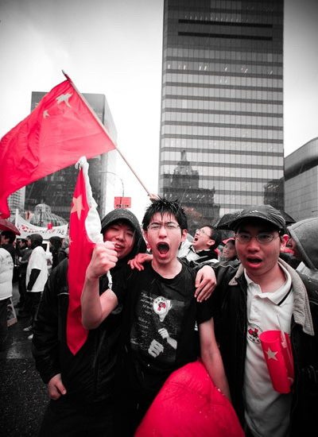

# 爱国就要爱自己

**我们小的时候或许都听过类似的故事：一个心系祖国远赴重洋的留学生面对自己的教授对中国说三道四的时候，站起来义正词严地反驳，为自己的祖国争取荣誉和尊严，然后教授沉听了会沉默，同学听了会流泪，大家纷纷向他/她投来尊重的目光，从此再也没有人说中国的坏话了。**

### 

### 

# 爱国就要爱自己

### 

## 文 / 戴冕（南京邮电大学）

### 

### 

昨天同学跟我说了个事，她的一个同学在讨论中国的问题是总是被外国的学生排除在外，而外国学生们又总是喜欢批评中国说中国的坏话。说来确实挺堵，好像因为国籍自己就在他人面前矮了大半截。不过这其中也包含了矛盾的东西：既想和外国人谈论自己的国家，又不想自己的国家被指指点点而因此让自己难堪。可事实是每个国家都有每个国家的弊病，我倒觉得把自己国家的问题拿出来晒晒又有何不可呢？坦然地面对质疑和批评，才真正地能大国的气度不是么？不喜欢听到批评之声恐怕是因为国内耳濡目染的颂扬之声太多吧，空洞而膨胀的爱国情怀就如同气球一样，被细细的针轻轻一戳，顿时便泄了气。 我们小的时候或许都听过类似的故事：一个心系祖国远赴重洋的留学生面对自己的教授对中国说三道四的时候，站起来义正词严地反驳，为自己的祖国争取荣誉和尊严，然后教授沉听了会沉默，同学听了会流泪，大家纷纷向他/她投来尊重的目光，从此再也没有人说中国的坏话了。这个故事本身倒无可厚非，可我们很容易因此而产生一种潜意识：外国人总是想方设法攻击我国，而我们为了民族尊严国家荣誉就必须予以严厉回击。这种潜意识所造成的后果就是不讲是非只讲立场或者立场第一是非第二。可是当我们的国家被指责每天有三万五千起强制堕胎事件时，当我们的国家被指责用杀伤性武器对待手无寸铁的平民时，当我们的国家被指责因为异议言论就将人非法拘禁私刑拷打时，当我们的国家被指责为了经济收入而摧毁人们的家园逼人自焚时，爱国的人们，你们依然要为了民族尊严和国家荣誉而愤起回击吗？虚妄的爱国不只让人丧失是非曲直的判断能力，在这背后实际上是泯灭人格强调国格、泯灭人性强调民族性的丑陋本质。一个丧失了人性的国家，爱字从何谈起？爱本身就是人性中最美好的一部分啊！ 

### 

### 

### 

当年北京奥运会火炬在传递时遇到了些曲折，某一段传递过程中爱国华侨们对着一个袒护藏人的美国老妇高喊着“中国万岁！”而美国老妇则微笑着回应“中国人万岁，人权万岁！”我当时若在场，肯定会在老妇人面前露了怯。追本溯源，一个国家成立最原始的意义便是要保护身处其中的每一个人的利益。我们知道，在国家危难时爱国主义往往大行其道，因为国家有难人人自危，人们的命运和国家的命运紧紧地联系在了一起。这时候人们在国家和社会生活中就会有一种无比强烈的参与感，这种参与感让人们意识到国家是自己的国家，而自己是可以为国运而奋斗的人。爱国的情怀本就来源于此。可看看我们如今的祖国，大多数人们不再热衷国家和社会的事务，虽然他们的生活的每一件琐事都与政治关系紧密，可他们却丝毫没有参与感；另一方面，之前提到的那一系列事件表明这个国家早已失去了最原始的意义而转为对人民的暴力工具。试问，如此国家，何以爱？ 那些叫嚷着爱国的人们不妨醒醒，先学会爱自己，然后爱他人，再谈爱国吧。为了民族和国家的尊严不妨先让自己和自己的同胞活得有尊严，起码要有生命的尊严。爱国就要爱自己，我相信，比起战胜于朝廷更伟大而更的是战胜于人民。 

### 

### 

（采自北斗投稿邮箱 责编：黄理罡）

### 

### 
