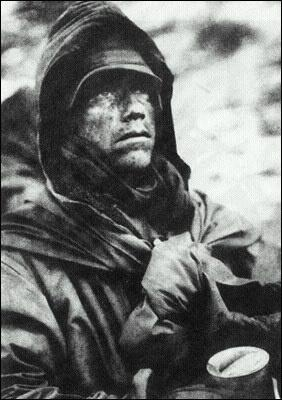
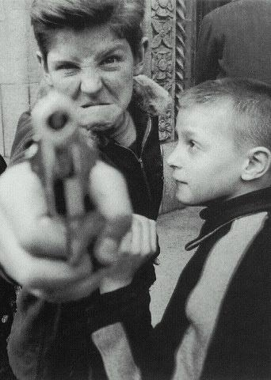

# 知识分子和他们的国

**“看来，似乎，每个国家都有自己的命，一个有希望的国家，大概是上下有交流通道互相妥协合力驾驶航船驶出历史的三峡，而失败的国家就是高压与悲情泛滥互相憎恨，同归于尽。”**

### 

### 

# 知识分子和他们的国

## 文/刘宇翔（上海财经大学）

### 

### 

1919年的夏天，中国的知识界爆发了一场“问题与主义“之争，李大钊曾经在这场争论的早期赞成胡适的观点，然而，不久，他便发现胡适的思考路径暗含对马克思主义的批评，于是，他之后写下了这么一段回应的话“罗曼诺夫家没有颠覆，经济组织没有改造以前，一切问题，丝毫不能解决。今则全部解决了”。

几十年过去，我们回头审视，十月革命一声炮响契卡行刑队枪杀沙皇一家就真的解决了俄国的所有问题了吗？1949年之后，中国人民就真的站起来了吗？这些问题的答案，大概，至今，所谓左右之间远不能达成共识。而历史的诡异之处在于，近一百年后，无论是俄国还是中国，都又一次站在了面向未来的分叉路口前。近百年前的那场争论其实并没有结束。 

### 

 上个世纪初的世界，可不是自由主义者的乐园，不妨说是自由主义在马克思主义法西斯主义挑战下节节败退的时期，无论是欧洲还是亚洲，弥赛亚救赎的渴望都裹挟在试图一劳永逸解决所有问题的主义上迅猛地征服了大部分知识分子，各种思潮层出不穷泛滥成灾，我想，要是我生活在那个时代，我也不能保证我不是某个主义的信徒，特别是启蒙与救亡二重奏的中国。西学进入中国后，几经曲折，终于在二十世纪初变成了所谓的主流，然而，撇开热闹的笔战口水之争，我们不难发现，中国人引来各种主义研究方式都不过是为了一个强国梦，什么方案主义看上去更有效就用哪个，完全一副急病乱投医的样子，所以，后来在苏联帮助下知识界迅速左倾就不足为奇了。 托克维尔曾经说过这么一句话，大意是：如果是一个贤明的君主带领我们改革，那么我们就很可能变成一个自由的民族，而一场革命却让我们变成奴隶。大意如此，大意。我想，要是一百多年前，坐在金銮殿上不是一对孤儿寡母的满族人，而是一个汉族皇帝的话，那么当时的局势会不会不同？其后的历史会不会不同？要是当年没有日本这个步步紧逼的恶邻的话，中国又将如何？翻看当年邹容陈天华他们的文章，你可以清楚地看到那种完全不加节制的民族仇恨煽动，可以说，当年的革命，是民族仇恨与渴望希望以及各种现实问题乱炖出来的一锅大杂烩，至今，其实，仍没有答案。 我们都不是专业的学者，我们评论历史时，其实总是不知不觉先有一个立场然后围绕着这个立场论证，得出我们早已经给出的结论。事实上，我们总是某个学者观点的信徒，我们其实是在文本中寻找信仰巩固信仰，仅此而已。无论是唐德刚还是黄仁宇还是蒋廷黻还是其他，总之，你总能找到一个你想要的权威，总能找到你想要的对历史人物的评价的证据。甚至，有时候，所谓的民国热还是辛亥革命热引发的读书热都不过是过眼烟云，热闹后，一切如故。蒋廷黻曾经说中国是一个中古的国家，以中古的国民政体思想军队对抗西方焉能不败？如今，我们又比他那个时代进步多少？黄仁宇的书中暗含着霍布斯主义，因为他曾经是一个军人。眼看着四分五裂的中国在日军面前一败再败，而现在的人们，又有几个真正领悟了他领悟的黑暗年代的霍布斯？ 

### 

 都是浮云，都是意淫。林林总总的一切都只是谈资，后人迟早仍会回到他们的原点。如果是进步就是电脑就是汽车就是奥运金牌就是钱的话，那么我们是进步了。但，如果说进步是精神世界的突破是政治的变革是学术体系的创新的话，我们又进步了多少？有意思的是，当年热衷时髦理论的陈独秀胡适等大家殊路同归都整理国故，而今天，钱穆牟宗三等国学大师备受推崇，似乎，一百年了，人们是幡然悔悟了呢？还是只是历史长河里又一次任性的翻案浪花而已？我们究竟同情理解理解同情他们没有？热热闹闹的西学浪潮冲击下，古老的东方回应了，然而，到最后到现在，我们仍没有塑造出主体性，那场历时百年的危机，谁说结束了？ 昨天，翻看一本轻松的书，苗炜先生的游记，文笔好很是布尔乔亚风情，不由让我想起更早前读到的托克维尔的美国游记，同样的是，他们并不认为是底层人民的代言人，他们清楚知道自己的立场精神趣味，他们只赞同自己认为对的事情。不可否认，我也是这样的人。虽然，我也可以穿着拖鞋大裤衩啃猪蹄喝啤酒当过工人和工友相处融洽，但我与他们存在看不见的藩篱，我也不觉得所谓知识分子就该天然负有为底层代言请命的责任。如今的网络上，存在这种情绪即认为底层天然是好的善良的饱含了苦难所铸就的宗教圣徒受难者的光辉，于是，原本法律经济等的问题和冲突就变成了一边倒的同情和对对方的咒骂。我不否认这个操蛋的体制下弱者的苦难，我警惕的只是这种完全没有节制的泛滥感性以及塑造出一个仿佛受难者圣徒形象的阶层符号。在历史上，这种激情引发的血腥革命有三场：法国大革命，俄国革命，中国革命。 其结果如何，各有评价吧，反正翻身的人们让千万人人头落地就是了。我想我们似乎要回到胡适，认真审视问题，而不是任由激情泛滥。其实，当年一说到苦难的人民就热泪盈眶的知识分子们，有几个是真正走进他们中间的？有几个有真正的人民朋友的？他们不过是虚幻出这么一个形象符号然后自己被自己的善良感动得情不自禁而已。翻看启蒙运动作家俄国知识分子们的书信和他们的行动以及宣言，你就可能震撼地发现那种近乎于人格分裂的反差。 当然，我要说，所谓改革也罢革命也罢，其实不同人有不同理解，不同人有不同的利益需求，只不过在恰当的时间恰当的事件刺激下形成一股合力而已，并不存在一致性独一的理念和诉求。比如，当年伊朗革命前夕，宗教主义分子民族主义分子中产阶级军队学者等等就对伊朗王朝有不同的不满，他们推翻了国王统治后，大概谁也没想到了迎来的是神权的统治。看来，似乎，每个国家都有自己的命，一个有希望的国家，大概是上下有交流通道互相妥协合力驾驶航船驶出历史的三峡，而失败的国家就是高压与悲情泛滥互相憎恨，同归于尽。 

 如果说，沙龙塑造了法国文化咖啡馆塑造了法国哲学的话，那么流放就铸就了俄国的知识分子西伯利亚苦难之旅铸就了俄国的精神，然而，我们审视下，是什么造就了近现代的中国知识分子？什么是中国精神世界的基点？苦难的二十世纪，其实，并没有让我们领悟多少。 历来，无论是海外学界还是中国学界，中国，其实都是一个被表述的他者，而在国内学界，中国南方更是一个被北方代表和表述的他者中他者。如果我们仅仅用史料或者新闻事件的视角去审视一个时代的话，那么我们似乎就得出了一个直观的判断，比如1919年就是《新青年》论战军阀开打的年份，911后的美国就是恐怖笼罩人人慌慌，然而其实，我们的历史认识是被塑造的，宏大的背景叙事下，其实是永远不被记录的家常里短日常生活，只是，历史，永远是叙事者塑造的历史。 而它们就塑造了今天的中国。
