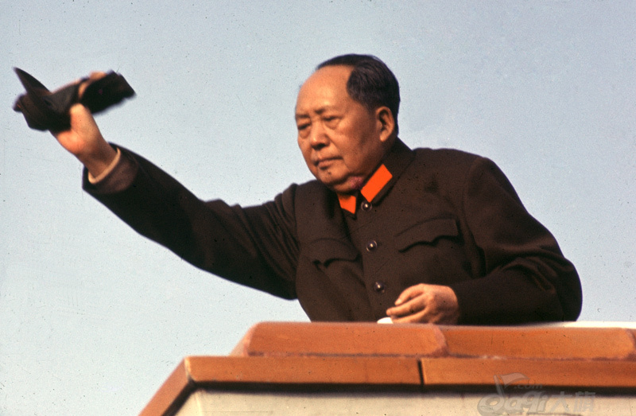
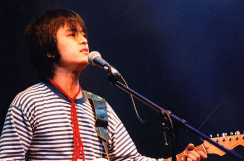

# 粉丝是伪粉丝的通行证，装逼是装逼者的墓志铭

**“说到底，我们追求偶像，只是为了寻找身份认同而已。而装逼先行者还必须需找能区别大多数人的身份认同，并假装惺惺相惜的聚在一起，我们追求的其实是自己心中的理想形态，只是把这个愿望投放到偶像身上而已，所以我们一直在路上。”** ** ** ** **

# 粉丝是伪粉丝的通行证，装逼是装逼者的墓志铭

## 文 / 黄薄码（南京师范大学）

 革命事业初创时，有潜质的偶像总能吸引到一班最原始的死忠支持者。这些支持者彼此欣赏，甚至还能与被膜拜者私下交流。这时偶像还不为大众所知，所以大众称这批先行者为装逼者。后来随着偶像的努力、传媒的报道和支持者制造出来的声音，渐渐的越来越多人认识这位偶像了。而这时，最初的支持者却选择离去。 

 装逼先行者虽然是一切装逼行为的始作俑者，但是你不得不佩服装逼先行者的眼光，他们所挑选的一些偶像既有初期小众装逼的气息又具有后来大众化传播的潜质，最初的装逼者不能称为装逼者，他们是被偶像那原始纯粹的色彩吸引过来的。我们支持这个没什么人认识的偶像，是因为我们喜欢这偶像表达的意识和思想，是我们自己找这位偶像，而不是人家把这偶像硬塞给我们的。 渐渐的，开始有“下一代”的支持者加入和我们分享这个偶像。最初，我们为找到知音而高兴，大家也乐于分享自己心中的偶像点滴。随着支持者越来越多，开始有不那么死忠的支持者，他们没有探究作品背后的意思，也不清楚偶像以前的作品，他们喜欢的纯粹是偶像某些作品；甚至不必哪本书，只是单因偶像受欢迎就加入支持者的行列。大陆有个规定，1949年9月30日之前参加革命的人退休后可以算离休干部，而之后的只能算是普通退休干部。可见革命胜利之后才来抢夺胜利果实的人是不受待见的。 

 后来当《旅行的意义》也从印有vaio的大屏幕山寨手机功放出来时，当穿着杰克琼斯的人也满口陈老师的时候，陈老师自然最早被装逼先行者们抛弃，因为像我们这些人最讨厌大众了，但我们这些人的虚伪之处也在于我们喜欢的是能被大众知晓的小众。所以《旅行的意义》对于陈老师的致命打击就是填上了先行者与后来者的鸿沟。此类的一本大作毁掉一个鲜为人知偶像的例子不胜枚举，《大江大海》之于龙应台，《志明与春娇》之于彭浩翔，甚至死亡对于王小波，后来者纷纷踏着铺好的捷径如获至宝的大肆渲染，这不得不让有密集恐惧症的装逼先行者感到很反感。 如果说当初94年红磡何勇的那一身海魂衫红领巾是真牛逼，而现在满街所谓文艺青年都他妈回力鞋海魂衫，这就是烂俗。对我们这些装逼先行者而言，一些新支持者无疑是肤浅而且影响了我们的格调，我们在新支持者身上再找不到认同，于是新人和旧人就会发生冲突。冲突的语调不外乎「变质」、「多方面尝试」、「认识不深」等。 

 当哈耶克的《通往奴役之路》已经不必以内部发行的渠道在大陆流通，并跟其他奥地利经济学派人物逐渐烂大街时，这个时候，我们这些装逼先行者已经在不断需找下一个哈耶克，下一个维特根斯坦，下一个博尔赫斯，而我们却认为上述曾经偶像「变」了，不再是他们喜欢的那个人了。 说到底，我们追求偶像，只是为了寻找身份认同而已。而装逼先行者还必须需找能区别大多数人的身份认同，并假装惺惺相惜的聚在一起，我们追求的其实是自己心中的理想形态，只是把这个愿望投放到偶像身上而已，所以我们一直在路上。 

