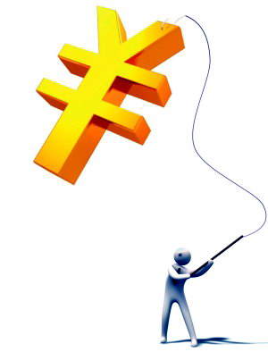

# 致我们这个终将完蛋的时代

**“手无缚鸡之力的书生文士，仅凭其德其言，就可以免于灾祸，虽死犹生，虽败犹荣，活的不朽的声名，这样的人，即便死也死的安稳。这样的人，不会有不安全感，不会是一个失败者。它是海明威笔下的老人，人可以被消灭，但不可以被打败。”**

# 致我们这个终将完蛋的时代

## 文 / 张亮（北京大学）

 每天，我都会收到一些人的问候，他们中间有我的中学同学、大学同学、研究生同学，我曾经的暧昧对象，我的前女友，我的狐朋狗友，我的亲戚，我的网友，我的老师，我的蓝颜知己。他们活着唯一的奢求是，十年、二十年之后，活的安全，不是一个失败者。 怎样才能活得安全？在唐朝，一个有文化的人，会写诗的人，不会是一个失败者。《唐才子传》里有很多这样的记载。某一天，一个衣衫褴褛逃难中的诗人，被一群强盗拦住，拔出刀来，要抢他钱，要他命。忽然，从贴身包袱里掉出来一本发黄的诗集。强盗检起来，翻了几页，改容敬之，请诗人给他写一首诗，诗人援笔立就，众强盗千恩万谢，请诗人饱餐一顿牛肉而去。 在汉代，一个像张俭那样得罪了宦官的儒生，虽然全国通缉，却依然有人冒着满门抄斩的危险，一个接一个的收留他，即使李膺为宦官所忌害，却依然改变不了士人对他的评价：“登李元礼门如等龙门”。 手无缚鸡之力的书生文士，仅凭其德其言，就可以免于灾祸，虽死犹生，虽败犹荣，活的不朽的声名，这样的人，即便死也死的安稳。这样的人，不会有不安全感，不会是一个失败者。它是海明威笔下的老人，人可以被消灭，但不可以被打败。 即便在我们父母辈的时代，像雷锋那样父母双亡的穷苦人，像我外公那样幼年失怙，中年丧妻，一生坎坷，也可以因为行事正直，两袖清风，即便刚直不阿，也能身后留名，为人敬重。即便面对子弹扑面，濒临死亡，他也坦然受之，不因此有杯弓蛇影之叹。 但如今不一样了，几乎所有年轻人对在我抱怨和感叹，害怕变成一个失败者，害怕失败的恐惧与不安像瘟疫一样传染，终其一生，杞人忧天已不再是笑料和讽刺，而是鲜血淋漓的现实。 

 有人对我说，他刚看过唐骏的视频，李开复的视频，比尔盖茨的演讲，他害怕自己是一个穷人，无车无房，不能在四十岁以前享受生活。 有人对我说，她刚看到陈鲁豫访问希拉里的视频，她希望自己是一个精明的政客，像希拉里那样呼风唤雨，但失败的恐惧萦绕她，十年之后不可想象。 我们的时代，唯一被人承认的力量便是金钱和权力，而不是什么立功立言立德。无功无言无德之人，只要拥有金钱与权力，尤其是垄断的金钱与权力，他便获得了安全的资本。 因此，也就不难解释为什么越来越多人一边痛骂当道黑暗，一边削尖脑壳考公务员，越来越多北大学生一边痛骂张维迎曲学阿世，一边削尖脑壳想进光华，越来越多人一边喝着牛奶面包看《蜗居》痛骂郭海藻一边满世界找个宋思明求包养，越来越多人不惜自毁名誉，一边顶着满头骂名，一边博取天下一笑，哗众取宠，如芙蓉姐姐、玉凤姐姐之流。 当只有金钱和权力才能给人们带来一点点可怜的自尊和安全感，当一个时代逼迫人们拥抱自己刚刚所唾弃过的一切，它离崩溃也就不远了。 

 我曾经对一个师弟说过一句话，总有一天我们都会变成我们昨天所唾弃的人，猪狗般活着，猪狗般死去。他觉得过于悲观。那么今天我再加一句，这个我们猪狗般活着猪狗般死去的时代终将完蛋，这是好事，毁灭往往意味着涅槃。 

