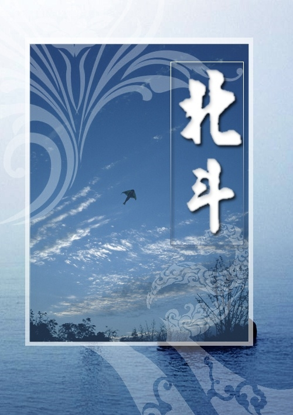

# 荀子·咸菜·粗粮·及其他——答父辈的疑问

**编者按：****2010年8月5日，北斗主站留言板上出现了这么一段署名为“老鱼”的留言。** **北斗的孩子们：** **我是你们中的一位活跃分子、一位组织者的父亲。有些心里话想对你们说，希望你们能够认真地对待父辈的意见。第一，作为父亲，我希望你们能够健康、平安的长大成人。理想、信念固然重要，一生平安同样重要。第二，天行有常，不为尧存，不为桀亡。只有当黑夜的最后一缕黑暗消失以后，白天才会真正到来。在黑夜里苦苦的抱怨黑暗和不切实际的期盼天亮，无异于折磨自己。第三，希望你们要完善自己，修身为先，然后才是治国、齐家……** **修身是一个漫长的过程，不是在大学里拿了一个什么文凭、写得几篇文章就有了的。城市里的80后门，几乎有一个共性的表现，令父辈们很是无奈。第一，在星期天和节假日里，几乎所有的80后都在做着同样的事情，上网到半夜，早上不起床，晚上不睡觉，早饭晚饭一起吃，上网永远不怕累，吃饭时要喊你们无数遍，还表现得不耐烦；第二，几乎永远不吃咸菜（咸菜这道调味品已经流传几千年），不吃粗粮，鄙视体力劳动，对家务劳动视而不见，缺少家庭责任感；第三，看社会不顺眼，看政府不顺眼，看国家不顺眼，看学校不顺眼，看城市建设不顺眼，甚至看家长也不顺眼（家长只是一台提款机而已），似乎到处都是一片黑暗，只有你们才是阳光。** **不说了，以上寥寥数语，你们肯定已经不耐烦了。如果你们不删除这个帖子，如果你们有勇气面对和保留，并能够认真思考，余愿足矣！** ** **

** **

** ** **基于对读者的负责精神，以及敝刊自我审视的反思、理想的阐释，我们由常务总编在当天立即作出了如下的回复：**

# 荀子·咸菜·粗粮·及其他——答父辈的疑问

## 文 / 迦南（北京外国语大学）

 伯父： 您好，首先无论如何，非常感谢您的意见。我们愿意接受来自各方的、各类的意见。 虽然不知道令郎是我朋友中的哪一位，但作为北斗曾经的一名骨干成员，我希望我的回答能稍减您的担忧和疑惑。 首先，子女平安是所有父母最挂心之事。我们完全理解，也完全赞同。我们不推崇任何过激的行动及言论。晚侄作为北斗的前常务总编，深知自己对北斗内的朋友负有一定责任，绝不让北斗内的朋友以身犯险。此外，虽然我们对社会民生及公共事务，时有尖锐意见，但我们同样相信今天的政府和国家比之过去已有了长足的进步，有足够的度量能够容纳来自民间的、大学生的一些温和意见和评论。 第二，您说的对，天行有常，不为尧存，不为桀亡。但在这段文字之后，荀子还有更为精彩的论述，他说：“应之以治则吉，应之以乱则凶。强本而节用，则天不能贫；养备而动时，则天不能病；修道而不贰，则天不能祸。故水旱不能使之饥，寒暑不能使之疾，妖怪不能使之凶。本荒而用侈，则天不能使之富；养略而动罕，则天不能使之全；倍道而妄行，则天不能使之吉。故水旱未至而饥，寒暑未薄而疾，妖怪未至而凶。受时与治世同，而殃祸与治世异，不可以怨天，其道然也。故明于天人之分，则可谓至人矣。” 晚侄以为，荀子的这段论述不仅在其所处时代，即便在今日，也是颇为先进的。他首先肯定了人不能对抗客观规律，但更重要的是，他还提出人可以利用客观规律以造福社会。但凡“背道妄行”则“天不能使之吉”，我们正是因为接触、了解了一些“背道”之行，才希望能通过笔杆子以“正道”。荀子说客观规律不可违背，就如您所说的“只有当黑夜的最后一缕黑暗消失以后，白天才会真正到来。在黑夜里苦苦的抱怨黑暗和不切实际的期盼天亮，无异于折磨自己。”但问题在于，您的类比并不恰当，您所说的是自然规律，即荀子口中的“天行”，“天行”是我们反对不了的，我们所反对的是“人谋”。 我们认为，当今社会上的一些不公与阴暗面不能以人类发展的客观规律加以搪塞，一些问题的出现实际上是人为的结果。荀子对此早已做过了回答：“治乱，天邪？曰：日月星辰瑞历，是禹、桀之所同也；禹以治，桀以乱，治乱非天也。”可见，荀子并不认同将治乱与否归咎于“天行”，因为这往往是为乱者用以推卸责任的借口。若一出现问题，即把责任推诿给“天”，那还要政府何用？对于人为造成的不幸，我们不应无视，不应麻木，更不应将其简单归结为规律使然，而应有积极的作为与态度。毛泽东曾言：“扫帚不到，灰尘不会自己跑掉。”我认为这个类比，比您所说的黑夜与白日的类比更恰当一些。对于当前社会的灰尘，一部公正的法律是扫帚，一则客观的新闻报道是扫帚，普通大学生的关注与评论同样是扫帚。 荀子还说过：“从天而颁之，孰与制天命而用之？愿于物之所以生，孰与有物之所以成？故错人而思天，则失万物之情。”既然包含了万物客观规律的“天命”尚可“制而用之”，何况违背了客观规律与道德伦理的“人谋”乎？ 第三，“修身，齐家，治国”乃是中国传统士大夫追求，恪守的人生轨迹。我们完全赞同。但正如伯父所言，修身是一个漫长的过程，或者说，是个终身的过程，而非青年期读几年书，拿几本证就可妄言“修成正果”。因此，修身固然是必须的，但修身与齐家，治国之间的关系并非割裂的、相互独立的，而是辩证统一的。一方面，唯有不断提高自我修养，方可具备齐家、治国之资；另一方面，齐家、治国也是整个修身过程的一部分。晚侄未闻有哪个人因自认修身不足，而不成家的，也未闻有人要在婚娶之前拜师学习如何过夫妻生活的。如日后令郎到了适婚之年，却与人说：“吾身未修，不可妄言嫁娶。”伯父将作何想？ 清末康有为曾批评革命党人道：“今日中国之人心，公理未明，旧俗俱在，革命之后，必将日寻干戈，偷生不暇，何以能变法救民，整顿内治。”章太炎驳曰：“公理未明，即以革命明之，旧俗俱在，即以革命去之。”相似地，今日诸多长辈以“心智未开，事理未明”为由，不愿小辈妄议国事，对此，我的回答也很相似：“心智未开，即以论辩开之，事理未明，即以论辩明之。”当然，论辩的前提须是理性与温和。 此外，晚侄以为，修身过程当伴人终身，否则即便事业有成，也于国于民无益。伯父岂不见某些为官者，恣意敛财横行乡里，岂不闻某些为商者，奴颜婢膝糜烂庙堂，岂不恨某些为学者，媚骨事宵小，著书愚黔首？何也？古人云：“意诚而后心正，心正而后身修。”意不诚、心不正者高谈修身，岂非咄咄怪事？令郎愿为不公而鸣，是为意诚，令郎不与浊世同流，是为心正。有此意诚心正之子，伯父还担心他日后身不能修，家不能齐？ 中国人自古便有“文死谏，武死战”的价值追求，只不过经历了政治高压和物质冲击，这样的传统逐渐凋零了。作为具备一定人文知识素养的青年，对此有所追求，也不足为奇。且一方面，我们尽可能以温和理性的言论提出看法，另一方面，我们也相信国家的法制进步，断不至因几个青年说了几句话，写了几个字就大动肝火。故比之皇权社会下的知识分子，我辈的处境可谓优越了许多，想说的话，敢说的话，自然也多了许多。 最后，关于令郎与您之间的事，本来，我觉得不便多言，因为我想无论再大的隔阂也能靠理性沟通消除。但就您所说的，令郎不吃咸菜的事，我觉得很有意思，希望将自身的经历与您交流一下。我个人，是喜欢吃咸菜的，但每每我吃得开心时，家母就要制止我道：“腌制品，容易致癌的。”所以，我与家母的情况比起您与令郎的情况，似乎是反过来了，但其实并无差别。我觉得您把一个简单的问题过度复杂化了，无论是您让令郎吃咸菜，还是家母不让我吃咸菜，都是出于为人父母的美好初衷。而吃不吃，我觉得是个简单的个人口味问题。您大概是多虑了。上网一事，我觉得关键在于，令郎到底上网做些什么。如果是学习，读书，扩展知识面的话，我觉得并无大碍，毕竟如今网络带来的信息量是无比巨大的。 至于，不干家务，对父母态度不好等事，我觉得只能靠加强温和的沟通解决。这个是我无法帮您的。 晚侄所能向您保证的就是，这不是一个干坏事的圈子，也不是一个要干革命的圈子。我们中的多数，都是温和的改良主义者。现实生活中，除了聚在一起吃饭、交流之外，没有组织过任何集体的活动。也不可能将这个圈子置于政府的对立面。这点，还请放心。我们只是一群拿笔写字的人。 

 落笔匆忙，辞不达意，如有不敬之处，还请伯父见谅。
