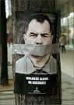

# 言论自由与“小报告”

**“比起那些一言不合就高呼“打倒”的愤青，或者那些掌握巨大社会资源的“隐形人”，坚持“誓死捍卫别人说话权利”的人们真是显得手无寸铁，而且毫无战斗力。但这些人们是幸福的，因为正是他们坚守的这些信念，贯穿了人类追求平等自由的历史。也许百年之后，抛开纷繁的现世，会发现他们输掉了每一场战斗，却赢得了战争。”**

** **

** **

** **

# 言论自由与“小报告”

## 文/叶大宽（Universität Stuttgart，斯图加特大学）

最近出了起北大学生打小报告举报老师的事情，被曝到网上后，便有人祭出“言论自由”的大旗为其辩护。他们的观点也很容易理解：那个学生只不过是在一定的地点，对特定的对象，说出了自己想说的话，行使了言论自由的权利，本不应该被口诛笔伐。乍一听似乎也对，然而，最危险的谬误，往往是那些看上去正确的谬误。

从逻辑学上讲，要讨论一个概念，首先要弄清楚它的定义。按照普遍被接受的观点，言论自由是指按照自己的意愿在公共领域自由地发表言论以及听取他人陈述意见的权利。依照《世界人权宣言》的表述“人人有主张及发表自由之权；此项权利包括保持主张而不受干涉之自由，及经由任何方法不分国界以寻求、接收并传播消息意见之自由。”尽管《公民及政治权利国际盟约》对此种权利有“尊重他人权利或名誉”，“保障国家安全或公共秩序，或公共卫生或风化”的限制，但窃以为“小报告”并不在此“自由”的范围内。

我们这一代人，小学的时候多半都会经历或目睹过所谓的“小报告”，这对我们并不陌生。长大后回想起来，“小报告”的本质就是在剥夺被举报人申辩权利的基础上，利用自身对掌权者造成的信息不对称的影响，诱使掌权者做出有利于自己的决定。这显然是与“言论自由”的原则背道而驰的。

言论自由的权利应当是人人共有的。相应的，如果一个人被指控，他自然的应当拥有通过言论为自己申辩的权利。所以，当江青的辩护律师走上法庭的时候，恐怖的文革才真正的结束，因为我们并没有召集数以万计的“人民群众”在嘈杂声和口号声中宣判她的罪行。在正常的社会下，学生如果不同意老师观点，大可当堂与老师辩论。正所谓“夫辩者，将以明是非之分，审治乱之纪，明同异之处，察名实之理；处利害，决嫌疑，焉摹略万物之然，论求群言之比”。这种辩论的结果自是“胜者不失其所守，不胜者得其所求”，是一种很健康的公民态度。如果执师道者用自己的权威压制学生的这种辩论，当然可以视之为对学生言论权利的剥夺。但整件事中，很遗憾，似乎并没有出现这样的一幕。众所周知，在当前政权的框架内，个人的境遇基本上只取决于上级，这就是为什么有人在举国反对下仍然能够连任两届总理一届人大委员长，并且顺带还把子女安排的如此妥当。那位举报自己老师的学生，肯定也深知这一点。兴许是因为在这样的制度下，“小报告”从来都比较快捷，使他本能的选择这种方式，去捍卫自己的观点。当然，如鲁迅先生一样，我“一向不禅以最大的恶意揣测中国人”，因此我并不估计这个学生有“举报立功”的小算盘。只是在他伸张观点的同时，却企图用行政的力量去干涉夏业良教授保持自己观点的自由，此举何谈“言论自由”？

中国的言论自由的大门，自58年后便彻底的关上了。这扇铁门是如此的严丝合缝，以至于五十多年后的今天，人们依然只能透过辛苦撬开的细细的门缝，说一些不痛不痒的“擦边球”。当年的掌权者不愧是深谙人性和帝王之术，时隔两千多年，依然能把《商君书》中最恐怖的保甲之制玩的炉火纯青。当每个人都有打“小报告”的权利，整个社会的安全感便荡然无存。而我们也从来都不会得知，我们会在什么时候因为怎样的理由被举报。在我们的命运被决定之时，我们甚至没有解释和申辩的机会。更糟糕的是，这一点很容易被那些决定我们命运的人利用，当然还有紧盯着我们的竞争者。其实只要看看被错划的55万“右派”，就会发现这并不难理解。于是举国齐喑，整个国度只有口号没有言论。盖当论，对言论自由损害最大的，恰恰是这些“小报告”。

更深一点说，言论的自由只是表象，其在本质上是人与人的平等，是一个公民不惧怕另一个公民，是强势者能够包容不同观点的胸怀，和令其必须包容不同意见的制度。但很遗憾，毋庸多言，这些条件在今天的中国是不存在的。生活在这样的环境下，我们最常看到的，是那些被允许自由发表的言论掩盖下的私欲，是躲在一面面旗帜下的龌龊的灵魂。这些灵魂是不敢站在阳光下讲话的，所以即便是见不得人的“小报告”，也必须披上“言论自由”的外衣。当然这些旗帜还是骗到了不少人。只是如果有一天，铁门被打开，旗帜被扯去的时候，那些见不得光的灵魂又当如何自处。

比起那些一言不合就高呼“打倒”的愤青，或者那些掌握巨大社会资源的“隐形人”，坚持“誓死捍卫别人说话权利”的人们真是显得手无寸铁，而且毫无战斗力。但这些人们是幸福的，因为正是他们坚守的这些信念，贯穿了人类追求平等自由的历史。也许百年之后，抛开纷繁的现世，会发现他们输掉了每一场战斗，却赢得了战争。
