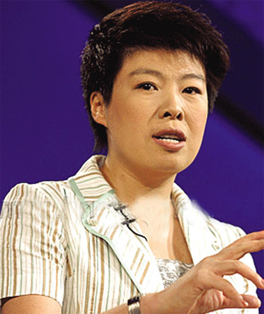

# 让我们真诚（一）——从警惕“哲理小故事”说开去

**“话题从“哲理小故事”引起，但我实际想说的是真诚的问题，真诚对一个人的判断力至关重要。按我的观察，讲“哲理小故事”的人通常都有一种“知性”“有内涵”的姿态，他们有时是足够真诚的，有时则不是——这时，小故事可耻地沦为一种标榜——虽然他本人可能并没有显式地认识到这一点。”**

# 让我们真诚（一）

# ——从警惕“哲理小故事”说开去

## 文 / 张慧聪（四川大学、现役新浪）

我通常倾向于认为一个智力健全的成年人在看到“哲理小故事”的时候，都会给出自己合理的解读。所谓合理，是指这个解读是完全在自己掌控之中的，不会由于被有感染力的文笔（和背景音乐）搅动了情绪，而跌却了判断力。在有效的思考习惯（敏感的逻辑反射）支持下，我们能简单地看清楚“哲理小故事”带给我们的到底是什么。 很多“哲理小故事”是很扯淡的。最臭名昭著的可能是“温水煮青蛙”。我没做过这个实验，但从我收集的资料看来，带来哲理的“事实”是假的。我们先不论青蛙到底会不会从缓慢加热的锅里跳出来，但一个拥有有效的思考习惯的人，在第一次听到这个故事时，至少应该会心存疑问——真会这样么？ 

很多时候，无效的论证也能带来有效的结论。比如：“天上下的雪其实是黑色的，但你看起来却是白色的，所以不要轻易相信自己看到的东西。”这是个无厘头的胡扯论证，如果把“雪其实是黑的”换成海市蜃楼，就是个有效的论证。我这里要指出的是，“由于结论有效（通过直觉性判断）从而（反推）认为论证有效”，这是很常见，但很有害的思维陷井。“温水煮青蛙”的“寓意”是告诉人们要防微杜渐——防微杜渐当然是对的，但这当然不能说明对它的论证是有效的。 还有些故事是从历史或现实里来，但可惜，作者按自己的意图“改编”了，使其更加符合“寓意”。我认为这种“改编”甚至“纯编”常常非常有害。比如有一类很常见的“面试”故事，一般模式是现在剩下两三个候选人，但名额只有一个,但企业没有考技能/专业知识，而是莫名其妙地“不经意”的考试，结果“人品好”的被录用了。我认为，这类故事的危害，比钱钟书先生批评的《伊索寓言》严重多了。《伊索寓言》之类的故事，明明就告诉你是假的，至于从中悟出什么道理来，那是你自己的事，但真实世界的背景经常容易给人一种幻觉，以为这就是真实的世界，但其实不是这样的。 就拿“面试”故事来说，我还从没听说过现实中有这么玄乎的面试（注意，故事中几乎从来不说是哪家公司，什么时候，谁在面试谁），这意味着即使有，你遇上的概率也极小。技能/专业知识/职业能力 永远是公司最看重的——因为它们决定了你能不能为公司创造价值。而人品一般在面试交流中就能够大体体现出来，对于判断“对公司是否有害”一般是足够的。还有些故事会讲“好人好报”（注意，这个好报可不是一般的好，而是鸡犬升天级的好），我听过真实可靠的好人好报，也听过很多的好人没好报。所以，这些故事即使是真的（更多其实是假的）其实也没什么哲理。一类常见的模式是某小人物因为心好帮了某个看来很落魄的人，结果这人竟是个大贵人的至亲，于是大贵人由于感激，就让这个小人物鸡犬升天了，“这个故事告诉我们，对所有人应该一视同仁。”教人心好是没错的，但且不说这种事情发生的概率有多小，难道你帮助别人是为了碰到这种贵人吗？ 有很多“流行文化”非常喜欢这类东西，它们会通过各种玄乎，各种装逼来显示“智慧”和“哲理”，但我们应该牢记：逻辑是一切说理和论证的基础。这里随便举一例：“ _孔子给我们提示了这样的方法。他说：“吾有知乎哉？无知也。有鄙夫问于我，空空如也，我叩其两端而竭焉。”（《论语·子罕》）_ _孔子说，你说我算是一个有智慧的人吗？我没什么大智慧。有鄙夫，也就是有个大老粗，他来问我一些问题，我脑子空空荡荡 的，所以我就回答不上来。没有一个人是全知全能的。但是孔子说，我有个方法，就是我遇到任何事会“叩其两端而竭焉”。也就是说，一事当前，人要跳得出，不 要沉浸在这个事情的过程中，纠缠于细节，而是要抓住这件事情的两个极端，就能求得事情的解决，知道问题的真相。_ _凡事在你眼前，你就问问自己，最好能怎么样，最坏能怎么样？然后你才可以决定怎么做。这叫“叩其两端”，就是问它两端的极值，然后来统观全局。_ _这里要说到一个有名的小故事。德国一个小学的课堂上，有一个小男孩特别淘气，从来不认真听讲，老师实在太烦他了，为了让他安静一会儿，给他出了道题，随口说：你坐在那儿算，一加二、加三、加四、加五、加六，一直加到一百，你去算吧，最后得多少？_ _老师转身接着讲课，没过几分钟，这小男孩站起来了，说是五千零五十。老师大吃一惊，问你怎么算出来的？那小孩说，一加一 百是一百零一，二加九十九是一百零一，三加九十八还是一百零一，这样两头加，加到中间，五十加五十一还是一百零一，那么五十个一百零一不就是五千零五十 吗？这个小孩就是后来的大数学家高斯。_ _小高斯用的这个方法，就是一个特别简单的叩其两端的方法。_” 大家可以在 [http://www.wcko.net/shownews.asp?id=778](http://www.wcko.net/shownews.asp?id=778) 看到上面我引用于丹老师的视频和文字。我不想说小高斯在做题的时候是全班一起在做这个题，还是老师在继续讲课，但总之，这个故事和“叩其两端”显然是屁关系也没有，你用叩其两端给老子求个平方和试试？求个倒数和试试？ 

之所以举上面的例子是因为我第一次看于丹就在讲这个片段，看完我就决定无视这个人。其实按我的经验，历史和事实更多的时候会告诉我们，真实世界是残酷和无奈的，死了的人不会复生，犯罪的人未必受罚，含冤的人难以昭雪，一直努力的未必就有收获。高深的（就是难懂的，其实就是装逼的）“哲理”在现实面前往往无效，还不如拉板车的大叔一句脏话实在，因为它们都是一些“有文化”的人意淫出来的，还是放在童话和寓言里吧。 话题从“哲理小故事”引起，但我实际想说的是真诚的问题，真诚对一个人的判断力至关重要。按我的观察，讲“哲理小故事”的人通常都有一种“知性”“有内涵”的姿态，他们有时是足够真诚的，有时则不是——这时，小故事可耻地沦为一种标榜——虽然他本人可能并没有显式地认识到这一点。按我的观察，很多人在这种姿态面前都有一种潜在的向往，好像认同并吸收了故事里的“哲理”，就靠近了这种“知性”，丰富了自己的“内涵”。这是很正常的心理需求，但习惯真诚的人能够把自己“获得丰富自己内涵的心理满足感”的欲望拆出来。这就有助于他理性地解读故事。 我们不真诚的习惯是从小就被明确培养的。小学作文时，老师会要求你“立意”，讲解课文时经常会说xxx表现了xxx，xxx的描写突出了xxx。后来我才发现这里的问题：如果你描写的是事实，那么就应该写实，无论是记人，记物，还是记事，用简洁地文字精确地表达才是目的。“为了表现/突出xxx”而描写，其实隐隐地鼓励了失真。 这个问题看起来没什么，但其实却深重地影响了我们整个国家的文艺，从《白毛女》到《走进新时代》，这都是些什么？甚至连新闻业都受之影响，那些被隐去或模糊了部分事实的报道，不正是在这种“目的”习惯下产生的么？ 尊重事实和逻辑，真诚面对自己内心的欲望和感受，这是我们必须具备的基本素养。 转自：[http://blog.renren.com/blog/200044020/485263400#id1559354159](http://blog.renren.com/blog/200044020/485263400#id1559354159) 作者博客地址：blog.bukn.info
