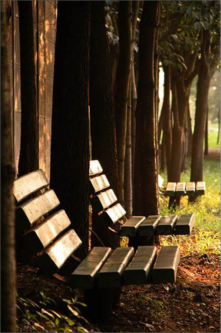
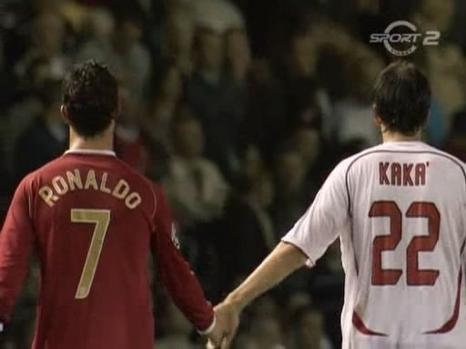

# 论姿态主义

**也许是因为“给自己贴标签”体现了一种对自己主权的独占，对“自己是谁”的独家解释权。让人有真正独立的感觉。还有一个原因，我不希望说但必须说的，我认为是一种过强的敌对欲望作祟。**

### 

### 

# 论姿态主义

### 

## 文 / 周雨霏（中国人民大学）

### 

### 

“姿态主义”是我和朋友们最近发明的一个词汇。为了让它听起来更牛逼一点，我们决定给它配上英文名：posturism（来自于单词posture）。这里的姿态不指站姿、坐姿、卧姿等实际的身体姿势，而是指某种形而上的、微妙的态度、立场。“姿态”本身是个中性的词汇，可加上“主义”感觉就不一样了。 曾看过一篇叫做什么《文艺青年养成教程》之类的日志。说如果你从来没看过村上春树，仅仅是知道他这个人，那你赶紧看看他的作品概要，然后你就可以到处向人宣称：“我是村上迷”了。确实，很多人从这种不停的宣称中得到一些自豪感和快感。他们听说村上是个很牛逼的人，而对着一群不熟悉村上的人宣称自己是他的追随者，可以让自己也显得很牛逼。这篇文章还谈到其他许多类似的，让一个完全不文艺的人迅速从姿态上先站成文艺青年的方法。比如旅游不叫“旅游”，叫“旅行”。某个牌子不叫“某个牌子”，叫“他们家”。比如随身带lomo，随时自拍。等等等等。这些方法简单实用，事半功倍。 

### 

### 

### 

这也许就是很多人认为文青做作的原因。有些文青太注重姿态。 刘瑜讲她大学时"为了当上一个合格的文艺女青年而读萨特、尼采、海子什么的。"至于读了之后有没有收获，她说仅仅是“可能当时也会搅动小心脏一下。如果说有影响，甚至有点坏影响”。盲目的跟风“造就了一批迷恋姿态远甚于思考本身的青年学子”。 而中国作家春树也说过：“人只有在年轻时才会觉得姿态比身体健康更重要。” 姿态本是个被动的后天赋予的概念。就是说，你在站的时候并没有刻意要摆出什么样子，只是别人在看的时候为你的样子起了一个名字，叫姿态。而现今很多同龄人越来越明显的倾向却是：在站立之前，就先定好了自己要站的姿态，并对此抱以极大的自信与热情。至于自己为什么要这样站，是不考虑的。如果必须要有原因，那也许是，这样很与众不同，很酷。 其实这也许是年轻人的再正常不过的心理了。我们谁没有过一天早上爬起来之后突然向世界宣布我要好好学习，然后步履坚定地踏着灿烂的阳光去食堂，回来之后继续猥琐地窝在电脑前虚度光阴？我们总是有种想要宣布什么的冲动，那个大声喊出来的瞬间带有某种魔力，让我们深深着迷。所以摇滚现场总是可以让一个平时乖乖的人变得疯狂。不只是我们，其他时代的、其他国家的年轻人们都喜欢这样。美国“垮掉的一代”，《挪威的森林》里号称要“肢解大学”的日本青年们……这是青春的特权，却也是青春的糟粕。我们成长的目的就是逐步摆脱这样的偏执。 看过一部很摇滚的美国青春电影叫《Nick and Norah's Infinite Playlist》。Norah对Nick说：“你是不是就是那类什么什么的人？我也是！”然后Nick很淡定地回答说：“对不起，我不是很喜欢给自己贴标签”。话说给人贴标签是我国某个年代很流行的事呀。为什么现在的人都那么喜欢给自己贴标签呢？ 也许是因为“给自己贴标签”体现了一种对自己主权的独占，对“自己是谁”的独家解释权。让人有真正独立的感觉。还有一个原因，我不希望说但必须说的，我认为是一种过强的敌对欲望作祟。 最近人人上有篇文章叫《我所认为的青年学生：左派与右派》，很明确地把现今对社会不满的、热血沸腾的、公共的中国学生分成了左和右两派。这个分类的限定之明确，左与右的特征之对立，让一些在读的过程中有对号入座的倾向的同学都觉得有些不自在。有点右的孩子发现自己右得不是很标准，甚至可能产生困惑。“我是不是还不够？”于是作者顺利地把本来对左右姿态没什么概念的人也引向姿态主义了。而一个人一旦坚决地站成一个姿态，他就很难反悔了。特别是某些脸皮薄的孩子，恨不得华丽丽地宣布：“一日为右派，终生为右派”，死不悔改。导致这种左右界限分明的原因，也许真的是敌人意识太强烈。为了同一个目标奋斗的，同一个战线上的人，都不顾一切地要分个左右，这是怎样的悲哀。不由想起那位被当做敌人关起来的同学曾说过的那句话：“我没有敌人。” 

### 

### 

### 

姿态主义同样可以用来解释狭隘的爱国主义。上个月参加反日游行的那些砸店铺烧国旗的人，一定为自己所站的爱国的崇高姿态感到欣慰和骄傲，所以他们的行为才可以那么随心所欲，甚至到了疯狂的程度。姿态主义到了这个程度，其后果不仅仅是不能给自己妥协的后路了，更是《1984》里所说的那样：“两分钟仇恨之所以如此可怕，并不是因为人们被迫扮演某种角色，而是因为人们根本无法不参与其中。”对一个姿态倾注得太多，你很可能会被这种姿态吞噬。这也许就是我们所说的“去人格化”。那个时代中曾犯下罪行的个人，之所以可以干出与从前完全不同的残忍的事，就是因为他们被自己所站的姿态、自己所扮演的角色吞噬了，除去时代本身的教唆，他们自己对于“自己的良心”和“自己扮演的姿态”的区分失去了基本的判断。 姿态主义，说通俗一点，它是“装逼”；说学术一点，它是一种意识形态。陈丹青在谈论同性恋时说：“那些意识形态强的人会对很多事物反感，包括同性恋。他甚至还没见到那个人，就会有一个立场，一种情绪，一种判断，伴随一整套例如‘违背自然规律’之类大字眼，然后立即进入厌恶状态，谴责状态。我发现我不是这类人。”而姿态主义者就是这样的人。 

### 

### 

### 

姿态主义如此害人，但它却不可否认地正在成为当今年轻人中的一种趋势。 然而，还好我们依然有像Nick一样的拒绝给自己、给别人贴标签的人。还好我们依然有从心底深处透着文艺范儿却从不张扬说自己文艺的真正的文艺青年们，还好我们依然有充满济世情怀而不钟情于内斗的真正的公共青年们。他们对一个姿态，不在乎，不声张，不屑一顾。他们在乎的是那个他们真正为之醉心，为之奋斗的事物。 那篇我不甚认同的《我所认为的青年学生：左派与右派》终究还是有了个让我宽慰的结尾：“双方关于一个新中国的梦想或许有差别，但不可否认摆在面前的只是更加残酷的现实而不是已经开始的改革。不管如何，问题比主义更加重要，而针对同一专制对象的言论与行动虽然方向不同却也只是说明了彼此尚在不断地进行着或言论或行动性的抗争。” 如果你还是觉得姿态对你有种美妙的吸引力的话，我也不干涉你继续“姿态”下去，毕竟我们一辈子就只有这么一次叛逆的机会。别等到你像奥巴马那么老了，才发现帅帅地讲两句“Yes, we can.”骗倒大家获取支持率的伎俩是行不通的。事实证明，人民的眼睛是雪亮的，你做出什么事才最重要。时间长了，没人会在乎你当年，有个多美的姿态。 然而很囧的却是，就像“价值中立”本身就是一种价值取向一样，“大家千万不要姿态主义” 本身也是一种姿态。不过这至少是一种相对清醒一点的姿态吧。 

### 

### 

### 

（采编：陈锴 责编：陈锴）

### 

### 
