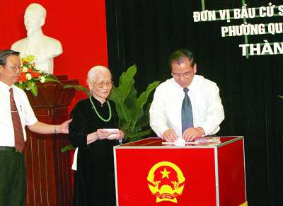
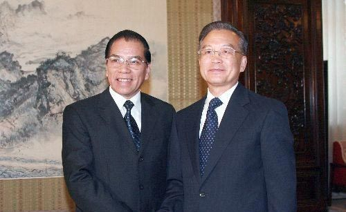

# 说说我所知的越南

**“中国模式，这个词汇不知何时开始频繁强奸我们的大脑。我的解读是，早年说中国特色时，当局想的不外乎和普遍真理（右派语汇是普世价值）对抗——中国不需要走你们西方的路，云云。曾几何时，有了几个臭铜板，还觉得自己了不起，可以向外输出模式了。而越南的革新开放，在中国报道中实在是改革开放的翻版。好像越南用的正是中国模式。殊不知人家的模式比你的好得多。”**

# 说说我所知的越南

## 文 / 阜远

 越南的政治民主化，最近成了热门话题。我想说说我所知的越南，以飨读者。 首先需要交代我的消息源。三个：一是越南奥委会的某副会长，我和他结识于北京奥运会前的一次国际奥委会会议上，之后保持电邮联系，他是政治学者、华裔——在越南被视为一个少数民族；二是我报在越南的雇员；三是在越南的日本侨民。 越南的确在民主的道理上发展的很好。他们的最高权力机关——国会（相当于我全国人民代表大会）已经实现了全民直选。越南的国家主席、总理或由国会选举，或必须国会认可。所以国会直选，就代表着该国已经普遍、直接的民主选举。 

 当然从具体做法看，仍有很多不成熟的地方。比如，国会代表的选举，并非西方政党角逐或者候选人自荐为主，拉票的选举。而是国会常务委员会和政协组织牵头，在全国从下到上经过三轮协商最后确定近900人的候选人名单，然后由国民从中选出500人组成国会。 自荐为候选人是合乎宪法的，但经过三次协商，最后成功成为候选人的自荐人不到自荐人总数的5%，所以可以说基本上还是“钦定代表”。所以越南的国会选举，与其说是选举，不如说是对执政党，对体制的信任投票。 当然瑕不掩瑜，从无到有的改革当然困难。一个和我国一样古老的封建传统浓郁的民族，一个曾经的殖民地，一个山地居多交通不便的国家，一个还比较落后的经济体，能取得这样的民主政治成就，弥足珍贵，值得赞扬。 而这样的信任投票，在我国都无法举行，只能说明当局的心虚、胆怯。 

 越南国会的成功，不仅表现在国会代表的直选，也表现在国会能够卓有成效地监督行政。比较有重要的例子可以举两个： 一是“中铝”投资西原问题。 越南政府招商引资，中铝决定投资越南西南部的西原高原地区，开发那里的铝矿。但越南社会各界，从元勋武元甲到科学家、少数民族人士，多以环境、农业、少数民族文化保护等理由反对。最后越南政府不得不向国会做出专项说明。越南政府显然将国会当作了民意的代表和行政行为合法性的来源，这非常符合宪政精神。但越南国会就是不为所动，没有批准该计划，所以西原开发至今没有进展。 二是越南总理提出的南北高速铁路计划被否决。 越南总理、越共中央政治局委员阮晋勇发起了南北高铁计划，有越南“梦工程”之称。计划斥资560亿美元从日本引进新干线技术，在越南打造一条连接北方政治中心河内市和南方经济中心胡志明市的黄金通道。 根据越南法律，凡预算在19亿美元以上的项目，必须经国会批准。早在2009年8月，越南政府便经由越南国家铁路公司和日本新干线公司达成初步合作意向，经过近一年的准备，才于今年5月正式将此案提交越南国会审议。尽管此间越南国内反对声此起彼伏，但主导此案的越南常务副总理阮生雄基于以往经验并不担忧，而且此前通过国会常委会摸底调查，也显示至少六成代表愿意投赞成票。不料，十二届国会七次会议期间，大家依然面红耳赤。最后427名议员（共493名，部分议员未能与会）投票表决，结果185名投赞成票，占37.53％；208名投反对票，占42.19％；34名议员投弃权票，占7.96％，议案未获半数以上代表赞同，被否决。 真是值得我们好好学习。 当然，我不是那种认为一搞选举什么问题都解决的人。越南的经济还很成问题，通货膨胀非常厉害。我在胡志明市的同事说，他们买房需要用黄金，因为越南盾的价值天天在跌。作为一个现代国家，恐怕这也是不成功之处。 同时、越南的地区差距很大，胡志明市已经现代化，中部长山山脉、西部毗连我国云贵的地区还仿佛非洲。少数民族权益、性少数派权益的保护，也总体落后于我国。 中国模式，这个词汇不知何时开始频繁强奸我们的大脑。我的解读是，早年说中国特色时，当局想的不外乎和普遍真理（右派语汇是普世价值）对抗——中国不需要走你们西方的路，云云。曾几何时，有了几个臭铜板，还觉得自己了不起，可以向外输出模式了。而越南的革新开放，在中国报道中实在是改革开放的翻版。好像越南用的正是中国模式。殊不知人家的模式比你的好得多。 

