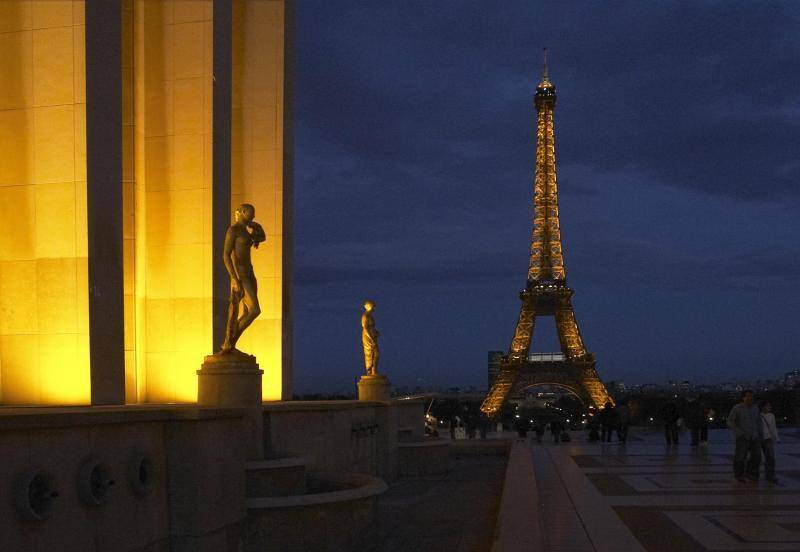
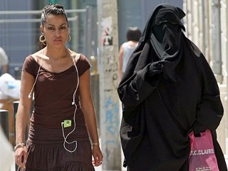
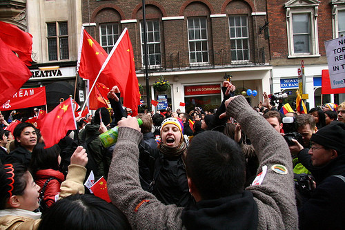

# 谁是法兰西

**“事实上，当今世界上的其他西方国家无不面临如此窘境，或多或少而已，只不过对于法国来说，移民对本体文化冲击的问题尤为尖锐。移民这种东西，一旦进来了，再想驱逐便不大可能，法国，必须要为曾经过左世界主义虚名买单，难以估量的是，这个单竟会有多大。”**

# 谁是法兰西

## 文 / 卢辰（武汉大学）

当人们提及伦敦，说得出叹息桥、大本钟、演讲角，提及罗马，说得出古竞技场，提及柏林、马德里，大概很难说出什么著名古迹了。但当人们提及巴黎，基本都能如数家珍地说出：圣母院、卢浮宫、埃菲尔铁塔、凡尔赛宫、凯旋门等等，法国文化在西方文化中的翘楚地位，由此一点便可看出。纵然大多数的人对法兰西文明的认识除此几个名词，之外一无所知。如果舍名词而用形容词的话，人们形容法国最多的一个词无疑是浪漫，就如同人们懂得以严谨来形容德国，用保守来形容英国人。欧洲国家有意思的地方就在于虽然都很小，皆五脏俱全，各不相同，甚至相去甚远，都有能有着自己的文化特质。如同文艺复兴只可能发生在崇尚艺术且有着深深伊壁鸠鲁主义传统的亚平宁，宗教改革只可能爆发于敦厚朴实而又极具哲思能力的德意志，启蒙运动则只可能肇始于崇拜自由平等好为人师的法兰西。这正是欧罗巴列国所不同于大一统的中国之处，多元，缤纷。 

 那么，我们又该如何定义法国。 事实上，甚至连法国人现在也很难回答“我是谁”这个问题。在全球主义、移民、因特网、跨国贸易盛行的今天，“我是谁”也成为了全球任何一个文明所必须坦诚思考的至关重要的话题。否则，即使在强大的国度，都难以在全球化的浪潮席卷之下站稳自己的脚跟。 从去年年底开始，在总统萨尔科齐和总理菲永的牵头之下，法国举国上下开始了一场核心议题是“什么是法国人”的大讨论。大讨论的话题涉及爱国主义、法兰西民族精神、民族主义、法国价值观、移民的社会融入与整合、伊斯兰教法国化、欧洲认同、全球化等等。如此大规模的文化讨论，在现代西方国家中估计也只有可能发生在法国这样一个对本国文化痴醉的国度。但这也确实反映出当代法国社会所面临的些许困境与焦虑，如何回答“我是谁”，其中最敏感的一点无疑便是外来移民的问题。 当下法国的外裔人口之多，我们从世界杯的法国队员肤色便可管窥一二，法国队中近半为有色人种，包括我们所熟知的亨利、马卢达，还有包括当年的维埃拉、齐达内等等。而你几乎很难在西班牙、英格兰的阵中找到几位有色人种。并且，非洲裔与亚裔还远远只是法国移民中的少数，你可能很难想象，法国现有的穆斯林移民达到500万之多！将近人口总数的8%，乃欧洲诸国最高，远高于排名第二的荷兰6%。并且，穆斯林是一个生育率极高的群体，根据有关人士的预测，若不加以控制，在十年之后，穆斯林的人口即可翻倍。甚至有人戏谑，巴黎终将变成巴黎斯坦，抑或巴黎兰堡。 

 而问题更在于，穆斯林人口有着极强的本位文化向心力，他们中的诸多愿意学习法语，穿牛仔裤，唱流行歌曲，但是绝对不会放弃伊斯兰的信仰，再由于众所周知如穆斯林是不可能与一个非穆斯林通婚，所以实在难以指望他们能够真正融入法国社会。 法兰西曾经一度为自己的包容与平等而自豪，时至今日法国依然是全欧洲对待外来人口最友善的国度之一，为移民修建低收入住宅区，鼓励移民申请工作，鼓励公司招募少数族裔的雇员，推动移民参加选举，法国政府还设立移民劳工与亲属社会行动基金，通过关怀家庭、儿童和青年在住房以及培训和就业方面的行动，促进外国移民融入法国社会。举一个具体例子，法国政府能够配发给像我这样的外籍学生住房补贴，总额可达房租将近一半，此项对外人口的福利政策，全球唯一。 可是，法国所得到的回报却是一次又一次的骚乱，2005年的巴黎骚乱，2007巴黎骚乱，2009北部骚乱，以及居高不下的社会犯罪率，大多都来源于外来合法或者非法移民。在巴黎这座世界花都的某些区，夜晚出门都已经成为不可能的任务。更可悲的是，这一切，竟然还要被诸多人归咎于法国政府“不合理的对待移民措施，自食其果”。 而一旦法国人开始准备举措控制移民人口时，遭到的反对更是难以想象。从最近的两件事情所引起的轩然大波便可看出，一是遣返罗姆人，二是欲立法禁止穆斯林女性在公共场合穿着长袍。前者由我们的观点而言，法国政府似已可谓仁至义尽，这些罗姆移民本身即非法入法，法国政府还要对他们进行遣返补偿，最终却还是遭到了包括好伙伴德国在内的诸多国家的反对。关于禁纱令的提案，更使得法国成为世界人民众矢之的，背负破坏宗教信仰自由、无视人权、造成种族分裂之恶名，甚至连奥巴马都曾为此事含沙射影地批评过萨尔科齐。 人们不会追寻过去，不会关心法国曾经是多么的左，曾经多么宽松地接待过世界各国的移民，中东欧的、北非的、东南亚的、中东的，从一战到二战到冷战，法国一直都是一个大型避难所。人们也不会在意法国现有的移民政策依然是相当宽松，平等的福利、为移民专设的社会社会行动基金、低收入住宅区。人们只会在意的是这个骄傲的国度又在计划着些什么不利于移民的政策措施，然后大开平等自由、人道主义的话语系统，谴责挞伐。法国又能如何呢，此类问题根本无法解释，旁观者永远不会喜欢一个右转的国度，诸如我作为一个暂居法国的外来留学生一样，自然而然会十分害怕政府出台对外来人口不利的政策。 事实上，当今世界上的其他西方国家无不面临如此窘境，或多或少而已，只不过对于法国来说，移民对本体文化冲击的问题尤为尖锐。移民这种东西，一旦进来了，再想驱逐便不大可能，法国，必须要为曾经过左世界主义虚名买单，难以估量的是，这个单竟会有多大。 

