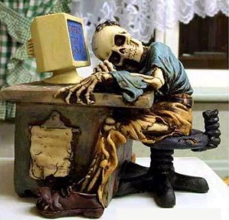

# 这是一个争夺用户注意力的年代

**“在硅谷，一个简单的设想也许就有几十万美元的投资进账，而这个时候，大家其实根本不知道怎么赚钱，只是一味的先去设法争夺用户的注意力和时间。难怪我的朋友在抱怨网络时代培养了一群重口味的读者——口味清淡的，纵然写的细致入微，也很难吸引眼球。”**

# 这是一个争夺用户注意力的年代

## 文 / 张韧刚（厦门曾厝垵）

 如果现在告诉各位这篇文章长达5K字，艰深，枯燥，并不有趣，但是蕴藏着作者个人的极为深刻的思想，你会不会点右上角的叉？我想我自己会的。好在本文没有那么长，而且我也希望各位读者继续看下去。 我想很多人也会，大家的时间都很宝贵，尤其是那种能静下心来思考，集中注意力去阅读，去理解问题的时间变得越来越宝贵。除了这个年代以几何级数增长的信息量之外，更重要的是我们所处的这个时代。 而实际上从报纸出现开始，信息提供商们就在争夺用户的时间和注意力。从报纸到电台，从电台到电视，从电视到网络，传输速度越来越快，传输频率也越来越快，而仅仅从网络的角度上来看，从门户网站的报纸一样的新闻时代，我们可能每天花在上面的时间不到半个小时，然后是BBS和博客，我们会在上面花一两个小时时间，看别人的东西评论或者自己写，再到人际网络SNS，几乎是每天有闲暇时间想上去看一下更新，到微博和手机订阅时代，几乎是随时随地的掏出手机上去发一条微薄。 

 随着时间的发展，信息提供商们开始将自己的信息切的越来越碎，以求渗入越来越零散的时间里去争夺越来越短暂的注意力。莎士比亚时代，文章都写的极为生涩，诗人作家们为准确的追求一个感觉的描述也许会用一个极为生僻的英语单词，而今天，虽然英语单词的数量越来越多，但是当我们回去看莎士比亚时代的作品，会发现很多单词我们根本就不曾用过。之后，随着报纸的出现，人们开始用比较短的文字来传播消息，然后更快的电影和电台。比起生涩的书本来说，你只要坐在那里静静的听，或者看，就能获得自己想要的消息。 而信息提供者们并没有止步于此，电视的出现，大大的加速了信息的传播，同时也让信息的获得变的更加容易，也开始创造出一种整天呆在电视前面的生活状态，这也许是我们在互联网行业所讲的“粘性”的最早的雏形。有趣的是，随着这种粘性的出现，免费的信息开始急速的发展，通过电视广告，电视台可以完全消化掉自己制作节目的花费。因而信息开始逐渐变的免费。只要能吸引用户的注意力，就有白花花的银两的时代到来了。各种信息提供商也越来越明白争夺用户的时间和注意力是才是他们赚钱的方式。平面媒体和纸媒迅速的跟进各种抢眼的广告一个接一个的出现在我们面前。 而互联网的出现对之前的媒体带来了前所未有的冲击。由于之前的信息提供商提供的信息都是固定的，所以如果人们需要对信息进行选择的话，往往他们只能选择不同的媒体，或者收看不同的时段。而互联网完全解决了这个问题，门户网站提供从女性到科技的几乎所有的信息，而读者们则有选择的去读自己需要的信息。之后WEB的急速发展，让这十年来人们接受信息的方式有了翻天覆地的变化。 

 信息提供商开始发现用户本身创造的信息也许比他们精心准备的更加吸引人，于是有了BLOG，然后人们发现阅读还是一如既往的累人，于是有了YOUTUBE。而信息提供商们并没有止步于此，他们发现人们除了整块的闲暇时间之外，还有更加小块的时间，而这些时间往往大家不再电脑前面，于是WIFI，手机上网开始迅速发展，手机订阅的各种行为和IM软件成为了新时代的标志，当手机让人们随时随地的进行信息交换的时候，运营商们发现，时间还能被切的更加细碎，于是TWITTER腾空出世。到这个时候，大家发现，风险投资商已经不在乎网站靠什么方式赚钱，而在乎网站靠什么东西能吸引点击量。在硅谷，一个简单的设想也许就有几十万美元的投资进账，而这个时候，大家其实根本不知道怎么赚钱，只是一味的先去设法争夺用户的注意力和时间。难怪我的朋友在抱怨网络时代培养了一群重口味的读者——口味清淡的，纵然写的细致入微，也很难吸引眼球。 记得很久以前的人们就在抱怨阅读的痛苦，于是古人说“书非借不能读也”，广大文人们纷纷表示讲的太对了。然而，时过境迁，现在，我们渐渐发现“买书如山倒，读书如抽丝”。 在这个各路信息提供商们都在处心积虑，殚精竭虑的想着怎么用商业化的手段去争夺用户的时间和注意力的年代，读书逐渐变成了一种非常奢侈而古典的享受，甚至成为了某种小资阶级彰显自己品味的方式。同时，另外一些手机GEEK们塞着耳机，挂着WIFI，盯着手机屏幕，开心的看着自己的言论被成千上万的人阅读——他们笑而不语。
