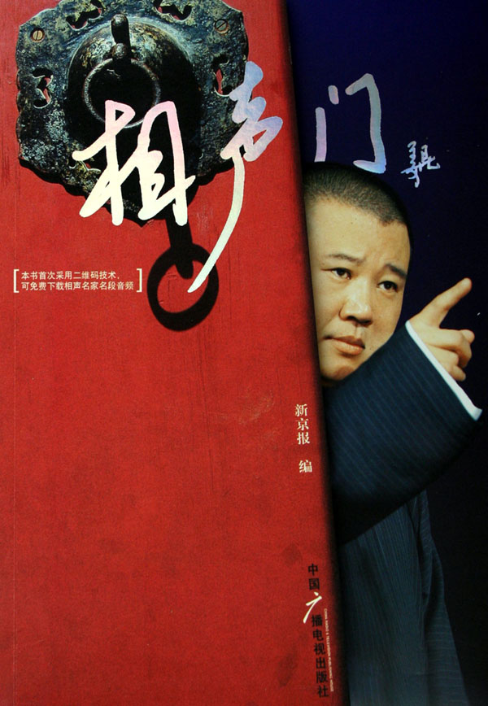
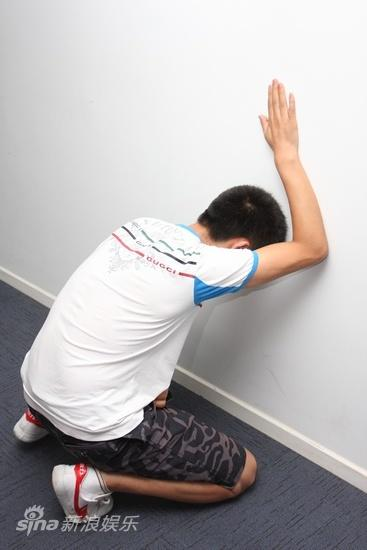
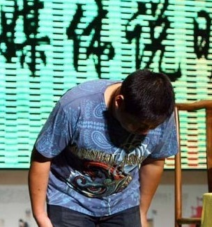
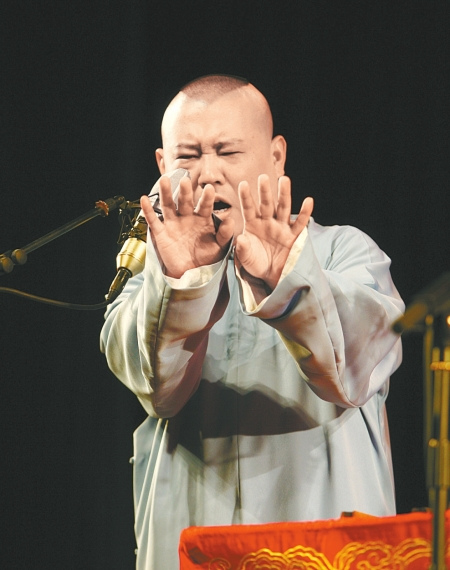
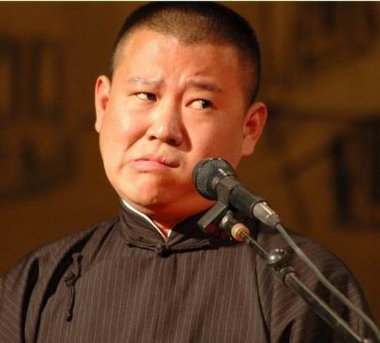

# 闭上眼，听一段啼笑皆非的相声

# 闭上眼，听一段啼笑皆非的相声

# ——郭德纲的三俗末路

** **

## 文 / 李坦（The University of Newcastle）

 郭德纲被整惨了，就快残了，剧场停演，徒弟有的离散有的拘留，音象和书籍据说也在北京下架了，电视表演节目取消了，CCTV用排比句声讨他，BTV播大字报叱责他。这就算封杀吧。 起因经过大家都知道，两个北京电视台的“工作人员”在无证偷拍私闯民宅的时候，被他徒弟扇了两巴掌。郭德纲事后又在相声段子里说：打就打了呗，过两天给他搞一专场，智斗歹徒民族英雄专场。然后有人就大骂郭德纲土匪流氓，然后就大谈特谈“对公众人物的监督”。对这样的人我要说，您不要搞笑好不好？那是人家郭德纲在讲相声段子，您竟然把它当成声明 表态 法庭辩护了？ 可是骂郭德纲的人也情有可原，在这个把新闻当相声听的时代，把相声当新闻听也不是什么不可理解的事情。 不过，我还是想问问那两个无证偷拍的记者：“哪个让你偷拍的？你是哪个单位的？你叫什么名字，把电话给我。” 

 如今我国注重精神文明贱射，官老爷们玩儿得是高雅，反得是三俗。但这三俗为啥就偏偏反到郭德纲的光头上了？郭德纲的“三个俗”只是调笑而已，并不与三个代表相冲突。如果说他“庸俗”，他能比北京西客站的庸俗规模还宏大么？若说其“低俗”，他能低俗得过天上人间的深喉捆绑冰火九重天么？若说其“媚俗”，你见过领导向领导的领导做工作报告时的嘴脸么？ 所以说，郭德纲的三俗不是最俗的，而且这种三俗不会像城管拆迁队那样对人民群众造成身心上的伤害与财产上的损失。 这样按理说郭德纲不至于在轰轰烈烈的反三俗运动中中枪，但郭德纲却是此次三俗革命中最好的靶子，不是因为他是个胖子目标大，而是因为他是一个没有后台的不识时务者，正好作一只给猴子看的鸡。 郭德纲自己说过：“你要看一看我这十几年是怎么踩着血一步一步走过来的”。在中国，但凡一个有后台有背景的人都不会混的这么惨，除非你的后台被双规了。退一步讲，郭德纲就算不靠后台，他只要作一个识时务的“俊杰”，在领导面前稍微展示一下在舞台上的“媚俗”功夫，也不至于当初连一件马褂都买不起，更不至于“踩着血走过来”。所以，既然没有人会在“有关部门”为你说话，那自然你也就是个无关紧要的人。 不打成了精的老妖，却欺负小鬼儿，这道理很容易想通，连齐天大圣孙悟空都没有打死过有神仙护着的妖怪，凡人们就更不敢碰有后台的衣冠禽兽了。吃唐僧肉的禽兽们从来都是在“夏初春末”之季“旗帜鲜明的反对”三俗，而说相声的戏子们却一次一次在金箍棒下演绎着血染的风采。难道曾经火眼金睛的孙悟空到了我们这个时代也已经 “老了，无所谓了？” 

 如果要看识时务者，可以看看演艺界大佬赵本山。虽然我本人也非常喜欢他，但也并不妨碍我认为他是“识时务者的楷模”。赵本山在海南圈地800亩，为什么没有记者敢扛着摄像机到赵本山的地盘上监督一下他有没有侵占公共绿地？因为那些反三俗的记者们明白，自己身上这二两肉还不够赵本山后院那一窝纯种藏獒塞牙缝的。而郭德纲家里那块绿地的面积，还不够一只藏獒撒泡尿的，没藏獒的院子里通常种满了软柿子，谁不想捏两把。 反三俗为什么不反赵本山？赵本山也非常“三俗”，他的成名作“卖拐三部曲”在外国被指责为“歧视残疾人”，他那些东北二人转里面什么“低俗内容”都有。反而赵本山这几年来一直都是春晚的大腕儿，一方面原因是因为观众极其喜爱他的三俗小品，另一方面是因为他在媒体机构面前是头顺毛驴，不得罪后台，闷声发大财。赵本山走红前不得罪后台，走红后他有了庞大的集团企业，自己变成了后台。一旦成了别人的后台，就成修炼仙了，孙悟空也奈何不得。 回想十几年前，赵本山还是个小人物，他在春节晚会的化妆间里找那个不识时务的陈佩斯签名，倔强的秃头笑星没有想到自己后来会被央视封杀，更没有想到十几年后又有另外一个叫郭德纲的秃子步他的后尘。 这就叫作，和谐后浪推前浪，把三俗拍在绿坝上。 退一万步讲，稍微折腾一下郭德纲也就得了，给他展示一下我党八耻八荣的作风就行了，何必兴师动众封杀这个说相声的矮胖子？他只是说相声时经常把观众逗乐，创造了主流相声界百年不遇的奇闻而已。仅凭这则奇闻，应该不会使其惨遭如此毒手吧？唉，你们啊，too simple， sometimes naive。 往小里说，把郭德纲这只肥公鸡搬倒，就是让媒体传媒和演艺界的猴子们知道，河蟹夹死只草泥马就像大叔推倒个萝莉一样轻松。 

 往大里说，把你郭德纲往死里整，就是提醒我国公民们要稍有常识，螳臂挡车的三俗暴徒是没有好下场的。 所以，把事情说到这里，就只能到此为止了，咱刚才挤兑了“反三俗”的记者，往上捯也捎带着挤兑了电视台媒体，但捯到电视台这层就不能再往上捯了，再往上捯，就捯到龙脉了。这事儿不能说太细。 郭德纲，你也别觉得自己冤枉，袁腾飞（在我眼里他也是个说相声的）有句话：“你再冤能冤得过岳飞么？” 如果你郭德纲活不到三俗大业告成的那一天，老郭你放心，在你死后，三俗群众们会按着国葬的规格把你做成腊肉，把主流相声界演员做成跪姿雕像摆在你面前。多少年后，我带着孩子们去德云社纪念堂，给孩子们讲解这段三俗革命人物历史：“儿子你看，这水晶棺材里的就是三俗主席郭德纲爷爷，这个西边跪着的是侯耀华，那个东边跪着的是姜昆，他们的雕像上涂满了藏秘排油，后面是嘴里含着大蒜的是周立波，他正在给郭爷爷倒Cappuccino，那个坐在郭爷爷身边跟他眉来眼去的是于谦副主席，在旁边笑而不语的秃子是陈佩斯蜀黍。。。嗨！你怎么又扣完鼻孔舔手指，这孩子越来越BTV了！” 这年头一睁眼，一不小心就可以看见这些社会主义初级阶段的闹心事儿，不如大家都闭上眼，每晚7点整打开电视听相声吧。听到抖包袱的时候别忘了感谢国家。 

 最后告诉你个小秘密，据说领导们不怕说相声的，但就怕听相声的扎堆儿。
