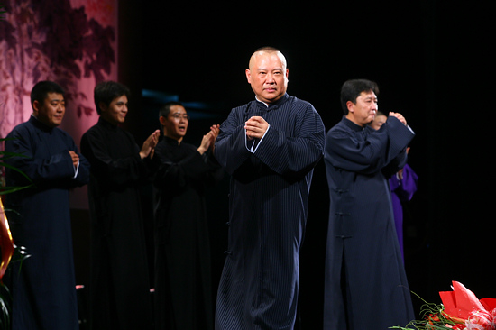
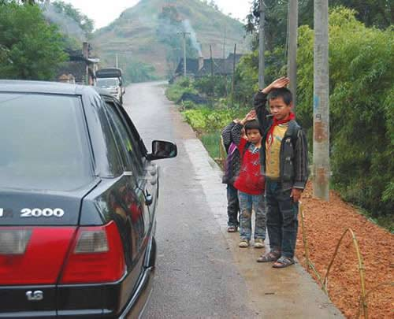

# 限制公权力是中国的当务之急

**“从郭德纲的光碟下架，到国殇日的游戏停服，公权力总是在失控。避免公权力的僭越，既是对民众个人自由和权利的保障，也有助于政府改善其在民众中间的形象。”**

# 限制公权力是中国的当务之急

## 文 / 元淦恭(中国人民大学)

 写在前面：本文是南方——炎黄体文章，文章表达的内容和我对中国政治现状的分析无关，此文并不代表我寄希望于执政者主动自我限权。同时，我坚决支持并且肯定中共设置国家哀悼活动，只是质疑其活动的具体方式，对于舟曲人民所遭受的巨大灾难和痛苦，我表示深切地哀悼。 今天是舟曲泥石流的全国哀悼日，两年前汶川地震时民众自发悼念与国家集体意志的统一已不复存在，越来越多的民众开始对全国哀悼感到不满和愤懑。究其原因？很大程度上来源于政府对哀悼权利的垄断。 政府有权规定全国哀悼的时间，设定全国哀悼活动，暂停公共娱乐活动，却无权干预普通公民的个人生活，更没有资格限定民众进行哀悼活动的具体方式。我一向认为，停止公共娱乐的落脚点在“公共”，具有政府背景的娱乐活动应该停止，表达政府和公权力对逝者的哀悼，体现公权对人民的谦卑，而现在的这种毫无法律根据的“停止公共娱乐活动”，实质上已经成了“停止一切娱乐活动”，根据国务院公告的规定，连棋牌活动等几个人的游戏都要停止，这些根本不属于“公共娱乐”的范畴也一并纳入限制的范围，实在是令人难以接受。政府以强制方式禁止民众的私人娱乐，这与国家哀悼日体现的公权力对生命的谦卑宗旨背道而驰，反而体现出政府公权力的霸道和越位。 在四川，有人去世被称为“白喜事”。在八十年代以前，打麻将这样的娱乐活动并不被官方允许，在家里打麻将被公安部门闯进屋里查办的事件还时有发生，但是政府部门却惟独在丧礼场合网开一面。四川地方的传统，一旦有人去世，在守灵几日中，亲戚朋友都会在灵堂里摆上麻将，大干一场，而公安机关也从来不抓这样的“丧火麻将”。由此可见，私人娱乐活动与哀悼并不矛盾，甚至私人娱乐活动是民众个人哀悼的一种方式。 

 四川的丧礼习俗，其实反映的是一种道家的生死观。就像玉树地震灾区很难捕捉到那些汉族地区发生自然灾害的那种对亲人罹难的撕心裂肺，藏人对待死亡的态度也使得灾区的气氛与汶川大相径庭，政府有权设立自己的哀悼日，代表民众表达集体的哀悼，却无权要求普通民众接受政府的哀悼形式。以什么样的方式哀悼自己的亲人和同胞，基于什么样的价值理念和宗教信仰、意识形态来对待死难者，是民众思想与言论自由的范畴，这是纯粹私人的空间，公权力无权置喙。 舟曲的全国哀悼日适逢日本投降日，又是星期天，使得这一次全国哀悼从一开始就显得异样。政府在“头七”举行哀悼活动，已经形成传统，这一哀悼日的日期也不便更动，我个人非常理解。然而在这样的日子进行这样形式的全国哀悼，对全国民众的影响非常巨大，汶川和玉树哀悼日都是工作日，大家感觉还不明显，而舟曲哀悼日，大家一打开电视，所有的频道都变成统一口径，这种感觉实在让人作呕。 中国内地的所有媒体都是公立媒体，因而在电视台停止部分节目的播出也合乎逻辑。然而现在这样要求所有媒体转发央视的节目信号，这纯粹是一种宣传霸权，我看电视从业人员并不把这当成全国哀悼，倒变成了他们自己的节日，全国地方电视台今日放假一天，多欢乐啊。从电视节目的千台一面，我们再次看到了非制度性的党政权力的僭越。 川青两省地震捐款绝大多数流入政府户头，也说明政府公权力的过度强势，这使得民众对于各种带有政府背景的慈善捐款滋生出更大不信任。 中国现行的政治体制决定了这个国家不具备实行普通法体系的条件，试想，要是各种因言获罪的案例能够被作为判例的话，对于这个国家民众争取个人权利，精英努力推动改革的过程将是多么巨大的灾难。中国现在只能继续实行大陆法系，而大陆法系框架对法律体系的要求之高，现在中华人民共和国还差得很远，差得最远的是什么？ 正是法律对公权力的限制。 中国限制民众行为的法律出台得很快，然而限制政府的规定却总是难产。这就是中国立法中最大的空白。 我为什么主张全国哀悼要立法，正是要通过这部法律保证行政权力对民众的个人自由秋毫无犯。公与私之间的边界模糊，给了政府干预民间日常生活的借口。而这仅仅是中华人民共和国需要界定的公私权力边界的冰山一角。 

 中国政府自认为自己是市场经济国家，一直得不到西方的承认，原因何在？首先就在于中国这个国家的政府，既不坚守法治原则，也不尽好“守夜人”的义务，中国政府在经济活动中所发挥的作用过大，在庞大的中央企业及其利益导向下，中国政府既是裁判员，又是运动员，它背离市场经济的调控与规制者的角色，成了少数既得利益集团的代理人。中国政府口口声声强调要“加强并改善宏观调控”，却一直是只“加强”，不“改善”。八十年代起都曾经有制定《计划法》的打算，如今二十多年过去了，关于国家干预经济的行为，法律仍然是一片空白。国家发改委这样的强势部门，仅仅依据国务院的行政命令开展工作，没有任何一部法律限制其行为，它的公权力对经济的渗透无所不在，“跑部钱进”的项目体制仍然为各方所热衷，这完全是一种统制经济模式，和市场经济差的太远。 中国政府一直强调，要建立透明的公共财政，殊不知中国到现在为止一部财政税收的基本法都没有，关于税收的法律很多，都是关于具体的税怎么收，却从来不规定税收的基本原则是什么，税收的根本目的是什么，收上来的税如何使用，如何监督，这样一个没有税收基本法的税法体系，显然是空中楼阁，地基不牢。中国连规定公共财政原则的法律都没有，哪能寄希望于中国政府能建立一套行之有效的公共财政体系。 关于发改委、财政部的立法缺失，对于当前中国是多么巨大的立法漏洞，相信大家都能理解。至于《新闻法》《政党法》《人民团体（社会团体）法》这类法律的难产，因为很敏感，我就不展开了，大家读到这里就知道我要说什么了。 有些人说，中国是个讲求“实践理性”的国家，什么事情先是没有法，然后实践了大家再来总结成法律。这是把改革初期的暂时现象当成长期规律，并以此为借口阻挠政治体制改革的深化，尤其是阻碍法律体系的完善进程。更何况如果一件事是政府所不愿意做的，没有法律的限制民众连质疑政府的底气都没有，更遑论政府会主动实践。 公私边界不分，是当今中国政治体制的重大弊端。如今中国立法的重点，也在于要给公权力画地为牢。正如小布什所说，他是在笼子里向大家说话。如果让中国的公权力被关进笼子，而不是像脱缰野马到处乱冲乱撞，正是这个国家当下所面临的重大问题。从郭德纲的光碟下架，到国殇日的游戏停服，公权力总是在失控。避免公权力的僭越，既是对民众个人自由和权利的保障，也有助于政府改善其在民众中间的形象。
