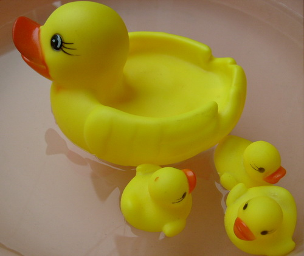

# 百年清华，同学们请收起那点孩子气！

**在这个园子里，有多少技术宅把自己幻想成不食人间烟火的科学天才，只想找一个平台做自己想做的清心寡欲的学术研究，谁跟他提商业应用他跟谁急。抛出的理论是他用不着荣华富贵，只想得到精神上的慰藉。如果他的满足感只是局限于解决一个数字游戏就好像初中时候解出一道巧妙的几何题那样而已，我只能说他还没有断奶，毫无独立生存的压力，根本提都不用提对于国家和民族的责任的担当。**

### 

### 

# 百年清华，同学们请收起那点孩子气！

### 

## 文 / 粟骥（清华大学）

### 

### 

母校100年华诞，作为老清华，本来应该上赶子说几句好话。但我更喜欢这么一句话：赞扬你是爱你，批评你更是爱你。 今天看了一段obama对美国中学生演讲的视频，不由激起一番感触。美国人对于未来一代的教育，一开口谈的就是责任，赤裸裸地告诉下一代：你们放弃了自己就是放弃整个国家。他质问在场的每一个孩子：250年前的一群年轻人发起革命建立了这个自由的国家，70年前的一群年轻人发挥聪明才智战胜了大萧条并赢得二战，20年前又有一群年轻人奇思妙想并用勇于实践创建了apple,intel,microsoft 以及后来的google,facebook,twitter……那么十年后你们能干出什么事来？ 

### 

### 

### 

这让我想起我和一个“中国通"式的美国朋友的对话。当我和他聊起中国政府大力支持年轻人创新创业这个话题时，他只是轻蔑地藐了我一眼说：中国政府谈创新，那不是在搞笑吗？ 即使是你们清华的技术创新，也不怎么地。 面对这样的质疑，甚至是羞辱，我确实无力反驳，因为各类创新创业大赛在各地方各学校办得无比红火，但学生们真正自己坚持做下去的创业项目，实在太少也太不值一提。 在国家需要改变发展模式，向创造型经济和产业转型的过程中，清华人本应该是站在风口浪尖的勇士；本应该像狼一样在科技商业的新战场上攻城掠地，杀出一条血路。；本应该像男人一样去占有本来属于别人的财富和荣誉来作为自己的战利品；本应该去抢去夺，因为我们不动手，别人就先下手为强，而且决不会对我们有所姑息。 就是在这样的背景下，我所接触到的身边的清华人，却只表现出稚嫩的孩子气而已，太缺乏几分成熟男人的责任感和占有欲。 在今天这样的大环境下，清华人还只是羡慕和向往去摩根斯坦利、高盛、瑞银打工做个高级employee的人生；还只是把精力放在为提高一两分学分绩而拼命做练习题的努力上；还只是满足于骑辆自行车载着青涩的小女友在校园里穿来穿去的小幸福里。那样造成的可能会是整个中国的悲剧。 在这个园子里，有多少技术宅把自己幻想成不食人间烟火的科学天才，只想找一个平台做自己想做的清心寡欲的学术研究，谁跟他提商业应用他跟谁急。抛出的理论是他用不着荣华富贵，只想得到精神上的慰藉。如果他的满足感只是局限于解决一个数字游戏就好像初中时候解出一道巧妙的几何题那样而已，我只能说他还没有断奶，毫无独立生存的压力，根本提都不用提对于国家和民族的责任的担当。 多少好好学生开口就埋怨北京的房价太高，表示毕业后在京城生存不下去，果断逃避到国外或者小城市去。那我就不明白了，CBD各种高档公寓里住着的难道是外星人；大街上跑着的不说兰博基尼法拉利，奔驰宝马也算泛滥成灾，难道开着的都是异形？ 我一个老家的朋友，没有高学历，没有牛背景，照样死乞白赖要在北京奋斗住下去。多少清华人读了一肚子学问，也有些好手艺，却丝毫没有压迫自己的勇气。 生存的压力，没有逼得清华人揭竿而起，在商战中去占个山头，却逼得大家丢盔弃甲各自逃匿。对比一些纽约来的朋友那种“这个也是我的，那个也是我的，you get out here”的霸气，我只能一声叹息。 这世上有很多事不做也就不做了，不做，可能可以平静安详地生活下去，可以活在自己的世界里，没有风险也没有压力。但我弱弱地觉得：这样的人生，不应该是连校庆都会举国皆知的清华的门徒所追求的。既然上了这条船，就有责任掌好国家发展的舵。 清华人应该学的是厚黑学，去战斗，去把经济侵略我们的对手赶出去，并跑到他们的土地上去豪夺巧取。 清华人应该知行合一，去实践，学会变通，学会狡黠，学会用手段，学会识权谋，学会八面玲珑，学会卑躬屈膝，学会隐忍，也学会凶狠，认识社会法则的真谛。 因为在真刀真枪的商战中，没有时间做梦，没有糖果，没有奶酪，没有玩具，没有俏皮话，更没有淳朴的人情；只有圈套，骗局，和对手击倒你时的洋洋得意。 

### 

### 

### 

同学们，请收起那点孩子气！母校百岁寿辰，只有我们像战士一样，才是最好的献礼。 

### 

### 

（采编：陈锴 责编：陈锴）

### 

### 
