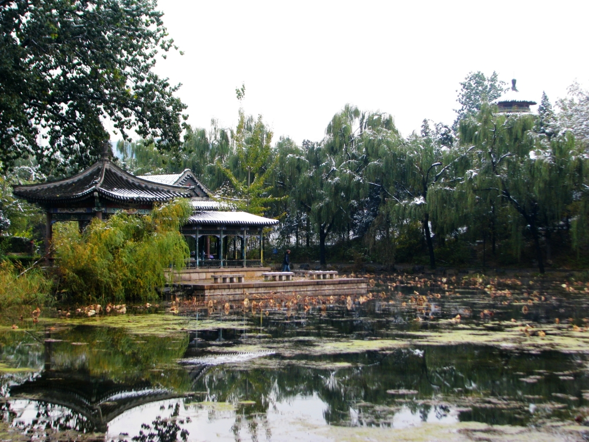
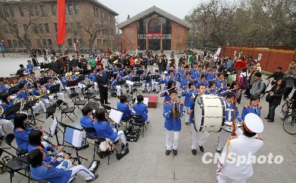
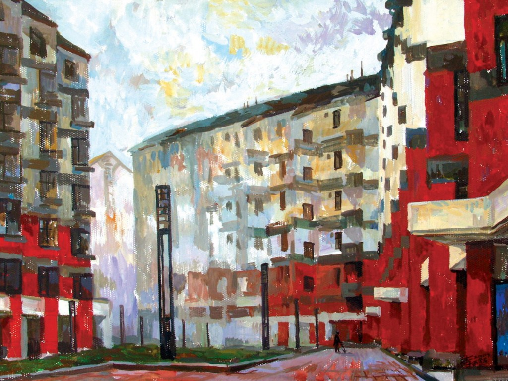

# 给清华大学的一封信

**现在我发现，他们并不是漠然，我的同学们不是不关心，而是自动维护着政府——仿佛维护着自己将要继承的遗产。清华人是可爱的，愤青少，领导多，内心大概还是有天下兴亡为己任的悲壮，表现出来却是高屋建瓴，虚头八脑的老干部摸样。**

### 

### 

# 给清华大学的一封信

### 

## 文/蒋方舟（清华大学）

### 

### 

清华，你好！ 和你的故事要从头说起，虽然并没有什么真正的开头可言。2008年，我参加自主招生考试，被清华降分录取。夏天自己拎着大包小包来学校，报道的地点已经有媒体围追堵截，要求我畅想校园生活，我那时说“记录生活的日子结束，生活开始了。”——奋不顾身飞蛾扑火，有“时间开始了”的自我感动劲儿。 如今我已大三，却还没有真正融入校园生活。现在在学校还常常迷路，同学讨论的成绩与保研，我也大都一头雾水。嘟嘟囔囔对学校的不满却说了很多，拿人不手软，吃人不嘴短。时值百年校庆，我想说给学校的，也不是感恩与颂圣，只能硬着头皮继续怨言。 

### 

### 

### 

因为身在学校，所以不能仅抱怨些片儿汤的话。白衣飘飘的年代没了，就别再紧紧拽住时间的裙角嗫嚅呻吟；学术之不知礼之不存，也已经没有再捶胸顿足的必要；大师离去，微斯人吾谁与归。大势如此，学院当然不能幸免，所以也别再长歌当哭了罢。 然而，除去以上这些，我对大学仍有抱怨，仍有不满，仍有震恐，仍有大惊小怪，仍有不情之请。 大一、大二的时候，我喜欢拽着人聊政治。当然，大部分情况是我支离破碎地复述着我在网上看到、饭局上听到的只言片语，骇人听闻。我的同学们总是左顾右盼坐立难安，一副盼着人把他们解救走的样子，实在被逼急才敷衍笑道：“中国就是这样的。” 我那时还觉得奇怪，二十出头正是对政治敏感的时期，即使是纯生理上也应有些喷张和兴奋，可他们是如此漠然或畏葸。那时，常常涌到我嘴边的话是：“你们到底在怕什么？” 现在我发现，他们并不是漠然，我的同学们不是不关心，而是自动维护着政府——仿佛维护着自己将要继承的遗产。清华人是可爱的，愤青少，领导多，内心大概还是有天下兴亡为己任的悲壮，表现出来却是高屋建瓴，虚头八脑的老干部摸样。 陈冠中的小说《盛世》里有个叫做韦国的青年人，理想是进入中宣部，因为“一个国家民族不能只靠物质力量，还要有精神力量，人民才会团结在一起。硬实力重要，软实力一样重要……我是学法律的，可以替中宣部的每一项决策提供坚实的法律依据，配合依法治国的国家政策。” 韦国加入读书会，组织同学有系统的驳斥网上反动言论，举报反动网站，举报“危险”教授。是年青一代的美丽领袖。 韦国说：“我今年已二十四岁。二十岁那年我做的十年计划，正一步步实现，但我不能自满。毛主席三十岁的时候在做什么？中共中央局五个委员之一。这样一想，我知道我要加倍努力了。” 我身边就有韦国这样的年轻人，越是高等的院校，就越多的如斯荒谬。这也不难理解，北大清华的学子一路都是教育和体制的少年既得利益者，成熟了，自然也是要沿着同一轨迹，而不能跌落到食物链的底端。于是，大学成了掠夺政治资本的地方。 我曾经旁观过学校的干部们做事，与教育和世俗标准下少年得志的成功者打过交道，他们毫无障碍地接受学校给予的一切价值观，自诩主流，一百年不动摇、一百年不怀疑；他们青出于蓝地运用官场技巧与规则，成者为王，败者为寇。 有时，我看着他们滔滔不绝地在课堂、在会场说些“主流价值观”的话，心想：“他们真相信这些，真可怕。”过了一会儿，又打了个寒战：“他们其实并不相信这些，那就更可怕了。” 天真与成熟、愚昧与清醒、单纯与复杂、糊涂与揣着明白装糊涂，我无法分辨他们是哪一种，也无法分辨哪种更可怕。 可是，你分辨，或者不分辨，他们就在那里。我的同学们，我的精英同学们，以后必然会成为社会的中流砥柱，学术圈或者官僚体系的主要组成部分，手握生杀大权。空气中有种紧张的成分，未来里藏着某种令人毛骨悚然的东西。 百年校庆快到了，学校里大兴土木黄沙飞扬，新的大楼和建筑一天天显现规模，学术成果在日夜赶工，我刚路过操场，看到四千人规模的团体操在训练彩排。 

 百年建筑清华学堂去年年底在修缮过程中被烧，现在仍罩着绿色的大罩子，依稀只能看见脚手架。忽然想到，文革时清华“百日大武斗”中损毁的建筑，也早就被修复痊愈了吧。记忆失，而永远不会复得。回顾既往岁月，将会把历史理直、理顺，甚至磨灭，下一个百年，又不知后人会怎样回忆起现世。 百年校庆快到了，逢此盛世，锦上添花的话也不缺我一个人来说，泼冷水却是我所擅长的。往小了说，“母校就是你每天骂八百遍，但不许别人骂一句的地方”；往大了说，“为何我眼里常含泪水，因为我对这土地爱得深沉”。那么，就此搁笔，是动情是矫情，就听收信人的吧。 

### 

### 

清华大学新闻与传播学院 蒋方舟

2010年3月20日

### 

发表于《看历史》2011年4月1日出刊

### 

### 

（采编：陈锴 责编：陈锴）

### 

### 
