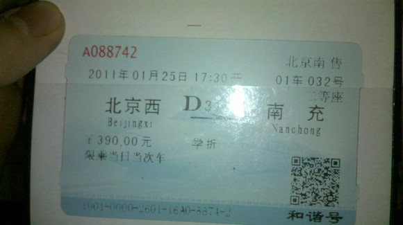
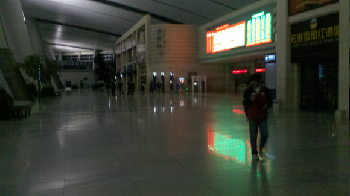
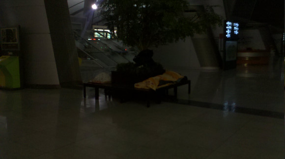
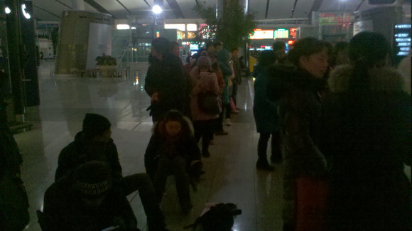
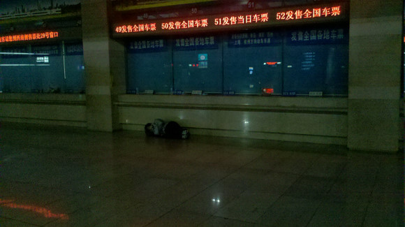

# 南站买票记

**五点的时候，F1正式开门，许多人开始冲进F2的售票窗口，但是已经晚了，也就是说，当你早上四点钟就起床，以为自己可以第一个冲到车站门口，抢到第一顺位，你就错了，因为有大量的黄牛一宿没睡，打通了各方关节，已经早早地占据了第一顺位。**

### 

### 

# 南站买票记

### 

## 文 / 我爱TDB（中国人民大学）

### 

### 

看到大家在网上纷纷表示火车票难买，我认为我有必要抽出时间向大家如实地汇报一下昨夜通宵在北京南站买票的经历及我的感想，供大家参考。 用一句话概括十几个小时之前买票的过程：岂止是惨烈，简直就是惨烈！了解我的人都知道，自从意识到身体的重要性，我几乎不再熬通宵了。但是，昨天，本人还是熬了一个通宵，而且是站着！没错！站着！熬了一个通宵。作为回报，我成功地买到了一张头文字D： 

### 

### 

至于为什么买到南充，请听我后面慢慢道来。 本文分为两部分，首先为大家如实地叙述我的购票经历，然后简要地发表一下感想。 

### 

### 一、买票记

**2011年1月15日晚9点半：** 取好钱，在床上小憩了半个小时，10点起床收拾了一下装备：背包*1、毛毯*1（御寒用）、书籍*3（结果就坐地铁的时候翻了一下）、去超市买了：瓜子*1、薯片*1、水*1。悲壮地从东门坐四号线末班车去南站（经过人大站的末班车是23:00）。 **23:50左右：** 到达南站，从B1上到F1，发现保安开始清理F2上买票的乘客，本来还打算在F2大厅里的椅子上休息一会儿的，看来是没戏了，于是我又返回到B1，找些工作人员聊聊，确认一下发票的时间。注意了：各大站以及各代售点都是9:00am开始发售预售票，D字头提前十天，其余的提前五天（注意：预售期包括当天，也就是说，16日早上可以预售25日的票），但在8:30am就可以发售当天至预售期前一天的车票（如果还有的话）。 在这个过程中，我听到了两个学生模样的帅哥和一位售票姐姐的对话，那位姐姐建议他俩到F2的学生窗口排队买票，现在就去，即使有保安拦也没事，和他们说说就行。这两个小帅锅将信将疑地上楼了，我也就尾随他俩从B1又到了F1，结果当然是被一群保安大哥拦在了F1，不过其中有一个年纪很轻的小保安，为了方便我们称他为保安A（绝对比我年纪轻），这个保安A建议我们到大厅外的一个玻璃门处等待一两个小时，等领导检查完了可以让我们上去。我们心怀感激地过去，三个人就这样聊起来。 **00:00~01：30：** 在聊天的过程中，我知道了这两个小帅锅确实比我年轻，汕头人，88年的，一个在中科院，叫小杜；一个在北理工，叫小林。大家都是学生，聊得比较投机，在这个过程中，我得知了小杜已经两次早起排队买票，第一次是六点起床去清华园买票，排在第八顺位，没买到票（T69两张，D319一张，K339一张）。第二次，他四点就起床，在学校外露天的代售点排队买票，排在第四顺位，还是没买到（大家可以估计一下自己所需车票的供给量，如果你排不到相应的位置，你就可以放弃排队了，因为肯定是买不到的）。于是乎，小杜就开始了今天第三次的排队。 **01:30~02：00：** 气温下降得很快，我开始理解卖火柴的小女孩了，脚变得冰凉，几乎感觉不到它们的存在。就在此时，保安A让我们到F1的大厅去坐一会儿。八错八错，虽然大厅里的气温也不算高，但是相对来说已经比较温暖了，我们三人坐了两个椅子，我取出了毯子和瓜子，开始嗑瓜子，侃大山，我还邀请保安A和他的同伴B一起来唠嗑，他们很“客气”地拒绝了。 这个意味深长的双引号意味着后面将有重要的故事发生。没错！几分钟后，保安A把小杜叫走了，说“有事和他商量商量”。不多久，小杜回来了，把“商量的内容”和我们沟通了一下：保安A答应2点放我们上F2的大厅，确保我们可以排在学生票售票口的第一个位置。条件是：1、我们每人出30元，给他和他的队长（注意：不包括同伴B）“发工资”；2、每人帮他们买三张北京至福州的卧铺。 已经这个点了，不答应也不行了，30元的要价也还能接受，而且我也突然来劲了：这故事太有戏剧性了，一定要把戏演完——我的人生又多了些值得回味的小片段。 **02:00~03:00：** 坐着发现越来越冷，一床毯子根本不管用。快到两点的时候，零零星星有人从门外走到F1大厅，保安A和B都逐一地去拦截，然后窃窃私语，应该和我们一样，收点钱放人。这些人，当然就是传说中的黄牛了，其中一个人告诉我们他前一天去北京西站排在第一个准备买5张D319，后来系统出问题，只买到一张，今天又到南站来买。2点，我们准备好“工资”，悄悄递给保安A，上F2准备排队买票了。保安A还非常不谨慎地把自己的电话号码给了我们，然后说如果要买福州的票会提前联系我们。 去过南站的同志们都知道，南站F2还是相当豪华，相当敞亮的。本人原计划就是在F2上找个舒服的位置休息到三点，然后排队买票，但是该计划完全被打乱了，F2上经过保安的清理，不见了白天的热闹，十分清静。 

### 

（有图有真相）

### 

但是，在各个售票窗口，已经有人在排队了！没错！那么这些人是如何上来的呢？我推断：南站的保安也是诸侯割据的，有的人可能从别的入口放进来了，甚至晚上清场的时候就没被清走，有的可能是溜进来的。见图： 

### 

### 

**此时的时间是02:15**

### 

### 

我们往里面走，找学生票的售票窗口，惊现职业黄牛！真的是职业的：你看看人家的装备： 

### 

### 

枕头、被子、床单一应俱全，那么他如何确保自己能够排在第一顺位呢？这位黄牛用了身上的帽子、手套、围脖，在4号售票处的十几个窗口都“占座”了。这已经不是一个简单的黄牛了，这简直是票霸呀！小杜兄弟不服气，叫来保安A：我们花钱购买了提前上楼的服务，居然被人占了先？保安A试图去沟通，不过他显然是没什么地位的小屁孩儿，只能不了了之。小林最后决定排在第二顺位上购买去广州的票，据说比较好买。我和小杜去另一边的学生票售票窗口排队，他排第一顺位买T69，我排第二顺位买D317。 此时，所有的窗口的第一顺位基本上都有人排队了，这些哥们儿都操着一口地道的东北话，看样子都是有组织、有纪律的团体。期间警察带着保安上来巡视了一下，喊了几句“不要在这里排队”然后就撤了，估计他们之间应该也挺熟了吧。 因为和小杜在聊天，加上灯光确实很不好，所以我带来的书几乎没怎么看。 **03:00~05:00：** 本人这学期还是挺注意身体的，尤其是看了《山楂树之恋》以后。这部清纯的影片带给我的最大冲击就是：男人，再帅、再富、再好，都是零，只有身体好了，才有那个1，你的那些零才能发挥作用。所以我还是很注意身体的，但是没想到，2011年第一个月就通宵了，而且是站着通宵的。 这漫长的夜我都快记不清是怎么度过的了。和小杜聊了很多事情，3点多的时候开始聊投资的事情，于是又兴奋了一下，困意消除了些。 **05:00~08:00：** 大家注意：五点的时候，F1正式开门，许多人开始冲进F2的售票窗口，但是已经晚了，也就是说，当你早上四点钟就起床，以为自己可以第一个冲到车站门口，抢到第一顺位，你就错了，因为有大量的黄牛一宿没睡，打通了各方关节，已经早早地占据了第一顺位。我和小杜属于幸运并支付了成本才侥幸占到了一个第一顺位。 

### 

（7:14的情景）

### 

这两个小时困意如同春风吹又生的野草肆意蔓延，小杜拿出MP4和我看了会儿《新水浒》，我们站着都差点睡过去——太难受了！真的！ **08:00~09:00：** 1月16日8:00am：售票窗口里面来了一个和蔼的阿姨，人群沸腾了！我的困意去了大半。她熟练地点着钱，打开电脑，备好暖手炉，往手上抹护手霜，非常淡定！我们焦急地望着她，拿着票款，备好学生证，活动一下僵硬的手脚，非常蛋疼！ 排在我身后第三顺位的是几个湛江的小帅锅（大一的），他们还有一些买到票的希望，后面的一些GGMM开始数数，看看自己排在第几顺位，确实，我可以比较负责任地告诉各位，排在第五第六顺位的同学们，你们基本上就只有祷告上苍了。排在这以后的，我建议你们直接回去补觉吧，不要紧张地排几个小时的队然后得到一个让人心碎的消息。 **8:10am左右：**可以出售预售期以前的票，如果这时有一些剩余的（可能还有票贩子退的），这时候就可以买了。购买学生票的同学们，我把我今天得到的一些消息和你们分享一下： 1、今年使用了新的售票系统以后，学生票的网络和公用票的网络分离了，原则上学生网可以查到公用网的票，此外，铁道部会为学生网单独预留一些票。 2、学生证上的乘车区间必须严格地同你的车票始末站吻合。如果新开的车次没有你学生证上的车站，只能购买到前一站车票。这也就解释了为什么我只能买“北京西—南充”的D317，因为我的乘车区间是“北京—绵阳”。 3、学生票的预售期都是五天。但是对于D字头的车，原则上可以先帮你在公用网上查询提前十天的车，如果有票，可以按照7.5折的价格出票。如果没有，可以替你在学生网上查询提前五天的车次，理论上也有概率买到。 4、据说以后学生票将执行“持本人的学生证且限购一张”的购买办法。 **8:40am：**售票阿姨和一个实习MM换人！这个换人是致命的！这个实习MM的手实在太生了！我们都替她紧张…… 小杜赶紧让她检查了我们的学生证，然后请她提前将T69的查询信息输入到电脑。只等九点一到了！我TMD都有点紧张了！ **8:55am：**警察和一个车站的工作人员开始做一个调查，要求排在第一至第三顺位的人出示身份证，登记性别、年龄、手机、购买车次、席别、张数。这显然是冲着黄牛来的，不过这个检查可以说完全就是走形式。 **9:00am：**抢票！ 快到九点的时候，那个实习MM就开始敲回车了，我们的心也跟着一颤一颤的。虽然我知道应该给新人更多的鼓励，但是这个MM捣鼓了5分钟，也没有查到半点结果，差点激起民愤。小杜让我先买D317，还算幸运。顺利地拿到票，小杜再查T69，什么票都没了……什么TMD叫TMD稀缺资源啊！ 小林也过来了，他在第二顺位也顺利地买到了票。排在他前面的票霸，用手套“占座”那位，在学生票售票窗口一个人买了近十张票！其中就有到福州的。看来福州的票也是稀缺资源啊。 另外：那个保安A也没有让我们替他买票，鉴于他垃圾的服务质量，我们也没打算帮他买。 **10:00am左右**：终于回到学校，室友对我膜拜之。 **10:30am~2:30pm：**昏睡…… 买票记就叙述到这儿吧，中间省略了很多痛苦的心理历程的，大家可以想象一下让你站着熬一个通宵是怎样的感受。 

### 

### 二、一点心得

在叙述的基础上，我总结一下我自己的三点心得，欢迎大家批评指正。 **1、关于黄牛** 同志们！黄牛党真的是一支有效组织、专业分工、爱岗敬业的职业化队伍！（有图有真相） 

### 

（多么敬业啊！）

### 

一个东北小伙儿对一位老大爷说了一句，“我们排了一整宿了，您哪儿受得了啊？”，这句话真的是句实诚话！这位黄牛就在我的旁边，他困了就趴着养养神，乏了就抽支烟，一个人，耐着寂寞和寒冷，在售票窗口站了一整夜——亲爱的乘客朋友们，您那儿受得了啊？ 为了赚这些钱，他们也需要像我一样，打通一些关节，搞好一些关系，他们也不容易啊！ 实际上，算算我此次买票的总成本： 

390元车票（还需要补到成都，至少还要40元）

10.5元零食

4元来回地铁票

10元在车站的麦当劳早饭

30元保安的“工资”（这TMD是最冤枉！最憋屈的！）

不知道多少钱=站了一晚上对身体的损害+耽误了自己的工作

划算吗？一点都不划算！ 我说了这么多，大家明白我的中心意思了吗？——如果你有钱，请直接买全价机票、高铁或者软卧；如果你是学生，请务必在学校订票；如果你没有做到以上两点，请直接联系黄牛！——人家是职业的，咱是业余的！再说了，人家的收费也还是合理的。朋友们，别再试图早起排队了，你是抢不过这支职业队伍的！赶紧认识一两个黄牛吧！（某童鞋在我的劝说下已经放弃排队，直接联系黄牛了！） 另：有读者推荐网络哈。这个也还是不错的，尤其是学校内的论坛，可信度高，也很方便。 有人会说：某某某，你这不是在纵容投机倒把行为吗？！ 我想说：我是站在你们的朋友的角度为你们提供的忠告！我以我自己为实验小白鼠亲身体验了整个过程。再说了，春运啊！一边是刚性的需求，一边是紧张的供给，黄牛党某种意义上是在扮演“零售商”的角色，让我们这些普通消费者不用辛苦地在“生产商”处购买，我们多支付的成本，实质上是购买了一种方便，而且也是划算的、亦是合理的。 **2、关于权力寻租** 绝对的权力绝对导致腐败！连一个小保安，都可以利用自己一丁点的权力（清场权）来寻租（编者注：权力寻租，特指握有公权者以权力为筹码谋求获取自身经济利益的一种非生产性活动），一个晚上，类似我这样的人肯定不下五个，他就能如此轻松地利用自己的权力谋取私利！ 而且，他还打算让我们替他买票。同志们！黄牛可能被消灭吗？保安在黄牛身上揩油！惹毛了衣服一换自己就成了黄牛！（县长就是麻匪，麻匪就是县长啊！） 实际上，只要还存在一些有效的监督机制，保安A的行为完全是可以杜绝。我手上就有这个人的姓名和手机号，但是我知道，我是没有地方去投诉他的。于是乎，一个小小的保安，就可以利用自己的权力捞上一笔（我说过，这孩子比我年轻，祖国的花朵啊）。 一个保安都这样，那管保安的队长呢？管队长的警察呢？管警察的XX呢？管XX的YY呢？管YY的ZZ呢？管ZZ的……呢？ **3、关于我们的执政者** 和上一个问题是紧密相关的，我想我们应该重新理解我们的这些个执政者们，我们低估他们了！真的！在很多事情上，他们知道原因，知道解决办法。他们都知道。用不着我们在这里替他们干着急。郎咸平教授总是担心政府水平低。我以为这种担心是多余的。他们不但知道问题症结和解决途径，他们还多想了一步棋：如果解决这个问题，我会失去什么？如果不解决这个问题，我会得到什么？正是这多想的一步棋，才让他们“显得”如此“低水平”。 为什么不能用实名制解决票贩子的问题啊？为什么要用摇号的方式决定购房权和购车牌权啊？为什么不藏富于民而要扩大投资啊？等等，这些问题他们都懂！但是他们还是要这样逆天而行！ 为什么？ 你懂的…… 太困了！就到这儿吧。祝大家顺利回家！春节愉快！阖家幸福！最重要的——身体健康！ 

### 

### 
