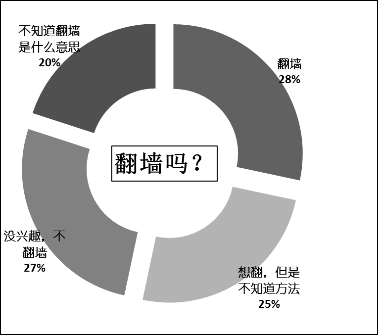
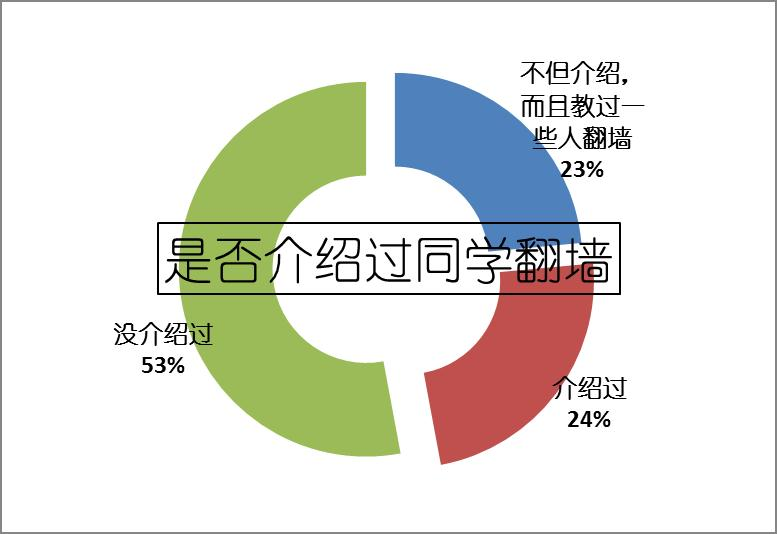
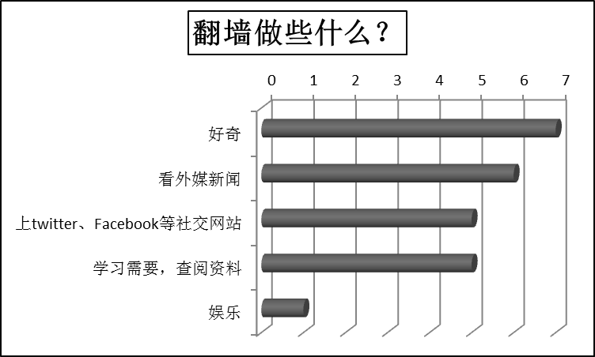
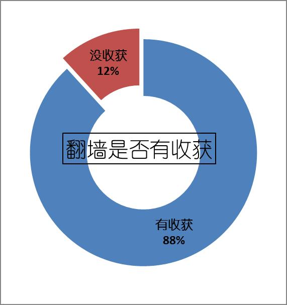
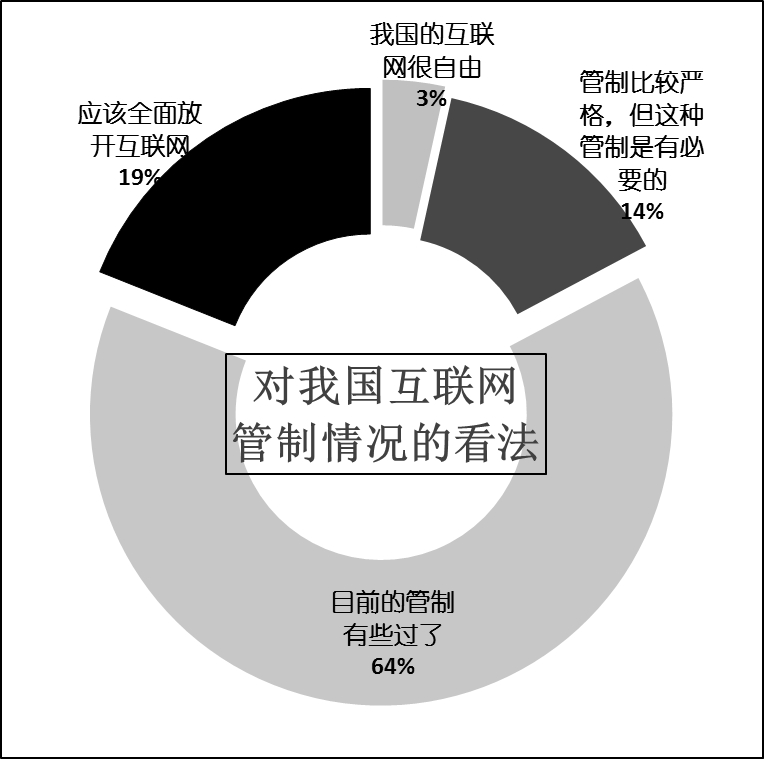

# 当Internet Explorer 无法显示该页

**齐同学说：“民众是有足够的判断对错明辨是非的能力的……越是隐瞒与屏蔽越会增加民众的不满与反弹。”这些话代表了翻墙同学的普遍看法。他们就自己的经历来看，基本上都认为墙外的内容未能左右自己的对事件的看法。**

# 当Internet Explorer 无法显示该页

# ——人大学生“翻墙”情况调查报告

## 文/ 陶辉东&熊辩(中国人民大学新闻周报特稿中心)

江湖上曾经流传这样一句话：人的大部分时间是在床上度过的。当代的大学生们或许不会反对，剩下的时间大部分是在网络上度过的。当我们双击Internet Explore图标，一个永远充满新鲜风景的窗口就这样打开，这扇窗让多少大学生乐此不疲，为之废寝忘食。然而，总有那么一些时候，当我们打开这扇窗的时候，却无奈地发现看到不是风景，而是不透光、不透风，严严实实地挡在你面前的一堵“墙”：“Internet Explore无法显示该页，你可以尝试以下操作……”。 

### 这堵“墙”是什么？

当看到打不开的网页，很多同学其实并没有这样的疑问，而只是简单地以为是网络问题。原因之一是这堵“墙”天生的隐蔽性，它采用域名劫持等技术手段，造成了网络故障的假象。 这堵“墙”其实有个名字：防火长城。这个中文名字起源于它的英文名：Great Firewall，缩写GFW。这并非是一个正式的名称，而是来自于Charles R. Smith写的一篇文章《The Great Firewall of China》。 防火长城主要指中国政府监控和过滤互联网内容的软硬件系统，政府设立这套监控系统的初衷是防范境外互联网的不良信息流入国内，不利于我国互联网的健康发展。但是自诞生以来，这套系统遭受了国内外很多的批评。政府虽然明确表示在对互联网进行审查，但是并未确认GFW的存在。关于GFW的所有资料均来自于网络。 GFW的严格程度并非一成不变，在北京奥运会期间非常宽松，BBC中文网、大赦国际等网站均可访问。而在另一些时候则相对更加严格。不论GFW宽松或严格，总有一些人试图越过这道“墙”。 这种行为就是翻墙。 因为GFW采用的是“黑名单制度”，即只屏蔽名单内的网站和内容，而不是“白名单制度”，即只放行名单内的网站和内容，从理论上讲漏洞总是存在的。GFW诞生不久，各种穿越GFW的方法即开始流传，一些组织或个人开发了许多的翻墙工具。就像GFW对网络的监控和过滤没有明确的法律规定一样，目前也没有对翻墙进行约束的法律规章。 

### 高墙边上的小道

今年4月30日，网站“可能吧”发布了“中国翻墙网民情况调查”的调查结果。这次调查收集到了5300多份数据。这个网络上发起的不正式的调查，或许是到目前为止最大规模、最权威的一次关于我国网民翻墙情况的调查。 

这份调查显示，翻墙的网民中，持本科或大专学历的占73%，年龄在19岁至28岁之间的占77%，约一半是在校学生。这说明在校大学生无疑是翻墙的主力军之一。 这份调查还显示，翻墙最主要的三个目的依次是使用Google等基础服务、上twitter等社交网站、看外媒新闻。 在这份调查的留言中，有这样一些文字： “互联网同其他媒体一样，不可能放任其随意发展的，各个国家都是如此。但不应该像中国这样，控制互联网已经到了登峰造极，以至影响到中国互联网深层发展的程度。” “……我去看F1技术专家的blog要翻墙……连全世界最权威的F1网站autosport.com的全部图片也都被‘墙’掉了，真是不可理喻。”（“墙”此处为动词，是网络流行用法，意即被防火墙过滤。 编辑注。） “GFW的存在，体现了当前政府对互联网并没有完整的掌控能力，即并没有一个足够有效的方法来对中国的互联网进行规范。GFW对国内外消息的封锁有时会出现盲目的情况” “GFW这种状态其实就是在高墙边上留了一条小道，你只要不太过分，修墙的也就不会理你。” 

### 寂寞翻墙路

像其他人大学子们一样，财金学院的代同学也很忙。晚上，奔波了一天的代同学回到宿舍，第一件事就是打开电脑上网放松。代同学点开Google Reader，照例“此页无法访问”（这是谷歌浏览器撞墙的反应。 编辑注）。代同学点开谷歌浏览器翻墙扩展，照例开始了翻墙。 像代同学一样翻墙的同学在人大有多少？ 记者在全校09级学生中随机选取了60人进行问卷调查，其中有仅17人表示翻墙。可见翻墙在人大并不算大众行为。 如财金学院的Terry所说：“一般人碰到网页打不开就去找别的。”一方面，一些同学不知道GFW的存在。在60位接受调查的同学中，有12人不知道翻墙是什么意思。另一方面，很多同学认为翻墙很麻烦，而墙外的网络资源似乎并非那么有价值。接受调查的60人中，有16人认为翻墙没意思，没有翻墙的意向。采访的结果印证了这一点。不翻墙的同学中，大多数人对翻墙没兴趣。这与互联网上很多激进者所鼓吹的并不一致。Terry说，有一些同学问过他翻墙的方法，但是大多翻一两次就没兴趣了，很少有经常翻的。08级的林同学曾经写过“翻墙教程”发在校内上，也教过一些人翻墙，但是“很多人会觉得，哇，这么麻烦，不翻了”。如新闻学院的赵同学所说：“翻墙这东西，有需要的人就会去翻。”他表示：“如果有谁需要我也很乐意帮助他翻墙。” 

从问卷调查的情况来看，17个翻墙的同学当中，有6人是听大学同学说的，有8人是从网上看到的。 这反映了翻墙技术传播的两个主要途径：一是对网络技术比较感兴趣、也就是比较喜欢“折腾”的同学会从互联网上了解并学习翻墙技术。这与调查发现的另一个现象有很大关联——翻墙的同学大多来自重数理的专业。在接受调查的12名法学院的同学中和10名劳人的同学中，翻墙的同学分别仅有两人，而理学院、财金学院、信管学院等学院均在半数左右。翻墙技术传播的第二条主要途径就是同学之间的传播。采访到的情况印证了这一点，很多同学第一次翻墙都是同学教的。09级的欧阳同学说，第一次翻墙是同学给装了一个翻墙插件。这种同学之间的传播，经常以宿舍为场所。一个翻墙的同学常常带动自己同宿舍或相邻宿舍的同学翻墙。例如09级的张同学大一的时候同宿舍的一个同学会翻墙，于是他教了他们宿舍的几个同学，这是张同学与翻墙最早的接触。 

### 因为墙在那儿

今年11月2日，网易发布了一则新闻：《GFW添闹剧FGW打飞机 你懂的》里面有如下这一段文字：有网民称，“CCTV说有个叫Facebook的网站全球用户超过5亿人，俺亲自上网验证过，世界上根本不存在Facebook这个网站。CCTV公然捏造一个子虚乌有的网站、公开播报虚假新闻，敝人对此行为表示强烈谴责。” 

此语道出了为什么会有人翻墙的原因。 从人大问卷调查的结果来看，翻墙的人中有很大一部分只是简单出于好奇。17位翻墙的同学中，有7人表示是因为想看看境外网站是什么样子。Facebook、Youtube、Twitter等风靡全球的互联网服务在中国大陆虽然被屏蔽，却享有很高的知名度。前面提到的张同学即是因为不能上Youtube才知道GFW的存在。08级的赵同学谈到，2008年的时候Youtube还处于半封锁状态，当时要是有敏感词就会出现“该页面无法显示”，只能刷新，等几分钟才能打开。当时赵同学只是觉得奇怪。而到了2009年3月份的时候，Youtube彻底不能通过正常方式登陆了，“这时候我们就发现事情好像就没这么简单”。 08级新闻学院的马同学说，师兄跟我们说有墙和翻墙这件事后，觉得很好奇也很疑惑。09级的齐同学干脆的说就是“想看看被目前网站上被屏蔽的东西”。“墙外”作为一个陌生而新奇的存在，天然的具有某种吸引力。而在赵同学看来，翻墙不需要太多理由，只是因为“墙在那儿”，看到一个又一个打不开的网页，翻墙的念头很自然的会冒出来。他说，每个人都有自由获取信息希望，打破限制是很自然的的想法。 好奇只能是翻墙的引子，调查显示，翻墙同学的主要活动是看外媒新闻、上社交网站、查阅资料和娱乐。上文提到的代同学即是一例。赵同学不上人人网，却每天都会登录Facebook，在他看来，这是了解世界的一个窗口。有位同学在调查问卷上写道：“翻墙是为了了解外国人对中国的看法。” 翻墙的17位同学中，有6位同学的主要目的之一是查阅资料。GFW在屏蔽了不良信息的同时，也误伤了大量正常的网站。很多情况下，翻墙的理由只是正常使用互联网。欧阳同学最初感受到GFW的存在，是因为有个同学的博客因用的是国外的网址打不开了。Google撤离大陆以后，网页打不开的情况较多，这也是Google的粉丝们翻墙的主要理由之一。Terry说：“经常就是因为Google链接被重置才翻的。”（并非所有网页打不开的原因都是链接被重置，只是习惯性这么说。 编辑注） 

### “墙”或翻墙改变了什么？

有采访对象认为，GFW发挥的作用十分有限。想翻的同学可以容易的翻出去，不想翻的同学本来就不会想去看墙试图屏蔽的信息。而想翻墙的同学基本可以比较容易的通过同学或网络找到方法。实际上，同学们翻墙的工具大多是简单的翻墙软件、浏览器插件或在线代理，基本不使用较高级的VPN等收费的翻墙方式。林同学认为，对GFW的巨大投入，实际上是一种很大的浪费。 

问卷调查的结果显示，17位翻墙的同学中，有14位认为翻墙有意义。林同学的翻墙感受是：挺开阔眼界、看到有另外的看法。这也是大多数同学的感受。林同学在饭否被封以后开始上Twitter，他关注的更多是一些媒体人。他说：“跟国内微博一样，Twitter上聊得也是腾讯360之争、李刚事件等国内的热门话题……新浪微博壮大以后，Twitter上很多言论就是转发新浪微博上的，也有人讨论上Twitter的必要性……但是当对于很多问题的讨论深入到背后的利益集团的时候讨论的阵地就只能是在twitter上了。”马同学说，翻墙让自己学会“更全面地接触信息，更客观地靠自己去判断、辨别，而不是只听哪一方的。” 墙外的思想实际上非常的多样，并非黑白分明。他们都认为，只有在综合墙内墙外各方的信息之后，才能得出一个较为接近真实的结论。这个过程中自然地丰富了自己的经历，锻炼自己的判断力。互联网、尤其是web2.0时代的社交网站，使得大学生们可以近距离的观察国外的社会与文化，甚至融入国外的网络生活之中，亲身体会外国人的观点和思想。全世界都在用Facebook，只有中国人不用。有人说，没关系，我们有人人网。而在赵同学看来，这客观上造成了中国人与世界的一种隔阂。 

### 墙，是否保护过度？

在17位翻墙的同学中，有7位同学认为网络管制其实没有必要，占总数的46.7%，其余10位同学认为目前的网络管制有些过严了。有同学在问卷上写道，管制应该有明确的法律规定。而在不翻墙的43位同学中，有5位同学认为网络管制没有必要，仅占总数的11.6%，还有10人认为目前的网络管制没有过严或不存在网络管制。 为什么翻墙的同学更加赞同放开网络管制？ 

齐同学说：“民众是有足够的判断对错明辨是非的能力的……越是隐瞒与屏蔽越会增加民众的不满与反弹。”这些话代表了翻墙同学的普遍看法。他们就自己的经历来看，基本上都认为墙外的内容未能左右自己的对事件的看法。 网上流传的免费翻墙软件大多有政治背景，打开这样的软件浏览器常常会自动连接到境外不法分子建立的网站上，这是大多数同学刚开始翻墙时的必经过程。而对这样的网站上的内容，虽然是首次看到，大多数同学并没有太多的意外。国内的舆论宣传早就描述清楚了境外不良网站上的内容是怎样的。如张同学所说，大多数同学对境外网站上可能出现的内容早有心理准备。他们认为这一类内容非常“傻”，“作假的手法太低劣了”。也有同学称国内的宣传把境外的不良网站描绘的太过妖魔化，实际上“根本没那么厉害”。 当面对与墙内观点有差异的内容，一个普遍的看法是：墙内和墙外是一样的，都有偏向。赵同学说：“长见识也好，开拓眼界也罢，（墙外内容）并不能取代你本人的看法。” 传播学上的“第三人理论”认为，受众普遍认为大众传媒对其他人的影响要比对自己的要大。换句话说，人们大多觉得自己的判断力比别人强，尤其是比陌生人强。这或许在某种程度上部分地体现了墙的设计者的看法。欧阳同学认为，“墙的设计者应该更自信一些。” 

### 
