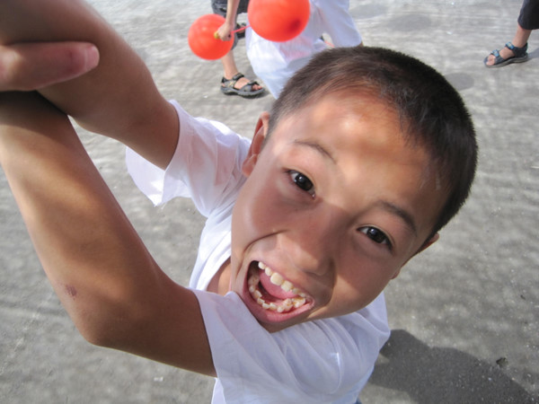
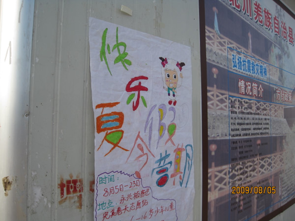
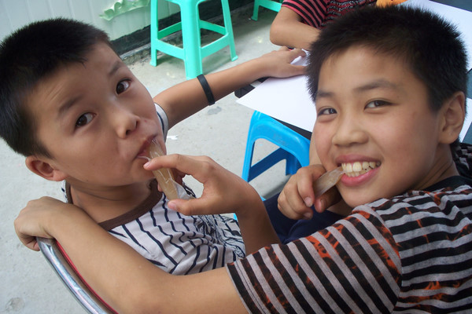

# 面对孩子，我们怎样做志愿者

**“但既然有如此多的机构与个人来来往往，来者就有责任和义务考量和审视自己的行动。遗憾的是，就我所见到的情形，多有为表达善意和爱心而迫不及待情感泛滥的志愿者，却少有尊重儿童理性计划的志愿者。”**

# 面对孩子，我们怎样做志愿者

## 文/大师兄

9月24日，是北川“9.24事件”一周年纪念日。对于一年前三分天灾七分人祸造成的惨剧，有司三缄其口，舆论也列为禁区。作为512川震中最为惨烈的地区之一，北川至今有很多不能讨论的话题，比如9.24，比如遇难学生——人数至今是个谜——追问则成了一种罪过。提到北川，在老县城遗址边上的“望乡台”，小摊小贩兜售的商品和纪念品和中国任何一处景点已经没有两样。山坡上四散而立的薄薄的墓碑，配上祭奠用的香烛，早成了过路君子“随心聊表心意”的生财之道。这里，俨然一个新的旅游景点，有热闹，有生气，但却缺乏应有的庄重和敬畏。在邻近的安置灾民的任家坪板房区，一个五六岁的儿童，竟然对志愿者说，叔叔，你给我买东西吧，我可以给你磕头。 

耳闻和眼见这些，作为一个志愿者，我觉得羞愧难当，或许我可以在种种不允许被言说的事情面前保持卑微的沉默。但在这样的地方，这样的孩子，说出这样的话，我不禁感到悲哀。孩子尚还年幼无知，倘如有错，也绝不在他。而我们这些成人，顶着一个志愿者的称谓，所谓光荣而慈悲地行走于灾区，所谓怀着满腔的爱去奉献，本意是能够于那些饱受惊恐的心灵有所帮助与安慰，对于儿童，原也是希望能够让他们能“幸福的度日，合理的做人”。最后加诸儿童的影响，竟然收获这样的结果，不能不令人羞愤难当。当然，对儿童的教育历来是件困苦艰难的事，在川震这样无常特殊的背景下，本来也不指望志愿者能够承担起这样的重任。但既然有如此多的机构与个人来来往往，来者就有责任和义务考量和审视自己的行动。遗憾的是，就我所见到的情形，多有为表达善意和爱心而迫不及待情感泛滥的志愿者，却少有尊重儿童理性计划的志愿者。 于是，在我所服务的社区，在我们能观察到的地方，所谓的“有问题的儿童”竟然令人吃惊地不是少数。人们或是关注地震对他们带来的伤害和影响，或是从“原生家庭”中找到因由。但是，不容忽略的是，志愿者的来去频频，对儿童的心灵带来的影响，不光有正面的，其实也有负面的。我们看到，很多儿童已经习惯了志愿者动辄施予物资，习惯了志愿者碰在手心贴在脸颊的关爱，习惯了告诉他们：因为地震，他们是可怜的，是必然需要关注的。于是，我们经常遭遇这样的情形，一个孩子心安理得地告诉你，作为志愿者，你应该为他/她买这个，为他/她做那个，稍不如意，便会生气发火；有这样的孩子，学会了察颜观色和选择对象，能够想尽一切办法央求你达成他/她的心愿；也有这样的孩子，变得以自己为中心，不合群而自大，拒绝分享和付出；还有这样的孩子，已经缺乏基本的礼貌和责任感，易怒而善变。事实上，我们也很难界定，究竟有多少负面的东西是因为志愿者们恨不得一下子掏心窝给出的爱而带来的。成人们无法自控的行为给儿童带来的情感上的伤害自古有之，教育需要爱，更需要智慧。在灾区，还有更多我们不能言说的负面的东西，而这些，其实是在说明我们这个社会距离成熟还为时尚早。 

而据说从对待妇女和儿童的态度上，可以看出一个民族的文明程度。依照这个标准，就我所眼见的状况来看，实在难以将我们这个民族与“文明”、“进步”这些正面的词汇联系在一起。且不说我们这些成年人在无明的社会里所遭遇的难以言说的侮辱与损害，那些被残害为残疾在街头乞讨的、沦为人贩子手中商品的、在遥远的乡村忍饥挨饿的、游走在城市边缘与垃圾为伍的、无奈地从事着繁重的体力活儿的、承受着毫无希望的教育的……种种与文明社会的进步背道而驰的生存状态，无时无刻不在提醒我们：我们原来也生活在这样的社会里，如此险恶、卑劣，既缺乏安全，也缺乏爱，更缺乏责任。身为父母，身为前辈，我们该怎样去面对我们的孩子，才能显得理性而活泛、友爱而庄重，足以同行，足以示范，有底蕴和信心去承领应得的福报？ 我曾听有进入政府工作的西部志愿者理直气壮地批评灾民不懂得报恩只会添乱，见过骗取志愿者钱财的灾民，也亲身见识过为了一己私利而不择手段的志愿者……这些都告诉我，人性是复杂的，每一种社会角色或许都有不为人知的人面。所谓“阳光底下并无新事”，屁股决定脑袋，才是符合客观实际的。我们宣传“感恩”教导“感恩”，我们相信“人定胜天”鼓吹“多难兴邦”，我们相信“盛世”和繁荣的现代神话；我们也掀起骂战痛斥赈灾不如己意的外企和王石，我们发起人肉搜索寻找大放厥词的网民，我们在每一个QQ群里不厌其烦地转发“熊猫血”的信息……唯独，鲜见理性的批判和恒久的坚持，所谓“依然如故，一无进步”，正是我们所面临的。基于这样的实际，面对前面的所说的志愿者，无论是机构或是个人，这样的批评是否过于严苛。然而，个人为流俗所绑架，反过来又成为流俗的帮闲与帮凶，这样的自觉与不自觉的个人，是需要被当头棒喝的。 90年前，鲁迅曾有过这样的文章《我们现在怎样做父亲》，他也曾经呐喊“救救孩子”，愿意“肩住了黑暗的闸门，放他们到宽阔光明的地方去”，而作为成人，需要的是“一面清结旧账，一面开辟新路”。但迄今，我们扪心自问，正如余世存在《成人之美》里面所言及的：“所有当代中国的成年公民们，我们这些类人孩们，扪心自问，我们不能说我们是绝对正直的人，是清白无辜的，是所有人也即人性的榜样。我们要承认中国的污染和匮乏，承认中国人的黑暗、肮脏和残忍，首先应该承认自身的卑怯和罪错。任何一个在中国繁荣或中国崛起神话里活着的成年公民，或任何一个在中国转型里建功立业的人，都不能说我们是所有人也即人性的裁判，都不能说我们活出了德性和正义，我们得承认我们跟这个表面经济繁荣的国家一起，毛孔里滴着血和肮脏的东西。对祖先、文明、人性和我们的孩子来说，我们都有一些难以启齿的言行、心理和思维。 ” 

然而，对于“躬逢盛世”乐意“与有荣焉”的人来说，这些表述是不合时宜的。我们不愿意承认自己的心智并不健全，进而由我们所组成的这个社会心智也不成熟。我们用不健全不成熟的心智去因应灾难，教育儿童，最终又一次收获失望，也就顺理成章。 于是，清结旧账，开辟新路，在90年以后依然是一个新问题。
