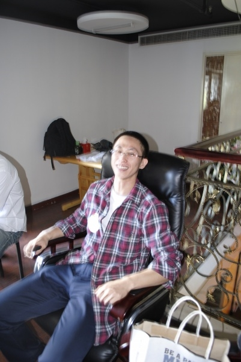

# 我们得有什么样的自由

**“其实，我们在当下这么一个环境里谈论自由，是有些奢侈的：言论自由、宗教信仰自由、免于匮乏和免于恐惧的自由，这些基本的自由，我们一样都没有。既然如此，我们为什么还要来讨论自由的话题呢？”** ** **

# 我们得有什么样的自由

# ——在首届草根论坛上的发言

## 文 / 乔淼（北京师范大学）

 各位下午好。今天在这里与各位交流的问题有关自由。题目中的“得”一定要读作de，不要读作dei，——后者带有神经症的味道，心理就不大健康了。其实，我们在当下这么一个环境里谈论自由，是有些奢侈的：言论自由、宗教信仰自由、免于匮乏和免于恐惧的自由，这些基本的自由，我们一样都没有。既然如此，我们为什么还要来讨论自由的话题呢？ 让我们从两个基本的问题开始。 我在北师大心理学院读研究生。有时候，研究生们想到一个自认为很牛逼、很漂亮的研究设计，会拿来和导师讨论；导师看过之后，就会问学生：你这个研究设计的很好，但是你为什么要做这个研究呢？它能回答什么问题呢？相似地，我也请热爱自由、要求自由的各位思考，自由有什么好处？我们为什么需要自由？我并不是一个实用主义者，但假如想不明白这两个问题，我们对自由的追求很可能就像那些研究方案一样，走着走着就迷了路。最常见的一种误区就是将自由当作野狐禅，讲来讲去，却并不明白自由的含义到底是什么，比如坊间最常见的将自由误读为“不受任何约束和限制，想干什么就干什么”。另一种情况下，自由则有可能变成我们心中的防御机制，也就是说，我们看上去想要的是自由，其实真正想要的，是其它我们难以表达的东西。 有的人把自由作为投射（projection），在自己不能容忍异见的情况下指责他人。比如说，今天在场的陆遥遥兄，喜欢在校内上点名和人论战，说话不客气，有的同学昨天刚刚说，“我要誓死捍卫你说话的权利”，今天就指责他，“陆兄，你怎么能这样和XXX说话呢，太不像话了！”或者，看到方舟子揭穿XX造假，他会跳出来骂，“呔，方舟子，你这么做什么用心，是不是为了你自己出名？”有的人把自由作为转移（displacement），明明想要其它的东西，却要用自由来替代。例如某人，父亲专横暴躁，他和父亲作对，对抗不过，就从家里跑出来，但是又不做工，养活不了自己，怎么办呢？于是就声称要为天下人谋自由，搞革命，干了许多杀人放火的事……这个人的名字我就不说了。还有的人对自由的追求是反向作用（reaction formation），高呼自由，其实骨子里专制得很，比如，成立了一个国家，叫做民主主义人民共和国，所有的好词全都用上了，但实际上怎么样呢，大家都清楚。 我们说，自由并不是人们生活的必需品。按照马斯洛的需要层次来分的话，自由不属于生理需要，不是安全需要，不是爱和归属的需要，充其量和尊严、自我实现有点关联。也就是说，我们没有自由，也可以生存下去。有饭吃，有水喝，有衣服穿，可以交配繁殖，就算是个奴隶又怎么样呢？我们可以活下去，人民不需要自由！ 另一方面，我们也知道Freedom is not free。自由不是白给的，不是天上掉馅饼。虽然说，“你想要我没有理由不给你”，但“想要”绝对不是说说那么简单。在座的今天大多数是男士，没谈恋爱的应该有不少。你们去追求一个女孩子，光说“我喜欢你”当然不行，必须要做些事，让她感受到你确实是喜欢她的，这才能赢得芳心吧。——当然我并不是说，你们非得要带她去多好的餐厅吃饭，买多么贵重的礼物送给她。所谓的那些“男女朋友必须作的XX件事”“好男人必须有的XX个习惯”都是浮云，没有必然性的。可是你什么都不作又不行。你必须得作点事，也就是说，你要付出相对等的代价。代价（Cost）这个词很关键，我们每获得一项自由，其实就是对等地失去了一些东西作为代价的。譬如，你获得了独立于家庭的自由，不受父母的管束，就会失去来自家庭的经济支持和安逸的生活；你获得了不受政府管束、可以自行其是的自由，就要学着为自己负责。我们常见这样一种人，他们想要自由，不愿意受别人管束，但是出现了什么后果，又要抱怨他人、抱怨命运不公，这样的人，当然是不配享有自由的。 那么，问题进一步地变成了，面对自由所要求的对等代价，你是不是愿意付出这个代价争取自由？ 我们的力量仍然有限，那么“日拱一卒”似乎可以作为不错的起始。一方面而言，我们可以做些“小事”来锻炼自己。今天在座的徐伟，就是实践了“杯水车薪”的行动，他所做的事已经不仅仅是件小事，可以算是小事中的“大事”了。这就是很好的榜样。另一方面，我所更加看重的，是我们对于身边发生的事件的言说。也就是，当我们自己受到伤害、心存情绪的时候，是否可以将它在第一时间，面对当事人，表达出来？比如说，今天你的男朋友说了一句话，让你很不开心。你会不会直接告诉他，“你这话让我很不满意？”你会害怕、忍气吞声，压抑自己吗？还是会用打冷战或者大吵大闹的方式来报复呢。“哎呀，我这么说，他会生气的。”“他一定有他的想法，我还是理解他比较好。”这不是胡说八道吗？你的感受你都放在一边不顾，你能理解谁的想法，你能真正原谅谁？你连自己都原谅不了。 那么，我们作这样的小事，争取一些触手可及的自由，又是为了什么呢？我以为，是为了我们自己的成长。心理学家Erickson曾经提出过一个重要的概念，叫做自我同一性（Identity），简单地说，就是一个人明白自己是谁，自己想要什么，以及自己会做出行动去追求它。换而言之，自我同一性的发展代表着人的成长，有了完善的自我同一性，人在心理上才算是真正长大；否则的话，就不过是个心理上的小孩子。而小孩子是不可能有充分的自由的。马斯洛也认为，心理健康的人，也就是自我实现的人，有一个重要的特征，就是有民主的性格：对新事物保持开放，尊重差异，没有偏见，接受不完美的世界，尊重人和人性……对于一个民主的社会，这些特质少了哪一个都是不行的。 因此，追求自由，最后就回归到要让我们自己心理健康的问题上来。相比于自我实现和自我同一性完善，我更喜欢朱建军先生提出的“清醒的人”的标准。一个清醒的人，首先是有自知（Self-awareness）的，他明白自己是谁，知道自己想要什么，时刻觉察自己和世界的变化。然后就是民主的性格。再然后还有一些重要的特征，比如说对自己负责，要适当勇敢，而且不勉强自己，做不成的事就做不成，所谓“努力在我，成功不必在我”……等等。为什么心理健康对自由这么重要？因为在我看来，最初和最后的自由都来自于我们的内心。假如我们的心理不健康、个性扭曲，那么就算给我们民主的制度、自由的保障，我们一样不能享有它；假如有朝一日我们像刘先生一样，被剥夺了一切外在的自由，我们是不是能保持内心的强大、不被强暴压垮呢？故此，可以说，我们自己可以争取的自由，首先是从我们的心理健康开始。 最后，归根结底，我们要的自由，首先是我们的一种生活态度。 

