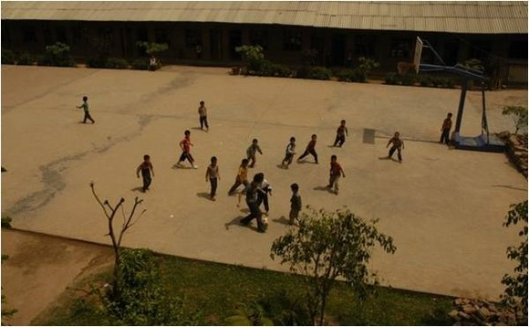
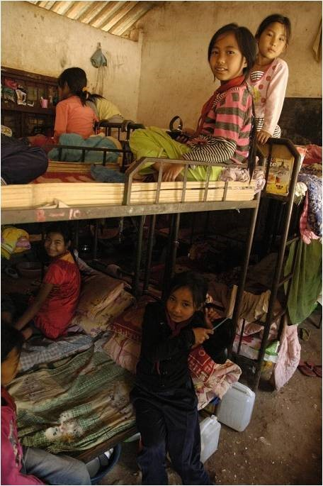

# 西南旱灾那点事儿（附音频）

**“当时跟当地电视台记者聊天，他说最近还要修一个水库，投资几亿，我说，那山上的村民也不受益啊，为什么不拿这些钱修水窖呢？他说：国家的政策是支持大中型水利设施，水窖太小了，很难拿到拨款。听了之后其实很沮丧，当很多国家去试图改变这种先天的不平等的时候，我们的国家竟然在花钱加剧这种不平等。让有水的人水再多一点，没水的人继续渴着。”** ** **

# 西南旱灾那点事儿

## 文 / 徐伟

 **演讲时间：**2010年9月22日——中秋节 **演讲地点：**中秋小论坛 **演讲人：**徐伟——“杯水车薪” 活动发起人 **音频：** 第一次在一群牛人面前做演讲，压力很大。还是先感谢国家吧，要不是在中国，肯定轮不到我去修水窖，我要是不去修水窖也不会有机会认识大家，所以国家是一定要感谢的。今天演讲内容是给大家介绍一下4月份旱灾时，我组织了募捐，然去云南修水窖前前后后的经历和一些自己的感想。很多人问过我为什么要自己组织募捐，其实我是个懒人，但是没想到红十字会什么的比我还懒，他们不公开账目、没第三方审计还敢收10%管理费用，这些烂机构做的这么差，我就想自己弄一个。当由于是私人募捐比较难以取得信任，所以我找学法律的朋友让他写了份法律意见书，又委托了会计师事务所做第三方审计。并且承诺公开所有账目。但是，就算如此，也还是难以取得信任，因为我只是一个普通大学生，没有公信力，所以就算制度很完善，别人也会怀疑。所以我又发邮件给老罗、许可、赵晴和刘瑜，骚扰他们，他们很给力，都在自己的网站或校内发日志宣传，也的确有很大一批人是冲着他们来的。在这里再次对他们的帮助表示感谢。 我发现捐款者的心理很有意思，有种捐款人是花钱买安心类型的，他们捐款并不是为了真正的能帮助灾区，而是为了让自己安心，这样的捐款人让我很头疼，因为他们不管你的制度怎样，他们只是需要随便找个地方把钱捐出去就行了，至于最后钱到没到灾区、有多少到灾区都无所谓。还有一类捐款人，是花钱买名型的，当时我试图跟一些高校联系，看能不能把他们的捐款交给我使用，某高校的某领导说：把钱给你你能帮我们宣传么？我说：不能，但是我能保证钱一定用到灾区。他说：但是我要宣传我们学校啊。于是，他们学校学生们的捐款就被交到那几个臭名昭著的盈利组织那去了。当时我就觉得“呵呵”了，这种人令我感十分的到恶心，在学校内搞强制捐款，然后用这钱给自己谋利益，这就跟偷情还逼老婆拿钱一样，太没出息。当然还有一类捐款人是我最喜欢的，理性型的捐款人，他们会仔细的阅读我的计划，之后提出疑问，这正是我试图通过这次活动倡导的，学会关注规则和制度。 捐款到了一万多之后我就出发去云南了，跟我同去的还有一个我高中同学。到昆明的时候我们打车去宾馆，路上我们问司机，昆明的洗浴中心营业么？司机大哥一听是打听洗浴中心顿时激动了起来，热情的跟我们介绍，说你们住的附近有，但是没什么特殊服务，要特殊服务得往市内走。当时我的感觉和很多网友一样，人家喝水都成问题了，你还搞三俗？可是后来我发现，不是这样。云南多山，城镇所处的海拔低，所以水库蓄的水可以满足城镇用水需要，即便是在当时旱灾的时候也一样，因为云南本身就不是缺水的地方，只要能蓄水是不至于如此干旱的。但是在海拔较高的山上还有一些村子，这些村子没法用水库中的水，因为要把水送到那么高的地方需要的成本太高了，所以就形成了，山下可以去洗浴中心销魂，山上连喝水都成问题这样的现象。我去的南伞镇就是这样，镇里一直不缺水，我每天都能洗澡，因为附近有一个水库给镇里供水，但是山上的就不行了，从镇里到山上要坐一个半小时摩托车，全是盘山土路，交通不便，所以之前想的从山下运水也很不现实。当时跟当地电视台记者聊天，他说最近还要修一个水库，投资几亿，我说，那山上的村民也不受益啊，为什么不拿这些钱修水窖呢？他说：国家的政策是支持大中型水利设施，水窖太小了，很难拿到拨款。听了之后其实很沮丧，当很多国家去试图改变这种先天的不平等的时候，我们的国家竟然在花钱加剧这种不平等。让有水的人水再多一点，没水的人继续渴着。 我去的这个村子叫塘上水自然村，其实这不是受灾最严重的村子，因为这个村子的村民在山上挖除了一个水源，我们就是利用这个水源，把水引到山下的村民家。因为资金有限，只有不到两万块钱，最严重的村子有几十户人家，我们不能拿着两万块钱去村子里只修几个水窖，因为这样会打起来，你没法确定该给哪户修不该给哪户修，如果只修几个水窖公用的话，全靠雨水蓄水也很不现实，因为蓄水的速度很慢，远远不够村民用的。所以没办法，我们只能选择在这个塘上水村修水窖。修水窖的过程大体上还是比较顺利的，村民积极性也很高。这是一些当时的图片。 这期间我还去了几个学校，总体上说，当地的教学资源还是非常非常少的，我去了两所小学和两个幼儿班，只有一所小学勉强算是正规的小学。就是这个学校。 

 上面的一排房子是宿舍，操场就是你看到的这么大，在我去之前这的孩子从没踢过球，我去的时候给他们上了两节体育课。 

 这是宿舍里面，有的孩子是两个人睡一张床，因为床铺不够，这个宿舍基本上就是一个大仓库改造的。我去的时候在这个宿舍后面，正在建一个新的宿舍，我问：是政府建的么？校长说：不是，是苗圃行动建的。我说：哦，那就不怕地震了。 当然，学校里还少不了这些东西。让人犯恶心的标语。 

 不过忠诚党的教育倒是挺对的，教育确实跟D差不多，很烂。最后面这个就是老罗书中说的，能让人精神分裂的标语。 修完水窖后我们用余下的钱买了书，给这个学校做了一个阅览室，当然没买余秋雨和郭敬明的。还买了一些教具和水管送给了其他学校，基本上这就是杯水车薪做的事了。其实真的没做什么，说是杯水都有点夸大了，其实也就算个水蒸气。在最开始策划的时候我们也想到这个问题了，肯定会有人质疑说旱灾区域这么大，你能救多少人？所以，我朋友就说为了防止有人以此为理由，我们不如就把名字就定为“杯水车薪”，我觉得这个名字非常恰当，要知道自己有几斤几两，同时也没必要因为力量小而忽略不计。这次论坛的主题是，寻找生命的图腾，我想在座的大多数都应该找到属于自己的图腾了，我们需要记住的就是莫作社会变革的牺牲品，别想操蛋的世界投降。我想我们会看到胜利的那天，最后祝大家中秋快乐，国庆也快乐吧，毕竟过一次少一次了。 

2010.9.22中秋，于首届草根论坛
