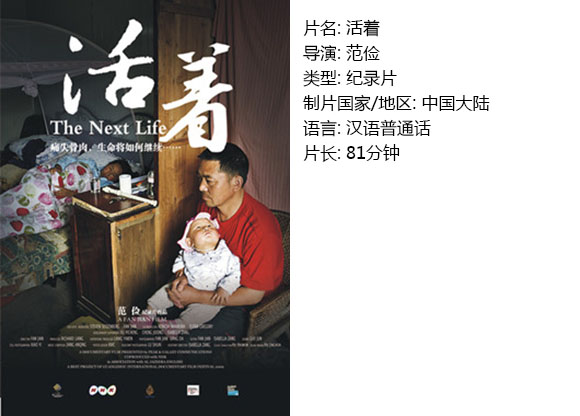

# 第五十三期：人，独立于其所受的苦难。

生而为人，自然逐渐会经历一些生死，开始明白世间的无常是常态。

常常兀自担心会遇见无法承担的失去，父母老去、配偶意外、子女夭折，种种庸人自扰，因此也格外好奇天灾人祸后究竟该如何继续。

范俭《活着》一片，描述了在5.12中失去女儿的夫妻，以一种苦中作乐的方式恬淡地接受着命运，我想与其视作逆来顺受，倒不如视为一种安于天命的释然。

于是，对于如何走出真正残忍的苦痛，我想大致可作如下这般想法罢。

一、面对

“面对”两字，也可谓老生常谈。轻，则于言谈间吹浮鸿毛；重，则于行为中如移千钧。

面对的意义，首先是面对“失去”的既成事实。人死不能复生，任何人无法下至阴曹地府，在奈何桥头拦下魂魄，也无法逆行时光，使河流倒淌。偶尔的恍惚和回忆无法避免，沉浸其中却于自身诸事都无益处。

其次，是面对无法纠正的因果链。人在无法抗衡的自然规律之下，自然渺小，无法穿越时光，找到引起山崩地裂的蝴蝶，也难以追根溯源去计较三峡工程救援队伍等宏观叙事体质问题。微观个体的命运，只能是时局中的一个缩影，一个必然负担者、必然牺牲者。

继而，面对自身的所作所为。父亲祝俊生有一场诉说震时情境的镜头。他说，下午3点左右，他跑到废墟里呼唤女儿，女儿还神气活现地回答“爸爸，我在这儿”，到后来救援队阻隔了众人，却仍至晚间21点还没救出女儿时，他再喊女儿名字时，小孩已经很虚弱了。父亲难掩愧疚地说“这辈子，我对不起她。”

在这场灾祸中，个体自身做了什么，没做什么；哪些责任在己，哪些不在己——分清楚这些，我想能称得上是真实面对了。

而扩展到社会范围，以纪录片的方式，拍摄下这对夫妻的重建生活的心路，也是一种更广阔的角度上的“面对”。

二、分担

** ** 经历过相识的同龄人意外去世，因是家里独子，母亲整日卧榻，不言不语，父亲尚可作坚毅状，接待亲友。而汶川之后失去子女的那批父母，他们互相引为“同道”人，在对镜头和外界诉说时，常会说“我们那批人”这样称谓。想来，这样的分担，确可大大减轻苦痛。因为“理解”从来都是最好的安慰剂。我们普通人尚且得一知冷暖之人便觉足矣，何况在苦难之下，真正的理解与懂得，自是安全与倚赖的润泽之源。

** **

三、恩爱

分担能减轻痛苦，那么和睦的夫妻关系对于伤痛治疗的重要性，更是不言而喻了。

很欣赏叶红梅祝俊生这对夫妻的性格。

叶红梅说“班上有三对家长离婚了”，可是叶祝二人即使贫贱，却从无劳燕分飞的打算。叶红梅一次次地跑医院，丈夫只觉心疼至极。即使也提到过“离婚”，也反而更像是夫妻间的默契玩笑。

年岁渐长，越发喜爱在细节中体味人物的性格。叶红梅长得可算不好看，又大又鼓的嘴巴，颧骨上两团高原红，然而一双黑眼珠子却格外纯稚，不仅没有女人的顾盼生辉，反而有种女童的“呆萌”。她不屈不挠地抽血，指望再生个小孩；她听丈夫与亲友谈笑时，常露出呆滞的笑容。再观丈夫祝俊生，五官可算得英俊，职业不佳，偶尔也会软弱，但举手投足间并无奴颜媚骨的卑怯，能够体恤妻子“身体受不了就不要再生了”，在生死等人生问题上也具备着难得的坦然心态。

叶祝这对夫妇，在失去女儿后，仍不时会冒出些打情骂俏的戏言。比如一位好友怀孕成功后离去，许是因为孤单，祝俊生格外难过起来，叶红梅便嘲笑他“人家走就走啊，这有啥好哭……”

随着时间的推移，这种对苦难的释然和宽容越发的鲜明起来。最后一次人工试孕失败后，叶红梅微笑着说“没有”，祝俊生看着化验单，也淡淡地笑起来。两人自我解嘲地走下楼去。

我想说，选对一个爱人过日子非常非常重要。好的夫妻感情，可以在两人之间形成属于自己的小宇宙。

比如经典美剧《成长的烦恼》中的父母形象，在当时称为一种很好的典范，即夫妻关系是独立于家庭关系的，夫妻关系并不完全受制于家庭关系。生养了三四个子女后，杰森和麦琪仍然有火热的互动和夫妻生活。

还有比如铊中毒的清华女生朱令，其父母也是受了人间至苦，抚养两位女儿成人，一位失踪，不见尸骨，另一位残障终身。常常想朱令父母究竟如何照顾智商只有7岁的朱令，继续这平静又简陋的生活，内心到底要多坚强才能做到。

或许使人能扛起这些的，正是夫妻之间的恩爱，这使得每一秒的相处都产生愉悦与抚慰。两人间形成一种同盟、一种互相治愈的能力、一种独立于外界的精神世界……

四、独立

陈寅恪说“独立之精神，自由之思想”，而我想，这句话不仅适用于做学术，在日常生活中也十分重要。

夫妻关系独立于外部世界，使得两人可以扛起苦难，而人与人之间的相互独立，也更是使得父母可以坦然接受失去子女的方式。

祝俊生指着女儿相片说“我这辈子对不起她！”，其中透露出的信息，是他并未将女儿当成自己的附属品，而是另一个切实的人。

克里希那穆提在《懂得爱》中这样写道：“如果你失去所爱的人，你会流泪不已，然而你的泪水到底是为自己，还是为那逝去的人而流？你究竟是为了自己，还是为别人而哭？你曾经为别人哭过吗？你曾经为那捐躯战场的儿子哭过吗？如果你哭过，那些眼泪是出于自怜，还是为了亡者？如果你是为了自己而伤心，那么眼泪就是白流了，因为你只不过是自怜罢了。但是如果你落泪，是因为你丧失疼爱了半辈子的人，那也不是真的疼爱。假设你的兄弟过世，你很容易为自己落泪，因为他已经离你而去。”

如果因为是失去“自己的女儿”而痛苦，这份痛苦是一种自怜，出发点是自己，这样的情绪会指向伤感，对整个生活都具有破坏性。相反，如果把女儿当成一个独立的人，痛苦仍然存在，但可以指向尊重逝者，以及重建自身。

五、真诚

犹为喜欢本片简短的结尾。

母亲在产房内，神情平静中透着某种坚毅和安详。鲜血淋漓的婴儿特写镜头后，便转至父亲对着女儿相片的祭奠。

没有更多的渲染，纪录片到此结束。

汉字中，有泪有声为哭，有泪无声为泣，无泪有声为号。祝俊生这位父亲此刻的情感是哭。他的情感是真诚的，对自己的行为真诚，对妻子的责任真诚，对死去的女儿和新生的儿子也都是真诚的。这样真诚的人，才会这样不矫饰的哭。也只有这样真诚的人，才会这样坚强地活着。愈真诚，愈坚强。

****** **

尾声 生与死

忘了是谁说过，“爱一个人最好的方法，是继承他的品质”，那么也许纪念一个人最好的方法，也是继承他的美好的品质。在这个意义上，女儿身上所有美好之处，永远留在父母的记忆中、一切认识她的人的潜意识之中，并为这个世界增添了一份抽象但又真实的美好。因此，尽管躯体和衣物已经顺水而去，但她也以这种方式，永远地留下了曾经活着的印记。

村上春树说，死是生的一部分。哲学上，可以说生与死辩证统一。我个人一直在寻找一种态度，面对死亡、面对生命中的苦难，一种“尽人事知天命”的活着的姿态。现在想来，答案应该是“独立”。

因独立而面对。

因独立而真诚。

因独立而坚强。

夫妻关系，之于家庭和社会际遇的独立。

自我，之于他者的独立。

死，之于生的独立。

生者，之于逝者的独立。

——人，之于其所承受一切的独立。

(采编：陈方青；配图：陈方青；责编：黄楚涵)

  【如何下载】 请加入独立影像流动分享群，在群邮件中下载本期所推荐的独立电影！ 1.请加群187213480，入群请注意以下几点哦： 2.流动群专供北斗读者下载本栏目所推荐的资源，验证身份时请注明“北斗读者”。 3.当期资源自发布后14天内可以下载，到期后工作人员将手动删除以上传后续资源，请注意时间。
