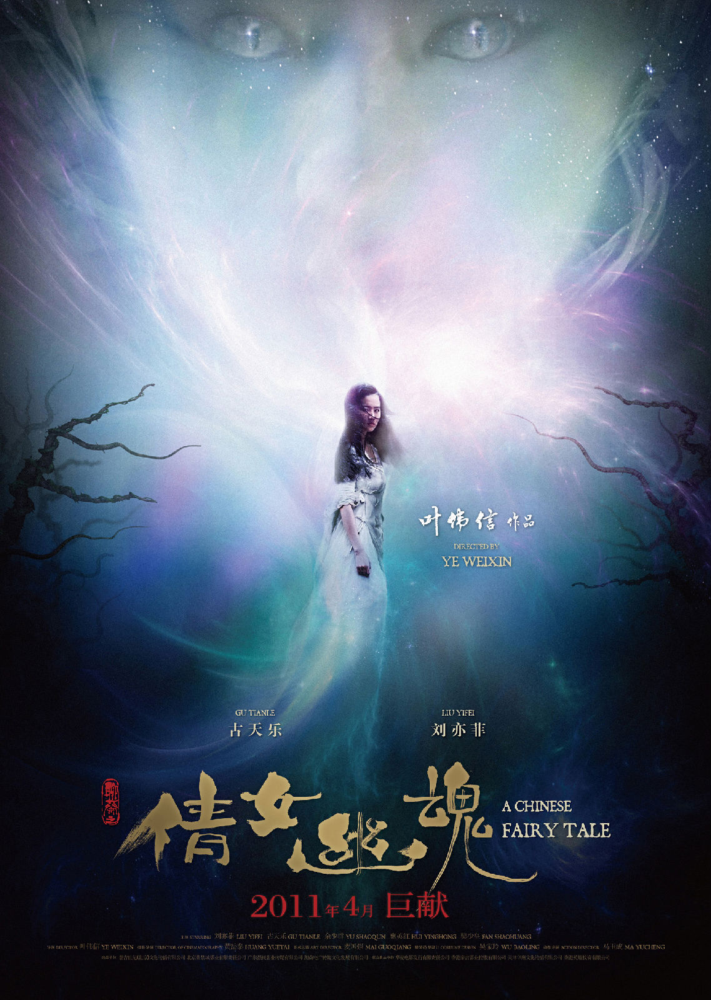
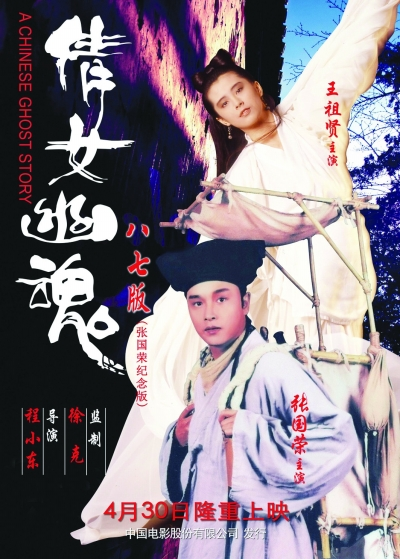
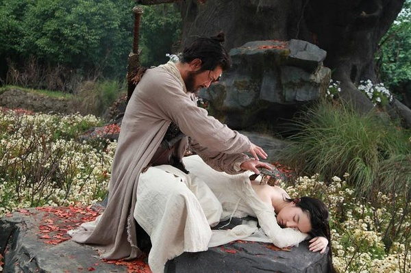
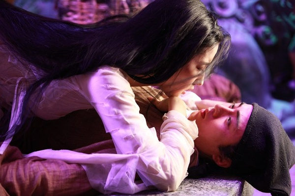

# 《倩女幽魂》：念旧更喜新

**这是一部拍起来格外小心翼翼，论说起来忐忑不安的影片，倒不是因为之前的《倩女幽魂》伟大到不能碰触，实在是因为它的拥护者无论是从从技术上对徐克的膜拜还是从情感上对张国荣的迷恋都会令后来改编者望而生畏的。 ** ibeidou.org ibeidou.org

# 《倩女幽魂》：念旧更喜新

ibeidou.org

## 文 / 昨夜西风（山西大学）

ibeidou.org ibeidou.org

ibeidou.org 这是一部拍起来格外小心翼翼，论说起来忐忑不安的影片，倒不是因为之前的《倩女幽魂》伟大到不能碰触，实在是因为它的拥护者无论是从从技术上对徐克的膜拜还是从情感上对张国荣的迷恋都会令后来改编者望而生畏的。因此，虽然嘴上说这不是对旧作的重拍，但叶伟信版的《倩女幽魂》连片名都不愿意改，片中不但出现了那首著名的歌曲背景音，甚至最后直接打出了“永远怀念张国荣先生“的字幕，凡此种种，都表现出叶伟信们对前作的诚惶诚恐。然而令人意外的是，诚惶诚恐的心态并没有让编导变得畏首畏尾，可以说新版《倩女幽魂》在故事改编上是大胆而有新意的，因此旧版固然经典，新版也可圈可点。 ibeidou.org

ibeidou.org 张国荣版的《倩女幽魂》除了徐克程小东联手打造的奇绝幽险的故事背景给人气象一新之感外，那种人鬼殊途宿命难违的悲剧美更是让影迷们久久难以忘怀，再加之黄沾的经典歌曲以及张国荣王祖贤等演员的独特气质，让整个故事萦绕在一种迷离忧伤但又不失传统意蕴的古典氛围之中，所有的因素都让《倩女幽魂》变得比《聊斋志异之聂小倩》更立体更广为世人所知。在前贤们已经“做绝”了的前提下，在视觉特效无法再超越前作时，新版《倩女幽魂》的故事改编只能求奇求异甚至求俗了，于是“三角恋”这个用滥了故事套路成为了叶伟信的“杀手锏”。至少我个人认为这样的改动效果居然出奇的好，大大出乎预料。 燕赤霞依然是捉鬼驱魔的方外之人，神通广大，但是这个“方外之人”这次却和小倩有一段人妖孽缘，这一改动堪称“胆大妄为”。如果以张国荣版的《倩女幽魂》的男女主角的至情至性和燕赤霞的古道热肠两个标准来衡量，新版《倩女幽魂》这一改编实在有些无厘头，但这仅仅是开场戏带来的突兀感，当接下来的情节展开时，你可以发现这个故事是有起有落的。它既符合“聊斋志异”和香港鬼怪片惯有的“前世今生”说，又体现着现代社会复杂的情感纠葛状况。这样既有神鬼片的光怪陆离，又有言情片的情绪波澜，其实本身已经具备了商业成功的基础。燕赤霞孤身一人长期驻守黑山，是因为难舍聂小倩，这种感情放在这样的鬼怪故事中你无法挑剔什么毛病，既然旧版《倩女幽魂》能将《聂小倩》改得人鬼殊途，那么新版《倩女幽魂》也完全可以改成现在这个样子。燕赤霞在原著小说中只是个身怀异术的奇人，本身性格并不鲜明，只是到了《倩女幽魂》中才发展成为古道热肠心怀苍生的大侠，而倒了这部新版的《倩女幽魂》中，燕赤霞已经是另外一种面目了。 ibeidou.org

ibeidou.org 这其实既和不同导演的创作志趣和理念有关，也和时代特征有关。在李翰祥徐克时代，正是香港新武侠的昌盛之时，无论是电影还是小说，新派武侠中的“侠义为先泽被苍生”都是为世人追捧的通俗娱乐话题；而最近二十年中国的“武侠”其实在不知不觉中已经有了新的变化，从武侠小说题材中的“穿越”盛行到武侠电影中的“人性至上”都体现了这一变化。去年的武侠电影《剑雨》就是一如此，在这部电影中把“侠义”二字化大为小，把江湖之事变为市井之事，更加注重人物的内心世界，人物不再是那么单纯地好和坏。由此再看新版《倩女幽魂》，就会发现燕赤霞这个人物也反映了这样的变化，他不再如午马版的燕赤霞那样嫉恶如仇心怀坦荡，而是变得有所牵挂优柔寡断，这种改变固然让喜欢旧版的人觉得不适应，但它却恰恰说明了燕赤霞也是一个人，是人就有这样或那样的弱点。 而从叶伟信执导的两部《叶问》也能看出他创作角度不同，可以说叶伟信没有徐克那么多正统武侠情结，至少在“武侠”这一点上和徐克的着眼点是完全不同的。其实港片的精髓就是“从小处着眼，奇险多变”，这从很多反映市井故事的港片都能找到鲜明的例证，即便是某些反映历史题材的香港电影也总是爱独出心裁，极尽荒诞搞怪之能事，“尊从正统”从来都不是香港电影的主流，而“不断颠覆”才是香港电影的生命，即使是在大陆审查的严苛和内地市场的火爆的矛盾夹缝中不得不做出某种妥协，我们也能窥见到香港电影的某些独到之处。所以，我认为新《倩女幽魂》的这种改动在意料之外，情理之中，也可以说是本片最成功的地方。 ibeidou.org

ibeidou.org 古天乐和樊少皇都是二人各自的标准配置表演，不过不失，余少群天生奶油小生脸，实则很吃亏，总是给人感觉很嫩，倒是两个配角“铁牙”和“黑山老妖”很抢戏，这其中尤以惠英红的老树妖有看头，香港电影金像奖最佳表演奖获得者还是很见功力的。其实很多人看这部新《倩女幽魂》是因为刘亦菲，尽管和王祖贤版的聂小倩相比，刘版聂小倩因为没有狐媚之气而让很多人非议，但是如果从另外一个角度去看，这岂不是恰恰说明这个聂小倩她本身就不是一个很坏的妖精？而在原著小说中其实也没有着重描绘聂小倩的狐媚鬼气，这个特征完全是旧版《倩女幽魂》的再创作。而且如果拿聂小倩这个角色和刘亦菲从前的那些角色相比，其实她在表演上已经有了很大的突破。如果你看过最近在某大片中的被力捧的某年轻女星的表演，你就会发现“神仙姐姐”的表演经验显然更丰富，即使苛刻一点说，花瓶也是有质量高低的区别的。 作为一部带有电影武侠色彩或者更确切地说武打特征的魔怪爱情电影，新《倩女幽魂》中燕赤霞和夏雪风雷的武打设计堪称鬼斧神工，在视觉上令人赏心悦目，和当年徐克程小东的一些经典之作相比，不遑多让。所以旧版的《倩女幽魂》固然经典，但新版的《倩女幽魂》也有新看头。 ibeidou.org ibeidou.org

（采编：安镜轩 责编：刘一舟）

ibeidou.org ibeidou.org
