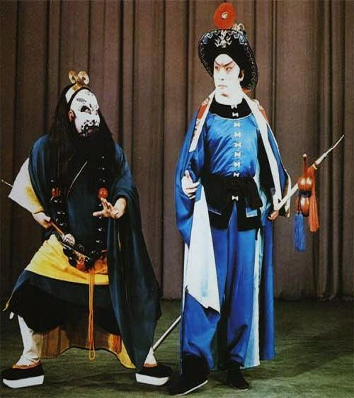
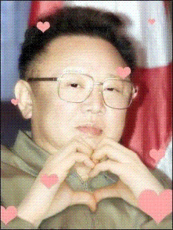
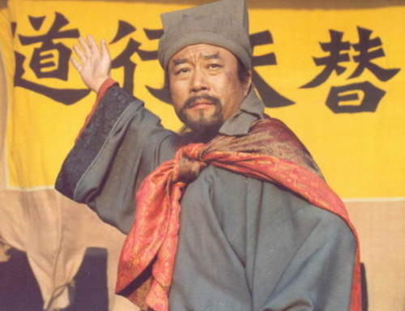

# 《水浒》以及新版水浒传

**就像有些电视剧上放的，清朝哪个皇帝要传位十四阿哥，结果有人把诏书一改，十改成于，就变成了传位于四阿哥。难道你死了写遗嘱的时候会写，“我财产中的那四袋苹果给三儿子，那苹果四代给五儿子”？这皇帝这么蠢，不知道直接写儿子的名字？**

### 

### 

# 《水浒》以及新版水浒传

### 

## 文 / 黄忠锉（北斗撰稿人）

### 

### 

恰逢张大胡子重拍《水浒》，在看这部片子之前，我就已经猜到这部片子的部分特点，这已经成了国内历史剧的基本特点了。总之导演认为历史是黑白的，只有肚兜是彩色的： 1.除李逵鲁智深等外表明显凶恶丑陋的以外，其余好人肯定是帅哥来演。 2.肯定会着重描写潘金莲、潘巧云等略带情色的出轨行为。 3.杜撰出一些男女感情故事。 果然，看到林冲我就要喷了，为什么找这么帅的人演林冲呢？古代的演义啊小说啊，人物基本上都有借鉴有参考有延续的，比如《说岳》里的八大锤和《隋唐》里的四个拿锤的很类似，比如《水浒》里的双枪将董平和《说岳》里的双枪陆文龙，兵器家世境遇都一样。而水浒里的英雄，比如大刀关胜就是关老爷，智多星吴用是诸葛亮，宋江么就是那个会用情义笼络人的刘备。当然王英和扈三娘就让人想到土行孙和邓婵玉了。 

### 

### 

### 

而林冲的形象就是张飞，张飞是豹头环眼，燕颌胡须，而书上说鲁智深初见林冲时，也是用这八个字来形容。且林冲除了刚开始那会儿用普通的红缨枪外，在抓扈三娘的时候以及以后用的是丈八蛇矛，书上，新片老片都是这么处理。所以别让林冲那么帅那么忧郁那么苦大仇深，他就是张飞，就算功劳再大，也只能排在关胜的后面。 林冲在发配沧州的时候，向柴进借钱孝敬差拨管营，身边随从，士兵很多，他还是多次大声喊：“柴大官人，你借钱给我吧，我要把钱拿给差拨管营，否则我在大牢里要被打死啊。”难道你被公安局抓了的时候，当着局长以及那么多警员、父老乡亲的面跟你爸说，“爸，快去多借些钱来，要送给局长，这样我在拘留所就不用被看守人员打了”…… 当然外表上处理比较不满意的还有宋江，觉得还是老版好，有点猥琐。而且这宋江不但这么帅，时不时还额头上有一条金线，难道真的是神灵下凡？或者是因为他是公务员就把他处理得帅一点神气一点？当然宋江最牛逼的就是时不时地蹦出一句“我宋江……”就像“我爸是李刚”那样掷地有声。 当然最喷的就是鲁智深倒拔垂柳之后又把柳树放回去，真是环保主义者，绿色和平的形象大使。最蛋疼的就是孙二娘的那些经历，好好的一个母夜叉，竟然有如此凄惨的境遇。导演用武松的例子说明了，男人感情受伤以后会报复社会；又用孙二娘的例子再次说明，女人感情受伤以后也会报复社会。 片子里最受不鸟的就是几个头领看到晁盖或者宋江的时候，都会自称绰号，比如说“小弟镇三山黄信拜见哥哥”“小弟摩云金翅欧鹏拜见哥哥”。难道包拯去见皇上的时候会说“臣包黑炭包拯参见皇上，吾皇万岁万岁万万岁”？或者领导接见我的时候让我介绍一下自己，我要说“我是忠哥黄忠杰”？ 就像有些电视剧上放的，清朝哪个皇帝要传位十四阿哥，结果有人把诏书一改，十改成于，就变成了传位于四阿哥。难道你死了写遗嘱的时候会写，“我财产中的那四袋苹果给三儿子，那苹果四代给五儿子”？这皇帝这么蠢，不知道直接写儿子的名字？ 当然《水浒》对我们行为做事还是很有借鉴的，比如靠足球发迹的高俅，体育特长生，进了单位，正好被端王赏识，端王运气好，哲宗无子，兄终弟及，继承大统。所以现在那些会打乒乓啊羽毛球啊之类的童鞋应该学学高俅。 又比如，梁山个个身怀绝技，但普遍靠武吃饭，文化水平不高。所以我还是觉得他们有点笨，招安的时候就该想到，朝廷把你们招过去干嘛。除了安道全能去当个御医，皇甫端能去当个兽医，萧让和金大坚能谋个文职，其他人就该去当炮灰了。所以我们要看到自己的技能是什么，我在单位里最不喜欢被当做业务水平高，办事快的柜员，要是柜员做得专业了，那就也许一辈子都是柜员了，当柜台离不开你的时候，也就是你要做一辈子柜台的时候了。 孙中山好像说过，“有人群就有政治”。有政治就有派系斗争。梁山的派系斗争可以体现在排名座次上。新片里说了排名是按照功劳，但最后还是招安派（宋江吴用公孙胜）的人自己定的。比如林冲功劳明显比关胜大，而他排在关胜之后，一是因为林冲肯定是反对招安的头头，而关胜祖辈世忠，肯定不愿意当草寇。二是因为关胜祖上是关老爷大圣人，我国不都讲个出身家世的么？和“我爸是李刚”“我爷爷是毛主席”一样。 

### 

### 

### 

再比如，梁上除了宋江的铁杆青州江州系，还有登州系不可小觑，所以登州系的领导人小尉迟孙立被放在了地煞，而登州系不起眼的解珍解宝却被放在天罡排位靠前。这就是政治手段，拉拢归拉拢，用归用，但不给实际地位，并且有分裂离间的作用。 所以别说功劳，排位靠前基本上都是招安派，前十名只有林冲不是招安派，李应和朱仝排在十一和十二也是这个原因，都是良善被骗到梁山，没有彻底地落草为寇。之后是十三、十四名的鲁智深和武松，二龙山派系的头领，非招安派。接下去除杨志外，其他都不是真心落草却渴望招安的，且大多很晚上山功劳基本没有，包括董平和张清等人，是宋江要拉拢的人。李逵排名二十二，作为宋江的心腹，他的排位不重要，因为他只是个打手，不需要他的权力地位以及出谋划策。再接下去才是晁盖系也反对招安的水军头领们。 不过最能制约《水浒》此书的文学、思想以及历史价值的就是书中对待女人的态度。女人的出场率很低，死亡率却很高。水浒里的女人包括这么几大类，淫荡不守贞洁的，包括潘金莲、潘巧云、阎婆惜等；长舌妇直接间接害人的，包括王婆、刘高老婆、阎婆以及李瑞兰的妈；男性化的几乎没有儿女情长的，包括孙二娘、扈三娘、顾大嫂等；完全的受害者，如林冲夫人、金翠莲等。 本书的宗旨是，如果一个人被儿女情长所困，就不是纯粹的英雄好汉了。水浒一百单八将有过老婆，二奶也算，反正可以明确有性经历的只有三十几个。其中最狗血的就是扈三娘，书上说她家人被杀（除哥哥扈成逃到西北经略府），庄园被烧，结果还是下嫁王英，这还是女人吗？所以这点电视剧处理地比书上好。 当然还有个狗血的人物就是电视剧里的卢俊义，他不仅仅是林冲和史文恭以及岳飞的师兄弟，还曾是正规军的大军头领，可以说是元帅。但纵观水浒，在水泊梁山靠天时地利大败多次正规军的围剿，而征方腊的时候却死了三分之二，就是说明梁山好汉的最大制约因素就是缺乏帅才。即使有关胜、林冲、呼延灼等马军单挑无敌，还有鲁智深、武松等步战大神，但缺乏的就是能排兵布阵沉着指挥的元帅级人物。电视剧让观众看到了卢俊义曾经的帅才，在征方腊的时候虽然宋江这个县级政府办公室秘书为主帅，但卢俊义却萎了地一塌糊涂，丝毫看不到任何用人布阵的才能。知道白面郎君郑天寿怎么死的么？不会游泳被派去打水战死的。 反正在那时候，最适合做艺术家的人做了皇帝，最适合做球星的人做了国防部长，最适合跑马拉松的人落草为寇。似乎和现在有点类似，适合弄权的做起了校长，适合当官的人做起了作家，适合搞建筑的做起了地方长官，适合当官的人在银行做了柜台。 知道这部电视剧总是在说朝廷的坏话让人浮想联翩却还是没有被和谐吗？因为宋江最喜欢讲的话就是：“当今圣上圣明，只是被下面的贪官蒙蔽视听”，这就是导演的政治觉悟啊。 

### 

### 

（采编：黄理罡 编辑：黄理罡）

### 

### 
