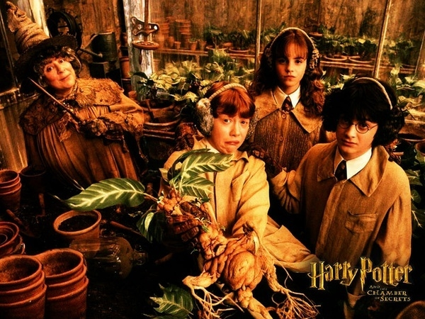
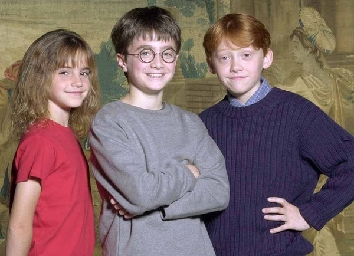
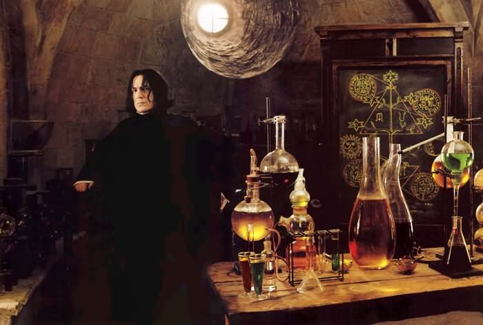
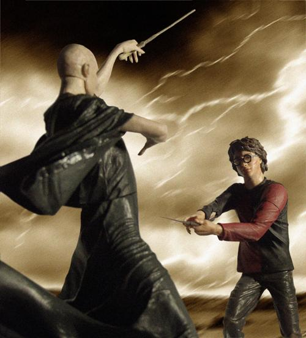
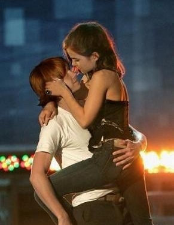
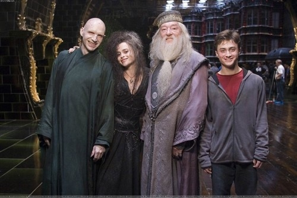

# 人性就是一杯墨汁：关于哈利波特

**“英夷一个单身主妇的一部小说，让这些他们恨之入骨的价值观轻松进入国人的视野中，就在他们的眼皮底下，无论他们审查时眼睛瞪得有多大。这些价值观会漫散开去，从一个人到另一个人，从一代人到另一代人。当认同这些价值观的年轻人成为社会的脊梁，社会也许就会因此而改变。”** ** **

****

****

# 人性就是一杯墨汁：关于哈利波特

##  邵立（University of California Berkeley）

### 一

《哈利波特》最后一部要上映了。肉麻地说，这部系列电影见证了我的成长。从初二到现在，每一部哈利波特在什么时候上映，在哪里看，和谁看，我都记得一清二楚。这部电影激发了我在电影院看电影的兴趣，我养成了不时往电影院跑的习惯――尽管大都是没什么营养的商业片，但我又哪里懂什么营养呢？像《黑客帝国》这样的电影，即使在电影院看一次，也无法理解其复杂性。当然，在中国，能在电影院里看到的好电影远远不及网上下载到的多。 

 最早决定去看这部电影的动力，来自媒体的热炒。那时我根本不知道哈利波特是个什么东东，迷迷糊糊地进了影厅，却一发不可收拾。我被它构造的幻想世界深深吸引，驱使我去买书看，一部一部电影追下去。我自认为不是狂热的哈利迷，但每次我读小说，都要一次读完一本才会安心，要不然心里老是想着里面的情节，寝食不安。平心而论，哈利波特是部很优秀的小说，电影制作也很精良。但是，它的流行来自于商业运作，故事背景又趋向低龄化的幻想主义，只是流行的大众畅销作品，不是什么阳春白雪。一句话，它“没有深度”。 但它真的缺乏深度么？我觉得，至少JK罗琳不会同意。哈利波特七本书的情节发展，那渐渐黑暗的风格和沉重的格调，表达了她的野心：这不是一部平常的儿童文学作品，它是一部关于成长的故事。它表面上在描写一个虚构的时空当中的一个小男孩的经历，但实质上在展示着人们普遍的成长经历。每个人都可以在这部小说中找到自己的投射。 我依然喜欢这部作品，是因为它从时间上，投射了我从一个懵懂的初中生到研究生的经历。但这不是唯一的原因。我欣赏它的另一个原因，是因为它试图对人生的一些终极命题进行讨论，而这场讨论刚好和我个人对这些命题的思考和探索共时共生，启示我去寻找到答案。 

### 二

《哈利波特》最重要的命题是，人性的善与恶，谁更强大？它不同于其他童话的地方，就在于展示恶的猖獗。在小说中，没有绝对的正义，却有绝对的邪恶，仿佛在印证着人性本恶的观点。邓不利多是正义的代表，代表正义一方的最强力量。但他却是有污点的人，也无法抵御强大力量的诱惑，最后葬送自己的性命。伏地魔是邪恶的代表，没有一点善良的可取之处，他就是恶的化身，灾难的根源。至于其他人物，基本都置于这两者之间，好人都有自己的弱点，坏人也偶尔有善良一面。但总的来说，恶的势力比善更强大。用一个流行的比喻，恶是墨汁，善是清水，人性就是滴了墨的清水，实质也是滴了清水的墨汁，总之，它是黑色的。 

 这显然不是一部只针对孩子的作品。它在向读者展示确实存在、无法回避的恶，撕碎童话“美丽世界”的幻象。这是我们认识世界的真正开端，是从孩子到成人，世界观形成过程中的叩问。有很多人喜欢回避这种思考，但这本小说没有回避。所以，它不像是一部童话，在这一点上绝无半分幼稚之处。 但这只是小说观点的一部分，是整个论点当中的前提，背景，而不是结论。小说的另一个命题是选择。贯穿全书，邓不利多对哈利的教诲，都在反复重现一个观点，他（哈利）不是天生就是一个好人（或者坏人），关键在于他如何选择。哈利选择做一个好人，抵抗邪恶带来的权力的诱惑，最终成长为正义的代表，成为正义能够最终胜利的关键因素。哈利的选择实质反映了作者的观点，那就是，尽管恶的力量更强大，但作者相信，人总是可以通过选择正义，而战胜邪恶。 如果说第一个命题作者在展示现实，这一命题则在展示自己的信念。哈利和伏地魔一直被塑造成一个硬币的两面。哈利代表的是光明的一面，代表作者对人类的善的信心。这样说来，这部分看起来又像是个童话了。我们可以发现哈利的成长环境不比伏地魔强多少。他生命中的前11年，都在受姨妈一家人的虐待。他完全有理由变成一个伏地魔一般心理扭曲的男孩，但罗琳没有让他这样做，反而让他一步步明晰、坚定自己拥护正义的选择。她没有回避在正义实现的过程中的挣扎和牺牲，但终归是邪不压正，小说也顺理成章地以大团圆结局。这并不是剧情自然发展的必然结果，而是作者将偶然变成必然，用以表达她自己的价值观。 

### 三

说到这里，你有没有发现自由主义传统在哈利波特上的影子？一方面是自由主义对幽暗人性的警惕――恶的猖獗，以及对个人道德权威的摧毁；一方面又是对人性的信心――对个人道德选择的重视和信任。此外的一些主题，如对政治权威（魔法部官僚们、费尔奇）的虚伪和无能的讽刺，对智慧权威（邓不利多和霍格沃茨）的尊重和对教育独立性的强调，相信爱的力量，相信家庭的温暖……罗琳已经润物细无声地把西方的自由主义，和一些宗教传统价值观融入到了精彩的小说当中。这又一次在印证小说的深度。 

 哈利波特的流行，让以死守意识形态底线为己任的同志显得很可悲。他们想办法宣传有天朝特色的精神文明价值观，绞尽脑汁拍见过大爷和见档萎爷，花巨款在国外电视台做“形象广告”，养喉舌抢夺话语权，费尽九牛二虎之力抵挡“不良信息”通过互联网渗透入西朝鲜。但是，英夷一个单身主妇的一部小说，让这些他们恨之入骨的价值观轻松进入国人的视野中，就在他们的眼皮底下，无论他们审查时眼睛瞪得有多大。这些价值观会漫散开去，从一个人到另一个人，从一代人到另一代人。当认同这些价值观的年轻人成为社会的脊梁，社会也许就会因此而改变。 这样说来，未来还是有一点可能吧。 不知道这样说，是否也是一个童话呢？ 

