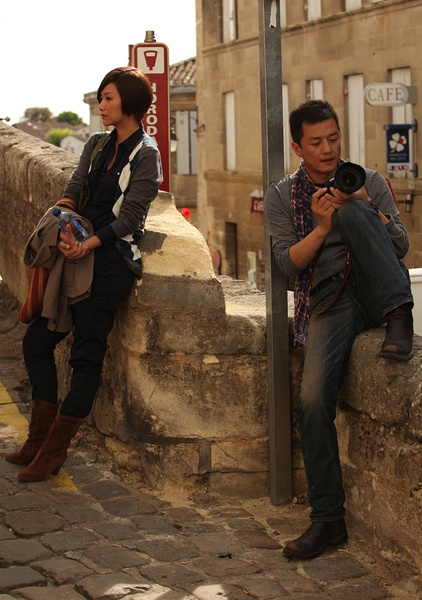

# 平行宇宙的悲欢——《将爱》影评

**——有些男人会守承诺的，会说话算话，会吐个吐沫也是个钉子。还有，说给你听原来是一个这么美的动作，因为你的存在，我在记录，我在和你分享，我的生活有一部分不再只是我一个人的经历，即使这段时间我不在你的身边，但是我经历的美丽感动，想要都说给你听，即使不能带你走。** ibeidou.org ibeidou.org

# 平行宇宙的悲欢——《将爱》影评

ibeidou.org

## 文 / 重光（北斗撰稿人）

ibeidou.org ibeidou.org 看完《将爱》已经过了2天，有些当时新鲜的感觉和触动已经变得迟钝，所以我只能尽快在遗忘之前把心里的想法一股脑倒出来，所以简单的说，这不是一部严格的影评，《将爱》也不是很好的电影，我只是有些话要说。 将爱分成了三个故事，讲述着三个平行宇宙的悲欢，分别是北京、上海和波尔多。 ibeidou.org

#### 第一幕 北京·话剧·重新发现

李亚鹏的胡渣、西装、徐静蕾的黑丝、刻意和日常生活保持距离感的台词和布景，各种夸张的色调和艺术手法提醒着我这是一个波普艺术的尝试，两个本是夫妻关系却互相用望远镜窥望的灵魂，这其实是一个辛辣的暗喻。 这个故事最后温馨终结，影院里绷紧的呼吸也放下了大半，我总觉得有种戏谑感，两个曾经相爱的人，必须要互相疏离，用望远镜和摄像头记录下来，才能真正的“重新发现”对方，我们对于自己心爱之人寄予的各种幻想和期许，我们从爱情中收获的各种失望和焦灼，一层层的构成心上的茧，说不清自己爱的是对方，还是爱对方身上所折射的自己和所共同度过的生活。 ibeidou.org

ibeidou.org 第一幕结局是完美收场了，在感人的音乐里，在无数大屏幕放映的回忆中，构建了完美结局，那一抱宣告了《将爱情进行到底》里纯情爱恋和中年现实握手言和的可能性，也不失为一种完美的进行到底。只是我咂吧回味起来总觉得不太对劲，我们的生活里是没有上帝视角的——没有望远镜，也没有摄像机。 ibeidou.org

#### 第二幕 上海·纪实文学·冰冷的现实

一次同学会，两个婚姻不幸的人，千种滋味涌上心头，正如一开始同学会所说：“为我们最平淡最无耻的现在干一杯。” 导演的手法很简单，把这种美好过往与残酷现实之间赤裸裸对比出来，有价值的东西毁灭掉。大步走入冰冷的生活。 像杨峥文慧这样充满深刻回忆而又现实失意的两个人，一相会是注定要产生些什么的，既然不能面对过去那个自己，那么就亲手给那些牵扯作痛的回忆一个痛快的交代。尤其是文慧在类似情境下那两句台词的奇妙对应，“我喜欢你”和“跟我回家吧”，涵盖了所有的沧桑和成长。 生活已经千差万别，彼此之间横亘着几年的时光，可能性在凋谢，人生早已过站，那个人早已下车，平凡普通的自己是那么的无能为力，就像《大话西游》里至尊宝在取舍间再也拉不住紫霞的手。抚慰心灵已经不能够。这个夜晚，其实是一个对过去回忆的交代之夜啊！ 现实甚至吝啬的不愿给予他们痛快的一夜，可以抚慰黏膜和荷尔蒙的爱情。文慧和前夫在派出所前绝望的扑打，扑打的是那些自己和别人内心赶也赶不走的疯狂和怨恨，那些噩梦般的现实，那些自我的渺小。扑打的是结构性坍塌的自己，在曾经爱过的人面前坍塌到尘埃里。费劲了全身的力气也赶不上这坍塌的速度啊。 最后的机场，拦飞机的文慧，好样的文慧，请你带着这12年的时光，吻下去。 ——这样的话，至少可以笑着离开了吧，过去的回忆，我已经无愧的给了一个交代，不想让你带着我披头散发的不堪样子回到自己的生活。也麻烦你，带着我最好的样子离开。 ibeidou.org

#### 第三幕 波尔多·油画·带不走

剧情不说，简陋的四人行故事。 ibeidou.org

ibeidou.org 唯一想说的就是杨峥站在海里的背影和高高举起的却空着右手，仿佛是一个朝圣爱的愚蠢信徒，虔诚的祷告一句真言：“文慧，你听” 这个桥段还是结实了感动了我。海所代表的非常态的生活和超脱世俗的力量，即使我没有超人的能力带你离开伤害和世俗的生活，但是我可以把海送到你的身边。站在大西洋里，空挚着右手，想要把海浪的怒吼打给你听，这行为也许傻逼透了，但是坚守承诺的偏执狂，只忠于内心的诺言，又哪里会在乎这行为在别人眼里傻不傻逼呢？ ——有些男人会守承诺的，会说话算话，会吐个吐沫也是个钉子。还有，说给你听原来是一个这么美的动作，因为你的存在，我在记录，我在和你分享，我的生活有一部分不再只是我一个人的经历，即使这段时间我不在你的身边，但是我经历的美丽感动，想要都说给你听，即使不能带你走。 ibeidou.org 注：正标题为编者所拟。 ibeidou.org ibeidou.org

（采编：黄理罡 编辑：黄理罡）

ibeidou.org ibeidou.org
