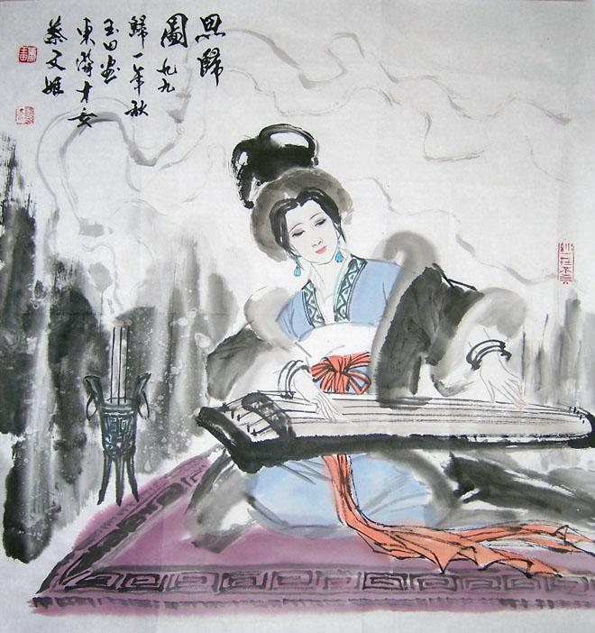
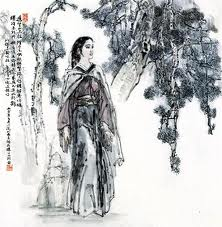
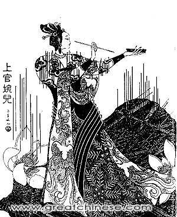
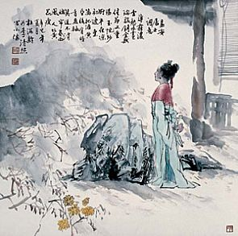

# 年年芳物尽，来别败兰荪

** “这些我们熟知的才女与另一些我们熟知的男人一同叙写了历史，一同存在于中华文明之中。也许这写算不上巾帼，没有功勋，甚至在男人的后面没有名分。然而大江大海之后，这剩下的不多才女，她们的韶光，她们的悲喜，一同成为了墨客的谈资。” **

### 

### 

# 年年芳物尽，来别败兰荪

## 文/吴科

### 

### (一)

要讲的第一位才女，就是蔡文姬。蔡文姬是当时的文化巨擘蔡邕之女，名琰。 蔡文姬同时代的“枭雄”曹操所敬重的人不多，而女性就更是凤毛麟角，但蔡文姬，就是其中之一。由于良好家庭教育和父亲经年累月熏陶的关系，再加上蔡文姬的天生聪颖，使得蔡文姬“博学有才辩，又妙于音律。”唐朝李贤太子引刘昭《幼童传》的注则令人咋舌：蔡邕夜里鼓琴，突然一根弦断了，此时年纪尚小的蔡文姬在隔壁突然说：“第二弦。”蔡邕不太敢相信，认为是女儿偶然得之（偶得之耳）。于是又故意弄断断一弦，蔡文姬又说：“第四弦。”果然并无差谬。 

### 

 待到蔡文姬过得及笄之年，蔡文姬便嫁给了河东的卫仲道。可惜丈夫早亡，而蔡文姬此时尚无子嗣，于是便单人回到了老家。此时尚是东汉，还没有兴起那些女人守节或所谓的“守妇道”之说，此时的蔡文姬又开始了在家吟诗抚琴的生活。然而突然间，天下丧乱，“汉季失权柄，董卓乱天常。志欲图篡弑，先害诸贤良。”董卓带着他的西凉大军杀进洛阳，烧杀抢掠无恶不作，颠沛流离中的蔡文姬被胡人所虏获，“马边悬男头，马后载妇女，长驱入朔漠，回路险且阻”，孤独无靠的她只好嫁给了南匈奴左贤王，在胡地呆了整整十二年，期间她生下了两个儿子。也许蔡文姬自己心里都已经做好了在此地长久活下去的准备，此时的她也许只有“感时念父母，哀叹无穷已”的嗟叹了。而此时，蔡文姬的大恩人出现了：由于同样具有八斗之才的曹操素来与蔡邕交好，同时曹操十分不愿见到蔡邕无后嗣，于是便派遣使者用珍贵的器物把蔡文姬赎了回来。此时的蔡文姬选择了回到故土，而没有留在“边荒与华异，人俗少义理”的胡地，哪怕那里还有她两个孩子。回到中原后，她重新出嫁，嫁给了屯田都尉董祀。 想来二人的婚后生活是十分惬意的，不过命运弄人，董祀突然犯了法，按律当死。此时的蔡文姬自然又想起了曹操，于是她火速去找曹操求情。蔡文姬此时披散着头发，光着脚，给曹操及百官连连下跪口头，言词酸哀。曹操及百官见状心里不忍，于是曹操问道：“我确实难过，可惜令状已经发出去了，奈何！”蔡文姬赶忙答道：“大王您有厩马万匹，虎士成林，那又何惜快马一骑，去解救不济垂死的性命啊！”就这样，铁石心肠的曹操被感动，蔡文姬的丈夫也得救了。而曹操见到蔡文姬如此凄凉的装扮，还赠送了蔡文姬头巾和鞋袜。 之后蔡文姬当然也给了曹操丰厚的回报：董卓带来的大火不仅让洛阳一片火海，同时而至的，也是大量文章书籍的损毁，曹操对此一直挂念在心，于是问蔡文姬： ——听说先父家中曾经珍藏许多珍贵的文章典籍，可惜都损毁了，你是否还能记得其中的内容啊？ ——先父曾经有四千余卷书，可惜兵燹爝火之下，几乎没剩下多少了。我现在能记得的，大概还有四百多篇吧。 ——那我就给你派一些人，来帮助你完成恢复这些文章典籍的任务吧。 ——贱妾听说男女有别，礼不亲授。乞给纸笔，真草唯命。 于是蔡文姬凭着记忆写出了四百多篇，亲自誊抄给了曹操，这自然让曹丞相十分欣喜。 之后便波澜不惊，蔡文姬依然作诗，抚琴，和文人讨论书法，还和董祀有了一对儿儿女。 “区明风烈，昭我管彤。”如此看来，蔡文姬一生大部分时间的生活还是很得意的，也许苦的是在胡地的12年时间，不过，没有这12年，也许就没有了《胡笳十八拍》和《悲愤诗》这样的传世之作了。如是，对于我们这些后人，对于蔡文姬，也不知那是福是祸了。 

### 

### （二）

三字经里有这样的句子：蔡文姬 能辨琴 谢道韫 能咏吟 彼女子 且聪敏 尔男子 当自警。 这句的意思很明显，你看看蔡文姬和谢道韫两位大才女，多了不得啊！你们这些男子可要好好努力了，可别让这些女子比下去。宋朝的作者显然对女性有着歧视的意味。确实，至宋以降，便开始流行着“女子无才便是德”的说法。然而，蔡文姬生活在汉朝，而谢道韫生活在东晋，都是世风开放的时代。否则魏晋南北朝怎么会产生嵇康刘伶阮籍这些让今人视为神仙般的人物呢！ 而谢道韫，就生活在竹林七贤所推崇的风气的时代。他的丈夫，就是大书法家王羲之之子王凝之，而她的父亲，则是安西将军谢奕。 谢道韫小的时候就被认为“聪识有才辩”。她的叔父谢安曾经问她：“《毛诗》何句最佳？”谢道韫称：“‘吉甫作颂，穆如清风。仲山甫永怀，以慰其心’此句。”谢安高兴，称她有雅人深致。而后朝《世说新语》曾记载这样的一件事儿：谢家家人聚会，半酣突然空中飘起了雪花，谢安兴致大起，便问列座后代：你们看这些雪花洋洋洒洒的，像什么啊（何所似也）？谢安的儿子便回答：“散盐空中差可拟。”谢道韫马上道：“未若柳絮因风起。”谢安大悦。只这一句诗，便可看出兄妹两人的才情对比，有霄壤之别。 

 后来谢道韫便嫁给了前面提到的王凝之，算是门当户对，而后世刘禹锡更是有传世佳句“旧时王谢堂前燕，飞入寻常百姓家”堪证。 可惜谢道韫的婚后生活并不幸福，婚后谢道韫回娘家，谢安问她：王凝之是王羲之的儿子，那么有才华，你嫁给他，怎么还闷闷不乐啊？于是谢道韫说道：无论是我家的这些男子，还是凝之的父亲兄弟，有这么多的才子在旁边，凝之和他们相比——不意天壤之中乃有王郎！ 不过谢道韫嫁给王家还是有许多小得意的，小叔子王献之经常往家里邀请名人，文化巨匠，这些顶级辩论手便在王家展开唇枪舌战，内容就是天文地理实事人文，无所不包，谢道韫就在帘后听他们辩论。而每当王献之理屈词穷，再也辩不出时，谢道韫便遣小婢送给小叔子一张纸条，里面写着“欲为小郎解围”。接着便在帘后侃侃而谈，人皆不能辩，于是都暗暗称奇。 然而，世道变幻，孙恩的“五斗米教”做大，并最终发动了叛乱，战乱中谢道韫的丈夫儿子都不幸罹难。谢道韫擦干了眼泪，组织起娘子军，开始出逃。然而毕竟寡不敌众，在谢道韫自己手刃数人后，也只能无奈束手就擒。而在素称毒虐的孙恩面前，谢道韫不愠不卑不亢不慌，慷慨陈词，语如珠玑，反而使得孙恩不知如何下手，无奈只得放了谢道韫，同时还有她的外孙子刘涛。 之后谢道韫就开始嫠居在会稽，会稽太守刘柳是一个雅量人物，于是便专程登门拜访谢道韫。而谢道韫也听过刘柳的雅名，于是她不施粉黛，坦然与太守刘柳相见。谢道韫与刘太守款款而谈，哀而不伤，而刘太守恭敬地回应。于是刘柳暗自长叹：“实顷所未见，瞻察言气，使人心形俱服。”而同样惺惺相惜的谢道韫也说道：“自从我亲人都不幸离我而去，我就一直郁郁，直到遇见此士，听其所问，我的心胸才算重新开阔了起来。” 也许只有在东晋那样的朝代，才能出得了像谢道韫这样的奇女子，正如云游到谢道韫家的济尼所说的那样：王夫人神情散朗，故有林下风气。——诚如是也。 

### 

### （三）

我国历史上有一位著名的女皇帝武则天，然而，在她治下，还有着一位虽无丞相之名，却行丞相之实的女人上官婉儿。 上官婉儿的祖父上官仪是唐朝名臣，后来由于触犯圣怒，被判处了忤逆罪，同时家人也受到了牵连，上官婉儿的母亲郑氏便以罪犯之身在后宫劳作。而《唐书》中记载着这样一件事情：郑氏怀孕的时候，曾经做了一个梦，梦到有巨大的神仙给她送来了一杆大秤，并说将来要用它来称量天下。此时尚是带罪自身的郑氏怎么也不敢去往这方面想，在上官婉儿刚刚满月的时候，郑氏开玩笑的说：哎，将来称量天下的会是你这么个小不点儿么？ 不过此种谶语在史书中并不少见，史书中经常会记载某某些帝王的母亲的一些奇怪遭遇，也许是史官为圣人立天命所为也不可，或许是冥冥之中真的天意？ 

### 

 然而，事实上是：上官婉儿的才能很小便开始展露，她“天性韶警，善文章”，才十四岁，便得到了武后的召见。这时候的上官婉儿便开始了在武则天身边工作。待到上官婉儿19岁，更是开始替武则天批阅奏章，处理国是，俨然武则天已经焦不离孟了。即使上官婉儿犯了“忤逆”这样的罪过，武则天也仅仅是给了她一个刺面毁容的黥刑而没有杀她。 也许武则天在朝堂上看到上官婉儿的时候，也会不自禁地产生错觉，以为眼前这个是自己的亲生女儿，要不然，两个人怎么会这么像呢？无论是心思，还是行事的手段—— 可惜她不是，而太平公主才是，宫廷，后宫，争宠，淫乱，明争，暗斗，杀人，挑拨…… 当这一系列的词汇汇合在一起时，就是再好的科幻小说家也不能想象得尽然，可是它却真真切切地发生在唐朝宫廷，武三思，崔湜，太平公主…… 恕我没有如花妙笔把这一系列复杂斗争描绘透彻，只能描绘一下其最终结果是：武则天去世不久，上官婉儿便被李隆基所杀。 上官婉儿在宫廷斗争中的真实想法？也许没人能知道，不过“岁岁年年常扈驿，长长久久乐承平。”这样祥和的诗句却是上官婉儿的作品，也许她自己心中早就厌倦了宫廷杀戮，她那么做，也许只是一种无奈。 史书中对她的作品评价是：采丽益新。而后世学者对她的诗文评价是：创作一洗江左萎靡之风，力革南朝以来四六骈俪的章法，挣脱六朝余风，使文风为之大变。与其说开古文复兴气运的是韩愈、柳宗元，无宁说是上官婉儿已经早为盛唐的文学面貌绘出了清晰的蓝图。她的诗对唐诗的辉煌发展也有极大的启导作用。 最初让我了解上官婉儿的，是女作家赵孜所著的《上官婉儿》。毕竟，懂得女儿心的还得是女儿，要不然，赵孜怎会在书中把上官婉儿的心思刻画得如此细腻婉转？ 

### 

### （四）

李清照，山东济南人，她的父亲李格非曾做过朝廷官员，据说李清照的父亲就写得一首好诗词。而李清照的母亲王氏，是状元王拱辰的孙女，既出生于书香门第，当然文墨丹青也是烂熟于心。在这样家庭环境的熏陶下，就让李清照在幼年便文采斐然。李清照的父亲就曾感叹：“要是清照是个男子，想必采芹入泮得如探囊取物一般！”不过这是宋朝，女子读书也不会去考去个功名。时光荏苒她也不再是那个见有人来，便“和羞走，倚门嗅青梅”的豆蔻年华的少女了，转眼之间已是个出落得“秋水并蒂开芙蓉”的大家闺秀了。 

### 

 不久李清照出嫁了，丈夫是文士赵明诚。赵明诚酷爱金石器物，常常收集字画文物，两人情投意合，意气相投，夫妻间的感情也越来越好。 无疑，这时的李清照的一直是很愉悦的，她趁夜色驾轻舟游玩，还微酌醇醪，于是趁兴而归，只奈却“误入藕花深处”。 而平时李清照除了帮助丈夫研究金石书画，两人还切磋诗词。伊士珍的《瑯嬛记》曾记载：易安作了一首《醉花阴》的词，着明诚读罢，叹绝，于是苦思求胜，乃忘寝食三日夜，得十五阕，词中夹杂着李清照的三句，等作好了词，便示以陆德夫。德夫玩之再三，曰：只有“莫道不消魂，帘卷西风，人比黄花瘦。”三句绝佳。尽管三句都是自己妻子的，赵明诚也不以为意，两人交好如旧。 时间如白驹过隙，很快来到了靖康年，天下却发生了天大的变化：由于宋徽宗自己的穷奢极欲，在金人与各地的起义军的连番攻讦之下，北宋最终灭亡了，而徽钦二帝也成为了金人的阶下囚。不久之后南宋建立，而赵明诚的朝廷官位也被罢，于是二人顺江出游，想到北国故土，同时又想到如今的朝廷偏安于江南一隅，李清照心不能平，于是她一改往日词风，脱口诗就：生当为人杰，死亦为鬼雄；至今思项羽，不肯过江东！ 然而她的国家却像是在跟她开着玩笑，南宋政权定都杭州，一直就歌舞升平的存了下去，直到百余年后。但李清照却在不久之后，失去了他的良人，赵明诚竟意外早逝。李清照痛不欲生，可是当她看到赵明诚的书册还没有整理完，她知道，她必须活下去，她开始一卷卷地整理着这些书画字帖，这是他们夫妻俩一生的收藏。这时的李清照很少写词，纵然李清照有着世间的无限丹青手，也因为着她此时的一片无伤心而画不成。直到全部手稿完毕，李清照心里的一块大石也落了地。之后的李清照，便带着那些书稿字画出游，也许以此来冲淡她对自己丈夫的怀念吧。 “寻寻觅觅，冷冷清清，凄凄惨惨戚戚。”“这次第，怎一个愁字了得！”当年赵明诚陪同好友远游时，独自在家的李清照也仅仅是“一种相思，两处闲愁。才下眉头，却上心头。”然而此时的她，也再也不能追忆当年那些好韶光了。
