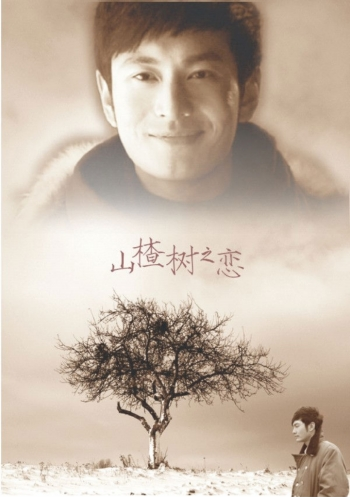

# 没有山楂树之恋，依旧可以有黄金年代

**小说中“她和任何人都格格不入。”她身上有一种真正的知识分子的气质，与那个时代甚至是现在这个时代，都存在着巨大的疏离感。当然，也是有些东西在她心深处长颤.渺渺茫茫,不定的光明。或许就是那本珍藏了许久的结婚证。陈清扬是一朵奇葩。**

### 

****

### 

### 

# 没有山楂树之恋，依旧可以有黄金年代

### 

## 文 / 林静（华侨大学）

### 

### 

据说《山楂树之恋》这部“纯爱小说”是2007的感动中国十大。在那个2007年的中国，处于一个特别需要感动的时代，常常听说什么东西感动了全中国，这部剧情老套的小说也不例外。 我看小说版的《山楂树之恋》，开始的时候觉得小说的开头轻易的爆料了作者的文笔实在一般，也没有太多引人入胜的地方。看完了小说后当然没有太大意外，看多了晋江网等其他网络小说的我，并没有对小说有太大感动或者淅淅沥沥矫情哭一场。 不知是不是巧合，那个时候我也看了另外一本描述同一时代的小说——王小波的《黄金时代》。也许是因为年代相同，所以不免联系两本书。一本让我感到有些乏味，一本却让我意犹未尽。静秋给我的印象是一种随处可见且容易被替代的年轻可爱，而陈清扬却让我觉得是一个奇女子。 同样是性压抑的时代，静秋表现的是一种性无知的可爱，陈清扬表现的是一种对那个年代的压抑爆发的可爱。我一直觉得陈清扬是奇女子，她配得上一个“奇葩”这样的词语描述她。 陈清扬的出场：她要求王二证明她不是破鞋。当王二颇具特色的逻辑的证明了她无法证明自己不是破鞋之后，陈清扬一路奇葩了下去，坦然地做了破鞋的陈清扬并没有太多的不快，反而让人感叹她的黄金时代来了。当她不是破鞋时，别人都说她是破鞋；当她真的成了破鞋时，却没有人叫她破鞋了。曾经无比介怀破鞋的身份，可是后来破鞋的身份却给陈清扬带来了巨大的快感。 而在《山楂树之恋》中，我觉得唯一不会太乏味，唯一值得撮出来的，就只是那个特殊年代可笑可怕的性无知。静秋根本没学过生理卫生课，加上她的知识分子妈妈也只能用手指划拉鼻尖来检验女儿。从无知因此无邪的静秋眼里看去，“性爱”就是隐在五里云雾中的夜叉猛兽。当然，《山楂树之恋》电影版的广告口号就是“史上最干净的爱情”。那么这“干净”又是从哪里表现呢，纵观整部电影，主要就是又这个无知表现。 我从来反对拿无知当纯情。纯情不是因为稀里糊涂搞不清什么是性行为，而是内心的纯洁和善良，以及对爱情神圣化的追求和信仰。从这个意义上说，陈清扬是纯情的。陈清扬是个理智、勇敢、独立的女人。敢爱敢做，有点反叛 。她是个知识分子，下乡经历一切颠覆了她的人生。她迷茫，在不知所措中经历了那个年代的苦楚。可是，她可以把苦到心里的痛，借着一段奇遇开成了生命中难得美丽的花。是吧，尽管她和王二的婚姻是荒诞的，可是她珍藏着那本结婚证好多年。 虽然是荒诞的，可是我相信陈清扬是在一种对现实的反叛和妥协里度过的她的黄金时代。王二自己说的，二十一岁正是自己的黄金时代，在一个异常性压抑而且毁灭人性的年代。他幸运，因为他可以尽情地和陈清扬享受着性爱这一时代奢侈品，甚至有了爱情的味道。虽然陈清扬的生命里没有一个韩剧男一号那样的高干子弟神性一般的爱他，可是遇见自由、奔放、从头到尾的混蛋气质的王二，却也让无奈的岁月里有一些显得真实的快感。 相比之下的《山楂树之恋》，那种像多拉a梦一样可以为你呼风唤雨的男主角是很少出现的。女孩子们，你相信现实生活中的男孩子和《山楂树之恋》或者众多韩剧男一号那样——多金英俊完美，不仅如此，还有若干男二号三号争抢你吗？请不要看这样的电视剧电影看傻了，当你的爱情观念被活生生地抬到天上的时候，和那些梦幻的多金男子相比，身边本来挺好的男孩子们在你眼里都变得不堪一击。并且还会有后遗症，你们会懦弱的做着梦,对一切要求完美和公平,然后只会不尽的失望。你对爱你的人要求爱,无私,多金,浪漫或忠诚,以及其他附加的优点。这样子的爱是糅杂着神性的爱。要明白，这个世界不是注定要有不相干的人来爱你的世界。 

 可是，这种迷恋山楂树向往静秋的女孩子毕竟还是多数，要不然山楂树也不会红。会去深悟陈清扬的女孩很少，陈清扬一直是孤独的。是吧，那个陈清扬是个异常孤独的人，即使是与如此亲密的有着“伟大友谊”的王二也未必懂得她内心深处的孤独与落寞，他们之间有一个漫长的距离隔着，他们最终没有在一起，分别了二十多年后遇见，也没有大团圆的结局。陈清扬至始至终都被无限的孤独包围着。小说中“她和任何人都格格不入。”她身上有一种真正的知识分子的气质，与那个时代甚至是现在这个时代，都存在着巨大的疏离感。当然，也是有些东西在她心深处长颤.渺渺茫茫,不定的光明。或许就是那本珍藏了许久的结婚证。陈清扬是一朵奇葩。 如果注定我们的生命里没有韩剧男一号，那么我希望在面对这个操蛋的世界，依然可以开出一朵花，像陈清扬一样孤独的美丽的开放着。她美丽，她坚强，她被所有人嘲笑、不屑、鄙视，对这个颠倒的世界也尝试反抗。她说的话，她的行为带着对无情世界的冷漠、不屑和真诚。她在她的交待材料中承认是破鞋，她不修改不畏惧这个现实。我一直坚信这是她对社会的反抗，对自我和爱情的真诚。 虽然说她对王二的情感在那个扭曲的年代，不是唯美的由爱到性，而是由性到爱，可是仍然是纯粹的毫无目的发自内心的纯爱。 如果你没有那么幸运的拥有山楂树之恋一样的梦幻感情，那么，你依旧还是可以拥有一个属于你的黄金时代。当然这取决你自己，是否有陈清扬那样的气质。 

### 

### 

（采自北斗投稿邮箱 责编：陈轩）

### 

### 
