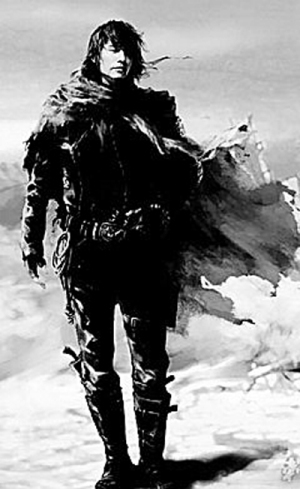

# 纪念周杰伦君——评《刺陵》

**“真的电影爱好者，敢于直面粗制滥造的影片，敢于正视自己偶像的拙劣演技。这是怎样的哀痛者和幸福者？然而造化又常常为庸人设计，以飘红的票房收入来洗涤万千骂名，仅留下观影者空空如也的钱包和微漠的悲哀。在这空空如也的钱包和微漠的悲哀中，又给电影人暂得偷生，维持这苟延残喘的电影市场。我不知道这样的电影市场何时是一个尽头！”**

### 

### 

# 纪念周杰伦君——评《刺陵》

### 

## 文/郭钦（长江大学）

### 

### 

开头的话：此文完全抄袭鲁迅先生名作《纪念刘和珍君》 。 一 公元二零一零年二月九日，就是《刺陵》上映后的两个月，我独自在豆瓣上徘徊，遇见一熟人，向我问道：“同学可曾为《刺陵》写了一点什么没有？”我说“没有”。他就正告我，“同学还是写一点罢；周杰伦在出演《刺陵》前还是很受称赞的。” 这是我知道的，凡是我所听的歌手，大概是因为现在流行音乐日渐衰落之故罢，好听者一向就甚为寥落，然而在这样的市场艰难中，唱片销量飘红的就有他。我也早觉得有写一点东西的必要了，这虽然于明星毫不相干，但在普通粉丝，却大抵只能如此而已。倘使我能相信真有所谓“心有灵犀”，那自然可以得到更大的安慰，让他听到粉丝的呼声，——但是，现在，却只能如此而已。 可是我实在无话可说。我只觉得所看的并非电影。长达110多分钟的影片，冲击着我的眼球，使我难于呼吸视听，那里还能有什么言语？长歌当哭，是必须在观影之后的。而此后几个所谓影评人的交口评论，尤使我觉得悲哀。我已经出离愤怒了。我将身为这烂片的低劣水准；以我最大的哀痛显示于豆瓣影评，使那些一直不喜欢周杰伦的人快意于我的苦痛，就将这作为周杰伦人气衰落的祭品，奉献于豆瓣的“周杰伦小组”。 

 二 真的电影爱好者，敢于直面粗制滥造的影片，敢于正视自己偶像的拙劣演技。这是怎样的哀痛者和幸福者？然而造化又常常为庸人设计，以飘红的票房收入来洗涤万千骂名，仅留下观影者空空如也的钱包和微漠的悲哀。在这空空如也的钱包和微漠的悲哀中，又给电影人暂得偷生，维持这苟延残喘的电影市场。我不知道这样的电影市场何时是一个尽头！ 我们还在这样的市场上做出观影选择；我也早觉得有写一点东西的必要了。离电影上映时间也已有两个月了，忘却的救主快要降临了罢，我正有写一点东西的必要了。 三 在四名主演中，周杰伦是我的偶像。偶像云者，我向来这样想，这样说，现在却觉得有些踌躇了，我应该对他奉献我的不屑和鄙视。他不是“还有一些观影底线的我”的偶像，是为了拍电影的“烂片王”。 他的第一部烂片为我所见，是我做高中学生时的《满城尽带黄金甲》，几个腕儿比较大的明星，其中的一个就是他；但当时我没看。直到后来，也许网上已经是板砖横飞、恶评如潮之时了，才有人告诉我：“这就是周杰伦拍的电影的水平。”其时我才能将他与该片实体联合起来，心中却暗自诧异。我平素想，能够不仅为音乐所限，涉及电影的歌星，无论如何，总该是有些演技的，但他却常常不能融入角色，演技很不娴熟。待到《满城尽带黄金甲》杀青上映后，他才始来忙他的音乐，于是我对他的不满和失望就渐渐多了，却也还是继续拍着电影。待到唱片市场日渐低靡，往日的粉丝对他的音乐日渐失望，流失不少，我才见他虑及音乐事业，黯然至于泣下。此后听他的歌就少了。总之，在我的记忆上，曾经那个“R&B”音乐天才是永别了。 四 我在去年十月，才知道周杰伦在拍《刺陵》，随后便得到噩耗，说是朱延平导演，网罗了不少明星，而我不喜欢的林志玲即在此列。但我对于这些传说，竟至于颇为怀疑。我向来是不惮以最坏的恶意来推测中国电影人的，然而我还不料，也不信朱延平竟会厚着脸皮又来拍片。况且，始终高人气的“R&B”音乐奇才周杰伦，更何至于无端被观众所指责呢？ 然而后来证明是事实了，作证便是他自己在荧幕上的表现了。还有一位明星，是陈道明。而且又证明这不但是水准低劣之作，而且是少有的烂片。因为少有影片把二位高人气明星毁得如此彻底。 但朱延平导演就有豪言壮语，说《刺陵》是一部大片，票房瞄准4亿。 但接着又评论说，导演只是把周杰伦当作票房筹码。 惨象，已是我目不忍视了；评论，尤使我耳不忍闻。我还有什么话可说呢？我懂得中国电影缺乏诚意之作的缘由了。扯淡呵，扯淡呵！不在扯淡中灭亡，就在扯淡中灭亡。 五 但是，我还有要说的话。 我没有亲见；听说他，周杰伦君，那时拍电影是很愉快的。自然，拍电影而已，稍宽容者，谁也不会得理不饶人，口诛笔伐。但竟拍出远远超过观众承受程度的电影，已是致命的创伤，只是还没有完全被市场踢出去。同一参演的陈道明，本来是帮一个朋友的忙（他曾在采访中解释他出演该片的理由），却也被殃及。但他还能凭借长期积累的资本，享受微薄的赞誉。 始终被称为“音乐天才”的周杰伦确是被毁掉了，这是真的，有他参演的《刺陵》为证。曾经饱受赞誉的陈道明也被毁掉了，有他参演《刺陵》为证；只有凭借姣好面容、妖娆身材的林志玲使电影有了一点看点。当他们从容辗转于朱延平电影中的时候，这需要怎样超乎常人的勇气呵。周杰伦的极高人气，陈道明的精湛演技全被朱延平的《刺陵》抹杀了。 

 但是导演朱延平居然说要做亚洲少有的探险片，同档期的对手只有《十月围城》、《三枪拍案惊奇》，却不知道自己已被广大影迷所唾弃。 六 时间永是流逝，中国电影市场依旧青黄不接，有限的几个烂片，在中国是不算什么的，至多，不过供无恶意的闲人以饭后的谈资，或者给其他的电影人以宽慰——再差也有人垫底了。至于此外的深的意义，我总觉得很寥寥，因为这只是众多低劣之作之一。电影的拍摄上映，正如煤的形成，当时用大量的木材（摆足了大阵势），结果却是一小块（相去甚远），但真正优秀之作是不在其中的。 然而既有了如此的恶评，当然不觉要扩大。至少，也浸渍了亲族、经纪公司、粉丝的心，纵使时光流逝，洗成过往，也会在微漠的悲哀中永存他不务正业的记忆。陶潜说过：“亲戚或余悲，他人亦已歌，死去何所道，托体同山阿。”倘能如此，这也就够了。 七 我已说过：我向来是不惮以最坏的恶意来推测中国电影人。但这回却很有几点出于我的意外。一是朱延平生命不止，烂片不休，二是周杰伦如此不务正业，非要赶这趟浑水。 我目睹周杰伦的走红，是始于初中，虽然在当时并非主流，但看他别具一格的音乐风格，天马行空的歌词，吐字不清的唱法，曾经屡次为之感叹。至于这一回参演《刺陵》，虽享受了拍电影的乐趣（他曾说很喜欢拍电影），则使他在音乐上分了心，虽票房不错，而被封上“烂片王”的称号。倘要寻求这一部影片对于将来的意义，意义就在此罢。 后来者在虽恶评如潮而票房飘红的现象中，会依稀看见微茫的希望；真的影迷，将更奋然而前行，接受更多烂片的考验。 

### 

### 

（编辑：黄理罡 ）

### 

### 
