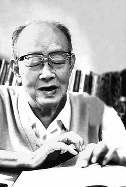
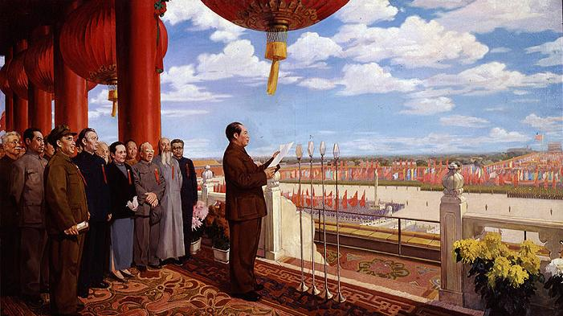
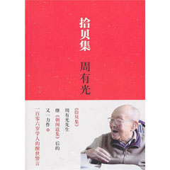

# 话说天下大势——读周有光《拾贝集》

**周老对这个问题的论述堪称经典，“原来两国都在同一条马路上开车，各有各的交通规则（多极化），法国采取‘民主’规则，德国采取‘专制’规则，结果一再撞车。”现在虽然马路还是只有一条，但是“大家都遵守相同的‘民主’规则（一体化），不再撞车了。”**

### 

### 

# 话说天下大势

### 

### ——读周有光《拾贝集》

### 

## 文 / 杨津涛（天津师范大学）

### 

### 

今年2月，在联合国安理会的一次会议上，印度外长克里希纳闹了个不大不小的笑话。他当时错念葡萄牙外长的发言稿长达几分钟，还毫无察觉。有网友对此表示“理解”：作为一个78岁的老人，有点糊涂在所难免。由此看来，在大家眼中，人一旦到了“七老八十”的年纪，即使说错点或做错点什么也都是在情理之中了。那如果我告诉你，有一位106岁的老人至今非但思路清晰，甚至还出版了新书，你会不会相信呢？ 原本是经济学教授的周有光老先生，后来改行研究文字，成了“汉语拼音之父”。85岁退休回家，广泛涉猎文史领域最前沿的学术成果，随读随想，边看边记，于是先有了《百岁新稿》、《朝闻道集》，再有了今年这本《拾贝集》。在我看来，周老其实是以一个多世纪的生命历程，向读者展示着自己所窥见的“天下大势”。 

### 

### 

### 

对所谓“天下大势”，想必大家对《三国演义》开篇那句“合久必分，分久必合”的话都是耳熟能详。即使是在今天的信息化时代，这句话也仍有其价值。一战的时候法国与德国就是冤家对头，到了二战依旧势不两立，然而战后却能在欧共体（欧盟）的框架下开展广泛合作，其原因何在？周老对这个问题的论述堪称经典，“原来两国都在同一条马路上开车，各有各的交通规则（多极化），法国采取‘民主’规则，德国采取‘专制’规则，结果一再撞车。”现在虽然马路还是只有一条，但是“大家都遵守相同的‘民主’规则（一体化），不再撞车了。”六十多年来的世界历史，也很好地验证了西方政治学界所提出的“民主和平论”——民主国家间几乎是不会发生战争的。 周老在《拾贝集》中对“民主”有很多精彩的诠释。在他看来，“民主是人类的经验积累”，既与种族无关，又和阶级无涉。人类政权总会遵循“从神权到军权到民权”的演进路线，使“全世界的国家都在这条路线上竞赛”。 毫无疑问，此种竞赛的规则与目标就是周老眼中的“天下大势”。 中国、美国和苏联是周老最为关注的三个国家。他在书中讲了一则故事，说克林顿去参观兵马俑，一名中国青年对他说：“你领导美国。”克林顿随即纠正道：“错了，不是我领导美国，是美国人民领导我。”我不知道这个故事的真实性有几分，但已足见周老对美国民主的推崇。与此同时，周老在《拾贝集》中还摘录了很多有关苏联的札记，凡政治极权、计划经济、文化禁锢全无所不包，其中涉及“大清洗”的资料尤其详尽，如“历史记录的累计：斯大林掌权二十五年间，死于非命的总数，下限2200万，上限6600万人”，又如“1937——1938年间，莫斯科一地，每天有上千人被枪决。”如此种种，真可谓触目惊心。 在周老出生后的第五年，中国爆发了辛亥革命，出任中华民国首任临时大总统的孙中山曾有一句名言，“世界潮流，浩浩荡荡，顺之则昌，逆之则亡。”“世界潮流”也就是“天下大势”，当年苏联逆潮流而动，所以最终不免分崩离析的命运。 

### 

### 

### 

三个国家中，中国是祖国，美国是成功榜样，苏联则是前车之鉴。周老无论是赞扬美国，还是反思苏联，其实都是在试图为中国寻求一条未来可行的路径。当然，这条道路必须要能顺应“天下大势”。试想，如果不是中国在上世纪八十年代顺应世界大潮，放弃计划经济、实行市场经济，那就断然不会有今天仅次于美国的GDP。所以周老对马克思的经典理论提出了质疑，“资本家不是只剥削，不生产价值。资本家有三种功能：创业功能、管理功能和发明功能。”“马克思（1818—1883）去世太早……他没有看到资本主义的全貌，因此《资本论》只可能是哲学推理，不可能是科学实证。” 如周老所说，今天的中国已从“天下中心”变成了“世界一员”。从前的竞赛规则由天朝一言而定，如今中国作为地球村的一个普通成员，就必须要在世界各国共同制定的规则下求发展。既然民主是“天下大势”，那中国也不能置身其外。针对国内一些学者对民主的审慎态度，周老曾对记者说，“从专制到民主是历史发展的必然，不是某个国家要不要的问题。有一位清华大学的教授讲，民主不适合中国的国情。其实，要改的是国情，不是民主。”这可谓是一语中的。 《拾贝集》继承了《朝闻道集》的思想风格，“兼有俯瞰全球的文化视野，百科全书式的知识背景，语言大师的清通文字，历史老人的清明睿智，现代公民的社会关怀，知识分子的批判精神。”听一位世纪老人话说天下大势，正是“言则启智，善莫大焉”。 

### 

### 

### 【注】

《拾贝集》，周有光，世界图书出版公司，2011年3月 

### 

### 

（采编：刘晓南 责编：乔淼）

### 

### 
