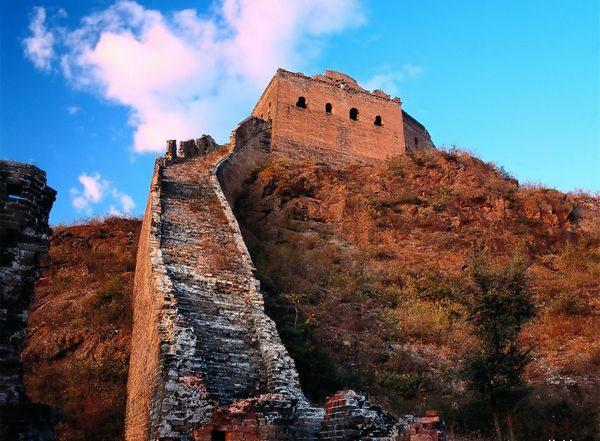
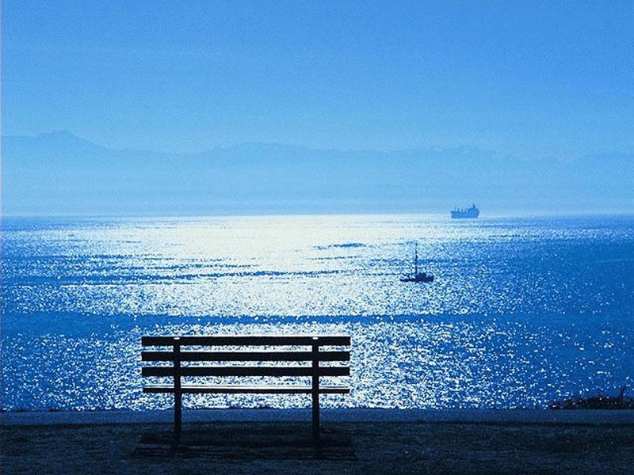

# 这年代谁还写诗

**我喜欢那种不加矫饰的诗歌，就如刚出世的婴儿般赤裸而高贵。北岛的诗过于宽广，顾城的诗又太过狭窄，似乎只有海子的诗歌处在一个恰当的位置，不高不低，不偏不倚。在北京呆久了“京骂”时不时脱口而出，其实如果这短暂的喷薄你能赋予它延续性便会是首不错的诗。例：傻逼，傻逼是什么，傻逼是我，是你，同样也是这世界。一个纪录片片段里三个在北京漂泊的年轻人在一起买醉。其中一个拿起一首他自创的诗用很深沉的语调念给另两个听，有意思的是每句诗的结尾都是“他妈的，北京”其实，诗歌未必就是用一种深沉的调子念的，可以是喊出来，骂出来的，我们的教育僵化了它的概念，这恰恰也是为什么我们都不写诗了。**

### 

### 

# 这年代谁还写诗

### 

## 文 / 孙习涵（北京体育大学）

### 

### 

海子的祭日同一天也是地球一小时，这冥冥之中有某种联系。在我们被社会的飞轮碾带着向前时，终有一个黑暗的一小时让你去找寻自我，一如海子在混沌中且行且歌。在这样一个年代，也唯有祭日能让那些历史中随风飘逝的灵魂得以望归，否则一年到头有几人能在某个不经意的时刻将他们想起？ 从高一与之相识相知至今已逾四年，我始终不愿也不敢写写关于他的东西，只是因为我之于他的情绪已超越文字的藩篱，似乎稍稍的表述都会让这种油膜似的感觉破散。然而似乎又真是到了不得不写的地步，因为年龄不允许等待，时间亦不允许等待。 前日会一个爱写诗的朋友。他已经好久没出一首完整的诗了，不是没有思路，就是半途而止。他想尝试着将自己的文风提升一个“境界”，我知道一个刻意想改变的人是写不出好诗歌的。他曾经如岩浆喷涌般地想过许多女孩，如今心如止水，当然“心如止水”亦不是写诗的境界。我突然问他，为什么有些人写诗，有些人不写诗，我们最开始到底怎么想到写诗？他说诗不过是最纯正的表达，平时唱歌或是呐喊用诗歌很直白。我读他以前的诗一度落泪，没有匠心独具的句式，没有唯美的韵脚，就这样直接，质朴地袒露，似阳光下的一片麦田，其实海子也无非如此。“姐姐，今夜我不关心人类，我只想你。”这句《德令哈》里的句子可以替代我对他的全部记忆。诗，属于家园，属于全人类。 有人说地球一小时纯粹是形式主义。当然说这话的人此刻可能此刻正在享受着内心寂寞的侵蚀。什么都是形式，什么都是无聊，他鄙夷着世间的存在和规则，也在鄙夷中找不到自己的存在。没有诗歌，不是因为这种形式已经过时，而是因为人们不再能耐心审视自己的内心，寻找世间的大美。诗迸发于单纯的时代，成熟于矛盾的时代，我不愿再添一句：衰落于开放的年代。你习惯了有事没事从兜里掏出手机，习惯在日光灯下静静地宅。你习惯了与社会和解。那日遇见城管大队风卷残云一般将小贩的三轮车堆上卡车。被“相中”的小贩束手站在路边，一脸屑笑。路人则多数视若无物。难道他们早已习惯了这社会的脾性，甘愿被其吞咽？可笑的是，人们却在网络理想国中腾云驾雾，翻江倒海，难道诗歌亦只是成了电脑屏幕前做久了排泄出的产物？ 我喜欢那种不加矫饰的诗歌，就如刚出世的婴儿般赤裸而高贵。北岛的诗过于宽广，顾城的诗又太过狭窄，似乎只有海子的诗歌处在一个恰当的位置，不高不低，不偏不倚。在北京呆久了“京骂”时不时脱口而出，其实如果这短暂的喷薄你能赋予它延续性便会是首不错的诗。例：傻逼，傻逼是什么，傻逼是我，是你，同样也是这世界。一个纪录片片段里三个在北京漂泊的年轻人在一起买醉。其中一个拿起一首他自创的诗用很深沉的语调念给另两个听，有意思的是每句诗的结尾都是“他妈的，北京”其实，诗歌未必就是用一种深沉的调子念的，可以是喊出来，骂出来的，我们的教育僵化了它的概念，这恰恰也是为什么我们都不写诗了。 现在大学里爱情的表白都很直接，要是以前还有很大的可能赐一首情诗。这是一种可爱的行为，也是一种负责任的行为，这证明你可能雇佣了无数个白天去打量一张容颜，又终于用无数个夜晚连成了几个句子。而非只是一时冲动，恋爱不是为了告别寂寞，不是面子工程，而是对自己灵魂的承诺，历史证明，写情书写出来的爱情能维系长久，沈从文和张兆和的姻缘不就羡煞世人？一个诗人纵是多情，他对恋上的人却是孩子般的真爱，而且并不懂得背叛。然而，现今大学校园里，谁还会看上一个诗人？ 今天可能借海子说了好些事，到头来还是没着墨于他。我的身上现在有太多浮躁的东西，或许终有哪天待我完全平静了，我才具备这个资格。 

### 

### 

（采编：刘一舟 责编：刘一舟）

### 

### 
