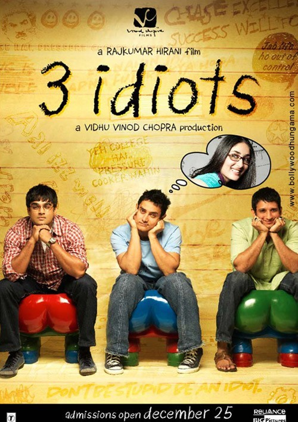
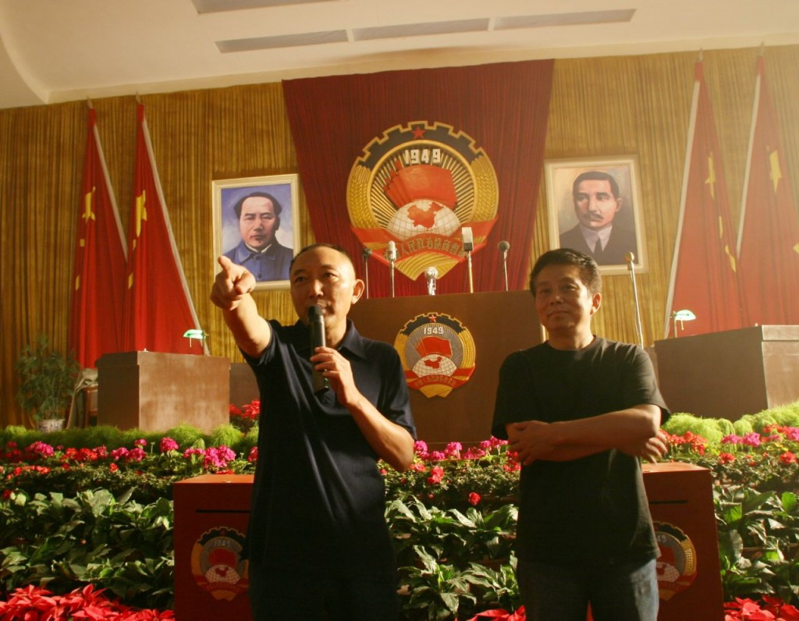

# 那些傻逼呵呵的理想主义

**有人认为活着就是要出人头地，要成功，世间的一切都是要购买的商品。有人活着做完自己梦想的事情，让这个世界更美好。这个世界正因为理想主义者的存在才那么美丽而令人敬畏。感谢那些理想主义者，感谢约翰·列侬、凯鲁亚克、马丁路德金、亨利·罗林斯、韩寒、罗永浩、连岳……这些人让我知道这个高墙筑起的世界仍有光明**

# 那些傻逼呵呵的理想主义

## 文 / 徐航 （南京财经）

昨晚看完几集辛普森一家，还不到睡觉时间，打算瞄一眼沉睡在硬盘里未看电影，看了一部据说评价很好印度片，《[3 idiots](http://www.verycd.com/search/folders/3+idiots)》，三个白痴，看名字原以为是简单的喜剧片，打算看个开头就睡觉，明晚再看，谁知看了之后便不能停下来，近3个小时片长的电影一口气看的晚上一点钟，很久没有看过这么让人激动的电影了。

### 

这部电影特别适合中国人看，因为这是一部谈理想主义的电影，众所周知，贵国人的态度大多是，“知识多钱多，就把理想买到了”，钱，是大伙儿唯一活的有劲的原因，要么贵国怎么叫PRC嘛，People‘s Republic of Capitalism。

片中的印度也是一样，在印度的大学生中，被洗脑的观念就是，人生就是一场赛跑，跑慢了就会被人干掉；要做好学生，上名牌大学拿学位，要做工程师和医生这种高收入职业；赚大钱，买房子买车子买老婆，有钱就是成功；理想能当饭吃吗，人要活的现实点……等等等等，反正就是你爸妈小时给你灌输的东西。

然后我们的主人翁闪亮登场了，他不相信这一套Crap，他觉得人生不是丫逼的赛跑，活的干嘛那么累，人应该自由地追求自己的理想；他认为学校不是用来换取文凭以作为找工作的砝码的地方，学校是真正热爱知识的人的天堂；他认为人生的价值不能用金钱衡量，人的生活不是价格标签，活着做行尸走肉有什么意思呢……当然这些理想主义想法，自然会和严酷的大学教授、一门心思发财的学生还有被世俗观念左右的家长产生冲突，他们一直认定，这个讲理想主义的家伙是个白痴，以后他肯定会活的很惨。

### 

另外两位白痴就是这哥们的室友，他们多少都被现实主义者压迫，渴望理想主义，但是因为家庭压力又害怕离开世俗的轨道，这种矛盾纠结下最终站上了理想主义者的战线。

所以说这样的电影特别适合中国，真诚，理想，有人情味，很多情节让俺看了眼前一热。我们的国家为什么没有这样的电影哪？我们只有《见过大爷》的谎言，《活着》的无力，《唐山大地震》的虚伪，以及各种大量的垃圾电影，唯独缺少的，是理想主义。看看日本、韩国、印度这三个邻国有着那么多理想主义的艺术作品，中国人应该羞进地缝儿去了。日本有足球小将之类的各种体育漫画让年轻人永远心怀梦想，而我们只有让年轻人心生幻灭的富士康十连跳和应试制度的压力。当日本足球已经达到世界水平时，我们的足球已经臭不可闻，这是能力差别吗？还不是你们从来不相信理想主义，只想着上好学校赚大钱的结果。有人会说了，日本球员踢得好有什么用，有我们山西煤老板赚的多么？如果你觉得赚不到钱就没有意义的话，那么中国可以向世界文明说再见了，这是一个野蛮人的国家，迟早会被历史淘汰。

### 

人没有梦想只能是机器，但是机器是没有情感的，人有了机器的压力却没有机器的冰冷，只能在重压下摧毁。也许有人已经活的没心没肺了，所以我们在这个国家会看到泛滥的成功学、人生职业规划讲师、唯钱是尊的价值观，二奶（这是贵国的特色，人家的情妇是为了爱情，我们国家的情妇都是为了钱）、“不要让孩子输在起跑线上”的应试教育，毫无希望的年轻人。这多么令人沮丧啊，这个国家糜烂到了灯红酒绿时，但惟独缺少理想的色彩。

贵国为了自己成为“世界工厂”而沾沾自喜时，我觉得成为人家的工厂是个很耻辱的事情。又不是人家造不出来，只是人家觉得你命贱，把这些苦力活交给你。似乎你现在能赚钱，所以你觉得理想主义者不重要了，那么就把他们赶尽杀绝吧。等着，总有一天，发达国家会把工厂外包到更加Loser的国家，那时候，中国遍地都是行尸走肉的大猩猩了。

当然我知道在这个野蛮的国家坚持理想是个很艰难的事情，1950年抱着一腔报效祖国的理想而回国的留洋知识分子，在什么都没做的情况下，被打成右派，被打成牛鬼蛇神，被发配边疆，青春的热血涂在了荒地上。野蛮的力量让你感觉在这个国家苟活着才是正道。那只能说明你还不是个理想主义者，理想主义者不是用投资回报率来计算人生的，就像韩寒说的，总有一些傻逼呵呵的世界观矗立在那里，是多少次打击，多少次鸽子都不能改变的。理想主义者不谈成功这个傻逼字眼,他们只求就着理想[做成一些事儿](http://www.zhanglixian.net/blogs/pigu6/archives/134525.aspx)，就像毛姆的《[月亮和六便士](http://www.amazon.cn/mn/detailApp/ref=sr_1_1?_encoding=UTF8&s=books&qid=1289539465&asin=B002V1HN2E&sr=8-1)》，有人抬头看见月亮，有人低下头捡起了六便士，月亮并不能用来消费，但在理想主义者眼里，生活不是成本和利润，即使是在追逐自己的噩运，当空的明月依然令人感到宇宙的宏伟。

李海鹏认为他姥姥的一个疑问堪称终极哲学命题：活着是为什么那？有人认为活着就是要出人头地，要成功，世间的一切都是要购买的商品。有人活着做完自己梦想的事情，让这个世界更美好。这个世界正因为理想主义者的存在才那么美丽而令人敬畏。感谢那些理想主义者，感谢约翰·列侬、凯鲁亚克、马丁路德金、亨利·罗林斯、韩寒、罗永浩、连岳……这些人让我知道这个高墙筑起的世界仍有光明，感谢在我有生之前，还能看到《[3个白痴](http://www.verycd.com/search/folders/3+idiots)》这样好的理想主义电影。

### 
