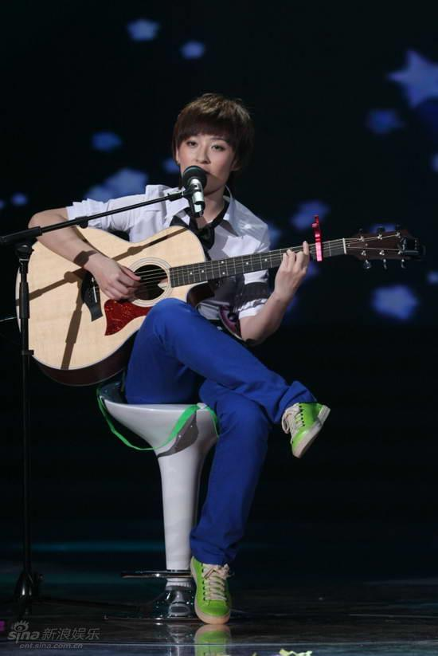
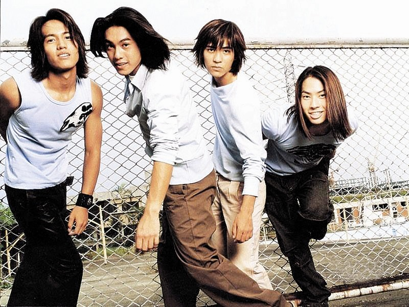
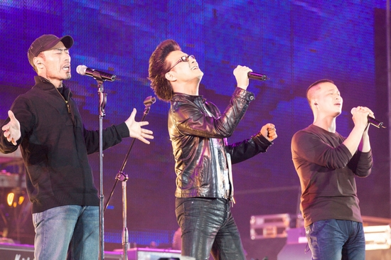

# 那些火箭般蹿升，又迅即消寂的明星们

**归根结底，这些红箭般蹿升，又迅即消寂的明星，是时代和资本共同创造，最后又被时代和资本抛弃。他们没有自己的思想，个性，才华。与披头士不同，后者是开创了时代，引领了一代人。**

### 

****

### 

### 

# 那些火箭般蹿升，又迅即消寂的明星们

### 

## 文 / 许岩（南京）

### 

### 

从什么时候起，那些梦工厂流水线制造周期越来越短，眼花缭乱到人们还没来得及品味，就迅即归于沉寂。在权力之手介入相对少的娱乐圈，资本的力量凸显出来。那些曝光的黑幕，不过是媒体柿子专拣软的捏，因为政界商界学界的黑幕并不亚于娱乐圈，但媒体不敢触碰这些背景更为复杂的圈子的生态而已。 

### 

### 

### 

这样的流星艺人们可以举出太多，新世纪以来就有从F4，沙宝亮，雪村，刀郎，04年凸起的网络歌手们等，（貌似王宝强也好久没听到信了），与并行不悖的是木子美，竹影青瞳，芙蓉姐姐，凤姐等等。这真是奇妙的现象，大概真如后现代主义所说，“娱乐至死”了。 并不是说那些表面还没有过气的明星们有着更高妙的艺术和强大的实力，实在是他们背后有强大的集团的支撑。举例来讲，小沈阳，在我看来，没有赵本山这个强大的文化垄断户各个方式的力挺，我不信他能火到今天。而赵家班的崛起同样是依靠央视春晚的舞台（即使你能举出种种例子它已不能像昨日那样垄断一切，但是文化管制这种政策本身就是有助于它的，最近春晚一个策划发泄牢骚指责骂春晚的人，我想他是找错了对象，观众的责任就是挑刺，他应该发牢骚的对象应该是文化管制部门）。 

### 

### 

### 

F4崛起于《流星花园》，这部偶像剧破绽百出矫揉造作，但不得不说，调动了人们对美好童话的向往，触动了最柔软的心灵。所以，火爆有其道理。但最终引发了文化管理部门的不满，下达了封禁令，王怡据此写出一篇美文《美的惊动了中央》。而F4据称是打造者柴智屏根据不同偏好打造的四个形象，无论你喜欢哪种形象，总有一款符合你。不得不惊叹于这套明星制造机制，经过选角—浆洗—漂白等等一系列塑造，最后明星就制造出来了。如果说权力控制一切的时代，人们的意识不由自主的被其操控，那么，在今天资本控制的娱乐圈，人们的意识，审美倾向也被其影响呢。其实，影响并不可怕，操控才可怕。最重要的还是每个自己，是否有足够的精神力量。再后来看到一条恶搞讯息：宋祖英与言承旭姐弟恋。这真是大众对政治和资本的恶讽，联想到以前的巩俐和乔丹恋爱种种，连众声喧哗的大众都是不可信的。 紧接着就是雪村凭借《翠花，上酸菜》的东北大俗腔热闹了颇有一阵，然后凭借着热捧还上了春晚舞台，演绎出一首小商贩过年的曲调，为和谐社会做出了自己的贡献。但这个尖头鼠脑之辈似乎不知所措了，在归于沉寂之后好久，大概是难耐寂寞，几年前又爆出个什么性骚扰的新闻，从众星捧月到寂寥无闻的确是很大的落差，一般人还真承受不起。所以我还深为怀疑这又是雪村大叔的一次炒作。不过过气终究过气，像临被淹死的人冒下头然后除了泛起泡沫之外在没有什么一样，雪村大叔也彻底的没有了音讯。 曾几何时，满大街的都是“暗香”和“2002年的第一场雪”的歌，还有什么“老鼠爱大米，两只蝴蝶”从北京的小酒吧卖唱开始到大红大紫的沙宝亮是各种北漂还寄托梦想的一个象征，刀郎这个名字就颇有艺术气质，网络歌曲的流行标明网络这种新技术新渠道给普通大众提供了机遇，但就像胡泳教授所说，在21世纪初的网络，还是原始丛林阶段，那么现在网络已经成为现实的投影，其金字塔的架构就对应着现实的架构。资本——网站管理者——大众。不要忘记，最大的网阀是政府。这是解读一切中国现实必须了解清楚的。在湖南卫视打造的超级女声中，其背后的资本力量为了像这个权力寡头示好，最后的决赛让决赛选手们唱起了红歌。 归根结底，这些红箭般蹿升，又迅即消寂的明星，是时代和资本共同创造，最后又被时代和资本抛弃。他们没有自己的思想，个性，才华。与披头士不同，后者是开创了时代，引领了一代人。提到这里，想起了当年南方周末那篇F4的报道，对比披头士和F4。但在搜索时，悲哀的发现，连这篇报道都找不到了，只剩下颜骏的评论，附在下面。还有王怡的《美的惊动了中央》（同名书是由去年诺和平奖得主作序） 

 （因为看到汪峰与旭日阳刚的冲突，想到旭日阳刚也有极大的可能是榨干后，迅即消寂，联想瞎写一气，感觉写的头重脚轻， ） 

### 

### 

### 【附】

1. [颜峻：不要作人身攻击，F4无罪](http://ent.163.com/edit/021122/021122_142162.html) 2. [王怡：美得惊动了中央](http://blog.tianya.cn/blogger/post_show.asp?BlogID=218076&PostID=2902826)

（编辑：陈锴）

### 

### 
