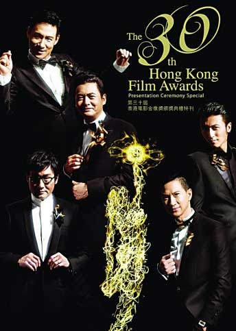
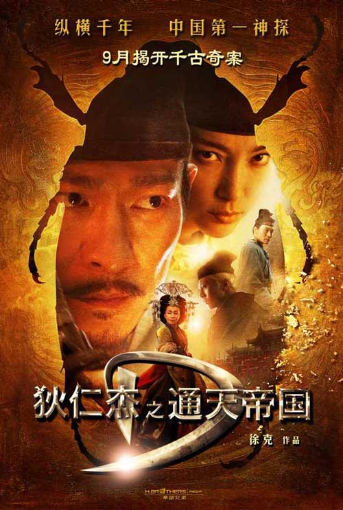

# 闲聊香港金像奖：人活着，戏死了

**纵观本届提名名单，大抵也没什么特别值得称道的新意，看来看去并无二致。理当传承的是技术甚或情感，这些行将作古的面孔仍旧代表而今的时代，真不知是福是祸。**

### 

### 

# 闲聊香港金像奖：人活着，戏死了

### 

## 文 / 苏乏

### 

### 

归总一下个人感受：香港金像奖越来越让人看不下去，即便三十而立（编者按：今年是香港电影金像奖30周年），却仅笼络《线人》《叶问2》《剑雨》几部屈指可数的野心之作，可惜叶伟信续作脱相，苏照彬借箭救市，唯有林超贤保持水准愈发凶狠。小片诚恳，大作含混，是这些年港片群像，《打擂台》莫不是最大黑马，恐怕这届奖项便无半点趣味可言。在合拍片盛行的当下，不知所谓的作品多如牛毛，香港本土的小制作自成系统，北上无缘便罕有听闻，想要一览香港电影现状，恐怕难上加难。电影生态是一个很有趣的话题，但本该令人激动的电影市场每每提及，总有一番种五迷三道自甘堕落的感慨。 “请把金像奖还给香港。” 

### 

### 

### 

这样的说法并不为过，没人愿意看到金鸡百花荼毒天下，伴随香港影业颓势渐成，自1982年开办至今金像奖几番起落，声势早已大不如前，在艰难营生中力争再现“盛事”，想来也颇为辛酸。至于一款正当而立的奖项，是否堪有独立性格的说法，似乎越来越变得无足轻重。猛然提起，竟有一点老气横秋的感觉。纵观本届提名名单，大抵也没什么特别值得称道的新意，看来看去并无二致。理当传承的是技术甚或情感，这些行将作古的面孔仍旧代表而今的时代，真不知是福是祸。 新人也非匮乏，而是作品老旧不堪。就这点来看，《打擂台》确有独到之处，无怪口碑。新老一代携手，形式上有所致敬，玩意却并不陈旧，情感共鸣拿捏得恰到好处。这样的港片在内地票房惨败实属注定，回到港岛偏又惜才入围，这等冰火二重天正应了香港金像奖的立意。文隽曾公开表示：“我已经听见很多人抱怨金像奖如何不公平，但我想告诉那些人，你们有没有了解金像奖设置的初衷？这个奖项本来就是为表彰和鼓励为香港电影事业的发展作出贡献的电影人而设立的。” 无论如何，区域性障碍的确令更多本土电影有机会入围金像奖，尤其以鼓励香港电影16项分工蓬勃发展最为突出。圈子画小些，晚辈只要努力，还是可以出头。另一方面，虽然文隽言之凿凿慨当以慷，但提名名单一经出炉便如石沉大海却是不争的事实，实在令人悲哀。与其眼睁睁看着《狄仁杰》《叶问2》之流欺负一票老幼病残弱，真乃百口莫辩。众口难调遭遇众望所归，也是宿命一种。 不知道是否有人像笔者一样，提到金像奖，第一反应仍旧是奥斯卡。虽然这两年也没那么轰动了，但学院奖的影片不仅追求荡气回肠的史诗观感，仍旧有宣告技术革命以及充斥争议与私人情结的作品，给世人呈现了与众不同外延与内涵。不敢用愈发不一样的工业背景来要求香港金像奖，只是有感于多元并存的香港好莱坞的消亡，香港电影黄金时代已不复存在，影片视角变得与仰仗基金会支持的学生作坊并无二致。 遥想当年电影撕咬得多狠，真有点不顾一切的姿态。观点犀利猛片辈出，剧本视效挖空心思，中规中矩有寻常人家的质感，剑走偏锋有桀骜不驯的喧嚣，吾辈看客无不大呼过瘾。再看而今《狄仁杰》的班底：美术设计余家安（《半生缘》《东方三侠》《辣手神探》《阿郎的故事》），艺术指导赵崇邦（《无间道》），动作指导洪金宝，导演徐克，制作人施南生（香港寰亚，徐克电影工作室，徐克的女人），编剧陈国富（《征婚启事》《双瞳》），演员不提了。这电影是个非常典型的例子，也是备受推崇的烂片，人还是那些人，怎么戏就硬是给圆滑了，哄得那么多人说好。 

### 

### 

### 

电影人绝非青黄不接，影视行业是少数迄今仍保留着学徒这种传统的圈子，只不过创作环境有够势利。电影观众绝非有眼无珠，只不过在物质极大丰富的今天，对电影没那么高的热忱，也就不那么较劲了。知足，感恩，于是影人常乐，钱如此好赚何苦太费心呢？让年轻人去奋斗吧，财富先由我们保管。打心里希望徐克这次香港金像颗粒无收，虽然基本不太可能如我所愿，但是以他现在乃至以后相当长时间的状态也就得个终身成就奖，别再蹚浑水了，他敢坦白说自己还想向电影索取的东西是什么吗？徐克脑袋怕是被门挤了，人气不是用来干耗的，一拍大腿搞个虚头巴脑的，糊弄几个亿，卷份子钱走人。偏就有些人自说自话自视过高，今天的徐克便是个中翘楚；而搞出《最强囍事》这种垃圾的黄百鸣，便早已是另一个境界了。 纵观这两年的金像奖，你会发现不止合拍片如《孔子》这种流氓电影见缝插针来捣乱，香港本土也有一伙倚老卖老的过气才俊专业贴秋膘，这种所谓电影看着看着也便乏了，追捧起来有什么意思呢？其意义便在于，踏踏实实做事情的人终敌不过金链银镯大铜佛，躲不过各种虚掷，这样的环境会催生两种人，在竞争中几经辗转生存下来的一根筋，以及心驰神往但是果断改行的少年郎，前者最好的结局是多年媳妇熬成婆，终于开窍拍了部口碑不错的作品金盆洗手，后者最好的结局是牛叉闪闪的作品虽然仅此一部，但每次都有毛头小孩有意无意得瑟起来：“有一片，比这强，估计你都没听说过。” 

### 

### 

（采编：黄理罡 责编：黄理罡）

### 

### 
