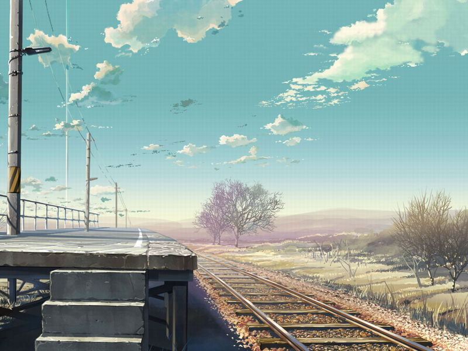

# 生活文两篇

# 寂寞考

一场接一场的大雨小雨雷阵雨，让这个城市始终包裹在温热潮湿的气氛中不能自拔。 同样不能自拔的有我生活在这个城市的朋友，A君，B君,C君,三位纷纷陷入寂寞的人。 起先是某日A君突然汇报说发现自己住的巷子里满满的那些，不是非主流，是寂寞在涌动——A君独自租住在一个靠近诸多学校的小巷中，期间家庭旅馆，各类小饭店以及无痛人流店。此巷名为许西巷，B君光顾之后称其为“许三多”：烧烤摊多，垃圾多，非主流多。 继而B君短信又来，言简意赅：“最近越相亲越寂寞啊！” 是日我们四个饭局，C君做东等待我们良久，堵车未至，C君怒，短信群发我等斥责之：“你们再不来，就只有我满腔的寂寞给你们吃了！” 当周立波在上海一笑倾城，郭德纲在北京捧哏逗乐，夹在中间的晋阳城，怎么就这么自甘寂寞了呢。 A君生活习惯极为规律，去固定的地方每日一顿饭，去固定的办公室朝九晚五的工作，沿着固定的林间小路散步回家，闲暇时候固定约我们台球，抑或一个人坐半小时的公交车去一个寺庙，将去那里的打车差价交到寺庙门口的固定的那个乞丐手中。 B君生活跟着领导走，经常睡至中午下午自然醒让我们嫉妒的牙根痒痒，又不时被领导支使得连续几日不眠不休，蹲在马桶上的时候才有空打电话给我们涕泪悲泣的声讨自己猪狗不如的压力巨大的生活，换来我们一句“你丫还有什么不开心的，一次说完让我们好好开心下……”然后电话两端双方互相问候数句“麻痹”之后各自开工。 C君是自由职业者，印象中他是资深少男外加资深宅男一个，而那次寂寞的饭局之后的某夜，他忽然打电话：“你知道吗，我在火车站汹涌的人潮中躲在前排，忽然就觉的自己变成一条鱼一样。而身边那些人好像都幻成了招摇的水草…你听，我身边有席地嬉戏的孩童他们在打扑克呢我记得你一直都不愿意学打扑克的，我边上还站了个自恋的老外呢不停的对镜子打量自己我记得那时你经常在阳台上发呆我老在猜你在想什么，我身边很多人是一个旅行团的有不少年轻女孩子但你知道吗她们的鞋子都选的不对所有人的小脚趾都有不同程度的变形变色和死细胞堆叠的死皮我记得那年我们一起看《流星花园》的时候藤堂静对杉菜说每个人都要有一双好的鞋子它可以带你去到幸福的地方…我还记得，你有一阳台的鞋子…呵呵” 我沉默一阵，慢慢的对着手机细小的通话孔说：“还记得我对你说过的么？因为心里太拥挤了，所以要学会说忘记就忘记。我们经过人群，早就改变了许多。你…早点找到你的那双鞋子吧。听到这边的汽笛声了么？我在另一个城市同样的离开站台上，等着某趟车带我去熟悉的或是陌生的站台。” 那时我刚从一个心力交瘁的事情中抽身逃离，独自一人背包等车的时候还正在想，哥这种逃离才叫寂寞啊！ C君的电话挂掉之后，我想起A,B,C分别讲过的各自寂寞。规律生活的寂寞，无力左右的寂寞，自由空乏的寂寞。终于能体会他们嬉笑着诉说寂寞的时候，心里多么的宁静而悲情。 暗自决定回去之后要仔细琢磨怎样讲我们的寂寞生活引上正轨，那一刻一声汽笛打断了我的思路，远方驶来的，不是列车，是要来载我回去的寂寞啊…… 

# 肉体说

按摩师刚碰到我背的时候就问：你最近怎么肩部背部劳损这么厉害？ 我脸朝下悲泣道：是啊是啊，最近做课件做策划忙的鞋带掉了都没时间系。 于是师傅笑叹一声，动作里多了一丝怜悯。 星期天的午后，昨日刚立秋，保健按摩店斜斜对着我们学院的办公楼，楼前是毛主席亲切挥手的巨大雕塑，在伟大领袖挥手遥指的方向，我呲牙咧嘴的被按摩师傅捏来摁去，不时发出低调的惨叫。 按到脑袋，某部位刺痛，惨叫，师傅说，你上火很厉害啊。没错，我事儿一多了就上火，喝绿茶红茶凉茶都不管用。 按到肩周，某部位酸痛，惨叫，师傅说你这里声响很大，最近是真累着了？我说对啊，每天写东西，对着电脑手握鼠标一个姿势保持大半天，熬人呢。 按到腰，某部位酸痛，惨叫，我对师傅说，还记得么，去年我腰扭到这块儿了你帮我按摩恢复的，只是一直没好全了。 甚至不需要讲话，一双训练有素的手提按揉捏，就将你这一段的生活摸索的一清二楚。原来，就算记忆已然忘却，但身体一直记得。 我趴在按摩床上开始想着自己身体印记的记忆。哦，眼角的泪痣是小时候淘气躲在妈妈身后吓唬她，被她一转身不小心用铅笔扎得；下巴上的细小疤痕是蹒跚学步时在公园台阶上摔下来，脸部45度触地留下的；那个心形的疤痕是高一时在瓦砾中割伤的，这个细长的割痕是…… 身上带着这么多不愉快的印记啊！记得十年前我喜欢诗经里“维以不永伤”一句，而未曾想到一路成长的历程，竟是从吹弹可破的小婴孩，长到伤痕累累的如今。 而且还要继续受伤下去吧。下午在校门外的公车站看到一位年老的乞丐，用巨大的木枝做拐棍，蹒跚在人群间乞讨，走路行止间的动作如同慢镜头般的迟缓，他的脸，色泽如同老树皮般暗沉，这张脸上的皱纹，亦如同树皮般斑驳错落，难道数十年的时光，都如同用刻刀在他脸上留下纪念么？他的身体里又承载了多少自己都不愿且不能忆起的苦难。 《lie to me》中那个略显偏执狂的教授总不喜欢让嫌疑人说话，你身体已经告诉了我答案，他说，反正你说了我也不信。 这肉骨凡胎，竟是本最客观详尽的苦难编年史。你愿意来读，你懂得解读，你会清晰地看到命运加之于一个人的某些具体且绵延不绝的部分。 果真如歌中唱的“命运如刀，就让我来领教”么？ “啪”的一声脆响，师傅在我脚心一拍，让我从半梦半醒的冥想中醒来。看墙上的钟，已过了一个小时。
