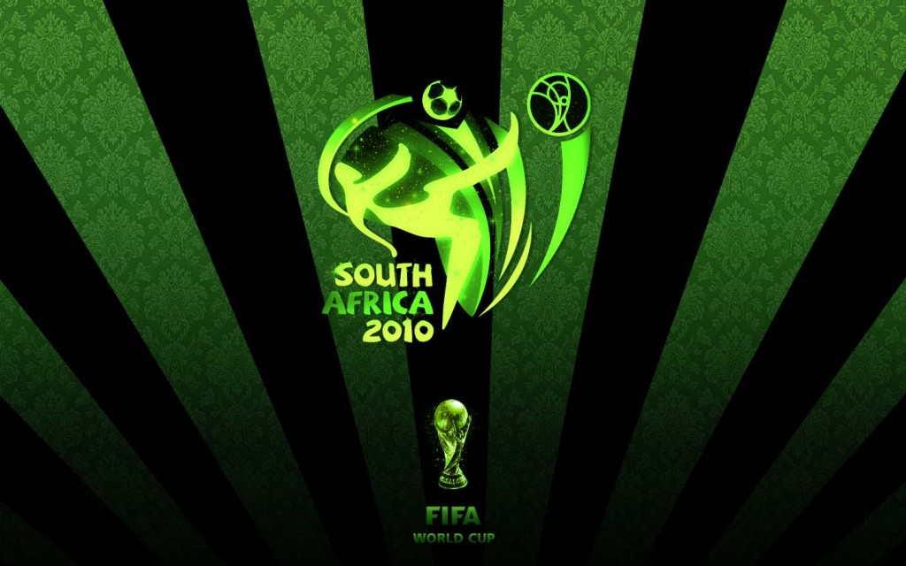
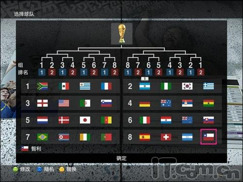
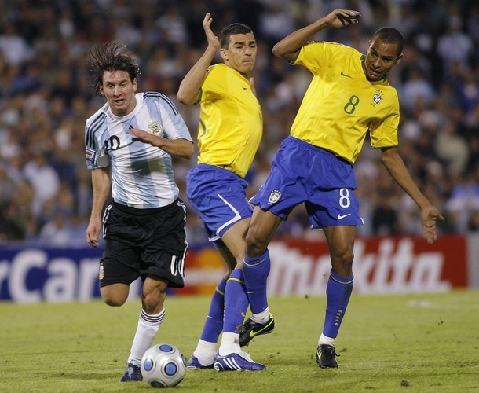
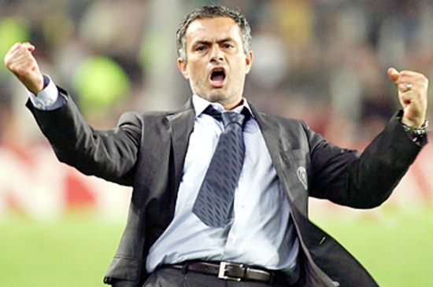
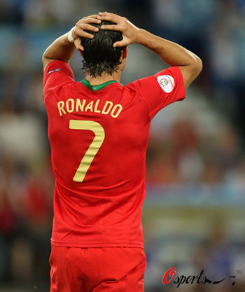
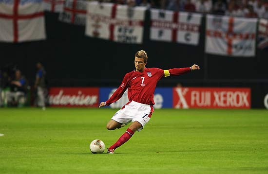
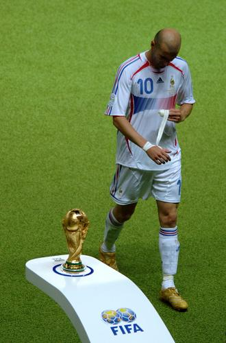
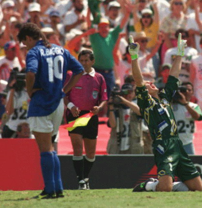
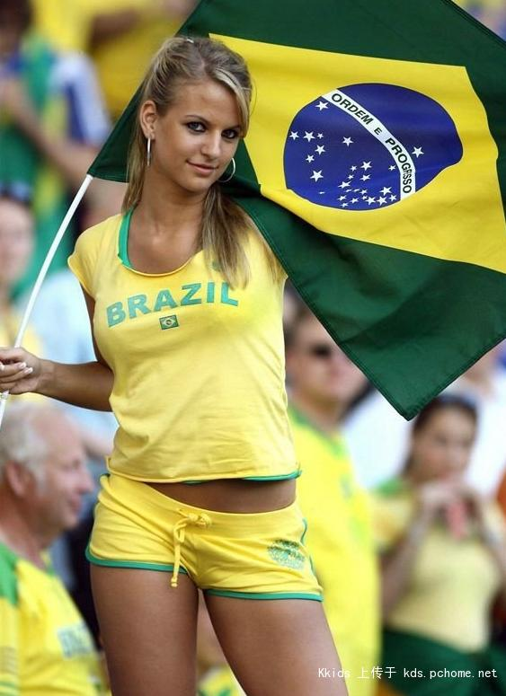
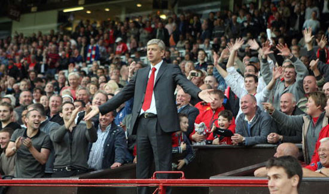

# 2010南非世界杯《北斗》预测摘录

# 2010南非世界杯《北斗》预测摘录

## ——摘星星的孩子，为你摘取这个夏天的每一点星火

#### 写在前面：

世界杯足球赛四年一度，我们的大学时代也大多将经历四周星而终结。人生有许多个四年，但在大学校内里的四载青葱光阴，往往是我们一生中最鲜亮、闪耀着最华丽色彩的四年。在这四年的或许某个夏天里，我们能拥有一届完美的世界大赛属于我们的生命体验，我们因暂无生活或工作的压力而尽情释放活力，更因逐渐走向成熟而越发懂得品味生活。《北斗》创办虽仅两年余四周，但一直以来推动与倡导的，是当代华人大学生原汁原味的生活观念与思维精神之交流，生逢夏花绚烂之季，我们特意为大家奉上2010南非世界杯专栏和特稿，并诚邀各位在世界杯比赛前后期间，把自己的心得、感想、评论或故事，付诸笔端，以飨同好。万分期待您的投稿，也同时欢迎推荐稿件。我们的头号是：“摘星星的孩子，为你摘取这个夏天的每一点星火。” 以下，我们以参加2010南非世界杯决赛圈的32支国家队和736名运动员为基准，访问了《北斗》的部分撰稿人、读者、编辑和办刊人员，为世界杯的到来率先准备一场思维大胆的预测热身赛。 

#### 基本概况说明：

本次预测一共有24人交回问卷。其中，女生7人，男生17人；自认为是A）球迷的有9人，是B）世界杯关注者的有5人（女生1人），是C）打酱油的有10人；自认为a)经常踢球或者水平较高的有3人，b)有时会踢或者水平一般的有12人，c)从没踢过或者毫无天赋的有9人。 另外，有体育新闻专业1人。 

#### 预测结果显示：

南美双雄可谓顶头大热门，巴西和阿根廷各有6票认为是最终夺冠的球队。稍被看好的有3票的英格兰，而西班牙与荷兰就同为2票。其他被认为有实力争冠的强队就只有法国、德国和葡萄牙，各得1票。另外还有人支持智利和朝鲜，两队都各有1票的支持。这样看来，南美洲球队的支持票数达到13票，欧洲球队有10票，亚洲球队因为神秘之师的存在捞得1票，在本大陆作战的非洲球队运程看淡。 在预测表现最好的球员方面，分布不算集中，日渐成熟的梅西和进步很大的鲁尼各得3票，成为最受期望的两名球员。最被看好的夺冠热门之一的巴西，仅仅只有卡卡一人获得1票，可见本届巴西在人们眼中的确星光暗淡。西班牙可能因为全队无伤病和整体实力强大，双前锋比利亚和托雷斯、中场核心哈维都各得1票，成为球员得票人数最多的球队。英格兰因为新任队长杰拉德也获得1票，连同鲁尼的3票，成为球员得票票数最多的球队。除了英格兰和西班牙，神秘之师的朝鲜也有不少于1票的最佳球员数，但得票的球员都没有名字，有1票投给了“朝鲜门将”，另1票被描述为“朝鲜新星”，而这两者有可能为同一名球员，所以我们这里把其算作“不少于1票”。此外，还有三名球员各得1票，分别是葡萄牙的C罗和德国的施魏因施泰格，以及连意大利本土都认为不该去世界杯的卡莫拉内西。热门球队中，只有阵容不得人心的法国和球星容易受伤的荷兰没有球员得到受访者的青睐。另据笔者分析，可能因为本届在开赛前就大量发生球星因伤退出世界杯的不幸事件，致使有部分受访者不作出本届最佳球员的预测。 

#### 具体问答摘录：

1）您最喜欢的球队？如果您可以选择，你会选择哪位教练来指挥您心爱的球队？

创办人薄然（Bc朝鲜/朝鲜的门将，认为门将不失球，无过而失球是死罪啊）：最喜欢韩国队，因为韩国是我的祖国。 撰稿人、特稿组组长刘一舟（Aa荷兰/鲁尼）：荷兰，范巴斯滕。 撰稿人罗天（Ab阿根廷/梅西）：阿根廷，我觉得理想的教练是穆里尼奥，这十几年的阿根廷太软了，缺少灵魂。 撰稿人、编辑周远游（Ab巴西/哈维）：意大利，穆里尼奥。 美编、办刊人员石三（Ab英格兰）：英格兰，温格。 编辑董庆兴（Ab英格兰/杰拉德）：巴西，安切洛蒂来执教。 编辑张瑞林（Ab巴西/C罗）：葡萄牙，希丁克。 办刊人员吉天诗（Bc西班牙/托雷斯）：英格兰，穆里尼奥。 办刊人员王圣洁（Cc荷兰/鲁尼）：荷兰，现在的范马维克。 读者张菲澳（Aa巴西/鲁尼）：最喜欢英格兰。会选择自己来执教。 读者郑蔚（Cc智利/卡莫拉内西）：喜欢齐达内的时候喜欢法国，现在受朋友影响比较喜欢意大利。第二问毫无概念。 读者大飞（Ab西班牙/比利亚）：西班牙，比埃尔霍夫。 2）您认为哪支强队会爆冷提前小组赛出局？又有哪支弱队会成为黑马打入八强或更后的比赛？

卸任社长王垚（Bc阿根廷/朝鲜新星）：葡萄牙会出局，因为我已经看好朝鲜了。 撰稿人、特稿组组长刘一舟（Aa荷兰/鲁尼）：意大利。朝鲜。 撰稿人、编辑周远游（Ab巴西/哈维）：意大利可能小组出局，黑马嘛，喀麦隆。 撰稿人乔淼（Bb德国或阿根廷/施魏因施泰格）：法国和葡萄牙比较危险。黑马……猜智利或希腊。 撰稿人罗天（Ab阿根廷/梅西）：最有可能爆冷的是阿根廷（掩面哭泣）和葡萄牙，弱队的话，我觉得朝鲜不错。 撰稿人、编辑王津（Ab英格兰/梅西）：葡萄牙。某支非洲球队，尼日利亚或者南非。 编辑董庆兴（Ab英格兰/杰拉德）：法国出局。黑马要是能想到就不是黑马了。 办刊人员吉天诗（Bc西班牙/托雷斯）：法国、荷兰、葡萄牙。不过葡萄牙大概已经算不上爆冷了。不会有弱队成为黑马打入八强。倒是会有二流强队进入八强，比如加纳之类。 读者张菲澳（Aa巴西/鲁尼）：法国。朝鲜。 读者大飞（Ab西班牙/比利亚）：葡萄牙提前出局，日本进八强，英格兰八分之一决赛被淘汰，德国四分之一决赛被淘汰。 3）您最遗憾的是哪支球队或球星无缘本届比赛？

创办人薄然（Bc朝鲜/朝鲜的门将）：苏联队。 撰稿人乔淼（Bb德国或阿根廷/施魏因施泰格）：巴拉克。 撰稿人罗天（Ab阿根廷/梅西）：贝克汉姆，唉，星星白发，生于鬓垂。 撰稿人、编辑王津（Ab英格兰/梅西）：球队：俄罗斯，捷克；球星：切赫。 美编、办刊人员石三（Ab英格兰）：特拉帕托尼…… 编辑李伯凯（Cb巴西）：中国队吧。 编辑董庆兴（Ab英格兰/杰拉德）：俄罗斯。罗纳尔多。 翻译组国英斌（Cb巴西）：小罗。 读者大飞（Ab西班牙/比利亚）：瑞典无缘世界杯。英格兰沃尔沃特、意大利博列洛、巴西帕托无缘世界杯。巴拉克就算不受伤也根本不该进大名单！！！ 读者陈小溪（Cc巴西、法国/梅西）：贝克汉姆，女生嘛o(︶︿︶)o 唉，你懂的。 4）02世界杯巴西豪华进攻火力七战功成，04欧洲杯希腊坚固防守加任意球战术夺冠，06世界杯意大利法国稳健为上同入决赛点球决胜，08欧洲杯对攻战西班牙完胜德国，您认为当今国际足球的战术潮流是什么？南非世界杯将会是一届进攻为主、极具观赏性的赛事呢，还是崇尚防守、功利主义盛行的赛事？

美编、办刊人员石三（Ab英格兰）：邓加，卡佩罗，里皮，多梅内克……难道指望马拉多纳代表攻势足球么？连皇马都要卡佩罗和穆里尼奥来压阵，问题所说的02年巴西夺冠，532的阵型不是关键因素么？08欧锦赛真是奇迹啊。 撰稿人、编辑周远游（Ab巴西/哈维）：功利。上赛季国米靠着钢铁防守和犀利反击连克切尔西巴萨，很有指标意义。本次，意大利，德国，巴西等强队都会防反，很显然。 撰稿人乔淼（Bb德国或阿根廷/施魏因施泰格）：当今国际足球的战术潮流应该是团队配合，重视防守和阵地战进攻。球星更大的作用应该在于门前一脚或者鼓舞士气，个人表演的空间越来越有限。加上很多有天赋的球星没能参赛，我以为本次世界杯应该偏向功利主义更多一些，精彩程度可能打折扣。 撰稿人罗天（Ab阿根廷/梅西）：当今的主要战术潮流还是西班牙-巴萨风和卡佩罗-穆里尼奥风两个潮流并进吧，我还是担心博斯克经验有余进取不足，西班牙可能很难最终问鼎，卡佩罗倒是很有希望，但是就怕英格兰人不够刚，想来想去竟是邓加最有可能……该死，那么这又是一届防守的世界杯，也许，之前的冠军杯决赛就是一个预兆吧。 编辑董庆兴（Ab英格兰/杰拉德）：防守，但未必猥琐。08年我不认为是对攻，德国队连球都没有，谈不上对攻。 办刊人员吉天诗（Bc西班牙/托雷斯）：观赏性的队伍中西班牙的战术素养不错，很可能拿到冠军。但是过多的队伍相对功利。总体来看应该是崇尚防守的，但是在通往决赛的路途中，应该会有很多观赏性强的比赛，如西班牙、阿根廷之类。 读者张菲澳（Aa巴西/鲁尼）：目前的主流显然是以西班牙、巴西为代表的拉丁派打法。退而求其次的话，也只会出现国际米兰式的胜利，功利主义和希腊童话式的运气似乎已是传说。 5）98年有贝克汉姆勾倒西蒙尼，02年有托蒂被判假摔，06年有鲁尼脚踏卡瓦略和齐达内头撞马特拉济，您直觉认为今年的世界杯赛场上又会出现哪名球星拿到红牌而被罚出场的难忘场面？

卸任社长王垚（Bc阿根廷/朝鲜新星）：今年，夜观天象，也该轮到荷兰了吧？ 撰稿人、编辑周远游（Ab巴西/哈维）：梅西。一定会。梅西成不了王。 撰稿人乔淼（Bb德国或阿根廷/施魏因施泰格）：脾气和人品越糟的人越容易出丑。但具体是谁，不知道…… 撰稿人罗天（Ab阿根廷/梅西）：第一反应，卡萨诺（什么？他没入选国家队？）；第二反应：阿尔维斯（什么？他不是主力）；第三反应：那还有什么说的呢，C罗，不解释。 撰稿人、编辑王津（Ab英格兰/梅西）：葡萄牙的C罗？ 美编、办刊人员石三（Ab英格兰）：马拉多纳吧…… 编辑张瑞林（Ab巴西/C罗）：我希望是朴智星。 编辑董庆兴（Ab英格兰/杰拉德）：德罗巴。我看好他。 办刊人员吉天诗（Bc西班牙/托雷斯）：必然会有的。我想很可能出现在荷兰队。 读者大飞（Ab西班牙/比利亚）：里贝里小组赛首场左脚骨裂，随后法国小组不出线；日本队川岛永嗣本届世界杯共扑出12粒点球，最终在四分之一决赛中禁区外手球红牌罚下，日本队也因此未能完成主帅冈田武史提出的“保八争四”的宏伟目标。 6）94年决赛点球大战巴乔最后一脚射失的落寞背影，02年欧文对阵阿根廷赢得点球贝克汉姆复仇成功，06年黄健翔声嘶力竭吼出“伟大的左后卫”格罗索，您直觉认为今年的世界杯赛场上又会出现怎么样情况的点球经典场面？

常务总编吴如加（Bb阿根廷）：守门员被颜射送医。 撰稿人乔淼（Bb德国或阿根廷/施魏因施泰格）：一个戈耶切亚式的门将在点球大战中挽救一支球队。 撰稿人、编辑周远游（Ab巴西/哈维）：C罗罚丢点球落泪。 读者张菲澳（Aa巴西/鲁尼）：这个还真难预测，可能是在关键时刻，裁判的误判，要么就是守门员主罚点球。 读者大飞（Ab西班牙/比利亚）：朝鲜队郑大世在本届世界杯中共踢了10个点球，只有一个打在门框内，还被扑住了。 7）您有否想象过本届赛场上出现朝鲜队对阵韩国队或者朝鲜队对阵美国队的盛况？ 卸任社长王垚（Bc阿根廷/朝鲜新星）：从对阵来看朝鲜对阵韩国与美国可能性都不大，因为巴西肯定可以锁定小组第一，而另外两对成为小组头名的可能性都不大，我倒是更乐于围观美国队与英格兰队的比赛。 撰稿人罗天（Ab阿根廷/梅西）：朝鲜，韩国，点球大战，最后时刻，金太阳拯救世界！ 撰稿人、编辑周远游（Ab巴西/哈维）：是。朝鲜队在二胖的死亡威胁下，全场紧逼，死守逼平美国。 撰稿人、编辑王津（Ab英格兰/梅西）：北韩虽然有战无不胜的猪蹄思想思密达，但是毕竟实力有限，又分在超级死亡之组，爆冷的可能性基本上为零。 编辑董庆兴（Ab英格兰/杰拉德）：这个，没啥。顶多朝鲜赢了，总局认为举国体制就是好啊就是好。 编辑张瑞林（Ab巴西/C罗）：我希望是朝鲜队力拼巴西。 办刊人员吉天诗（Bc西班牙/托雷斯）：不太可能。因为这几支队伍都无法出线。 读者陈小溪（Cc巴西、法国/梅西）：朝鲜对韩国倒是挺有意思，对美国么，美国队估计不关心这个吧，只会有朝鲜一面倒的满腔怒火也不一定。 读者大飞（Ab西班牙/比利亚）：想象过，朝韩会师决赛，全世界的男人都可以去死了。 8）您将会如何处理世界杯和异性的关系？是会因为世界杯的丝丝入扣而促进呢，还是格格不入而疏远呢？

常务总编吴如加（Bb阿根廷）：木有异性，木有压力。一般来说，是可以让异性陪自己看球的吧。 撰稿人、特稿组组长刘一舟（Aa荷兰/鲁尼）：这个不冲突，世界杯都是晚上，我本来晚上一般也在学校的。 撰稿人乔淼（Bb德国或阿根廷/施魏因施泰格）：目前单身，希望谈个恋爱什么的，随缘。 撰稿人罗天（Ab阿根廷/梅西）：一般来说现在女生还是能接受男生看球吧，如果大家都是球迷，只要不是英阿这种应该还是能和平相处的。至少我没有出现过因为看球和某少女闹翻的情况…… 撰稿人韩晓琳（Cc卡卡）：反正四年只有一次，随他们去吧。 撰稿人、编辑王津（Ab英格兰/梅西）：本人没有异性伴侣，求交往。 美编、办刊人员石三（Ab英格兰）：我自己都没时间看了……不会有什么矛盾了。 编辑李伯凯（Cb巴西）：绝对选择萝莉或御姐~~ 办刊人员吉天诗（Bc西班牙/托雷斯）：如果有个异性，我想应该是会有些疏远……除非人家是球迷可以传道授业…… 读者张菲澳（Aa巴西/鲁尼）：单身。对我来说更重要的是处理好和领导的关系，他能从我眼眶的血丝判断昨天看了几场比赛。 读者陈小溪（Cc巴西、法国/梅西）：会因为关心另一半而关注足球，即使我对足球和世界杯一知半解，不过我相信他会为我的无知而做解答。你不能要求另一半和你的爱好都扣合的。 读者郑蔚（Cc智利/卡莫拉内西）：想看就看吧。看球没问题啦。说不定我也拿个啤酒熬夜。不过希望他有空的时候好好休息。赛季过后陪我多说说话。 

（全文完） 

搜集、整理：黄理罡

2010年6月8日
