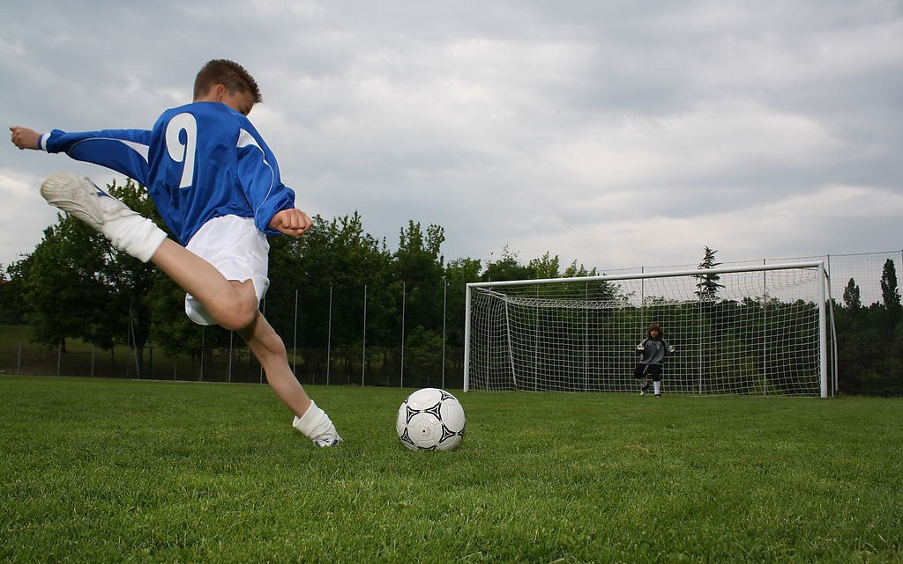
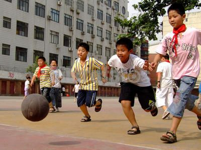
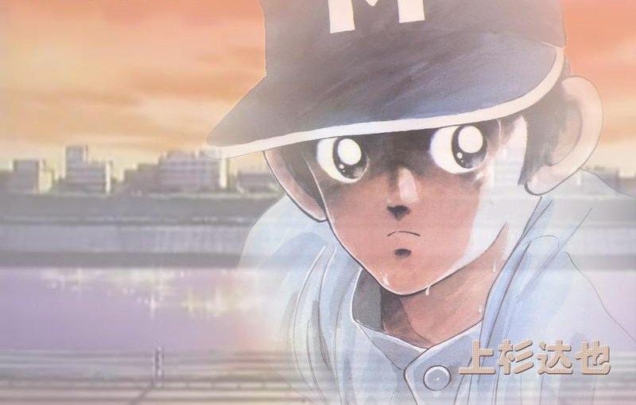
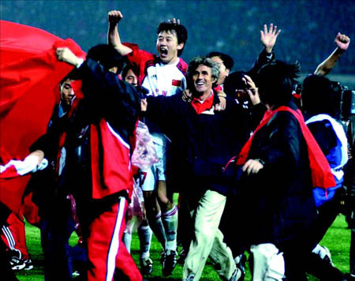
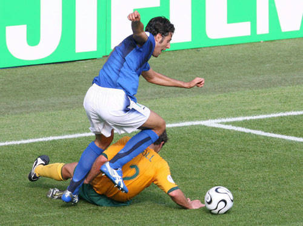
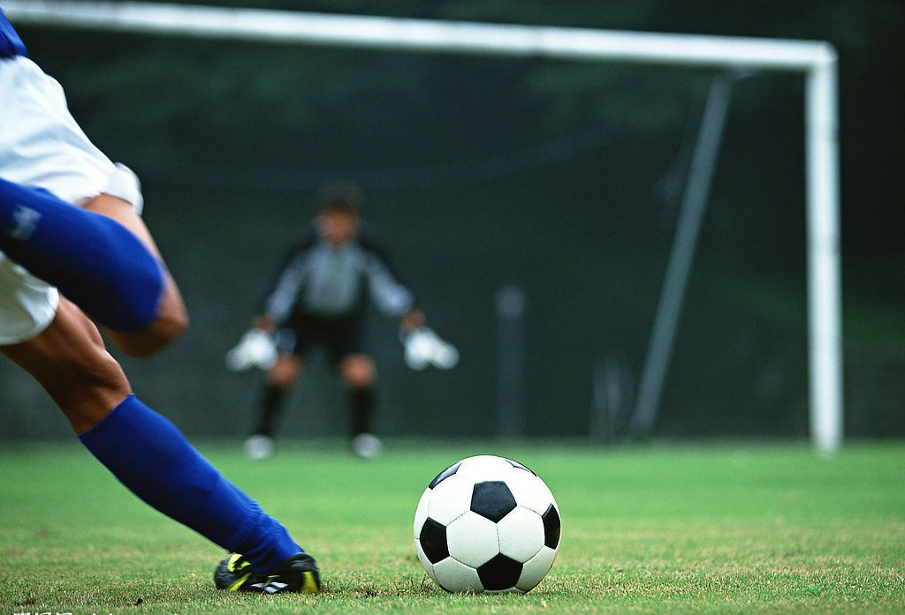

# 永远绿色的季节

# 永远绿色的季节

## 文 / 徐迟寅（浙江财经）

 **一个嗅得到泥土清香的季节** **一个充满了狂欢、尖叫，释放各种激情释放季节** **一个具备了竞技和娱乐所有元素的季节** **一个32支球队一个目标的季节** **一个属于足球的季节**

**——题记**

 生在东八区是我们的幸福，因为不论是否有比赛，夜里2点通常是没有人来打扰的。我们可以一个人，也可以叫上三五好友，或在家独守电视，或在酒吧与朋友喝酒论球，我们都能安心地盯着屏幕，安静地享受足球带给我们的快乐。倦意，是我们唯一需要克服的。 我已经习惯了这样的生活，早早的睡觉，半夜揉着惺忪睡眼醒来，两小时后，伴着微吐的晨曦睡去。是的，我很少出去看球，几乎是从不，但我却很喜欢半夜一个人，躺在床上，或对着电视，或对着电脑，享受着属于自己的足球世界。 大多数与我同龄的人对足球的记忆始于94年，那时还是小学二年级，玩具、动画片依然是我生活的主旋律，对于足球，似乎只是半夜被老爹从客厅搬到房间的电视机和老妈不停的唠叨，似乎那时候对足球并没有什么好感，更不用说那年夏天的天使之城玫瑰碗里巴乔忧郁落寞的背影了。 老罗说过：小孩子打架比的是发育。同样，可以推论出，小孩子玩体育比的也是发育。于是，我们便可以在操场上踢球的人的厉害程度上分辨出个大概了。三四年级的只能把球开过半个篮球场，而从五年级开始，一个篮球场的距离也成了件能轻松完成的事。 

 96年的欧洲杯回到了现代足球的起源地（我一直觉得我们祖先玩的那游戏跟足球八辈子扯不到一块，马可•波罗不会把那玩意带回欧罗巴的）。坚强的德意志战车和被誉为黄金一代的捷克（那时候还叫jack slow fuck）走到了最后。那是我第一次在半夜起来看球，印象中被叫起来已经到加时了，结果已经遍体鳞伤的德国人凭着比埃尔霍夫的金球让捷克饮恨温布利。如今，96黄金一代都已淡出，捷克足球从此失去了旗帜，不知何时才能见到下一个内德维德，下一个波博斯基。 之后，灌篮高手红遍了全国，漫画、动画片充斥着每个校园。谁没有看过谁的童年就不是完整的，我想它的地位应该就相当于西游记在中国百姓中的地位吧。那时没有电脑，更没有网络，于是只能忍受一天一集的蜗牛速度，借已经被翻“熟”了的盗版漫画。每个男孩子的嘴里都喊着灌篮高手里主人公的名字。 那时的操场只有一个篮球场，却有好几个篮球在场上乱飞。这，或许就是信念的影响力吧。“全民健身”的口号永远都只是喊喊的。如今，时光荏苒，却依旧怀念当时的单纯与美好。当然，同样被我们记住的还有上杉达野和他手里的棒球。 

 98年，开始第一次认认真真、完完全全、真真切切看一届世界杯。高卢人凭着无比强大的后卫和中场线，在家门口捧起了自己的第一座世界杯。想想当时法国人让人无比艳羡的中场：秃顶、德尚、大蛇、petit， vieira、pires、马克莱莱还只能坐在板凳上。那年，亨利21岁，vieira23岁，pires24岁，青春茂盛的他们，日后联手组成了阿森纳犀利无比的左路黄金走廊。这一年，西班牙开始被叫做“预选赛之王”。这一年，有着太多深刻的印记，太多铭心的故事。inzaghi进球后扑到baggio的背上，blanc亲吻barthez的光头，英格兰的一出悲欢离合以及最后罗胖子的千古悬案…… 一年后，我完成了人生中最长的阶段性学业。也在那一年，我结识了相伴终生的兄弟们，那是我一生中最快乐的三年，所有人，都需要铭记，都值得铭记。如果要把这三年拍成一部电影，那么，足球，将是这部电影的主线，因为，它无时不在。 时间进入新千年，那一年，有好多大片，偷天陷阱、黑客帝国……除了荧幕上的大片，现实中的大片也在这年夏天上演。2000年，近10年水平最高的一届欧洲杯在荷兰比利时上演。从结果上看，这是属于法兰西的欧洲杯，但从过程上，这届欧洲杯属于所有热爱足球的人，继续塑造杯具的预选赛之王西班牙，杯具的荷兰，杯具的意大利，杯具的葡萄牙黄金一代，神奇的托尔多、特雷泽盖，横空出世的戈麦斯，冷酷的斯塔姆，无奈的德波尔，他们一起在郁金香之国的落日余辉中奉献了一场无与伦比的演出。那一年，葡萄牙黄金一代踢出了sexy football，活力四射，青春不羁，无奈倒了如日中天的法国人脚下。那一年，成名已久的figo、rui costa们终于开始进入我的视线。当然，那一年，还有一个让我们记住的声音——黄健翔，他的声音透过“位于太平洋上空的国际通讯卫星”划过中国沉寂的夜空，传到了每个中国人的耳朵里，让我知道原来足球不仅仅只是一项竞技，足球，还可以是一种娱乐。 01年，这一年发生了很多事情，最大的新闻莫过于国足终于成功“破处”，闯进隔壁邻居家举办的世界杯，加上“超白金”在世青赛上的惊艳，足球运动在这片古老、神奇而又诡异的土地上得到了前所未有的关注。尽管最终的结果逃不掉“世界杯一次游”。但是，那天晚上，中国足球从未感觉那么好。 

 02年的夏天，世界杯第一次离我们这么近，无论是时差还是感情上。正当所有人都放下手中的工作翘首以盼国足的处女战时，我们却依然只能坐在教室里上着数学课，但每个人的心却不在这里。劳技课时做的小收音机在关键时刻罢了工，听着对面楼里传来的叫喊声，我只能焦急而又无奈地等着下课，打开教室里的电视，从雪花点中寻找些许珍贵的现场记忆。那年夏天，我中考。而国足的世界杯之旅在中考前一天停止了，于是，我们只能眼睁睁的看着邻国的高丽人在裁判的帮助下一路灭掉葡萄牙、意大利、西班牙，打进了四强，并且间接灭掉了法国（金南一在和法国热身的时候把秃顶给废了）。忘不了老迈的马尔蒂尼被安XX压住头球后的无奈，也忘不掉秃顶最后一场缠着绷带在场上踉跄的脚步，四年前的王者如今居然沦落到如此的地步。那一年，巴西是当之无愧的王者，他们风卷残云般举起了大力神杯。同时，那一年，大热必死的定律再次应验。 这年夏天，我们告别了很多人，马尔蒂尼、鲁伊、巴蒂、卡尼吉亚……一张张曾经熟悉的面孔，随年华逝去，消散在东方的雨季里。曾经的他们风华正茂，现在，历史的车轮终于要将他们无情地撵过。但他们不会被历史遗忘，因为，他们已是历史。 告别02，告别无法遗忘的三年，开始新的生活。却也始终无法忘却刚刚过去的那段青葱岁月。02年的热度还未退却，04年的欧洲杯已在地球的另一端拉开了战幕，“陆止于斯，海始于斯”，或许，足球将在这里开始一段全新的航程。 相比于四年前，足球的商业化更加明显了，这或许是一种趋势，无法逆转。但足球，必须保持其最本真的元素。这一年，捷克和葡萄牙黄金一代的欧洲杯谢幕演出，两个黄金一代，原本应该在决赛中为全世界奉献一场华丽的表演，然而却都倒在功利足球的脚下，在感叹奥托大帝神奇的同时，也为这样的结果感到无奈。从此，我们必须像等待戈多一样开始等待下一个内德维德，下一个波博斯基，下一个ruicosta的出现。这一年，德国战车溃败，或许正是这次的失败，才有了两年后日耳曼人在家门口的涅槃。还有经典的蓝色爱琴海神话，当然，不能忘却的还有那场完美的2：2，那一夜，科英布拉的雨特别的阴冷。这一年，上帝连昙花一现的巴罗什都没有留下。 每一年，这样的离别都在上演。只是，随着年龄的增长，这种离别显得更加刻骨铭心，只是，每一年离开的人在我心里所占的位置越来越重要。到了06年，我们已经看不到ruicosta，世界上最后一位古典大师就这样离开了这个舞台，他最后留下的是两年前那个踩着满地彩纸的落寞背影，球袜依然只卷到护腿板的一半。同样，不见了的还有pires，这把阿森纳的famas霰弹枪仅仅是因为和教练的星象不合而被永远的挡在国家队的大门外。 06年，波澜不经，留下的只是三个人，两场比赛，一个声音。日耳曼人终于迎来了机会，但却输给了一个人。伟大的左后卫，天佑的意大利，在经历了若干个轮回后，地中海蓝上终于绣上了第四颗星。这一年的决赛也是我第一次在外面看球，大学第一年，大家天南地北，却在这一天共聚于此。在自由港，喝着兑了水的饮料，看着电视，见证了秃顶的惊世一顶，见证了伟大左后卫最后一个点球，也见证了黄健翔“意大利万岁”后无奈的蛰伏。06年，我们得到的要多于失去的。 

 之后的两年，我成长着，也感悟着，烦恼像年轮一样增长着。虽然踢球的时间少了，但足球，仍然是我一个避风港，是我的精神寄托。那时候，学校晚上要断网，我就在第二天早上起来bt，然后封闭一切关于比赛的消息，把bt当成现场直播，这也实在是无奈的选择吧。然后现在，我连这样的热情都已消耗迨尽。 08年，活在大三和大四的夹缝中，却是我过的最开心的一个暑假。迎来又一届的欧洲杯，学生时代最后一次大赛，小组赛里所向披靡的荷兰，风光无限的巴斯滕，却在1/4决赛中输给了对自己和荷兰队更加了解的希丁克。我依然记得荷兰打法国的那天晚上，我梦到荷兰4：1把法国打的满地找牙，结果醒来，震惊地看到了一个和梦境中相同的比分。巴斯滕是个好教练，只是欠缺火候，要是他们能在小组赛里输一场，那么或许他们能走的更远。而今年，他们依然只能继续头顶“无冕之王”的称号走向2012。 08年的西班牙成熟了，那时候跟人打赌，说西班牙没有冠军命，结果输了顿饭。决赛，躺在寝室的床上用手机看的视频直播，耳机里依旧是黄健翔熟悉的声音，习惯了这样的看球方式，也习惯了这样的生活方式，却无法习惯出现在场上的比自己还小的球员。范德萨，已经可以叫做活化石的老家伙终于也要离开了，一瞬间，突然明白自己也将告别这自己习惯的生活，走向未知的世界。那时候，步履蹒跚，尽管现在仍然没有从容淡定。 94-08，14年，弹指而过，记不得多少个夜晚从睡梦中醒来，嬉笑怒骂，尽在这方寸屏幕之中。曾经为了不让老爹看球哭闹过，也曾经为了看球与父母争吵过，为了踢球早上4点半就起床过，也曾经在考试之前用考卷做了自己所谓的“球”一起去小区里疯过。而现在，这一切，都永远地留在了过去，尘封在我的记忆中。看得见，却抓不住。如今，又一次的轮回，身边的一切都变了，不一样的环境、不一样的心绪、还有不一样的人，只有这静谧的夜晚依旧。但愿这一次，足球，依然可以带给我心如止水的永恒。 阿门！ 

