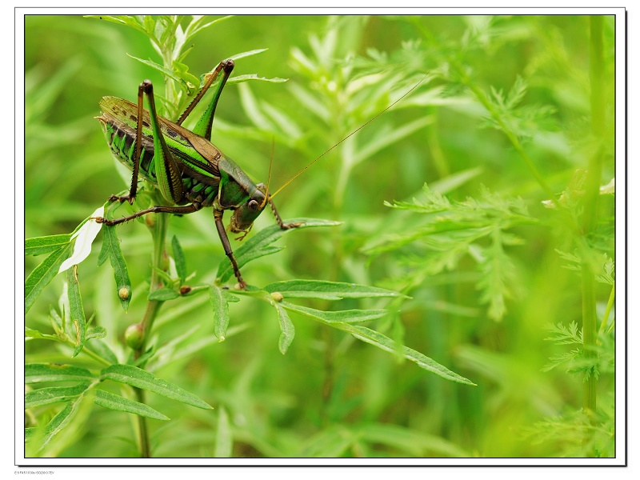
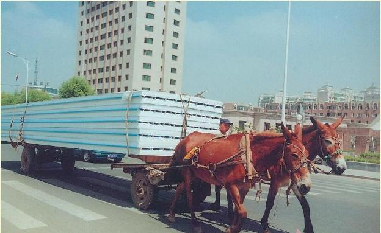

# 从前有座山

# 

# 从前有座山

## 文 / 小茉莉（上海财经）

 一个姑娘在人生逆境时，曾愤恨道：再不行我就觅一座山，自此隐居，日出耕作，养鸡蓄豚，再也不理社会琐事了！ 我被这天真烂漫的想法感动了：慢说此时天朝的山头不像你家炕头那样，说上去就能随便上去，即便交了门票上了山头，也不是你就能画山为王，自成一派的。 看到现在小区里的小孩子只能骑着漂亮的三轮童车绕着楼兜圈子，我就不由想起关在滚动笼子里的小松鼠——多么无趣的童年！ 于是，我格外怀念我的小时候。 小的时候，我家居住的小区还没有改造，更加没有出售产权给旁的人，正是名副其实的家属区。门前园子里，是隔壁老大爷种的土豆茄子牵牛花，园子一隅是架报废了破旧的公车壳子。小伙伴们常常在假期里跑去偷挖土豆，然后躲到公车壳里偷偷生火烤了吃。偶尔被老大爷撞见，把风的大吼一声：跑，众人撒丫子就跑，鸟兽散状地让大爷跟在后面骂我们小兔崽子。 到了晚上，父亲们各自搬了板凳，聚在园子前的空地上，一人一支香烟，沏一壶热茶，天南海北地聊到伸手不见五指，才恋恋不舍地各自搬了板凳回家去。 后来我搬家了，虽然只是远了5分钟的路，却好似远了一个光年，同一幢楼里各家的大朋友们，谁也不认识谁。更不用说各家的小朋友了。从前的大朋友们不再走动，万幸的是，旧时的小朋友们，依然各有来往，依旧调皮如故，上房揭瓦，好不快活！ 

 更加万幸的是，楼前依然是一个郁郁葱葱的园子。栽满了丁香花，还有一株孱弱的桃树。我们常常蹲在树下，仔细寻找树下牙签粗细的小洞，用一根草茎伸进小洞里面，诱捕老虎虫。有一个小哥哥，养了一只鸡，夏日时分，每天带着小鸡到园子里散步，摘一种草，搓出黑色的草籽喂给小鸡。那时候，我认识了一位老伯，他刚退休不久，春天一到，他在园子里种各种漂亮的花，他教我认识了三色堇和豌豆花，还送了我一些牵牛花的种子——于是，我再也不用等到秋天去偷人家的牵牛花种子了。 这时的小区，已经不如从前那般野化了——搬家之后，我就再也没有捉到过螳螂或者长足十厘米的青翠蝈蝈，只是偶尔还能在烂草丛里逮到几只蟋蟀，或者在枯树叶盖着的地里挖出几只蚯蚓。城市也慢慢地“文明化”着：很小的时候，马路边栽着几十年的参天大树，炎炎夏日，这些城市的守护者们殷切伸出臂膀，华美的树冠播撒着阴凉。随处可见的马车，赶车的人给马儿坠了一个屁兜，就赶着他们上路，马蹄敲打柏油路的声音夹杂着马铃叮当，十分悦耳。几年之间，马路不断拓宽，苍天大树被切去臂膀，被“人道地”移去了郊区；马儿，毛驴和骡子因为影响市容，被禁足——仅有一次，我和爸爸在十字路口，偶遇排成队的毛驴，嘚嘚地慢慢踱过，过往的司机通通为他们静止，爸爸笑嘻嘻地说：多少年不见了，这小玩意竟然还能排成溜儿。 

 爸爸啊，您是太多年不见人类以外的动物（家养的寻常宠物不可计算为“动物”）了吧？以至于一队小毛驴就让您看得乐不可支。您不是曾经指着奶奶家门口一条臭不可闻的河，对我说这条河多么的清澈见底，您儿时是怎样在此同鱼嬉戏，跟小伙伴们比赛扎猛子么？我儿时也曾同弟弟一起采摘河边的青蒲，却从未望见有鱼跃水面，至于绿水之下的世界，我们不曾探知。而今这条早已寸草不生飘着垃圾的水沟，已经无法让好奇心十足的小孩子生起任何兴趣了。 许多年过去了，什么都变了，不复当年了。我家楼前的园子也被夷为平地，取而代之的是水泥砖铺地，石砌小花坛，种着一串红和矮牵牛，确实比从前整洁了，可是我和从前的老邻居们并不见得真的开心，我们都很想念从前那几棵四层楼那般高的柳树，那些满园飘香的丁香树也不见了踪影，更不用说那棵本来就很孱弱的小桃树了——某年某月某日，我亲手葬我最心爱的宠物于此树下，只盼它香冢以桃花为被，鸟鸣为乐。却不知，它朝无处觅踪影。 人类自以为是地用“城市化”改造着地球，却对地球的哭泣充耳不闻。第一次在家乡遭遇沙尘，是我读初中的时候，而后沙尘天气一年比一年严重，媒体只会说植被遭到破坏，环境恶化所致，却不曾检讨城市本身所犯下的罪恶，当然也不会关心当年那些腰肢健壮的大树们如今安好。从前让我和小伙伴们肆意打滚的白雪地也不复存在，而今雪落一天便被尘埃染黑——塞北的雪，我多么希望我能爱你如初。可是，小雪，我们还能回得去么？ 世均，我们回不去了。当年同我一起爬墙上树的青梅竹马，亦已为人夫，快为人父，我不知道，未来的某一天，他会不会抱着他的孩子坐在他的膝头，给那小孩子讲述我们童年的故事：你爹小时候，曾同一个野丫头翻墙偷摘丁香花…… 可是，他的孩子，会知道丁香花是什么么？ 亲爱的，我们的童年是属于百草园的；他们的童年是属于电视机的。
