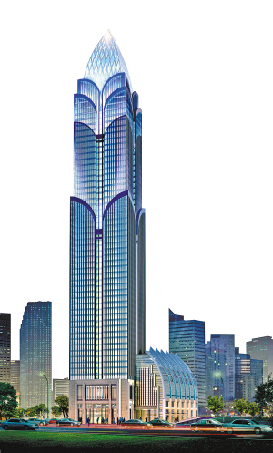
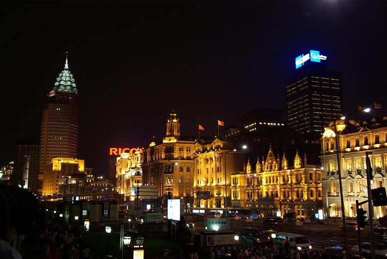
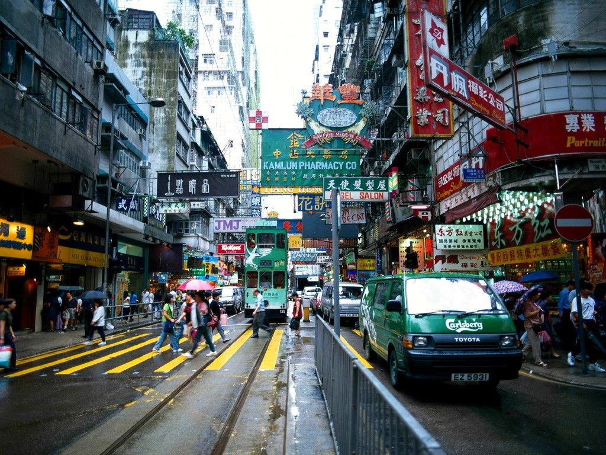
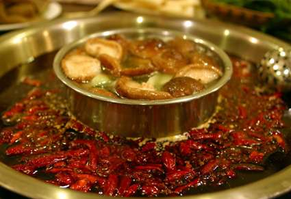

# 止战之殇

**按：近期我写的不少涉及重庆的文章，其实都是在讲体制问题。我讲的是一个城市发展的动力，一个城市自我认知的方法，一个城市与周围城市的关系。我提倡的是正和博弈的区域合作，强调的是公共财政的充分监督，鼓励的是城市体制的创新，呼唤的是城市法治的建构与发展思路治理模式的改善。虽然每次下面都有些人发表一些精彩的议论，但是希望大家还是不要忽视了阅读我文章本身表达的主题。** ** **

** **

** ** ** **

# 止战之殇

## 文 / 元淦恭（中国人民大学 ）

 中华人民共和国有六个城市，以城市名义成为一单独省级行政区，北京、天津、上海、重庆、香港、澳门。这六个城市，崛起的进程，几乎都与战争有关。 北京还算好一点，金的建都、元的建都、清的建都，本身都不是主要出于军事目的，明朝建都北京，军事目的较为明确，但是总的来看，其位于华北平原北侧，燕山之下，又河湖众多，其自然条件在当时来看，也还十分优越。 天津、上海本身临海，又都是平原，它们的发展主要仰赖港口的地位。没有几次中外战争给它们带来开埠的机遇，两个地方也不可能有今天，甚至天津城本身，最初的起源就是卫，以军事为城市发展的关键。 决定港口地位的最重要决定因素是经济腹地的规模。上海的经济腹地是中国长江流域，是全世界所有港口中经济腹地最大的，自然上海作为全球第一大港口的地位，自然而然就会形成。 

 澳门本身和战争没有太大关系，葡萄牙租住时并未采取战争手段。1849年葡萄牙开始殖民，也是假英国鸦片战争胜利之时机，狐假虎威，倒和战争有了一点点关系。 这六个城市里面，香港和重庆是最为特殊的了。此两地是因战争而生的。香港、重庆都是完完全全的山城，平地很少，从某种程度上来说，是“寸土寸金”，填海造地，平整山地，在多山区域筑路，这两个城市的城市建设成本，在全中国范围内无出其右。重庆每修一公里公路所花的资金，在邻近的成都可以修四公里。香港、重庆地处“穷山恶水”，几乎是人们的共识。从来没有听说过有人把物华天宝的说法加在这两个城市之上。 日本设计大师黑川纪章来到重庆的时候,感叹这是一座上帝垂爱的城市:上帝竟然把两条河流给了一座城市。然而，多山的地形仍是这个城市最大的制约。 重庆历史上的第一次大的发展机遇是《马关条约》后开埠，依凭川江航运的便利，重庆迅速发展，工业有了很大起色，超过了省会成都。然而，民国时期工业经济还不发达，工人阶层人口不多，一直在1937年年底，国民政府宣布将重庆定为陪都之前，重庆人口仍不到40万，还不到当时四川省会成都的三分之二。在1948年、1949年内战引发的逃港潮发生前，香港的人口不到上海的三分之一，而经济规模更是只有上海的零头。 这两座城市，因战争而生。重庆得到陪都地位后，人口一年中由35万膨胀到70万。在当时的战争条件下，中国政府需要一个富庶肥沃的大后方，必须将陪都选在四川盆地。云南、贵州、陕西等省都不足以支撑这个庞大的政权机构。成都和重庆，为何选择了重庆？是当时势所必然。首先当时迁都仰赖水运，岷江乐山以上航段航运条件太差，人货运输到重庆尚可，如要转移到成都，则将浪费大量时间精力。其次，最关键的因素就是重庆恶劣的自然环境，多山的地势，使得建筑防空洞等设施成本低廉而又容易，多雾的天气，让日军的轰炸变得无的放矢，分散的居民点，让日本空军难以判断攻击的目标，这些都是战时首都绝好的要素。 要是当时把临时首都设在成都，防空洞的修建就会成为大问题，没有多山地势，没有缭绕的云雾，城市集中组团，日本要是对成都进行地毯式无差别轰炸，国府一定不能招架。和平时期的优势，变成战争时期的危机。而重庆城市分散、交通不便，山区地貌，却恰恰成就了一个最佳的战时首都。 如果没有抗日战争，重庆至今仍然是四川的一个小城市，人口能不能过百万，也成问题。新中国成立后，重庆的军工产业仍然得到了长足的发展，成为其城市发展的持续动力，究其原因，主要还是备战备荒的考虑。在战争条件下，重庆深居内陆腹地，多山的地形地势，有利于军工产业的隐蔽。虽然当时四川“偏心”成都，但是，相对于当时全国其他地方的城市，重庆在全国范围内得到的，更多还是照顾。 重庆是一个因战争而生的城市，因备战而兴的城市。如今，这个城市最大的问题，是如何克服止战之殇。一个因战争而生的城市，如何在和平的年代走向深远，走向繁荣。穷山恶水的中间，怎样让城市发挥出巨大的活力，是这个城市面临的深刻命题。 自然条件是决定一个城市发展的关键因素。不管有的人是怎么自我膨胀，到过四川省和重庆市的外地人、外省人对于成渝两个城市自有公道的评价。成都修地铁的成本，不比重庆修轻轨高到哪里。然而重庆要是修地铁，其花费比北京、上海还要高。成都修路和城市整治的成本，更是只有重庆的几分之一。成都的中心城市结构和环形——放射状的道路路网，更使得成都的交通成本比重庆低得多。这些都是因为平原和山城自然条件不同造成的，是没有办法改变的。如果重庆要和成都拼这些，确实是没有拼的资本。 直至今日，香港的基础设施建设成本之高，两地通勤时间之长，仍然不是内地其他城市可比的。香港再有钱，也不可能解决这些问题，因为那是香港的自然条件带来的。 香港自然条件的恶劣程度，在全球大都会中敬陪末座。然而香港却一样小天地创天地。前不久发生了“五区总辞”，有的内地人会说，北京对香港仁至义尽，给他们食物、饮用水，什么都给他们，而且还签CEPA，对香港居民像一等公民，这些香港人还不知足，还要对抗北京，真是太不知好歹。说实话，北京市民从北京政府得到的好处比香港人还要多，北京市民的批判精神似乎也不比很多穷乡僻壤的人弱。在一个现代国家，永远不会有十全十美的政府，批评，是为了让这个国家变得更好，或者用时髦的话来说，是温总理强调的东西，是他所希望的改进自己和自己政府工作的不竭动力。 这些批评香港人的内地人，说对了一个方面，确实香港的农产品、饮用水全靠内地供应，而且是高补贴的供应，甚至从某种程度上是牺牲部分广东居民利益的供应。这反映出香港城市的畸形。香港这一片多山地带，竟然聚集了七百万人口，真是世界城市历史上的巨大奇迹。而香港这一路走来，更是见证了战争的影子。 1842年，英国在鸦片战争后获得了港岛；1861年，英国因第二次鸦片战争的胜利执掌九龙，1898年，在瓜分风潮中英国租借新界。没有清政府在战争中的节节失败，就没有香港殖民地。然而直到1949年，香港在整个中国的地位并不突出。那时候中国民众在租界和殖民地的来往相当自由，而奉行自由市场经济的上海，在中国绝对经济领袖的地位不可撼动。 香港的自然条件无法和上海相比。上海居于中国海岸线的中央，几乎是长江流域唯一的入海大港，拥有超过全中国百分之四十的人口，一半多的经济总量作为经济腹地。地势平坦，长江三角洲泥沙自然生出新地，城市可以围绕核心组团，规模自由扩张，基础设施建设成本低。这一切的一切，都比香港优越太多了。 三四十年代，抗战和内战的烽火让上百万人涌到香港，成就了香港在大江大海之后的繁荣，从江浙，从内地各处来的人才、富商、设备、款项，让香港一夜之间有了发展的基础和动力。香港有了从来没有过的人力资源，从来没有过的丰富资本，从来没有过的内地和外界沟通唯一桥梁的地位。五六十年代，还是纺织业勃兴的轻工业为王的时代，到了七十年代以后，房地产、金融的支柱地位才渐渐确立。 

 廉政公署的出现，让香港的治安大为改善，警界的贪腐得到整肃。英国不懈的经营，使得香港的市场经济体制日趋完善，司法独立和言论、社会自由的充分保障，使得香港经济发展有了稳定的制度动力。香港超越上海，不是通过简单的资本投入，而是通过系统的制度建构，通过市场经济的运作，通过对人力资本的充分挖掘。 七八十年代以前，由于许多人吃不饱饭，广东的逃港潮一直泛滥，据统计，现在有一半的香港人，是那时候逃港的人及其后裔。他们的冒险精神和拼搏意识，构成了香港社会精神的主轴，香港人坚持理想的勇气，其实根源于的是在他们曾经与内地不可分割的血肉联系。香港人努力实干的作风，就在于他们曾经敢于担负巨大风险的选择。 香港，从因为战争而生的城市，实现了城市精神风貌的蜕变。香港，克服了止战之殇，完成了历史转型。这一转型的进程，以法治、开放和市场经济为主轴，以香港市民和社会的总体提升为动力。 今天的重庆，不是也绝不可能是去大连身上找自己的未来。重庆要真正成为有竞争力的城市，要真正超越成都成为西部的绝对霸主，就不要再继续和成都纠缠GDP总量，纠缠固定资产投资。重庆市委书记位列党和国家领导人之列，如果真正要让重庆克服自然条件的天然劣势，就应该真正把功夫下在该下的地方。 重庆自然条件上，比起成都唯一的优势就是临江。然而这个优势现在已经消失殆尽，长江航运的萎缩和三峡永久船闸的瓶颈效应，让八十年代少数重庆市决策者不惜牺牲涪陵、万县地区的高坝方案彻底破产，重庆继续和成都攀比自然条件，实在就是无聊透顶了。香港的例子说明了一切，香港超越上海，依靠的是人才和体制。重庆真的要超越成都，关键就在人才和体制，重庆这座山城，只有成为中国内地的制度高地，才能够克服自然条件相较于成都、西安、武汉的劣势，而居于真正第一的位置。 重庆工业基础好，人口数量大，又是一个直辖市，两江新区已经获批，可以说面临着自抗战以来的最大的发展机遇，要是把握好了这个机遇，可以成就历史的巨变。如果重庆市的主管者能够高屋建瓴，超越四川省、成都市的决策水平，就可以在短时间内利用直辖优势，甩开同成都的差距。然而，如果重庆市的管理者要和成都硬碰硬，要和成都走同一条道路，那么重庆要招商引资，就太困难了。 当初，重庆和成都都只有一座领事馆。分别是美领馆和英领馆，1997年重庆直辖后，一度重庆领事馆数量超过成都，成为西部领事馆最多的城市，结果到了现在，成都拥有九家外国领事馆，重庆只有七家。传统上，两个关系特殊的国家会把领事馆分设在相邻近的两个城市，以便充分了解整个区域的情况。当初英国和美国分别把领事馆设在重庆、成都就是出于这个考虑。但是最近出现了一个非常特殊的现象，老欧洲的两大引擎德国、法国同时在成都设立领事馆，却都没有在重庆设立领事馆。在重庆第一个设立领事馆的申根国家，竟然是丹麦。 这就是差距。这个差距怎么来的？说实话和重庆市本身没什么关系，和成都的努力关系也不大。就是自然条件使然。欧洲的冒险家喜欢在川西的高山探险，欧洲的企业家也喜欢在天府之国建厂，这些因素重庆永远不会有。要是重庆就一直这样和成都比下去，只能是扬短避长。 重庆作为中国中西部唯一的直辖市，应该有点直辖市的风貌，有点直辖市的精气神。如果一个直辖市搞得萧规曹随，没有任何的体制创新，只注重表面功夫，那么是放低了自己的眼界。重庆，要做的是向香港这样的城市学习经验，了解人家如何克服了“止战之殇”，如何在“穷山恶水”之间，打造出一片大天地。而不是和成都继续争下去，争一些永远争不赢的东西，一个直辖市和一个副省级城市争GDP总量之类的，真是自甘堕落，降低了自己这个城市的标准。 我是真正喜欢重庆，才说这么一番中肯的话。香港人从来知道自己自然条件差，像梁文道那样的人，觉得自然条件如此糟糕的香港成就了亚洲超级都会的地位是香港人的骄傲。如果一个地方的人不能正确地认识自己的城市，指鹿为马颠倒黑白，这种品格和风味那是发展不起来的。 

#### 后记：

我这篇文章说了两个城市自然条件恶劣。一个是重庆，一个是香港。结果，有重庆人就在这里辨称重庆自然条件其实好，却有香港朋友进来支持我的观点。大家都说，重庆远看像香港，那么也要有“像香港”的样子。虽然极少数人不代表整个重庆，也不代表重庆市民，但是我还是要强调，一个城市现代化的进程，首先是市民现代化的进程。楼下有人的评论，显示出来的正是其仍然处在前现代的阶段。我有很多重庆的朋友，我对重庆也有很特殊的感情，在这里大家围观了之后，也不用对“重庆”产生任何其他的印象。因为重庆的伟大和光荣，是全中国的骄傲，香港的理性和成熟，更应成为全中国学习的榜样。 另外，关于香港的地理条件，在梁文道为舒国治一书写的序言中有这样一段，全文摘录： 除了舒國治，我想不出還有誰能簡簡單單地只用兩個字就這麼精准地寫出紐約的抽象、日本的氣氛，以及英國的蕭簡。早在十四年前，我就領教過他這過人的本事了。那年香港快要回歸，他正預備要寫一本談香港的書（但始終沒有完成），於是我請他到我家裏夜聊，向我這個土生港人形容一下他所知道的香港。沒想到他竟然把這片我們傳統上習稱為福地的城市形容為窮山惡水。“由於沒有多少平地，他們總要在那麼彎曲狹窄的水道旁邊蓋樓，這些樓一面緊貼被人工鏟平削尖的山丘，另一面就是曲折的海岸了，這麼險要的形勢，竟然就住了這麼多人。”我不得不承認，他說得很對，從這個角度看來，香港的確很像一座擁擠的邊塞，住滿了無路可逃的難民，此處已是天涯海角，再往前走就是陸秀夫負主投海的怒洋了。這，如何不是窮山惡水？ 该文章原文链接为：[但少闲人——舒国治《理想的下午》序言](http://blog.sina.com.cn/s/blog_4c3782760100i59v.html)
