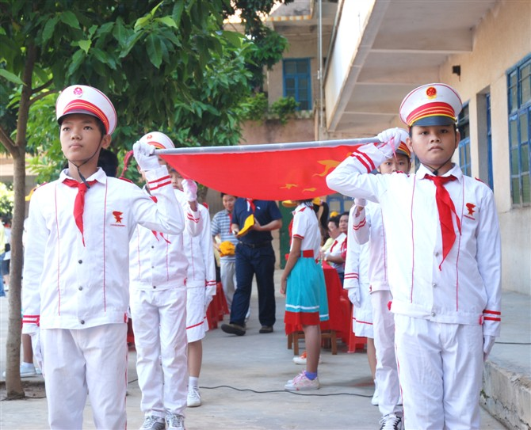

# 别让红旗染上孩子的血

# 别让红旗染上孩子的血

## 文 / 刘派（深圳大学）

 今天是我弟弟就读的小学的公开课，因为父母都没空，那长兄为父，我便临时担当起家长的重责，去观看我弟弟的公开课。 好久没进入中小校园，我发现外部的观感与我童年的记忆基本相同，连气味都有点象。我找到我弟弟的教室，已经开始上数学课了，老师在组织学生进行速算比赛，因为家长们到来的缘故小朋友们表现得特别主动和积极。现在小学的教学设备很先进，黑板上还配备了一个触屏显示器。只不过老师展示的内容并不需要如此尖端的设备，反倒是教室里面居然没有配备空调，几个旧式的吊顶风扇在转着，与老师讲台上的先进设备形成了鲜明对比。数学课之后是英语课，现在小学生的英语教学程度比我们那时高了不少，课堂上有大段的英语听力对话，老师也基本上是全英教学。不过话说回来，我向来是不支持英语教育进入小学课堂的，孩子中文都没学好就同时要负担起另外一门语言，实在是压力太大。 最后一节课是语文课，这节课我兴趣最大，时隔多年，我想看看现在的语文教育发生了什么转变，教授语文课的是一位看起来还满年轻的女老师，看得出有很强的控制欲，上课的时候动不动就爱叫全班起立读个什么东西。这节语文课的课文讲得是关于红旗的一篇文章，一上来那位女老师就在黑板上让学生写下了这几个事物：一块面包，一件大衣，一面红旗，一个生命，一份爱。然后告知学生门如果只能选一样的话选哪个。我的弟弟最先被点回答这个问题，他说他会选择生命。老师问他为什么他说因为国家有很多个，命只有一条。说实话，我当时真被我弟弟给感动到了，非常朴实而又正确的价值观念。不过显然这不是那位老师想听到的答案，于是我又提听到了某些诸如选择红旗因为它象征着国家尊严的答案。这种答案出自小朋友之口没什么，小孩子不懂事，不过老师不能够深化这种错误的观念，可是这位老师做的居然是不断的强化＂国旗比生命重要的价值观＂。她今天要讲的课文，本身就相当的搞笑，说一个人迷路了，又受了伤，好不容易遇到一个商人愿意提供有偿援助，但是我不知道是什么样的思路可以使得那那个商人拒绝了男主人公身上的皮大衣而要他的红旗。结局大家想必也猜得到，男主人公拒绝了商人，独自离开了。这其实是一篇相当左的文章，要在危难关头真能凭借后红旗来换取救助，我早就给了。怎么可能就这么潇洒的走人。虽然这篇文章虽左，但还不算极左。可是那位女老师居然直把文章解读为主人公为了红旗和国家尊严，连命都不要了。当我亲眼看到那位女老师把黑板上的一块面包，一件大衣，乃至于一个生命力都擦掉的时候，我心理的小怪兽就忍不住的咆哮了。大大的黑板上剩下的只是一面红旗，和一份爱，还是对国家的爱。课程结束老师的脸上还洋溢起了卫道士般的笑容，让学生上台表达想法，我弟弟第一个上去，说了什么我忘了，只记得下台时，老师又问他要生命还是要国旗，我弟小生的说了句：还是生命。老师撅了下嘴，让他回去了。 我等到课程完全结束，家长和学生都还在的时站起来大声的向那位女老师问道：老师，如果我现在是一名凶徒，闯进了这个教室，要你把教室里面的红旗交给我不然就伤害小孩，你是选择红旗还是选折选择学生。那个老师明显吃了一惊，迟钝了三秒，尴尬的笑道：那当然是选择学生。我便说道：那你为什么刚刚要教孩子选择红旗不选择生命？她顿时哑口无言。后来那老师走过来跟我大谈什么教学大纲，什么么美国的价值跟我们的不一样，语速之快，完全不容我插嘴。我真不懂，命比旗子重要，这么简单一个道理，她还有什么好理论的。想必是因为我当众折了她面子，心有不甘吧。后来我弟弟的班主任找到我，问我什么样的意见。我把我的基本意见一说，班主任也很无奈的跟我说，这样是不是损了老师的面子，我反问到老师的面子难道比教育学生正确的观念更重要？班主任又夸赞我有个性，我说我讲得都是常识，跟个性有什么关系。 后来我把这事跟我妈一说，我妈说你把老师得罪了，你弟弟要吃苦头。老师现在都是得罪不起的主。她们不开心，对待小孩就粗鲁。我听了心里一阵难受，不过是不想鲜红的国旗再染上儿童的鲜血，而社会却这样来报复讲常识的人。红旗本该是用来保护公民的事物，现在教师却要求为其献上儿童的鲜血。 我还能说什么呢？这是一个疑问句。 

