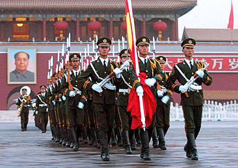
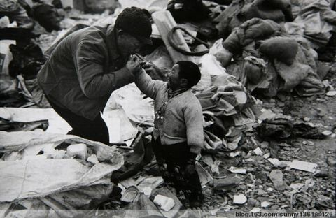

# 精英你妹

# 精英你妹

## 张琦（北京大学）

 上周去天安门，教国旗班英语。说老实话，之前完全没有准备过。还好，面对一屋子平均年纪还比我小一点的新兵，倒是没什么心理压力。几十个朝气蓬勃的青年，都是板刷的发型，都是黝黑的皮肤，站起来回答问题的时候，个个都是挺着胸膛，声音洪亮，双手习惯性地紧贴裤缝。紧张害羞的表情让人难以联想到，正是他们每天执行着这个国家最重要的仪式。 

 课程时间不过一两个小时，内容也简单。可中途很多次，我一度觉得不知道再教些什么，因为那一声声带有距离感的“老师”和那种能读出敬畏的眼神，让我疑问自己为何有资格站在那里。 从一开始我就放弃了纠正发音的企图，并最终用一种我平时断然不能接受的拼音式读音来讲每一个单词。我害怕如果我的发音和他们不一样，那种距离感会太呼之欲出，怕他们默许我是高墙之外那个世界里的未来权贵，怕他们以为自己和我不是一类人。但那终究是真的。我十几年生活的主题于他们而言毫无意义。反之亦然。 中午的时候要留吃饭，我百般谢绝，唯恐与他们一起坐下的时候显出什么尴尬。于是，中队长从游客不能至的区域把我们带出天安门，期间的时候问我：“你是北大的？”他自然知道答案，于是我只“嗯”了一声作为回答。过了几秒钟，当我以为对话已经结束的时候，他叹了一口气道：“唉，天之骄子啊。”我看了他一眼，似乎没有在对我说话的意思。于是我们都默不作声，继续往前走。 在长安街上到处能看到这样的军人。他们憨厚敦实，你很难想象会因为什么原因从他们的眼里能看到社会的黑暗和饱经世事的城府。除了执行命令以外，他们其实不知道用什么方式与不同的人打交道，或者说，与像“我们”这样的人打交道。但另一方面，他们身后站着世界上最庞大的国家机器，正是通过他们，才有了这个国家的统治与被统治阶级。他们是国家机器的组成部分，但讽刺的是，这台机器的运作方式和目的与他们毫无干系。 五月三十五日要到了，不好评论什么政治的东西。这些军人的位置，倒让人很容易联想到最近大红大紫的富士康。看之前分享的一个帖子，有一种说不出的压抑感。竟然有这么多人的过着宁愿去死的生活。不，或许不应该用“竟然”这个词。 但就是这些生活在文明边缘的人，这些人造就了郭台铭这样的巨富，这些人保住了中国GDP的“8”。就是这些人，而不是光鲜在外抛投露面的名人们，用一个一个螺丝，撑住了中国亿万人的未来，你我的未来，不属于他们的未来。 由此想到高三历史课上讲到“三角贸易”这道经典solo，记得大致的答法是：要辩证地看。一方面三角贸易是极其黑暗血腥的，使黑奴生活在水深火热之中；另一方面，however，三角贸易是西方完成资本主义原始积累的重要手段，在物质上为今天这个伟大的世界奠定了基础。一句话，总要有人为了大家而牺牲。 但到底什么是“大家”，又是谁挑选了牺牲品呢。“天之骄子”们么。 这一年里，越发觉得“精英”这个词很刺耳。不能理解有那么多人竟然可以把一些很普通甚至很装逼的活动，如此大言不惭地冠以“精英”、“高峰”、“领袖”这样的词语。而但凡这样的活动，每每必与海外名校、华尔街、成功、未来、世界这样的关键词挂钩。不知道是谁把自己的未来托付给你了，不知道你对世界能有什么贡献。但可以肯定的是你在同龄人里是完全的精英，至少看起来是。你的电子设备都是i开头的，你的简历里统统都是“主席”。北大绝逼二流，哈佛非你莫属。 最近在做新东方某个以“精英”冠名的项目。佩服民办学校的粉饰能力，说是“比vip班还精英”，顾名思义也就是学费比vip这样的班还发指。看每天反馈回来的学员情况，大多是“表现很差”、“不积极”、“没来上课”、“作文和xxx一模一样”，整一副没出息的怂样，考了三四次动辄报名费上千的考试，成绩还没别人拿脚底板敲一下答题卡读出来的高。但就是这些人，完全不能想象，会有一天成为“精英”。 你能责怪他们么？看看我们自己对精英的定义吧。记得有一次，有人感叹xxx很牛逼，我问为什么，回答我说：“喏，明尼苏达大学毕业的！”语气之间，仿佛考过托福的人都自然地高人一等，更不要说喝过洋墨水的了。我便只能笑而不语了。几乎可以肯定，他不会知道宾夕法尼亚大学和宾夕法尼亚州立大学是不一样的，正如他对明尼苏达的全部了解，都是来自于美国职业男子篮球联赛，这个简称NBA而不是ETS的机构。听上去牛逼就行了。看上去精英就行了。如此而已。 所以他们成为了精英。一群和解放军这堆“愚众”和富士康员工那些“贱民”完全不同的人。永远不要指望这些人能够哪一天为他的国家和人民做点什么。他会说：这些人跟我没有关系。我到美国去了，我不跟你们玩了。 

 于是我总是特别反胃，虽然我从事着这样的事情。我不相信任何冠以“精英”名号的活动和事业，因为你只能看到一些自诩能为别人做些什么的人，小到一个部门，大到整个地球。仅仅一套西装就足够让一些人觉得自己在做大人的事情，仅仅那一点权力就可以让他们膨胀到无限。最可怕的是，他们打心底里相信，自己正在从事着精英的事业。 精英你妹。
