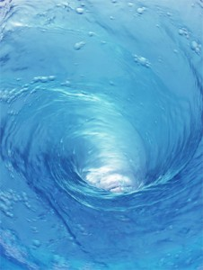

# 学术，让生活更美好

# 学术，让生活更美好

## 文 / 王玉砚（中国科学技术大学）

 我在自习室看着实变，看着看着，觉得胃部开始收缩，肠道开始加速蠕动，还不时发出两声沉闷的咕噜声。于是我经过严密的推导得出，我饿了。但是，我控制收敛定理的证明还没看完，还有三道题没做。但是，我确实饿了。这是个悖论。思考了一会儿之后，我给出了最优解——在手表时针指到12点和我做完这三道题之间取下确界作为我吃饭的时间。嗯，好，搞定了。 我在水房洗衣服。当我把盖到下水口的盆子移开，我发现水流加速涌到下水口，形成了一个大大的漩涡，空心的，而且是右旋的。于是我想，这是不是科里奥利力形成的地转偏向力呢？嗯，力学里学过，北半球向右偏，南半球向左偏。嗯，对啦。于是我又想，我要是在南半球洗衣服，是不是那漩涡就左旋了呢？可能是，又可能不是。但我记得我最喜欢的向守平教授当年对我们说，抽水马桶里水的转向是跟科里奥利力没关系的……那跟什么有关系呢，嗯应该是下水口的形状不是完全关于中心对称的，嗯一定是这样。电扇不也是因为扇叶的形状导致前面有风后面没风吗。咦对了，电扇的扇叶是顺时针转还是逆时针转的呢，一会洗完衣服回去看看。啊我终于洗完啦。我就不明白了，为什么我洗衣服总是比别人慢呢。 

 以上两大段，如果翻译成人话，就两句。 **第一句是，如果我12点还没做完这三道题，那我就去吃饭。** **第二句是，我把盖在下水口的盆子移开，水池不再堵水了。** 记得高中时，我们班有个规模不小的“装派”，以几个搞竞赛的大牛为首把“装”的精神发扬光大。所谓“装”（我当时也是花了很久才领悟到其真谛的），就是以一种超学术的眼光看待周围一切，很像Big Bang Theory里的Sheldon的风格。比如，他们要去邯郸大学做物理实验，会拿出邯郸地图，量好线路的总长度按比例尺换算成总长度，然后用相对论（注意，不是一般的距离除以速度，是相对论）算出到那要花的时间。比如，我和室友上个寒假去北京学新东方，接待我们的是我的高中同学，晚上他们骑车带我们回住处，我那清华的同学对坐在车后座的室友说，旁边这辆车开得太快，你坐稳了，注意伯努利效应（空气流动快了压强小了受力不平衡了）。再比如，还是寒假在北京，一北航的同学要来北大和我们一起逛，结果找不到人了。我听到那个清华的同学在电话里问他，咱俩是不是不在一个坐标系啊。后来吵了一会我听见他说，你换极坐标系吧，极点是博雅塔。不一会，那北航的同学真的找到我们了。室友被雷得外焦里嫩，晚上回去之后十分认真地对我说，你的同学，都太强大了。 记得高中是我对他们这种“装”的做法很不以为然，心想有什么大不了的，不就是不说人话吗。慢慢地我发现，“装”其实是一种很高的境界，它需要你融会贯通所有的自然科学知识，需要你首先是个不折不扣的牛人。上面提到的我那清华的同学，我们叫他老党，是当年我们市的高考状元。而那个在电话里讨论极坐标系的北航的同学老邹，在高中时就把比两块砖还厚的《大学物理难题集萃》啃完了。 在科大，我企图让自己沐浴在浓浓的人文气息中。我是我们宿舍的“语文课代表”；我书架上摆了红楼梦诗经楚辞菜根谭还有好多文学书籍；我绣十字绣，弹钢琴，练瑜伽，企图坚持一周一篇随笔。但是我发现无论我怎样坚持，我还是被浓浓的学术气氛重重地压倒了。科大真的是个学习的好地方。“偌大的中国，也只有科大容得下一张安静的书桌。”这是最高的也是最真实的评价。记得去年我高考完的同学来合肥找我玩，晚上我们在校园里逛，她们说，怎么这么安静啊。我说很正常啊，晚上你还想多闹腾。潇雨说，她逛过北大，晚上的北大校园热闹非凡，有露天聚会的，有做活动的，也有在草坪上谈情说爱的。她们说人到哪去了。我领她们来到五教，她们在每个教室里都看到了N多个埋在书堆里的脑袋，顿时无比感慨崇拜，还在我说话时对我“嘘”，怕我吵到了他们自习。 

 经常看到同学的人人状态说，我明天要开始学术了。我在想，怎么科大的同学很少有发这样的状态呢。后来我想明白了，因为我们天天都在学术，因为我们已经把学术当成了生命的一部分，我们已经与学术不分你我水乳交融耳鬓厮磨了。所以学术于我们，就像人是铁饭是钢一样重要。我们没有哪天不吃饭，所以我们没有哪天不学术。 我在人人上说，我正在成为一个学术女。北大的同学畅回复，难道以前不是吗。我苦笑，天哪原来我在别人眼中早就成为一个学术女了。我记得看才女蒋方舟的一篇文章，说学术女这种成功模式最省事，“可以不必做美女，只吃毫克计量的食物，每天早上搭配时装都面临超越自我的巨大压力；也不用做社工达人，组织奔忙各种活动，背着巨大的塑料展板也要做出麻利活泼的样子，在每个寒冷的风雨夜归夜怀疑生活的意义；只用练习一种神秘莫测的表情，每当老师在课堂上举例某位美索不达米亚哲人的时候，能回应给他一个心照不宣的微笑”。她是学文的，对我，最后一句也许应该改成，“每当教授说出一个德国俄国或者法国名字再加‘定理’或‘命题’二字时，对他狡黠地眨一眨自己的眼睛”。 不得不承认，我也为学术苦恼过。且不说自己背负着巨大的学习压力啃那些正常人生活一辈子都不会用到的抽象的数学理论，每次跟同学聊天，听他们今天去这实践啦，明天去那考察啦，后天组团去旅游啦，还有各种各样稀奇古怪的社团，我都羡慕得要死。然后，半是抱怨半是哀怨地想，我干嘛要来这个地方折磨自己啊，选个轻松地大学轻松地专业天天轻松地生活，岂不快哉。每当这时我都会想起一个北大光华管理学院的师姐说，人年轻的时候多吃点苦，是一种福分。于是，遐想终归只是瞎想，我低下头，又一个猛子扎进数学的海洋了。 但是渐渐地我发现，自己慢慢地爱上这种学术的生活了。尤其在考试周快到的时候，起个大早背着书包拎着早饭听着鸟叫一路晃到自习教室，找个安静的角落把自己蜷缩进去，翻开书本，和柯西黎曼打个招呼说又见啦，然后一头埋进书堆。一天下来，当我从教室再晃悠着出来，有时胸前抱着厚重的红宝书，抬头看天上皎洁的月亮，会觉得自己这一天过得，像月光一样，宁静、充实而且美好。 我们这个国家，我们这个社会，我们这个世界，是需要学术的。不是说科学家为人类的美好生活做出了多么巨大的贡献，而是说，单单纯纯的学术，能让生命有种单单纯纯的满足感。这不是在唱K或者游山玩水之后那种爽透透的快感，这是一种静静流淌的幸福。当你发现全纯函数一列点的函数值就决定了它在全部定义域上的取值，当你发现二项分布当n无穷大是和Poisson分布是一样一样的，你会发出来自灵魂深处的最会心的微笑，然后对自己说，学术，让生活如此美妙。 原文摘自：[http://blog.renren.com/blog/301388758/477358629?from=friendEnd](http://blog.renren.com/blog/301388758/477358629?from=friendEnd)
