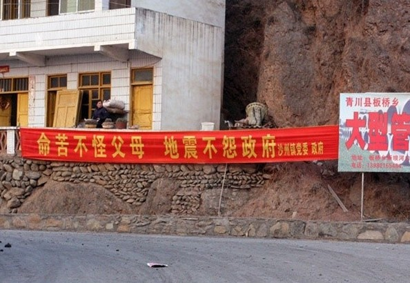

# 地方政府管治水平低下已威胁中国社会稳定

# 地方政府管治水平低下已威胁中国社会稳定

## 文 / 张可（北京师范大学中国社会政策研究所）

如何维持社会稳定是摆在当今中国最高决策层面前的一个现实问题，就现有情况而言，由于地方政府管治水平低下所引发的各种社会问题，导致大量的社会治安事件层出不穷，对中国社会的稳定形成了直接威胁。例如，近日发生的紫金矿业严重污染事件，随着新闻媒体调查的不断深入，其事件背后的真相也越来越清晰。如果说将责任推诿于地方政府缺乏有效监管加上企业的不负责任才导致此次重大污染事件的发生，未免有些轻佻。实际上，企业以维护社会稳定为由将泄漏污染隐瞒了一个月。而作为守土有责的地方政府而言，在事故出现之后竟然删减监测数据，为企业开脱罪责，其行为令人发指。 事实上，中国地方基层一直处于缺乏有效治理的境地。就地方政府自身而言，由于缺乏有效地监督和强制力约束，加之地方对于财政的无止境渴求导致政府自身从一个以经济发展为导向的政府逐步异化成为以资源掠夺为导向的政府。一方面，地方政府通过征地、拆迁等政府行为获取不正当利益。另一方面，通过与地方企业和其他利益集团相勾连，以权力寻租的方式攫取各种各样的收益。在紫金矿业的事件当中，政府和企业“你中有我，我中有你”，相互难舍难分。而其最后的结果正如郑永年教授所说的，除了出卖资源早期的什么都不用发展，演变的到后来的什么都没有发展，最后什么也发展不了的局面。作为这一链条中利益受损最大的村民老百姓来说，资源的污染就意味着其生产资料收到损失，由于缺少生产资料而无法进行社会再生产，最后所能够选择的就只有一次次不断地由底部向上抗争反应诉求，从而导致社会群体性事件的发生。遗憾的是，面对当前中国社会群体性事件频发的现状，地方政府非但不去正视解决，反而通过刚性手段试图去掩盖这一类事件，加强社会控制。正如广东省于近日招聘了3万名突发事件信息员，第一时间收集并向省政府应急办上报各类敏感事件，这样的行为非但不能化解以及积重难返的社会矛盾，反而只会进一步激化官民矛盾，酿成社会稳定危机。 实际上，上述两个事例正好是反应了当前中国社会稳定问题的上游和下游。在上游部分，地方政府的拙劣管治水平不断制造新的社会矛盾，而在下游，政府也牢牢控制着民意宣泄的渠道，使诉求无法获得正常的表达。对于地方执政者而言，本来既非老百姓票选产生的，又不受到老百姓约束，铁打的地方，流水的官，想要对地方有责任感几乎是不可能的事情。因此，地方政府缺乏有效治理，最糟糕的后果就是由地区性社会危机转变为区域性或者整体性的政治危机。 郡县治，则天下安。毫无疑问，如果要想化解当前的困局，其中最根本的解决方法就是构建以县域为基础的监督约束体系，其中重要的一步就是深化基层民主选举制度，将村镇基层民主选举制度进一步扩大为县域的村民选举制度。与此同时，重构县域公检司法体系，地方检察院和法院直接受省级司法机构垂直管理，并实行巡回轮换制。在处理民众的诉求上，进一步拓宽渠道，广开言路，在法律程序符合的情况下有限度向民众开发意见宣泄的场合。除此之外，通过合理的社会政策创新化解社会矛盾，解决民众迫切需要的问题，改善民生。这有这样才能使得现在官民关系、阶层关系日益紧张的局面获得缓解，从而促进中国社会的稳定。
