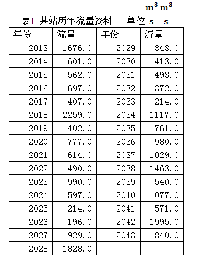
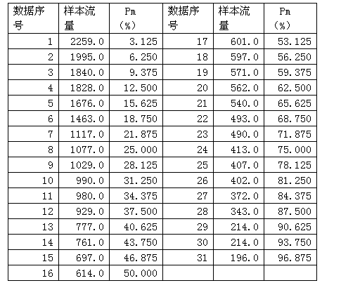
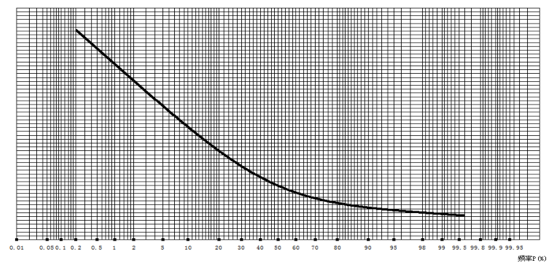

# 浅谈“百年一遇”等当前被误读的水利热点

**“水利上作为样本的数据多以年为时间单位取值，如年平均流量，年最高水位等，所以把这个概率的倒数称为“重现期”，比如某场大洪水，在图上读出相应的横坐标是1%，那么它的重现期是100年，习惯性的说法就是百年一遇。”**

# 浅谈“百年一遇”等当前被误读的水利热点

## 文 / 提琴不小

 此篇拙文出自一名21岁的年轻人，一个尚在修读水利类某专业学士学位的本科生。作为一个不闻窗外事的工科生，本人绝没有论辩争雄的意愿。只是看到近期很多同龄人对水利行业突然给予了很多的关注，表达了自己独到的看法。这些言论提出的出发点无疑都是好的，但从一个略懂水利的初学者角度看，很多人因为对水利行业的陌生，导致自己提出的观点完全没有道理。这篇文章为零水利基础又具有简单数学知识的朋友而写，刻意避免了行业术语的出现，只是对大家容易混淆的概念做些简单的解释，也附带了作者本人的稍许愚见，希望大家不要再把热忱和时间浪费在没有意义的事情上。 第一，关于“n年一遇”。“我在这个星球上只活了二十多年却能遇到这么多次百年一遇，此生无憾啊”。最近一段时间，类似的表达似乎已经成为一种时尚。但“百年一遇”并不是是某位文采飞扬的记者笔下四个字简单的组合，而是水利学相关研究中一种固定的说法。大家应该能理解，受现在预报技术的限制，以现在的时间点看，明年洪水发生与否、洪水大小都具有随机性。所以设计水利工程时，对未来几年甚至百年的不同大小洪水，只能用概率来描述其发生的可能性。计算这些概率所使用的样本，自然是同类型的历史数据。 现在为了说明原理，举一个极端简化的例子，假设下表就是已有的历史数据： 

 这一阶段的计算中，年份是不重要的。以这些流量数据作为样本计算频率，再按大小排序得到下表。 

 Pm是指洪水水量大于该Pm所对应流量的概率，这个结果很容易理解：大于最小值的概率很大，大于最大值的概率很小。（写给理工科的朋友：水利上习惯采用超过制分布函数，样本服从皮尔逊-Ⅲ型分布，有兴趣的朋友可以去查阅相关书籍资料自己计算一下。原理并不十分复杂，这里直接给出结果）。 然后把这些概率和流量点在坐标纸上并且连成线，纵坐标是流量，横坐标是概率。这种坐标纸横坐标并不均匀（海森几率格纸），但原理和普通坐标是一样的。 

 把这条线定出来以后还需要进行各种检验和调试，这里不再赘述。假设定出的这条线符合相关精度要求，刚刚发生了一次洪水，测出了流量，就在这根线上由纵坐标确定一点，找出对应横坐标，读出概率的大小。水利上作为样本的数据多以年为时间单位取值，如年平均流量，年最高水位等，所以把这个概率的倒数称为“重现期”，比如某场大洪水，在图上读出相应的横坐标是1%，那么它的重现期是100年，习惯性的说法就是百年一遇。 写这些无趣的原理，只是为了让大家明白，百年一遇并不是一百年才遇一次。比如10年前发生了一次大洪水，以历史数据做样本进行计算，得出概率1%。今年发生了一次更大的洪水，以包括上次洪水的历史数据做样本计算，完全有可能同样得出概率1%。有兴趣的朋友可以自己去推导这种情况的发生条件。 需要说明的是，实际计算中不会像这个例子这么简单，洪水频率计算不可能只考虑流量这么一个简单的数据，现在也不一定采用定线这么粗糙的方法。定线的本质是由已知点内插出未知点的值，有很多计算方法和程序来获得未知数据，这里的三张表只是为了说明什么是“n年一遇”而举出的一个极端简化的例子。如果水利工作能有这么简单也就不会有那么巨大的生命财产损失了。 回到最开始的问题，很显然，前文中那种“此生无憾”的感慨也有其产生的原因。在本人学习水利学相关课程前，也很自然的认为百年一遇就是一百年才碰到一次。这一切的根源很简单，媒体。故意运用一些极易引起歧义的专业词汇进行，表现我们这次面对的灾难是多么巨大多么恐怖。然后的种种，就不是这篇文章要讨论的问题了。 第二，关于某个超大型水利工程的在这次洪水中发挥的作用。有朋友给出了一组截图，几年前媒体报道说该工程能抵御万年一遇的洪水，几年前又报道该工程能抵御千年一遇的洪水，然后今年说抵抗这次洪水不能完全依赖该工程。大家应该知道的是，工程建造都是有图纸有方案的，该水利工程的功效在很多年前都已经确定了，不会有很大变化。由于某些原因（这些原因在下面会讲到），一般人无法获得该工程的一些具体数据。但在这里可以提供的是一般特大型水利工程的标准，即所谓“千年一遇设计，万年一遇校核”。这里“设计”和“校核”在专业术语里都另有所指，用容易理解的话并不十分精确地去解释，大概就是百年一遇洪水不启用一定范围外的分洪区，千年一遇下游不淹没，万年一遇不溃坝。某个超大型工程作为世界之最有可能高于此标准，但如此矛盾的报道只有两个原因，记者断章取义哗众取宠，或者受访者不是技术出身，信口开河。并且第三个新闻并不是一个很负面的消息，我相信发布此消息的长江水利委员会并没有一把鼻涕一把泪专门举行新闻发布会，发布完这条消息后就哭丧着脸去见完老婆孩子最后一面。还是记者。稍微动点脑子就会意识到，这只不过是一段采访中很普通也很实在的一段对话。随后这条消息被各大网站疯狂引用说明了该记者的职业嗅觉足够敏锐。 人人网开出了某工程的公共主页，在现在防汛工作最紧要的关头得到骂声一片。个人表示无法理解。该工程之前一直有人批评，之后肯定也会有人骂，但现在是最没有理由骂的时候。我们假想一条小溪，水流不息，然后拦腰插下一块很高的大铁板，水流被阻断，上游的水开始越积越多，水位开始升高，淹没了很多地方，造成了很多影响。但下游的水无疑是少了。然后再在铁板上开个小门，这个门可大可小，可以调控，于是水往下流的多少、速度都受到了一定的控制。洪水总量的多少不会因某工程的建立与否产生多么巨大的变化，而在水多的时候，最需要的无疑是这样一个闸门，有大水来时关门蓄水，待下游水量减少到一定程度时再有计划的放水。98年洪水带来的灾难有目共睹，现在的洪水流量已经超过12年前，如果没有这样一个闸门，就意味着比那次灾难更多的洪水已经冲到了下游地区。朋友们可以想象一下这情形。 第三，关于一般人对水利工程的建议与意见。很多人都在不同场合表达过对某个工程的个人观点，相当一部分人也提出了一些比较尖锐的意见。这些意见的提出无疑都是善意的，但很多人连百年一遇这种最最基本的术语都没有弄懂，这些负面的评价从何而来就很令人好奇。为此笔者做了一些小规模的调查和问询，发现这些观点多来自于网络上的转载文章，并且多以某位黄姓水利学家的坎坷生平作为起笔。在做任何辨析和讨论之前，作为一名即将进入水利行业的后辈，笔者在此非常真诚地对那位老前辈致以最崇高的敬意。在大学这样一个特殊环境条件里笔者有幸接触到极少部分不会对普通公众公开的内部资料，包括某些机构的内参、历史影像等等，对几位比较特殊的前辈的学术成果、生平际遇也都有着较为细致的了解。工程建设的论证是十分复杂的，笔者并没有这方面的知识储备，但正如很多人了解到的，某个超大型工程的论证工作进行的十分艰难，不仅学术界有着较大的争议，主管部门最高层内部都存在着非常大的分歧，在一些内参中的争论非常非常激烈。但作为工程技术人员，我们更关注于当前和今后。已经发生的事情不能改变，工程技术人员的努力目标是最大程度的发挥工程效益，减小负面影响，消除潜在危机，改变之前预言的种种。当今技术发展速度、研究工具和研究方式都与几十年前不可同日而语，另一方面江山代有才人出，这些目标的实现并不是不可能的。 工程技术人员的另一个特点是一切拿数据说话。翻阅网络上的被大量转载的文章，关于某位前辈的遭遇的报道是真实的，并且在这里笔者可以说，他承受的要比文字所能表达的要多得多。但关于某些负面影响，完全都是陈述句，没有任何数据支持。原因有二：第一，面向的读者大多没有水利甚至工科的基础知识，数据对读者没有任何影响力；第二，文章的作者无法获取第一手的数据资料。某所高校拥有除行政主管部门外唯一的一整套中国水文年鉴，即以年份、地区来编纂的中国各地水情最原始的资料。每本资料的封面都印有“保密”或“绝密”字样，一般人只能凭相关证件借阅1985年以前的资料（这些资料已过保密期）。当前的学术活动中，若有人需要较新的第一手资料，如果他没有一定的行政级别或学术身份，就要和该地区的水行政部门、存有数据的相关高校或上级水行政主管部门联系获得许可后购买资料。曾经某地区某设计院一位高级工程师因在网上向别人发送资料被网警追查最后判刑入狱，在行业里引起了不小的震动。因此业内有着“操着卖白粉的心，挣着卖白菜的钱”的自嘲。所以说，一般人很难得到最有说服力的原始数据，而跟工程技术有关的论述，没有数据，一切都是空谈。 在这里笔者并没有说某些工程完全没有负面影响，只是说现在看到的很多影响生态、导致地质灾害的指责都毫无根据，这种话任何一个高中生都可以讲出来。当然，读者也可以以同样的理由指责本文也不是那么严谨。笔者已经尽量做到在文字论述时都言出有据，只是出于对自己的保护不在这里展示最原始的论据。这仅仅是一篇科普性质的小文。总的来说，以目前可以获得的公开信息进行比较、估算，入夏以来，相关水利工程为保护公民的生命财产安全已经发挥了不可替代的巨大的作用，如果没有这些工程，灾难已经在几个水情严峻的省份发生。工程的负面影响在工程设计期就已经做了论证，这些论证短期内定然不会对公众开放，只能说对生态、社会、经济等各方面的影响复杂而深远。对于已经完成的工程，技术人员在尽一切可能兴利避害，以技术手段把负面影响降到最低，并且随着技术的飞速发展，前景是令人乐观的。 更深层次的探讨并不是这篇文章想涉及到的，简单地说，现今学术界的管理体制使得获取数据成为一道门槛，学术界行政化的运行体制和水利行业对政府的依赖特性也使得独立自主进行相关负面研究成为天方夜谭。最根本的，真正有发言权的人现在已经在体制内位高权重，他们不可能站出来发表言论。也只有像笔者这样的无知小本，出于对行业的热爱和受友人的邀请，秉着无知者无畏的娱乐精神写一点科普性质的拙文，希望大家不把自己的青春和热情浪费在人云亦云和没有任何科学依据的争论上。
